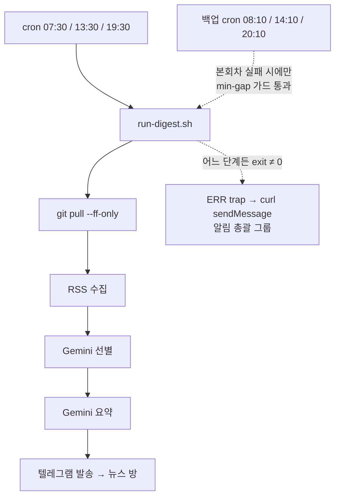

아침 브리핑이 안 왔다. 07시 30분에 오기로 한 회차가 정오가 지나도 없었다. 어제 저녁 회차까지는 멀쩡했다.

배경을 짚으면 이렇다. 이 봇은 원래 GitHub Actions의 무료 예약으로 하루 세 번 돌았는데, 매 회차가 한두 시간씩 밀려서 미니PC의 cron으로 이관했다. 옮기면서 두 가지를 뺐다 — Actions 예약을 겹쳐 두던 백업과, 발송 기록의 git 추적. 감시 장치도 따로 없었다.

없던 데는 이유가 있었다. 시스템이 가벼웠다 — 상시 도는 프로세스 없이 cron이 띄우고 80초 뒤에 죽는 봇에 감시 장치를 달면 감시 장치가 본체보다 무거워진다. 그리고 GitHub 시절의 「안 오는 일」은 거의 전부 예약의 문제였다. schedule 이벤트가 폐기되거나 밀리는 일이었고, 실행 자체는 26회 전부 성공이었다. 백업 예약이 48분 뒤에 하나씩 더 있어서 아예 안 오는 일도 드물었다. 그때는 딱히 감시가 필요해 보이지 않았다.

이번에는 실행이 죽었다. 그리고 죽은 사실을 알게 된 건 다섯 시간 뒤였다.

## 로그 마지막 줄 한 줄이 전부였다

미니PC는 살아 있었다. `up 6 days`, crontab도 그대로. 로그를 열었더니 마지막 줄이 이랬다.

```
텔레그램 발송 완료: 후보 227건 → 26건
2026-09-23T19:31:52+09:00 done
외부 API 오류: HTTP 503
```

어제 저녁 회차는 `done`까지 찍고 끝났고, 오늘 아침 회차는 오류 한 줄만 남기고 죽었다. 타임스탬프도 없다. `set -euo pipefail` 아래에서 무언가가 0이 아닌 값으로 끝나 `echo done`까지 못 간 것이다.

## 실패 지점은 재시도를 다 쓴 뒤였다

`외부 API 오류`는 봇 코드의 최상위 핸들러가 찍는다. `HTTPStatusError`가 파이프라인 어디서든 올라오면 저 한 줄을 출력하고 exit 1로 끝낸다.

수집 실패는 여기 안 온다. 피드가 죽으면 `건너뜀: <피드>: 네트워크 오류` 경고로 쌓이고 회차는 계속 간다. 치명적인 건 Gemini와 텔레그램뿐이고, 어느 쪽이든 같은 한 줄로 끝난다.

Gemini 호출부는 이미 재시도가 있다.

```python
RETRY_STATUSES: Final = frozenset({429, 500, 502, 503, 504})
RETRY_DELAYS: Final = (5.0, 20.0, 60.0)
```

503이 와도 최대 네 번까지 다시 묻는다. 그걸 전부 소진하고 `raise_for_status()`가 올라갔다는 건 **구글 쪽 장애가 적어도 수 분은 지속됐다**는 뜻이다. 로그에 다른 줄이 없는 것도 그래서다 — 경고는 회차 말미에 한꺼번에 찍는데, 치명적 실패는 그 전에 회차를 죽인다.

## 복구됐는지는 드라이런이 답했다

정오쯤 같은 명령을 `--dry-run`으로 돌렸다. 발송도 기록도 없이 수집부터 요약까지 전체 경로를 태운다.

```
드라이런 완료: 후보 227건 → 발송 대상 14건
```

정상이었다. Gemini는 이미 살아 있었고 다음 예정 회차는 그대로 두면 됐다. 남은 건 「다음에 또 이러면」이었다.

## 실패의 성격이 바뀌었는데 장치는 그대로였다

미니PC로 옮기면서 실패 구도가 바뀌었다. 트리거는 내 기계의 cron이라 믿을 만해졌고, 대신 **실행 단계의 실패**(외부 API 같은)가 주요 실패 모드가 됐다. 그런데 그 단계를 덮던 장치는 하나도 없었다 — 백업은 이관하면서 빠져 있었고, 감시는 애초에 없었다.

백업을 뺀 것 자체는 합리적이었다. Actions가 저장소의 낡은 발송 기록을 기준으로 돌면 미니PC가 방금 보낸 걸 모르고 같은 브리핑을 한 번 더 보낸다. 백업과 중복 방지를 동시에 가질 수 없어서 백업을 버렸다. 하지만 그 판단은 「발송 기록이 저장소 안에 있을 때」의 얘기였고, 지금은 `sent.jsonl`이 미니PC 파일이라 `git pull`과 무관하다. **백업을 못 두던 이유가 사라져 있었다.**

감지 쪽도 마찬가지다. GitHub 시절에는 트리거가 GitHub 것이라 내가 감시할 수 있는 지점이 없었다. 지금은 실행 전체가 내 기계라, 실패 순간에 신호를 낼 지점이 생겼다.

## 백업 cron은 알림이 아니라 자동 복구다

GitHub Actions 시절에는 예약 폐기에 대비해 48분 뒤 백업 workflow를 뒀다. 이번에 crontab 한 줄로 되살렸다.

```
10 8,14,20 * * * ~/bin/run-digest.sh >> ~/logs/ai-trend-bot.log 2>&1
```

중복 발송 걱정은 `--min-gap-hours 3` 가드가 이미 해결해 둔다. `sent.jsonl`의 마지막 발송 시각이 3시간 안쪽이면 수집 전에 건너뛴다. 본회차가 성공했으면 백업 회차는 몇 초 만에 조용히 끝나고, 실패했으면 마지막 발송이 어제라 가드를 통과해 브리핑이 40분 늦게 나간다.

발송 도중 죽는 경우도 안전하다. `sent.jsonl`에는 텔레그램 메시지 하나가 나갈 때마다 기록이 찍히므로, 재실행 때 이미 보낸 항목은 제외된다. 오늘 같은 503이었다면 08시 10분에 브리핑이 왔을 것이다 — 실패 알림을 받는 것보다 브리핑이 오는 쪽이 낫다.

## 실패 알림은 봇이 아니라 trap이 보낸다

백업이 못 메우는 경우가 있다 — 장애가 40분을 넘기거나, `uv sync`나 스크립트 자체가 죽는 경우다. 그래서 실행 스크립트에 `ERR` trap을 걸었다. 실패 시 봇 코드가 아니라 `curl`이 텔레그램 API를 직접 호출한다. 새 장치 둘이 붙은 전체 그림은 이렇다.



이번 사고는 `Gemini` 호출부에서 죽은 경우다. 선별인지 요약인지는 한 줄짜리 로그로 구분이 안 됐고, 그게 뒤에 나오는 메시지 패치의 계기다. 백업 cron은 `run-digest.sh` 전체를 다시 태우고, trap은 스크립트 안 어느 줄이 죽든 잡는다.

알림은 뉴스 브리핑이 가는 방과 분리했다. 이번에 알림 전용 그룹을 하나 팠는데, 앞으로 여러 개인 서비스의 장애 신호를 전부 모을 총괄 방이다. 그래도 새 봇은 필요 없었다 — `sendMessage`의 `chat_id`는 호출마다 고르는 파라미터라, 같은 봇을 그룹에 멤버로 넣고 그 `chat_id`를 쓰면 끝이다. 메시지는 `[서비스명]` 접두어를 달아 어느 서비스가 죽었는지로 시작한다.

```
[ai-trend-bot] 회차 실패
시각: 2026-09-24 07:30:47 KST · minipc
단계: 수집·요약·발송
원인: 외부 API 오류: Gemini HTTP 503
명령: "$UV" run ai-trend-bot run --send --limit 30 --min-gap-hours 3
```

형식을 정하면서 세 번 고쳤다. 처음엔 로그 마지막 여섯 줄을 통째로 붙였는데, 이전 회차의 `done`까지 같이 딸려와서 오히려 읽기 어려웠다. 그래서 마지막 비어 있지 않은 줄 하나만 뽑는다 — 이 스크립트는 죽기 직전에 찍은 것이 곧 오류다. 그다음엔 `exit 1` 같은 걸 붙였는데, 종료 코드는 아는 사람만 읽는 정보라 빼고 대신 스크립트의 각 단계에 이름을 달았다. `STAGE` 변수를 매 줄 갱신해 두면 trap이 「어느 단계에서 죽었는지」를 말해 준다.

남은 약점은 `원인` 줄이었다. `외부 API 오류: HTTP 503`만으로는 Gemini인지 텔레그램인지 구분이 안 된다. 그래서 봇 코드의 최상위 핸들러를 손봤다 — 실패한 요청의 호스트를 서비스 이름으로 변환해 같이 찍게 했다. 이제 로그에는 `외부 API 오류: Gemini HTTP 503`처럼 남고, 알림이 그 줄을 그대로 가져간다.

trap에서는 `$?`와 `$BASH_COMMAND`를 첫 줄에서 잡아야 실패한 명령과 종료 코드가 산다. 그리고 알림 발송 자체는 `|| true`로 감싼다 — 알림이 스크립트를 다시 죽이는 재귀는 없어야 한다.

## 장치마다 잡는 것이 다르다

| | 봇 실패(API·버그) | cron 정지 | miniPC 다운 | 텔레그램 장애 |
|---|---|---|---|---|
| 백업 cron | ✅ 40분 뒤 자동 복구 | ❌ | ❌ | ❌ |
| 실패 trap | ✅ 즉시 알림 | ❌ | ❌ | ❌ |
| 외부 헬스체크 ping | ✅ | ✅ | ✅ | ✅ |

앞의 둘은 기계가 살아 있어야 동작한다. miniPC가 통째로 죽는 경우까지 덮으려면 외부에 두는 ping이 필요한데, 이번에는 달지 않았다. 「기계가 죽어 브리핑이 안 오는」 상황은 여전히 사람이 알아채야 하는 영역이라, 움직이는 부품을 하나 더 들이는 값을 아직 안 치렀다.

## 남은 구멍을 적어 둔다

- **`git pull` 실패는 알림이 안 간다.** `|| echo`로 넘기는 soft-fail이라 trap이 안 잡는다. 의도한 설계지만 「코드가 오래 안 갱신된다」는 신호는 따로 없다.
- **Threads 수집처가 며칠째 네트워크 오류로 건너뛰고 있다.** 회차는 정상으로 끝나 지나치기 쉬운데, 로그를 봐야만 아는 종류의 고장이다.
- **알림 경로도 텔레그램에 있다.** 텔레그램 자체가 죽으면 브리핑도 알림도 못 간다 — 그날은 조용하다.
- **miniPC가 통째로 죽는 경우는 여전히 무음이다.** 표에 있는 외부 헬스체크 ping만이 이 구멍을 메운다.

이관할 때 「미니PC가 죽으면 그 회차는 아예 오지 않는다」고 적었다. 이번에는 미니PC가 살아 있는데도 안 온 사례를 겪었다. 백업 cron 한 줄과 trap 몇 줄, 그리고 오류 메시지가 자기 이름을 말하게 한 패치까지 — 회차 실패는 이제 늦게라도 오거나, 안 오면 무엇이 왜 죽었는지 즉시 알려 준다.
