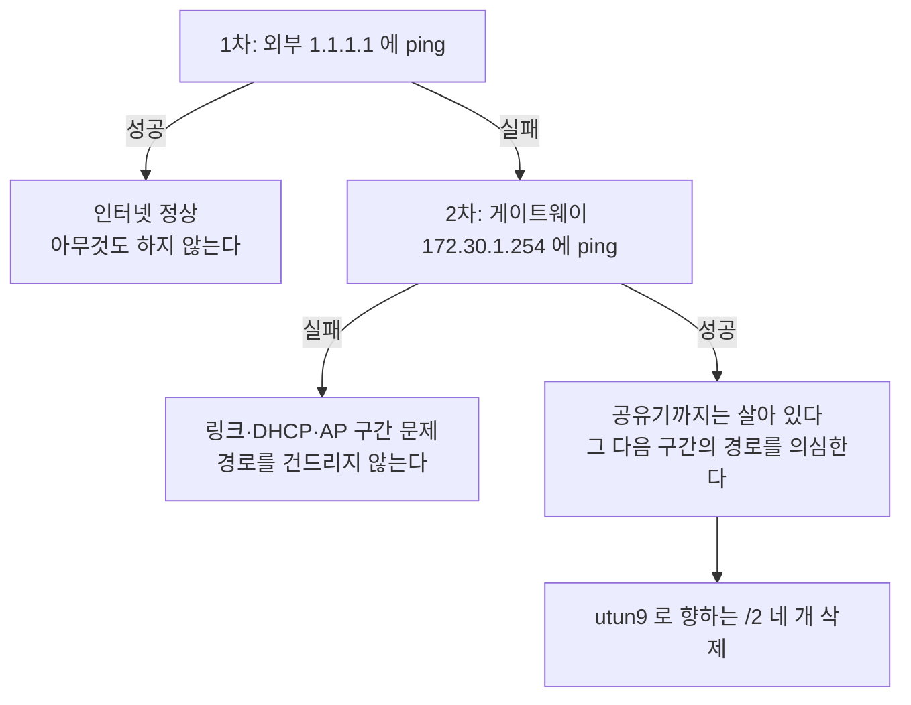
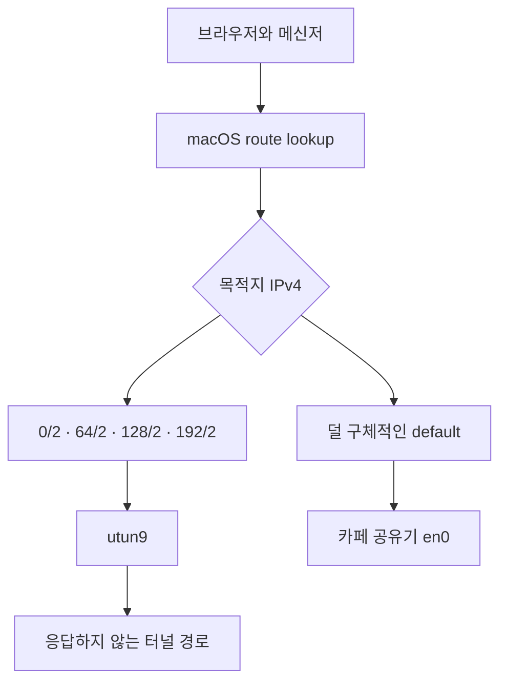

카페에서 작업하다가 맥북의 인터넷이 갑자기 멈췄다. 와이파이 아이콘은 연결 상태였고, 같은 공간의 휴대폰은 인터넷을 잘 썼다. Tailscale도 화면상으로는 계속 연동된 것처럼 보였다. 그런데 맥북에서는 브라우저가 열리지 않았고, 실행 중이던 메신저 연결도 멈췄다.

이럴 때 가장 먼저 떠오르는 말은 "카페 와이파이가 불안정하다"다. 하지만 이번에는 `fixnet` 한 번으로 복구됐다. 재부팅도, 와이파이 재연결도, Tailscale 설정 변경도 하지 않았다.

결론부터 말하면 이번 증상은 와이파이 접속 실패라기보다 **인터넷 트래픽이 응답하지 않는 터널 인터페이스로 라우팅된 상태**에 가까웠다. `fixnet`은 Tailscale을 끄지 않았다. macOS 라우팅 테이블에서 외부 IPv4 트래픽을 가로채던 네 개의 경로만 지웠다.

이번 사건을 세 문장으로 줄이면 다음과 같다.

- `en0`는 카페에서 IP 주소와 게이트웨이를 정상적으로 받았다.
- 인터넷 주소 전체가 `utun9`로 향하는 더 구체적인 경로에 걸려 있었고, 그 터널 쪽 패킷 왕복이 멈췄다.
- Tailscale 네트워크 익스텐션 로그가 같은 시각에 실패를 기록했기 때문에 Tailscale의 경로 상태가 유력한 관련 요인이지만, 네 개의 경로를 실제로 설치한 주체까지 이 기록만으로 확정할 수는 없다.

## 이 글은 이전 글이 요구한 「n」을 채우는 기록이다

이 증상은 처음이 아니다. 3주 전에 [와이파이를 옮길 때마다 맥북 인터넷이 작동 안하던 이유](/17/macbook-wifi-issue-when-moved)를 쓰면서 같은 경로를 지목했고, 그 글의 마지막은 이렇게 끝났다. **"지금 이 글에 부족한 건 분석이 아니라 n 이다."** 사례 하나로 내린 결론이 3일 만에 반례를 만났기 때문이다.

그래서 그 뒤로 `fixnet`은 실행할 때마다 판단과 결과를 `~/fixnet.log`에 쌓아 왔다. 이번 카페 장애는 그 로그에 새로 붙은 세 줄이다. 이 글이 이전 글과 다른 점은 새로운 원인을 찾았다는 것이 아니라, **같은 패턴이 다른 장소·다른 인터페이스 번호에서 반복된다는 것을 로그로 보이게 됐다**는 점이다.

`~/fixnet.log`에 지금까지 쌓인 것은 다섯 줄이다.

| 날짜·시각 | 장소(게이트웨이) | 문제의 터널 | `fixnet`이 남긴 결과 |
|---|---|---|---|
| 2026-08-15 00:32:55 | 집 `192.168.0.1` | `utun4` | 경로 삭제로 해결 |
| 2026-08-18 19:31:04 | — | — | 게이트웨이 무응답, 개입 안 함 |
| 2026-09-03 16:22:32 | 카페 | — | 게이트웨이 무응답, 개입 안 함 |
| 2026-09-03 16:22:44 | 카페 `172.30.1.254` | `utun9` | 경로 삭제로 해결 |
| 2026-09-03 16:38:48 | 카페 `172.30.1.254` | `utun9` | 경로 삭제로 해결 |

**「경로 삭제로 해결」이 세 번 쌓였고, 「Tailscale 재기동으로 해결」은 아직 한 번도 없다.** 이전 글이 세워 둔 판정 기준이 바로 이것이었다. 재기동으로 풀린 사례가 섞이면 경로가 원인이 아니라는 뜻이고, 경로 삭제만 쌓이면 경로 쪽이 맞다는 뜻이다. 다만 n이 셋이라 아직 결론이 아니라 경향이다.

여기서 이미 하나가 눈에 띈다. **8월에는 `utun4`, 9월에는 `utun9`였고 게이트웨이도 집에서 카페로 바뀌었다.** 뒤에서 설명하겠지만 `utun` 뒤의 숫자는 고정된 장치 이름이 아니라 연결 순서에 따라 붙는 번호다. 로그가 그것을 실제로 보여 준다.

### 이번 장애의 시각별 기록

`fixnet` 로그와 macOS 통합 로그를 실행 시각 기준으로 겹쳐 보면 다음과 같다. 출처가 다르므로 어느 쪽에서 온 줄인지 함께 적는다.

| 시각 | 출처 | 관찰된 것 | 결과 |
|---|---|---|---|
| 16:20:04 | 통합 로그(`configd`) | `en0`에 `172.30.1.100`과 게이트웨이 `172.30.1.254`를 DHCP로 설정 | 와이파이 연결·로컬 네트워크 설정은 성립 |
| 16:22:32 | `fixnet.log` | 게이트웨이 무응답 | 경로를 건드리지 않고 종료 |
| 16:22:44 | `fixnet.log` | 게이트웨이 `172.30.1.254` 응답, 외부만 불통 | `/2` 경로 네 개 삭제 후 복구 |
| 16:38:48 | `fixnet.log` | 같은 라우팅 패턴 재발 | `/2` 경로 네 개 삭제 후 다시 복구 |

두 번 모두 로그의 마지막 줄은 같았다.

```text
[2026-09-03 16:22:44] 결과: 경로 삭제로 해결
[2026-09-03 16:38:48] 결과: 경로 삭제로 해결
```

로그를 읽을 때 주의할 것이 두 가지 있다. 첫째, **`fixnet`은 "이미 인터넷이 정상"이라고 판단한 경우에는 로그에 아무것도 남기지 않는다.** 화면에만 "할 일 없음"을 찍고 끝나므로, 아무 일도 없던 실행은 기록에서 보이지 않는다. 둘째, 16시 22분 32초의 게이트웨이 무응답 줄은 주소를 남기지 않는다. 위 표의 `172.30.1.254`는 그 12초 뒤 줄과 DHCP 로그에서 끌어온 값이지 그 줄 자체의 기록이 아니다.

이 기록만으로 모든 원인을 확정할 수는 없지만, 적어도 이번 두 번의 장애에서 `tailscale down/up`은 실행되지 않았다. 경로 삭제 단계에서 인터넷이 살아났기 때문이다.

## 와이파이와 인터넷은 서로 다른 계층에서 멈출 수 있다

macOS 통합 로그에서 16시 20분 전후의 상태를 계층별로 나눠 봤다.

먼저 `configd`는 `en0`에 카페 네트워크의 주소와 게이트웨이를 정상적으로 설정했다.

```text
DHCP en0: identified lease for 172.30.1.100
DHCP en0: setting 172.30.1.100 netmask 255.255.255.0 broadcast 172.30.1.255
DHCP en0: publish success { IPv4, DNS, DHCP }
DHCP en0: BOUND
```

즉 맥북이 공유기와 통신할 기본 조건인 무선 연결과 DHCP 주소 수신까지는 진행됐다. 물론 DHCP 성공이 인터넷 전체의 정상 동작을 보장하지는 않지만, 적어도 "와이파이에 붙지 못했다"고 보기에는 맞지 않는 로그다.

그 다음으로 Tailscale 네트워크 익스텐션과 커널의 연결 기록을 봤다.

여기서 `en0`와 `utun9`는 성격이 다르다. `en0`는 현재 카페 네트워크에 연결된 맥북의 일반 네트워크 인터페이스이고, `utun9`는 macOS가 VPN·네트워크 익스텐션 같은 소프트웨어 터널에 할당한 가상 인터페이스다. `utun` 뒤의 숫자는 연결을 만들고 끊는 순서에 따라 바뀔 수 있으므로, `utun9`라는 숫자 자체가 고정된 장치나 Tailscale 전용 이름을 뜻하지는 않는다. 이번 기록에서는 Tailscale 익스텐션 로그와 같은 시각에 함께 등장했다는 점이 관련성을 보여주는 단서다.

```text
interface: utun9
t_state: SYN_SENT
bytes in/out: 0/0

connect: network is unreachable
connect: no route to host
PollNetMap: all connection attempts failed
```

16시 38분대에는 KakaoTalk의 연결도 경로 자체는 `satisfied`, `viable`이라고 표시됐지만 실제 인터페이스는 `utun9`였고, 30초 뒤 `Operation timed out`으로 끝났다. "경로가 있다"와 "그 경로를 통해 패킷이 왕복한다"는 별개의 상태라는 뜻이다.

이 구분을 위해 `fixnet`은 서로 다른 두 곳을 순서대로 확인한다. **먼 곳을 먼저 보고, 실패하면 가까운 곳을 본다.**



순서가 이렇게 잡힌 이유는 간단하다. 외부가 되면 애초에 고칠 것이 없으므로 더 볼 필요가 없고, 외부만 실패했을 때 비로소 “어디까지 살아 있는가”를 물어야 하기 때문이다.

게이트웨이 ping이 실패하면 무선 링크, DHCP, ARP, 카페 AP 또는 captive portal 같은 로컬 구간을 먼저 의심해야 한다. 이때 경로를 지워도 공유기까지 가는 문제가 해결되지는 않으므로 `fixnet`은 개입하지 않는다.

반대로 게이트웨이는 응답하는데 `1.1.1.1`만 실패하면 맥북과 카페 공유기 사이의 연결은 살아 있고, 그 다음 구간에서 잘못된 경로를 선택하고 있을 가능성이 커진다. 이번 16시 22분 44초와 16시 38분 48초가 바로 이 분기였다.

## 네 개의 `/2` 경로가 IPv4 전체를 덮고 있었다

장애 당시 `fixnet`이 남긴 라우팅 테이블은 다음과 같았다.

```text
0/2                utun9              UScg                utun9
default            172.30.1.254       UGScg                 en0
default            link#26            UCSIg               utun8
64/2               utun9              USc                 utun9
128.0/2            utun9              USc                 utun9
192.0.0/2          utun9              USc                 utun9
```

`netstat -nr -f inet` 출력이라 목적지 사전순으로 섞여 나온다. 눈여겨볼 것은 기본 경로가 **두 개**(`en0`와 `utun8`)라는 점, 그리고 그것과 별개로 `/2` 네 개가 모두 `utun9`를 가리킨다는 점이다.

`0/2`, `64/2`, `128.0/2`, `192.0.0/2`는 표시만 짧게 줄여 쓴 것이고 실제로는 다음 네 네트워크다.

여기서 `/2`는 “주소의 앞부분에서 2비트만 네트워크 식별자로 사용한다”는 CIDR 표기다. IPv4 주소는 총 32비트이므로 `/2` 하나에는 `2^(32-2)`, 즉 전체 주소 공간의 4분의 1이 들어간다.

왜 하필 네 개인지는 2비트로 만들 수 있는 값이 넷뿐이라는 데서 바로 나온다. 첫 두 비트가 `00`·`01`·`10`·`11`, 이 넷이면 남는 주소가 없다.

| 첫 2비트 | 경로 | 첫 옥텟 범위 |
|---|---|---|
| `00` | `0.0.0.0/2` | 0 – 63 |
| `01` | `64.0.0.0/2` | 64 – 127 |
| `10` | `128.0.0.0/2` | 128 – 191 |
| `11` | `192.0.0.0/2` | 192 – 255 |

즉 이 네 줄은 “IPv4 전부”를 네 조각으로 쪼개 적은 것이고, 조각마다 목적지가 `utun9`다. 터널 소프트웨어가 `default`를 직접 덮어쓰는 대신 이렇게 **더 구체적인 경로를 여러 개 까는 것은 흔한 수법이다.** 원래의 `default`를 지우지 않고도 실질적으로 모든 트래픽을 가져갈 수 있고, 터널을 걷어낼 때 그 줄들만 지우면 원래 경로가 저절로 되살아나기 때문이다. 이번에 `fixnet`이 한 일이 정확히 그 “그 줄들만 지우기”다.

```text
0.0.0.0/2
64.0.0.0/2
128.0.0.0/2
192.0.0.0/2
```

주소를 몇 개 대입해 보면 더 직관적이다.

| 목적지 주소 예시 | 선택되는 `/2` 경로 |
|---|---|
| `1.1.1.1`, `8.8.8.8` | `0.0.0.0/2` |
| `100.64.0.1` | `64.0.0.0/2` |
| `172.30.1.254` | `128.0.0.0/2`보다 더 구체적인 카페 LAN 경로 |
| `203.0.113.10` | `192.0.0.0/2` |

라우터는 목적지에 맞는 경로가 여러 개면 **가장 긴 접두사(longest prefix)를 가진 경로**, 즉 더 구체적인 경로를 선택한다. `default`는 사실상 `/0`이라 모든 주소에 맞지만 구체성이 없다. 반면 `/2`는 앞의 2비트를 지정했으므로 `/0`보다 우선한다. 그래서 표에 `default 172.30.1.254 en0`가 남아 있어도 `1.1.1.1` 같은 일반 인터넷 주소는 `en0`가 아니라 `utun9`로 간다.

게이트웨이 `172.30.1.254`가 응답할 수 있었던 것도 모순이 아니다. DHCP가 만든 `172.30.1.0/24` 같은 로컬 네트워크 경로는 `/2`보다 훨씬 구체적이므로 게이트웨이 통신에는 `en0`가 선택된다. `fixnet`의 “게이트웨이는 응답하지만 외부 주소는 실패”라는 판정은 바로 이 차이를 이용한다.

또한 `default link#26 utun8`가 함께 보인다고 해서 트래픽이 자동으로 정상화되지는 않는다. 그것도 기본 경로(`/0`) 수준의 후보일 뿐이고, 네 개의 `/2` 경로가 더 구체적이기 때문이다. `link#26`은 인터넷 주소가 아니라 macOS가 터널 인터페이스를 가리키는 내부 링크 표기다.



이 상태에서는 와이파이 공유기까지 가는 길이 살아 있어도 인터넷 패킷은 공유기로 가지 않는다. 모든 주소가 `utun9`의 네 범위 중 하나에 들어가기 때문이다.

### 그래서 지우면 왜 통하나

여기까지 오면 `fixnet`이 왜 듣는지가 한 줄로 설명된다. **네 줄을 지우면 `1.1.1.1`에 맞는 경로 중 남는 것이 `default` 하나뿐이 되고, 그 `default`가 가리키는 곳이 카페 공유기다.** 새 경로를 만들어 넣는 것이 아니라, 이기고 있던 줄을 치워서 원래 있던 줄이 이기게 하는 것이다.

`1.1.1.1` 한 주소만 놓고 보면 이렇게 갈린다.

| | 후보 경로 | 이기는 줄 | 결과 |
|---|---|---|---|
| 지우기 전 | `0.0.0.0/2` → `utun9`, `default` → `en0` | `/2` (더 구체적) | 응답 없는 터널로 감 |
| 지운 뒤 | `default` → `en0` | `default` (유일) | 카페 공유기로 감 |

Tailscale을 끄지 않아도, 와이파이를 다시 잡지 않아도 되는 이유가 이것이다. 고장 난 것은 인터페이스나 연결이 아니라 **선택**이었고, 선택지 넷을 없애면 판단이 저절로 바뀐다.

다만 이 대목은 지금 추론이지 기록이 아니다. `fixnet`은 지우기 **전** 라우팅 테이블만 로그에 찍고 지운 **뒤**는 찍지 않는다. 그래서 「`en0`로 돌아갔다」의 직접 증거는 ping이 다시 성공했다는 사실 하나뿐이다. 삭제 뒤 `netstat`을 한 번 더 찍는 줄을 넣는 것은 한 줄짜리 수정이고, 다음 장애부터는 이 표가 추론이 아니라 로그가 된다.

## Tailscale이 연결돼 보이는 것과 인터넷 경로는 다르다

이번 현상을 "Tailscale이 완전히 끊겼다"고 쓰면 정확하지 않다. 반대로 "Tailscale은 정상인데 와이파이만 고장 났다"고 쓰기도 어렵다.

Tailscale은 기본적으로 Tailscale 기기 사이의 오버레이 네트워크를 만들지만, exit node를 사용하면 일반 인터넷 트래픽도 특정 기기를 통해 보낼 수 있다. 공식 문서도 exit node가 공용 인터넷 트래픽을 라우팅하며 기본 경로를 구성한다고 설명한다. [Tailscale exit node 문서](https://tailscale.com/kb/1103/exit-nodes/)

여기서 기존 글의 표현도 조금 조심해서 고쳐야 한다. `accept-routes`는 다른 장치가 광고한 경로를 받아들이는 설정이고, subnet router는 일반 인터넷 전체를 바꾸는 기능이 아니다. [Tailscale CLI 문서](https://tailscale.com/kb/1080/cli), [subnet router 문서](https://tailscale.com/kb/1104/enable-ip-forwarding)

따라서 이번 로그만으로 "`accept-routes` 하나가 범인이다"라고 단정할 수는 없다. 확인된 사실은 다음 세 가지다.

1. 카페의 `en0`는 DHCP 주소와 게이트웨이를 받았다.
2. Tailscale 네트워크 익스텐션과 여러 애플리케이션의 트래픽이 `utun9`에서 멈췄다.
3. `utun9`에 IPv4 전체를 덮는 네 개의 `/2` 경로가 있었고, 그 경로를 삭제하자 두 번 모두 복구됐다.

여기서 exit node 를 원인으로 지목하고 싶어지지만, 그 설명은 이미 한 번 어긋난 적이 있다. 이전 글의 후속 검증에서 `tailscale debug prefs`를 찍어 보니 `ExitNodeID`가 비어 있고 `RouteAll`도 `false`였는데, **그 상태에서 같은 `/2` 네 줄이 그대로 설치돼 있었다.** 그러니 이번 카페 장애도 “exit node 를 켜 둔 채 자리를 옮겨서”라고 단정할 근거가 없다. 확인된 사실과 추정을 다음처럼 나눠 두는 편이 안전하다.

| 구분 | 이번 기록에서 말할 수 있는 범위 |
|---|---|
| 직접 확인된 원인 | 응답하지 않는 `utun9`로 외부 IPv4를 보내는 `/2` 경로가 존재했고, 삭제하자 인터넷이 복구됨 |
| Tailscale과의 관계 | 같은 시각 Tailscale 네트워크 익스텐션이 `network is unreachable`, `no route to host`를 기록했고 트래픽도 `utun9`에서 멈춤 |
| 아직 확정할 수 없는 것 | 네 개의 경로를 정확히 어느 프로세스가 설치했는지, exit node 설정인지 다른 네트워크 익스텐션인지 |

그러므로 “Tailscale이 인터넷을 끊었다”보다는 **Tailscale과 연관된 것으로 보이는 터널 경로가 비정상 상태로 남아 일반 인터넷 경로를 가로막았다**고 쓰는 것이 정확하다. Tailscale이 화면에서 연결 상태로 보였다는 사실도 반박 증거가 아니다. 피어·제어 plane 연결 상태와, 이 맥북의 공용 인터넷 트래픽이 실제로 터널을 통해 왕복하는지는 서로 다른 경로와 상태이기 때문이다.

휴대폰이 정상인 것도 같은 이유로 설명된다. 휴대폰은 자체 라우팅 테이블과 자체 Tailscale 터널을 사용하므로, 맥북의 `utun9`에 남은 경로 문제를 공유하지 않는다. 휴대폰이 된다는 사실은 카페 회선이 살아 있다는 단서이지, 맥북의 터널 경로까지 정상이라는 증거는 아니다.

다만 누가 이 경로를 설치했고 왜 네트워크 이동 뒤 재발했는지는 아직 남은 질문이다. 다음 장애 때는 `route -n get 1.1.1.1`, `ifconfig`, `scutil --nwi`, Tailscale 상태와 시스템 로그를 경로 삭제 전에 함께 저장해야 이 부분까지 확인할 수 있다.

## `fixnet`은 복구 명령이 아니라 작은 실험 장치다

현재 `fixnet`은 별도 실행 파일이 아니라 `~/.zshrc`에 들어 있는 셸 함수다. 중요한 부분만 줄이면 다음 순서다.

이 함수의 역할은 네트워크 설정을 무작정 초기화하는 것이 아니다. 먼저 “인터넷이 정말 안 되는가”를 확인하고, 그 다음 “내 맥북과 현재 공유기 사이까지는 살아 있는가”를 확인한 뒤, 두 조건이 맞을 때만 좁은 범위의 라우팅 복구를 시도한다. 즉 복구 명령이면서 동시에 장애를 세 구간으로 분류하는 작은 진단 장치다.

```bash
fixnet() {
  local log=~/fixnet.log ts=$(date '+%F %T') gw
  net_ok() { ping -c2 -W1000 1.1.1.1 >/dev/null 2>&1; }

  # 이미 인터넷이 되면 아무것도 하지 않는다
  if net_ok; then
    echo "인터넷 정상. 할 일 없음."
    return 0
  fi

  # 게이트웨이까지 안 되면 라우팅을 건드리지 않는다
  gw=$(route -n get default 2>/dev/null | awk '/gateway:/{print $2}')
  if [ -z "$gw" ] || ! ping -c2 -W1000 "$gw" >/dev/null 2>&1; then
    echo "게이트웨이($gw) 무응답 → 링크/와이파이 문제. 경로는 안 건드린다."
    echo "[$ts] 게이트웨이 무응답, 개입 안 함" >>"$log"
    return 1
  fi

  # 지우기 전에 문제 패턴만 골라 로그에 남긴다
  echo "[$ts] --- fixnet 시작 (gw=$gw 응답, 외부만 불통) ---" | tee -a "$log"
  netstat -nr -f inet | egrep '^(default|0/2|64/2|128.0/2|192.0.0/2)' | tee -a "$log"

  # IPv4 전체를 쪼개 덮은 경로를 하나씩 삭제한다. 실패를 숨기지 않는다
  local failed=0
  for n in 0.0.0.0/2 64.0.0.0/2 128.0.0.0/2 192.0.0.0/2; do
    sudo route -n delete -net $n 2>&1 | tee -a "$log" \
      | grep -q 'not in table\|delete net' || failed=1
  done
  [ $failed -eq 1 ] && echo "[$ts] 경고: route 삭제 일부 실패 (sudo?)" | tee -a "$log"

  if net_ok; then
    echo "[$ts] 결과: 경로 삭제로 해결" | tee -a "$log"
    return 0
  fi

  # 경로만으로 부족한 경우에만 Tailscale을 재기동한다
  tailscale down >/dev/null 2>&1; sleep 2; tailscale up >/dev/null 2>&1; sleep 3
  if net_ok; then
    echo "[$ts] 결과: Tailscale 재기동으로 해결" | tee -a "$log"
    return 0
  fi

  echo "[$ts] 결과: 둘 다 실패 → bash ~/Desktop/mac-net/netdiag.sh" | tee -a "$log"
  return 1
}
```

각 단계가 실제로 의미하는 것은 다음과 같다.

| 단계 | 코드 | 확인하는 것 | 이번 실행 |
|---|---|---|---|
| 1 | `ping 1.1.1.1` | DNS를 거치지 않은 외부 IPv4 도달성 | 실패 |
| 2 | `route -n get default` 후 게이트웨이 ping | 현재 로컬 네트워크와 공유기까지의 연결 | 첫 실행은 실패, 이후 두 번은 성공 |
| 3 | `netstat -nr -f inet` | 외부 트래픽을 가로채는 `/2` 경로 존재 여부 | `utun9`에 네 개 존재 |
| 4 | `route -n delete -net` | 의심하는 네 개의 분할 경로만 제거 | 두 번 모두 복구 |
| 5 | 외부 ping 재검사 | 경로 삭제가 실제 복구로 이어졌는지 | 성공 |
| 6 | `tailscale down/up` | 경로 삭제만으로 부족할 때의 후속 조치 | 이번 두 번에는 실행되지 않음 |

첫 번째 외부 ping은 `1.1.1.1`을 직접 사용하므로 DNS 장애와 인터넷 경로 장애를 어느 정도 분리한다. 다만 ICMP를 막는 네트워크에서는 실제 인터넷이 되는데도 실패할 수 있는 휴리스틱이다. 그래서 이 함수의 성공·실패는 “인터넷의 모든 기능을 완벽히 증명한다”는 뜻이 아니라, 다음 복구 단계를 선택하기 위한 신호로 읽어야 한다.

두 번째 게이트웨이 검사는 더 중요하다. 게이트웨이가 응답하지 않으면 `fixnet`은 경로 삭제를 하지 않는다. 그 상태에서는 문제의 범위가 와이파이 링크·DHCP·ARP·카페 인증망일 가능성이 높고, `/2` 경로를 지워도 해결되지 않기 때문이다. 반대로 게이트웨이가 살아 있으면 로컬 구간을 통과한 뒤 외부로 나가는 경로를 조사할 근거가 생긴다.

세 번째 단계에서 `netstat` 전체를 무작정 수정하지 않고 `default`, 네 개의 `/2`만 로그로 뽑는 이유도 있다. 현재 함수가 알고 있는 문제 패턴을 기록하되, 다른 Tailscale 기기 경로나 로컬 네트워크 경로까지 건드리지 않기 위해서다. 실제 삭제 대상은 다음 네 개로 고정돼 있다.

```text
0.0.0.0/2
64.0.0.0/2
128.0.0.0/2
192.0.0.0/2
```

이 삭제는 Tailscale 애플리케이션을 종료하거나 계정에서 로그아웃시키는 작업이 아니다. 현재 커널 라우팅 테이블에서 해당 네트워크 항목을 제거하는 작업이다. 의도적으로 exit node나 전체 터널을 사용 중이었다면 인터넷 경로가 바뀌거나 Tailscale이 나중에 경로를 다시 설치할 수 있으므로, 이 명령을 범용적인 “네트워크 초기화”로 사용하면 안 된다.

이번 장애에서 복구가 `tailscale down/up`보다 먼저 끝났다는 점도 중요하다. `fixnet`은 1단계 경로 삭제 뒤 바로 외부 ping을 다시 보냈고, 두 번 모두 이 검사에서 성공했다. 따라서 이번 로그가 직접 증명하는 것은 “Tailscale 재시작이 고쳤다”가 아니라 **문제의 순간에 커널의 잘못된 경로를 제거하자 `en0`의 일반 경로로 돌아가 인터넷이 회복됐다**는 사실이다.

반면 함수의 현재 구현에는 운영상 한계도 있다. 삭제 명령의 성공 여부를 macOS `route` 출력 문자열에 의존하고, 외부 확인을 ICMP 하나에 의존하며, `/2` 네 개를 문제 패턴으로 미리 알고 있어야 한다. 또 `route -n get default`는 현재 대표 기본 경로의 게이트웨이를 얻는 용도이지, 라우팅 테이블에 존재하는 모든 기본 경로를 진단하는 명령은 아니다. 이번처럼 `en0`와 `utun8`에 기본 경로가 함께 있을 때는 뒤의 `netstat` 출력까지 같이 봐야 한다. 다음 버전에서는 삭제 전에 `route -n get 1.1.1.1`의 실제 인터페이스를 로그에 남기는 편이 좋다. 이번 로그에는 “어느 인터페이스로 나가기로 판정됐는가”가 빠져 있어서, 경로 표를 보고 사람이 역산해야 했다. 다만 `ifconfig`와 캡티브 포털 확인은 `netdiag.sh`가 이미 수집하므로, `fixnet`이 그것까지 떠안기보다 **증상이 났을 때 `netdiag.sh`를 먼저 돌리는 순서를 지키는 편이 낫다.**

16시 22분 32초의 첫 실행이 게이트웨이 무응답으로 종료된 것은 오히려 이 가드가 작동했다는 뜻이다. 그 뒤 게이트웨이가 응답한 16시 22분 44초에는 경로 네 개가 삭제됐고 바로 복구됐다.

## 이 명령을 모든 네트워크 문제에 쓰면 안 된다

`fixnet`은 범용 네트워크 치료제가 아니다. 다음 상황에는 다른 원인을 먼저 봐야 한다.

| 상태 | 먼저 의심할 것 |
|---|---|
| 와이파이 자체가 연결되지 않음 | 무선 링크, 인증, DHCP |
| 게이트웨이 ping도 실패 | 카페 AP, 신호, captive portal, IP 충돌 |
| 게이트웨이는 되지만 도메인만 실패 | DNS, MagicDNS, resolver |
| IPv4는 되지만 IPv6만 실패 | IPv6 경로와 터널 설정 |
| 의도적으로 exit node를 사용하는 중 | `/2` 경로 삭제가 설정을 깨뜨릴 수 있음 |

또 `net_ok`은 `1.1.1.1`에 ICMP ping을 보내는 휴리스틱이다. ICMP를 막는 네트워크에서는 오판할 수 있으므로 다음 버전에서는 IP ping과 짧은 HTTPS 요청을 함께 확인하는 편이 낫다.

복구 명령을 실행하기 전에는 다음을 먼저 남기는 것이 가장 좋다.

```bash
bash ~/Desktop/mac-net/netdiag.sh 2>&1 | tee ~/netdiag-$(date +%m%d-%H%M).log
fixnet
tail -n 80 ~/fixnet.log
```

고친 뒤에 보는 라우팅 테이블은 정상 상태의 흔적일 뿐이다. 이번처럼 `fixnet`이 원인을 지우면서 동시에 증상을 고치는 경우에는, 실행 전의 라우팅 테이블과 통합 로그가 더 중요하다.

## 세 번을 고쳤는데, 아직 원인을 모른다

[이전 글](/17/macbook-wifi-issue-when-moved)은 결론을 미루면서 판정 기준을 하나 남겨 뒀다. 로그가 쌓이면 어느 칸에 떨어지는지로 원인을 가리자는 것이었다.

| 이전 글이 정한 기준 | 지금까지 쌓인 로그 |
|---|---|
| 「경로 삭제로 해결」이 여러 번 → 원인 진단이 맞다 | **3회** |
| 「재기동으로 해결」이 섞임 → 경로는 필요조건일 뿐이다 | **0회** |
| 「게이트웨이 무응답」 → 애초에 Tailscale 문제가 아니었다 | 2회 |

기준대로 읽으면 통과다. `tailscale down/up`이 필요했던 적은 한 번도 없고, **경로 네 줄을 지우는 것만으로 세 번 모두 인터넷이 돌아왔다.** 카페든 집이든, `utun4`든 `utun9`든 같았다. 앞에서 본 것처럼 왜 통하는지도 설명된다. 이기고 있던 줄을 치우면 `default`가 남고, `default`는 공유기를 가리킨다.

여기서 하나는 바로잡아야 한다. 이 증상을 「자리를 옮기면 생기는 문제」로 부르기는 어렵다. 8월 15일 건은 집에서, 게이트웨이 `192.168.0.1`을 쓰던 중에 났다. 네트워크 전환이 흔한 방아쇠인 것은 맞지만 필수 조건은 아니다.

그런데도 개운하지 않다. 이전 글이 한 칸에 두 가지를 같이 넣어 뒀기 때문이다.

- **「경로를 지우면 고쳐진다」** — 세 번의 로그가 증명한다.
- **「경로가 있어서 고장 났다」** — 로그가 증명하지 않는다.

둘은 같은 말이 아니다. 이전 글이 이미 반례를 만났다. 경로 네 줄이 그대로 깔린 채로 `ping 1.1.1.1`이 6ms에 돌아온 순간이 있었다. 6ms는 터널을 돌아 나간 지연이 아니다. **경로가 깔려 있는 것이 평상시의 정상 상태이고, 어쩌다 그 경로가 블랙홀로 변한다**는 쪽이 지금 데이터에 더 맞는다.

## 고치는 법은 알았는데, 그걸로는 부족하다

솔직히 말하면 `fixnet` 한 줄로 30초 만에 복구되는 지금도 충분히 편하다. 재부팅해서 열어 둔 세션과 터미널 탭을 통째로 날리던 시절과 비교하면 그렇다.

그런데도 이걸 놓기가 싫은 이유가 있다. 지금 나는 **왜 고쳐지는지는 알지만 왜 고장 나는지는 모른다.** 그래서 카페에 갈 때마다 오늘은 날까 안 날까를 생각하게 되고, 증상이 나면 그때부터 하던 일이 끊긴다. 대응 시간이 짧아졌을 뿐 불확실성은 그대로다. 세 번을 같은 방법으로 고쳤다는 것은, 뒤집으면 세 번 다 원인 근처까지 갔다가 그냥 지우고 돌아왔다는 뜻이기도 하다.

그래서 물어야 할 것이 바뀌었다. 「누가 이 경로를 깔았나」가 아니라 「**같은 경로가 어떤 날은 통하고 어떤 날은 삼키는가**」다.

카페 로그에는 답의 후보가 하나 남아 있다.

```text
connect: network is unreachable
connect: no route to host
PollNetMap: all connection attempts failed
```

Tailscale 익스텐션이 자기 control plane에 닿지 못하고 있었다. 그렇다면 이런 그림이 된다. **터널 경로는 늘 깔려 있고, 익스텐션이 건강한 동안에는 그 경로로 들어온 패킷을 제대로 흘려보낸다. 익스텐션이 제어 연결을 잃으면 같은 경로가 그대로 블랙홀이 된다.** 이게 맞다면 고장 난 것은 경로가 아니라 경로 끝에 있는 프로세스이고, `fixnet`이 하는 일은 원인 제거가 아니라 **막힌 출구를 우회하는 것**이다.

즉 지금 `fixnet`은 증상을 지우면서 원인도 같이 지우고 있다. 그게 이 문제가 세 번이나 나고도 안 끝나는 이유다.

## 다음 한 번이면 끝낼 수 있다

여기까지 못 온 이유는 자료가 어려워서가 아니라 **비교 대상이 없어서**다. 증상이 났을 때만 로그를 떴고, 멀쩡할 때의 같은 항목을 떠 놓은 적이 한 번도 없다. 그러니 필요한 것은 새로운 명령이 아니라 대조군이다.

같은 항목을 두 번, 정상일 때와 증상일 때 떠서 나란히 놓으면 된다.

| 재는 것 | 위 그림이 맞다면 | 틀렸다면 |
|---|---|---|
| `/2` 네 줄의 존재 | 양쪽 **같음** (둘 다 있음) | 증상일 때만 있음 |
| `route -n get 1.1.1.1` 의 인터페이스 | 양쪽 **같음** (둘 다 `utun*`) | 정상일 때는 `en0` |
| `tailscale netcheck` 의 DERP 도달성 | **증상일 때만 실패** | 양쪽 같음 |
| `tailscale status` 의 peer·control 상태 | **증상일 때만 실패** | 양쪽 같음 |
| 익스텐션 PID와 기동 시각 | 증상 직전 재시작 흔적 | 변화 없음 |

앞의 둘이 같고 뒤의 셋만 갈리면 범인은 익스텐션 쪽이다. 반대로 정상일 때 `route -n get 1.1.1.1`이 `en0`로 나오면 경로가 그때그때 깔렸다 지워진다는 뜻이라 이 그림은 무너진다. **어느 쪽이든 한 번의 대조로 판정이 난다.**

문제는 사람이 이걸 잊는다는 것이다. 이전 글의 1번 원칙이 「고치면 증거가 사라진다」였는데, 그 글을 쓴 사람이 재발한 날 또 잊고 와이파이를 껐다 켰다. 그러니 다음 판은 기억이 아니라 도구에 맡긴다.

### 증거를 남기는 방법

`netdiag.sh`는 계층 전체를 훑는 무거운 도구다. 지금 필요한 것은 위 표의 다섯 항목만 빠르게 뜨는 작은 함수다. `~/.zshrc`에 넣는다.

```bash
# netsnap — 라우팅 블랙홀 판정에 필요한 다섯 항목만 한 파일로 뜬다.
# 정상일 때(대조군)도 장애일 때도 같은 함수를 쓴다. 항목이 갈리면 비교가 안 된다.
#   netsnap ok     → 평소 대조군
#   netsnap down   → 증상 순간 (fixnet 이 자동으로 부른다)
#   netsnap after  → 경로 삭제 직후
netsnap() {
  local tag=${1:-manual}
  local out=~/netsnap-$(date '+%m%d-%H%M%S')-$tag.txt
  {
    echo "# netsnap $tag  $(date '+%F %T')"
    echo; echo "== 1. /2 네 줄과 default =="
    netstat -nr -f inet | egrep '^(default|0/2|64/2|128.0/2|192.0.0/2)'
    echo; echo "== 2. 1.1.1.1 은 어디로 나가나 =="
    route -n get 1.1.1.1 2>&1 | egrep 'gateway|interface'
    echo; echo "== 3. tailscale status =="
    tailscale status 2>&1 | head -20
    echo; echo "== 4. 익스텐션 PID 와 기동 시각 =="
    local pid=$(pgrep -f 'io.tailscale.ipn.macsys.network-extension' | head -1)
    [ -n "$pid" ] && ps -o lstart=,pid= -p "$pid" || echo "익스텐션 없음"
    echo; echo "== 5. tailscale netcheck (8초 제한) =="
    perl -e 'alarm shift; exec @ARGV' 8 tailscale netcheck 2>&1 || echo "(제한 시간 초과)"
  } >"$out" 2>&1
  echo "$out"
}
```

설계에서 신경 쓴 것이 넷이다.

**함수는 하나, 부르는 곳은 둘이다.** 평소용과 장애용을 따로 만들면 항목이 갈려서 **대조 자체가 안 된다.** 같은 함수를 사람이 정상일 때 부르고 `fixnet`이 장애 때 부른다.

**`fixnet.log`를 오염시키지 않는다.** 이 파일의 가치는 한 줄 판정 원장이라는 데 있다. `netcheck` 출력 30줄을 여기 부으면 앞에서 본 것 같은 표로 읽을 수 없게 된다. 상세는 별도 파일로 빼고 `fixnet.log`에는 파일 이름만 남긴다.

**느린 것 하나만 시간을 제한한다.** 재 보니 `netstat`·`route`·`pgrep`은 0.0초, `tailscale status`는 0.04초인데 `tailscale netcheck`만 2.08초다. 장애 중에는 DERP 프로브가 더 오래 매달릴 수 있다. macOS에는 `timeout` 명령이 없어서 `perl`의 `alarm`으로 묶었다. 전체는 2초쯤에 끝나고 결과는 60줄 남짓이다.

**`sudo` 앞에서 뜬다.** 뒤에 붙이면 `sudo`가 비밀번호를 묻는 동안 멈추고, 그 사이에 자리를 뜨거나 취소하면 증거가 통째로 사라진다.

`fixnet`에는 두 줄만 끼우면 된다. 게이트웨이 확인을 통과한 직후와, 경로를 지운 직후다.

```bash
  echo "[$ts] --- fixnet 시작 (gw=$gw 응답, 외부만 불통) ---" | tee -a "$log"
  netstat -nr -f inet | egrep '^(default|0/2|64/2|128.0/2|192.0.0/2)' | tee -a "$log"

  echo "[$ts] 증거: $(netsnap down)" | tee -a "$log"      # ← sudo 앞에서 뜬다

  local failed=0
  for n in 0.0.0.0/2 64.0.0.0/2 128.0.0.0/2 192.0.0.0/2; do
    sudo route -n delete -net $n 2>&1 | tee -a "$log" | grep -q 'not in table\|delete net' || failed=1
  done

  echo "[$ts] 삭제 후: $(netsnap after)" | tee -a "$log"   # ← 앞에서 못 남긴 '지운 뒤' 테이블
```

`fixnet.log`에는 이런 두 줄만 늘어난다. 원장은 그대로 읽히고, 상세를 보고 싶을 때만 파일을 연다.

```text
[2026-09-04 14:02:11] 증거: <HOME>/netsnap-0904-140211-down.txt
[2026-09-04 14:02:14] 삭제 후: <HOME>/netsnap-0904-140214-after.txt
```

### 순서

1. **오늘 `netsnap ok`를 친다.** 대조군은 증상이 난 뒤에는 만들 수 없다. 이게 이 글을 쓰고 나서 처음 할 일이다.
2. 다음 장애 때는 `fixnet`이 알아서 `down`과 `after`를 뜬다. 사람이 기억할 것은 없다.
3. 두 파일을 나란히 놓고 **1·2번 항목이 같은지, 3·4·5번 항목이 갈리는지**를 본다.

```bash
diff ~/netsnap-*-ok.txt ~/netsnap-*-down.txt
```

**1·2번이 같고 3·4·5번만 갈리면** 경로는 평상시에도 늘 깔려 있고 익스텐션의 상태가 블랙홀을 만든다는 뜻이다. 그러면 `fixnet`은 원인을 지우는 게 아니라 우회하고 있는 것이고, 진짜 고칠 자리는 Tailscale 익스텐션 쪽이 된다.

**1·2번이 갈리면** 이 글의 그림이 무너진다. 경로가 그때그때 깔렸다 지워진다는 뜻이라, 그 경로를 심는 주체를 다시 쫓아야 한다.

**3·4·5번이 양쪽 다 멀쩡하면** 둘 다 아니다. 그때는 `netdiag.sh`의 DNS·captive portal 쪽으로 범위를 옮긴다.

어느 쪽이 나오든 다음 한 번으로 갈래가 하나 줄어든다. 덧붙여 `fixnet.log`에 「Tailscale 재기동으로 해결」이 처음 찍히는 날이 오면, 그 한 줄만으로도 반대편에서 한 번 더 확인된다.

## 같은 증상을 만났다면

정리하면 순서는 이렇다.

1. 휴대폰이 되는지 본다. 되면 회선이 아니라 이 맥의 문제다.
2. 게이트웨이에 ping 을 보낸다. 안 되면 링크·DHCP·AP 문제이니 라우팅은 건드리지 않는다.
3. 게이트웨이는 되는데 `1.1.1.1`이 안 되면 `netstat -nr -f inet`에서 `default`보다 구체적인 경로가 외부 주소를 가져가고 있는지 본다.
4. **지우기 전에 증거부터 남긴다.** 고치면 사라진다.
5. 그 경로만 지운다. VPN 앱을 끄거나 네트워크 설정을 초기화하는 것과는 다른 조치다.

이 글이 지금 말할 수 있는 것은 여기까지다. 경로 삭제가 세 번 모두 들었다는 것은 확실하고, 그 경로가 왜 어떤 날에만 나를 막는지는 아직 모른다. 다만 이번에는 다르다. 다음에 증상이 나면 무엇을 찍어야 하는지가 정해져 있고, 정상일 때의 사진은 오늘 찍어 두면 된다. **이 글의 다음 편은 「또 났다」가 아니라 「이래서 그랬다」이길 바란다.**
