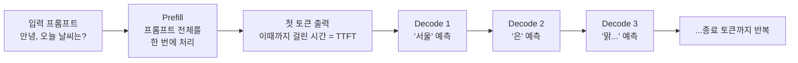
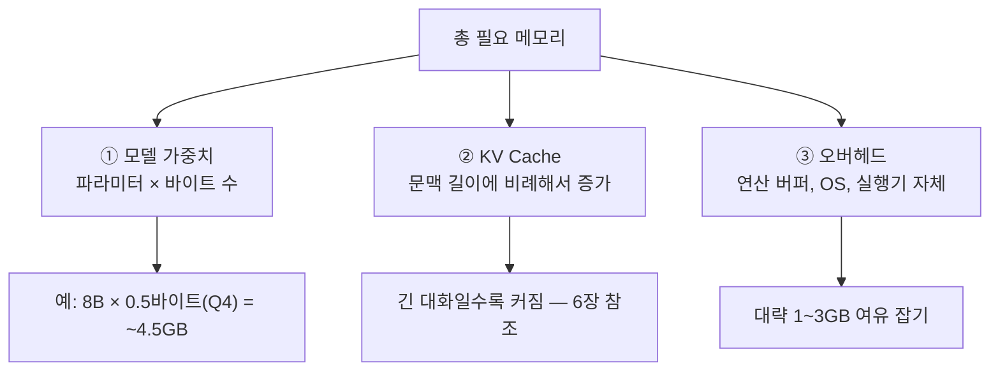
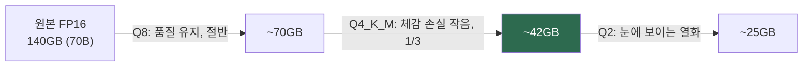
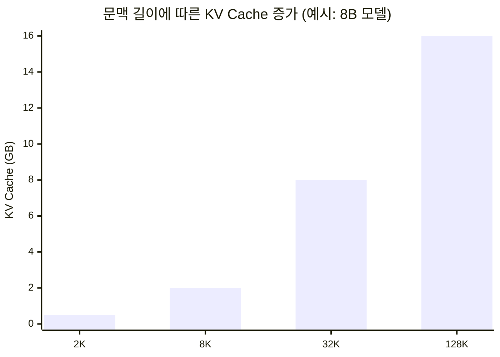
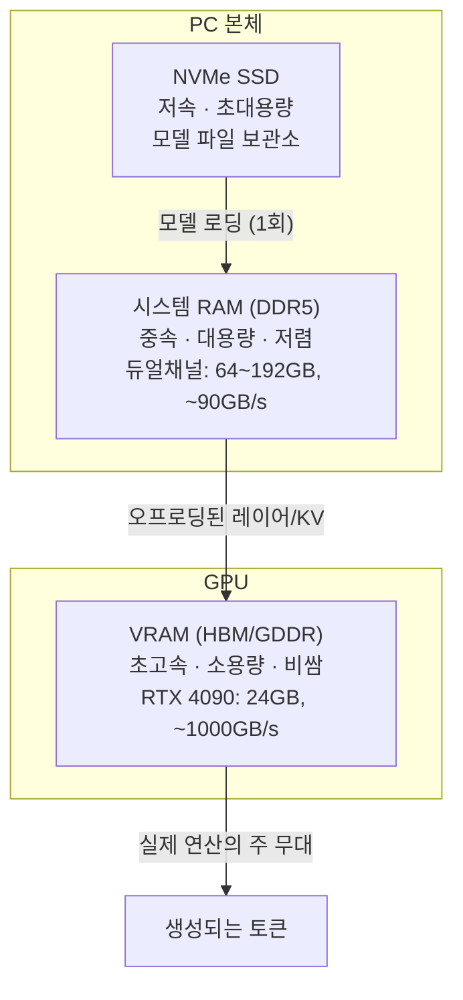
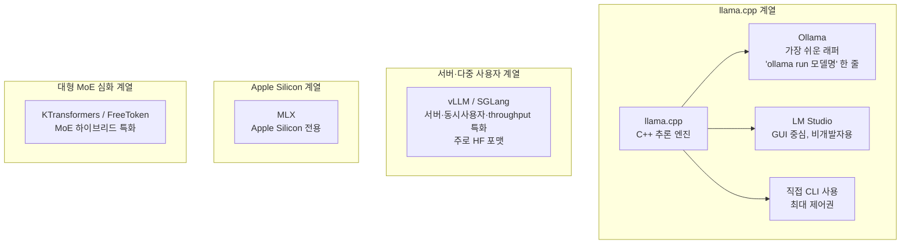

> **이 글의 대상**: 클라우드 API(ChatGPT, Claude 등) 대신 **내 컴퓨터에서 LLM을 직접 돌려보고 싶은 사람**. 전공 지식 없이도 읽을 수 있게 용어가 처음 나올 때마다 풀어 설명한다.

> 이 글의 메모리·속도 수치는 특정 모델과 하드웨어를 기준으로 한 대략적인 감각이다. 실제 결과는 모델 구조, 양자화 방식, 문맥 길이, 런타임과 드라이버 설정에 따라 달라질 수 있다. 모델과 도구의 지원 범위도 업데이트에 따라 바뀔 수 있다.


## 1. 로컬 LLM이 뭐가 다른가

ChatGPT 같은 서비스는 **남의 데이터센터**에 있는 초대형 컴퓨터에서 모델이 돌아가고, 우리는 네트워크로 질문을 보낼 뿐이다. 로컬 LLM은 그 모델 파일을 **내 PC의 저장장치에 받아서, 내 GPU/CPU로 직접 실행**하는 것이다.

| 항목 | 클라우드 API | 로컬 LLM |
|---|---|---|
| 비용 | 토큰당 과금 (월 수만~수십만 원 가능) | 소프트웨어 비용 없음 (전기세·하드웨어 비용 제외) |
| 프라이버시 | 데이터가 회사 서버로 감 | **추론 데이터가 기본적으로 내 머신에 머묾** (도구 설정 확인 필요) |
| 인터넷 | 필수 | 모델 다운로드 이후에는 불필요 |
| 성능 | 최신 프론티어급 | 내 하드웨어와 모델의 한계까지 (작거나 양자화된 모델) |
| 속도 | 빠름 (전용 인프라) | 하드웨어·모델·설정에 따라 크게 달라짐 |
| 설정 난이도 | 0 | 낮음~높음 |

로컬이 어울리는 사람: 코드·문서를 외부로 보내면 안 되는 경우, API비가 하드웨어값보다 커진 경우, 오프라인 환경, 실험/학습 목적.

### 로컬 실행은 학습과 다르다

로컬 LLM을 실행한다는 말은 이미 학습된 모델 파일을 내 컴퓨터에서 **추론(inference)** 하는 것이다. 모델의 파라미터를 새로 학습시키거나 지식을 영구적으로 추가하는 과정은 아니다.

- **추론**: 질문을 입력하고 답변을 생성한다. 이 글의 주제다.
- **파인튜닝**: 특정 데이터와 목적에 맞게 모델의 가중치를 추가로 학습한다. 별도의 데이터셋과 학습 자원이 필요하다.
- **RAG**: 모델을 다시 학습하지 않고, 문서를 검색해 관련 내용을 프롬프트에 붙여 답변하게 한다.

따라서 로컬에서 실행한다고 해서 모델이 자동으로 최신 정보를 알게 되거나, 대화 내용을 영구적으로 학습하는 것은 아니다.

---

## 2. LLM은 어떻게 글을 써내려가나 — 토큰과 생성 원리

### 2-1. 토큰 = LLM의 글자 단위

LLM은 글자가 아니라 **토큰(token)** 단위로 텍스트를 다룬다. 토큰은 단어 조각 정도로 생각하면 된다:

```
"안녕하세요, 로컬 LLM!" → ["안녕", "하세요", ",", "로컬", " L", "LM", "!"]  (예시)
```

영어 기준 대략 **1 토큰 ≈ 0.75 단어**, 한국어는 글자당 토큰 소모가 더 많다(대략 영어의 1.5~2배). 이후 나올 속도(tok/s), 문맥 길이, 가격이 전부 이 토큰 단위다.

### 2-2. 생성은 한 번에 하나씩

LLM은 답변 전체를 한 번에 출력하지 않는다. **다음 토큰 하나를 예측하고, 그걸 입력에 붙이고, 또 다음 토큰을 예측하는 과정의 반복**이다. 흔히 보는 타이핑처럼 글자가 하나씩 나오는 건 이 때문이다.



여기서 두 단계의 성격이 완전히 다르다는 점이 중요하다:

- **Prefill**: 입력 전체를 병렬로 처리 → 연산량(GPU 계산 능력)이 병목
- **Decode**: 토큰 하나 생성할 때마다 모델 가중치 전체를 메모리에서 읽음 → **메모리 대역폭이 병목**

### 2-3. 속도 단위: tok/s

- **10 tok/s 이상** — 대화형으로 충분히 쾌적
- **5~10 tok/s** — 읽는 속도 수준, 사용 가능
- **3 tok/s 미만** — 문서 요약 등 배치 작업용

---

## 3. 모델 크기 읽는 법 — 7B, 13B, 70B의 의미

`Qwen3-32B`, `Llama-3.1-8B` 같은 이름 뒤의 숫자는 **파라미터(학습된 값) 개수**다. B(Billion) = 10억.

| 크기 | 느낌 | 대략 필요 메모리(Q4 양자화 기준) | 쓸 만한 용도 |
|---|---|---|---|
| 1~4B | 스마트폰에서도 구동 | 2~3GB | 간단한 요약, 분류, 번역 |
| 7~9B | 저사양 PC 실속형 | 5~6GB | 일상 대화, 코딩 보조 |
| 12~14B | 중급 | 9~10GB | 요약, RAG, 코딩 |
| 27~35B | 고급 (24GB GPU의 sweet spot) | 17~22GB | 복잡한 추론, 에이전트 |
| 70B | 로컬 플래그십급 | ~42GB | 프론티어급에 근접한 품질 |
| MoE 대형 (100B+, 활성은 소수) | 전문가 네트워크가 여러 개 | 전체 용량은 필요, 연산량은 작음 | 프론티어급 오픈 모델 |

> **MoE(Mixture-of-Experts)**: 거대한 "전문가" 네트워크를 수십~수백 개 넣어두고, 각 토큰마다 라우터가 몇 개만 골라 쓰는 구조. 예: DeepSeek-V4-Flash는 284B 전체 중 토큰당 13B만 활성화. **저장 용량은 크지만 연산은 가볍다** — 이 특성 덕분에 RAM 활용 추론 기술이 크게 발달했다.

일반적인 경향: 같은 계열이라면 파라미터가 클수록 똑똑하다. 하지만 **"작은 최신 모델"이 "큰 구형 모델"보다 나은 경우가 많으니**, 크기보다 출시 시점과 벤치마크를 먼저 보자.

### 모델을 고를 때 확인할 네 가지

모델 이름의 숫자만 보고 고르기보다 다음 항목을 모델 카드에서 확인하는 편이 안전하다.

| 확인 항목 | 입문자가 볼 것 |
|---|---|
| 모델 성격 | 대화·지시용 **Instruct/Chat 모델**인지, 추가 학습용 Base 모델인지 |
| 모델 크기 | 파라미터 수와 내 GPU VRAM·통합메모리에 들어가는지 |
| 양자화 | Q4_K_M, Q5, Q8 등 파일 크기와 품질의 균형 |
| 문맥·라이선스 | 지원 컨텍스트 길이, 상업적 사용 가능 여부와 배포 조건 |

처음이라면 일반적으로 **Instruct 모델 + Q4_K_M급 양자화**에서 시작하고, 답변 품질이나 문맥 길이가 부족할 때 상위 양자화·큰 모델로 올리는 순서가 시행착오가 적다. 단, 모델마다 권장 양자화와 라이선스가 다르므로 모델 카드의 안내를 우선해야 한다.

---

## 4. 메모리 계산법 — 내 컴퓨터엔 뭐까지 돌아가나

### 4-1. 세 가지 메모리 소비처

모델을 띄우면 메모리는 세 군데서 소모된다:



### 4-2. 빠른 계산 공식

```
모델 가중치(GB) ≈ 파라미터(B) × 양자화당 바이트
  - FP16 (16bit): B × 2      예) 8B → 16GB
  - Q8    (8bit):  B × 1      예) 8B → 8GB
  - Q4    (4bit):  B × 0.5    예) 8B → 4.5GB (실측 보정 포함)

총 필요 ≈ 모델 가중치 + KV Cache + 1~3GB
```

### 4-3. 치트시트 (Q4 기준)

| 내 GPU VRAM | 추천 모델 크기 |
|---|---|
| 8GB | 7~9B |
| 12GB | 14B |
| 16GB | 14B (넉넉한 문맥) 또는 27~30B 타이트하게 |
| 24GB | 32B, 또는 70B를 RAM과 나눠 쓰기 |
| 48GB+ | 70B 통째로 |
| Mac 64~128GB 통합메모리 | 70B~120B급 |

모델이 VRAM에 안 들어가면? → **CPU 오프로딩**(레이어 일부를 RAM에)으로 돌릴 수는 있지만 느려진다.

---

## 5. 양자화(Quantization) — 모델을 압축하는 마법

### 5-1. 왜 필요한가

원본 모델은 파라미터 하나당 16bit(FP16)로 저장돼 있다. 70B 모델이면 140GB — 아무도 집에 안 갖고 있다. **양자화는 파라미터 하나를 담는 bit 수를 줄여서(16bit → 8bit → 4bit...) 파일 크기를 압축하는 기술**이다.

정밀도가 떨어지니 품질도 조금 떨어지지만, 4bit 수준의 잘 만든 양자화는 체감 품질 손실이 작을 수 있다. 품질 손실을 일정 부분 감수하고 모델 크기를 크게 줄이는 것이 로컬 LLM 생태계의 핵심이다.

### 5-2. GGUF 양자화 등급 읽는 법

llama.cpp 생태계의 표준 포맷인 **GGUF** 파일 이름에는 양자화 등급이 붙는다:

| 등급 | bit 수 | 8B 모델 크기 | 품질 | 비고 |
|---|---|---|---|---|
| FP16 | 16 | ~16GB | 원본 | 압축 안 함 |
| Q8_0 | 8 | ~8.5GB | 거의 원본 | 검증용 |
| **Q6_K** | 6.6 | ~6.6GB | 매우 우수 | 크기 여유 있으면 최선 |
| **Q5_K_M** | 5.5 | ~5.7GB | 우수 | |
| **Q4_K_M** | 4.8 | ~4.9GB | 좋음 ⭐ | **가장 인기, 기본 선택지** |
| Q4_K_S | 4.5 | ~4.5GB | 약간 낮음 | |
| Q3_K_M | 3.9 | ~3.8GB | 저하 시작 | 7B 이상에서만 |
| Q2_K | 3.4 | ~3.4GB | 명백한 저하 | 최후의 수단 |

이름 해석: `Q{bit수}` + `_K`(개선된 k-quant 방식) + `_M/_S`(medium/small — 혼합 정밀도의 비율). `IQ` 접두사는 더 공격적인 importance-matrix 양자화다.

**선택 경험칙**: 가능하면 **Q4_K_M 이상**. 모델 크기가 작아질수록 양자화 손실이 커지므로, 7B 모델을 Q2로 눌러 쓰는 것보다 14B를 Q4로 쓰는 게 대부분 낫다.



### 5-3. 다른 포맷들 (짧게)

- **GGUF**: llama.cpp 계열 표준. CPU/GPU 하이브리드·mmap 강점. 개인 유저 기본값.
- **GPTQ/AWQ/EXL2**: GPU 전용(vLLM, ExLlama 계열). 서빙 특화.
- **MLX**: Apple Silicon 전용. 맥 유저라면 이것.
- **MXFP4/NVFP4**: 최신 4bit 부동소수점 포맷. DeepSeek-V4-Flash 등 신형 모델이 네이티브로 채택.

---

## 6. KV Cache — 문맥을 기억하는 숨겨진 메모리

### 6-1. 원리: 같은 계산을 두 번 하지 않는 법

Transformer가 새 토큰을 처리할 때는 앞의 모든 토큰과의 관계(attention)를 계산한다. 매번 이전 토큰들을 재계산하면 낭비가 심하니, **각 토큰의 Key/Value 중간 결과를 저장해두고 재사용**한다. 이 저장소가 **KV Cache**다.

덕분에 생성 속도가 빨라지는 대신, **문맥이 길어질수록 KV Cache가 계속 불어난다.** 이것이 "긴 문맥 = 많은 메모리"의 정체다.



*(차트가 안 보이면: 2K 문맥 ≈ 0.5GB, 8K ≈ 2GB, 32K ≈ 8GB, 128K ≈ 16GB 수준으로 선형 증가)*

### 6-2. 크기 계산

```
KV Cache(바이트) ≈ 2(K,V) × 레이어 수 × 헤드 수 × 헤더 차원 × 정밀도 바이트 × 토큰 수
```

외울 필요는 없다. 감각만 잡자:

- 8B 모델 + 8K 문맥 → KV Cache 약 1~2GB
- 같은 모델 + 128K 문맥 → 수십 GB. **모델 가중치만큼 커질 수 있다**

### 6-3. 실무 함의

1. **문맥 길이는 공짜가 아니다** — 모델 카드의 "128K 지원"과 "내 GPU에서 128K가 돈다"는 다른 이야기.
2. 문맥이 VRAM을 밀어내면 모델 일부가 RAM으로 밀려나 **갑자기 느려진다** ("OOM 직전 현상").
3. 긴 문맥이 필요 없는 작업(짧은 요약 등)이라면 문맥을 줄여서 여유를 확보하는 게 성능에 유리.
4. 서버 운영 관점에서는 KV Cache를 CPU RAM·SSD로 밀어내는 **KV 오프로딩**(vLLM LMCache 등)이 핫한 주제다.

---

## 7. 하드웨어 기초 — VRAM, RAM, 그리고 대역폭

### 7-1. 세 가지 메모리의 역할



### 7-2. 기억할 것은 딱 두 가지

1. **용량(VRAM 크기)** = 어떤 모델이 "들어가나"를 결정
2. **대역폭(VRAM 속도)** = 얼마나 "빠르게 나오나"를 결정

Decode는 메모리 대역폭 바운드이므로(2장), 같은 24GB라도 대역폭 1000GB/s짜리 RTX 4090과 256GB/s짜리 APU의 tok/s는 크게 다르다.

### 7-3. 플랫폼별 특성 요약

| 플랫폼 | 강점 | 약점 |
|---|---|---|
| NVIDIA GeForce | CUDA 생태계, 호환성 최고, VRAM 옵션 다양 | 24GB 이상은 가격 급등 |
| Apple Silicon (M 시리즈) | 통합메모리로 64~128GB를 GPU가 직접 사용, MLX 성숙 | macOS 종속, 업그레이드 불가 |
| AMD Strix Halo 등 APU | 128GB 통합메모리를 $2천대에 | 대역폭 낮음(256GB/s), ROCm 미숙 |
| CPU만 (RAM) | 진입장벽 0 | 1~10 t/s, 대형 모델은 사실상 불가 |
| 서버 GPU (A100/H100 등) | 80GB+, 대역폭 폭발 | 가격이 감당 불가 |

심화 주제: VRAM이 부족할 때 RAM을 활용하는 오프로딩·MoE 하이브리드·CXL 같은 기법들은 별도의 심화 학습 주제다.

---

## 8. 실행 도구 생태계 — 무엇으로 돌릴까

### 8-1. 도구 지도



### 8-2. 한 줄 요약

| 도구 | 이럴 때 |
|---|---|
| **Ollama** | 5분 안에 첫 모델. 개인용 기본값 |
| **LM Studio** | GUI/챗창이 필요할 때. 모델 검색·다운로드 내장 |
| **llama.cpp 직접** | 세밀한 튜닝(`-ngl`, 컨텍스트, 스레드)을 할 줄 알 때 |
| **vLLM** | 여러 사람이 쓰는 API 서버. 배칭 처리량 압도적 |
| **MLX/LM Studio(MLX)** | Mac 유저 |
| **KTransformers, FreeToken** | 200B+ MoE 모델을 개인 하드웨어로 |

### 8-3. 첫 실행 예시 (Ollama)

```bash
ollama run qwen3:8b     # 다운로드 + 대화 시작, 끝
# OpenAI 호환 API도 자동으로 localhost:11434에 뜬다
```

### 8-4. 첫 실행 10분 코스

처음에는 모델을 여러 개 비교하기보다 하나를 끝까지 실행해 보는 것이 좋다. Ollama를 기준으로 하면 순서는 다음과 같다.

```bash
# 1) 모델 다운로드와 대화 시작
ollama run qwen3:8b

# 2) 설치된 모델과 현재 메모리에 올라간 모델 확인
ollama list
ollama ps

# 3) 로컬 API가 응답하는지 확인
curl http://localhost:11434/api/generate \
  -H 'Content-Type: application/json' \
  -d '{"model":"qwen3:8b","prompt":"로컬 LLM을 한 문장으로 설명해줘","stream":false}'
```

`ollama run`은 모델이 없으면 먼저 다운로드하고, 이후 대화형 실행을 시작한다. GUI가 편하다면 LM Studio에서 같은 방식으로 모델을 내려받은 뒤 로컬 서버를 시작하면 된다. 첫 테스트에서는 답변 품질, 첫 토큰까지 걸린 시간, 생성 속도, 메모리 사용량을 함께 기록하면 다음 모델을 고르기 쉬워진다.

> **보안 주의**: 로컬 API는 보통 기본 인증 없이 동작한다. `localhost`에서만 사용할 때는 괜찮지만, 공유기·인터넷에 포트를 공개하면 누구나 모델을 호출하거나 데이터를 보낼 수 있다. 외부 공개가 필요하다면 인증·방화벽·리버스 프록시를 별도로 구성하자.

---

## 9. 실전 선택 가이드 — 상황별 조합표

| 나의 상황 | 추천 조합 |
|---|---|
| "그냥 첨 써보고 싶다" (GPU 있음) | Ollama + 8B Q4 |
| 맥북 유저 | LM Studio 또는 Ollama + MLX, 통합메모리 크기에 맞는 모델 |
| 코딩 에이전트(Claude Code류)를 로컬로 | llama.cpp/Ollama + 코딩특화 모델, VRAM 넉넉하면 30B급 |
| 문서 100개 야간 배치 요약 | vLLM + 중형 모델 (처리량 우선) |
| 70B 이상을 돌리고 싶다 | 24GB GPU + 64GB RAM + llama.cpp `-ngl`, 또는 통합메모리 Mac |
| 프론티어급 오픈 MoE | RAM 대박(382GB+) + KTransformers/FreeToken |
| 프라이버시가 생명 | 전부 로컬. 에어갭 환경 + 소형 모델이라도 |

---

## 10. 자주 겪는 문제와 해결

| 증상 | 원인 | 해결 |
|---|---|---|
| 응답이 너무 느리다 | 모델이 VRAM 초과로 RAM에 걸침 | 더 작은 양자화(Q4→Q3 아닌 더 작은 모델), 문맥 길이 축소 |
| `out of memory` 에러 | VRAM/RAM 부족 | Q4_K_M 이하로, 문맥 `-c` 값 줄이기 |
| 답변이 이상하게 깨진다 | 양자화 과다(Q2/Q3), 템플릿 불일치 | Q4_K_M 이상 사용, 모델 전용 프롬프트 템플릿 확인 |
| 문맥을 금방 잊는다 | 컨텍스트 길이 설정이 작음 | 실행기 설정에서 컨텍스트 확대 (메모리 희생) |
| GPU를 안 쓰는 것 같다 | 드라이버/백엔드 미설정 | `nvidia-smi`로 점유율 확인, 백엔드(CUDA/Metal/Vulkan) 지정 |
| 첫 응답만 몹시 느리다 | 모델 로딩 중 (정상) | 로딩은 1회. 상주 설정(keep_alive) 활용 |

---

## 11. 용어 사전 (치트시트)

| 용어 | 한 줄 정의 |
|---|---|
| **토큰** | LLM의 글자 단위. 대략 단어 조각 하나 |
| **tok/s** | 초당 생성 토큰 수. 10 이상이면 쾌적 |
| **파라미터 (7B 등)** | 모델이 학습한 값의 개수 = 모델의 '뇌 용량' |
| **FP16** | 파라미터당 16bit 원본 정밀도 |
| **양자화** | 파라미터 bit 수를 줄여 압축 (품질 약간↓, 크기 大幅↓) |
| **GGUF** | llama.cpp 계열 표준 모델 파일 포맷 |
| **Q4_K_M** | 가장 인기 있는 4bit급 양자화 등급 |
| **KV Cache** | 처리한 문맥의 중간 결과 저장소. 문맥이 길어지면 메모리를 잡아먹음 |
| **컨텍스트 길이** | 모델이 한 번에 기억할 수 있는 토큰 수 |
| **TTFT** | 첫 토큰까지의 대기 시간 |
| **Prefill / Decode** | 입력 일괄처리 단계 / 한 토큰씩 생성 단계 |
| **VRAM** | GPU 전용 초고속 메모리. 용량=무엇이 들어가나, 대역폭=얼마나 빠르나 |
| **오프로딩** | VRAM에 안 들어가는 부분을 RAM(SSD)으로 밀어내는 것 |
| **MoE** | 전문가 네트워크 여러 개 중 일부만 활성화하는 구조. 용량↑ 연산↓ |
| **mmap** | 모델 파일을 복사 없이 메모리에 직접 매핑하는 로딩 방식 |
| **Ollama / llama.cpp** | 가장 대중적인 실행기 / 그 밑의 엔진 |

---

## 마치며 — 다음 단계

이 글의 핵심 세 줄 요약:

1. **로컬 LLM = 모델 파일 + 메모리 + 대역폭의 게임이다.** 크기 계산법(4장)만 익혀도 하드웨어에 맞는 모델을 바로 고를 수 있다.
2. **양자화는 일정한 품질 손실을 감수해 크기를 1/3~1/4 수준으로 줄이는 필수 기술.** 기본값은 Q4_K_M.
3. **문맥은 공짜가 아니다.** KV Cache가 불어나는 속도를 이해하면 "왜 긴 대화에서 갑자기 느려지는지"가 설명된다.

더 깊게 파고 싶다면 키워드로 검색해볼 만한 주제들: **CPU/GPU 오프로딩**, **KV 캐시 오프로딩(LMCache)**, **KTransformers**, **FreeToken**, **유니파이드 메모리(Apple MLX, AMD Strix Halo)**, **CXL 메모리 티어링**.
