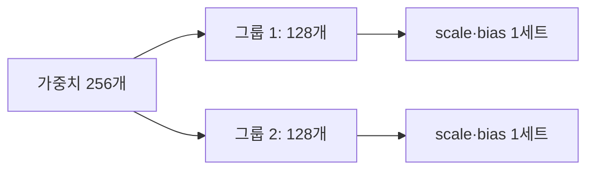
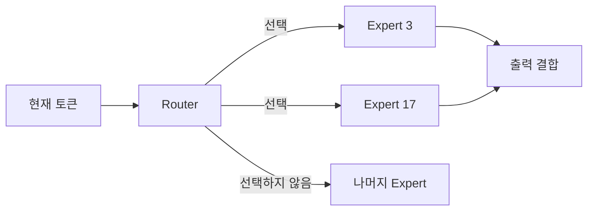
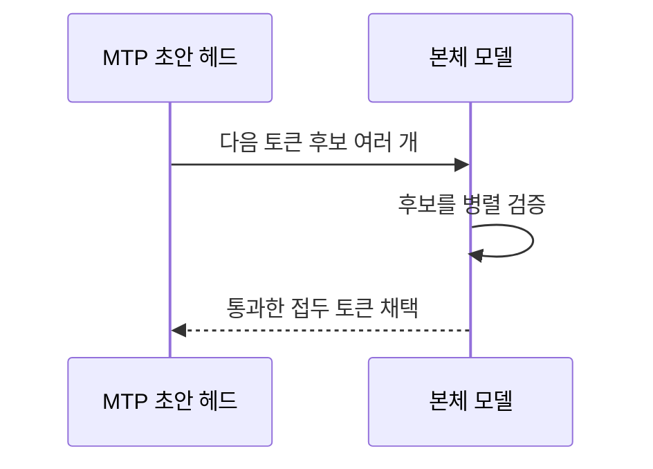

Hugging Face에서 모델을 고르다 보면 이름부터 암호처럼 보인다.

```text
Ornith-1.5-35B-A3B-oQ6-gs128-mtp-vision
```

`35B-A3B`, `oQ6`, `gs128`, `fp16`, `MTP`가 각각 무엇을 뜻하는지 모르면 결국 숫자가 큰 파일을 고르게 된다. 그러나 같은 Q6라도 실제 평균 비트 수와 비양자화 텐서, 그룹 크기, 양자화 알고리즘이 다르다. Q8이 Q6보다 항상 빠르거나 정확하다고 단정할 수도 없다.

이 글은 [로컬 LLM 완전 정복 가이드](/31/local-llm-complete-guide)에서 다룬 모델 크기, 양자화, KV 캐시의 기초를 한 단계 더 깊게 파고든다. 목표는 이름을 외우는 것이 아니라 모델 카드와 벤치마크를 읽고 내 장비에 맞는 파일을 판별하는 것이다.


> 이 글에서 가장 먼저 기억할 것은 세 가지다. **비트 수는 명목값이고, BPW가 실제 압축 정도에 더 가깝다. 모델 파일 크기와 실행 중 메모리는 다르다. 양자화 품질은 KLD 하나가 아니라 실제 작업 성공률까지 확인해야 한다.**

## 로컬 LLM을 이해할 때 양자화부터 확인하는 이유

로컬 LLM을 고르는 일은 단순히 “가장 똑똑한 모델을 찾는 일”이 아니다. 실제로는 세 가지 질문에 순서대로 답해야 한다.

1. **내 장비에 들어가는가?** 모델 가중치, 비양자화 텐서, KV 캐시와 런타임 버퍼를 함께 감당할 수 있어야 한다.
2. **기다릴 만한 속도로 동작하는가?** 메모리 대역폭, 양자화 커널, Prefill·Decode, MTP가 첫 토큰과 전체 생성 시간을 결정한다.
3. **내 작업을 제대로 끝내는가?** 코드·한국어·긴 문맥·도구 호출 같은 실제 작업에서 품질 손실이 허용 범위 안이어야 한다.

양자화는 첫 번째 질문인 메모리 문제에서 출발하지만, 세 질문 모두에 영향을 준다. 낮은 비트로 가중치를 줄이면 더 큰 모델이나 긴 문맥을 넣을 여지가 생기지만, 역양자화 커널과 숫자 오차가 속도와 출력 품질을 바꾼다. 반대로 높은 정밀도를 고르면 기준 모델에 가까워질 가능성은 커지지만, 메모리와 대역폭 비용이 늘어난다.

| 로컬 LLM에서 확인할 문제 | 함께 봐야 할 요소 |
|---|---|
| 메모리에 들어가는가 | 전체 파라미터, 실제 BPW, 비양자화 텐서, KV 캐시, 런타임 오버헤드 |
| 충분히 빠른가 | Prefill, Decode, TTFT, 양자화 커널, group size, MTP acceptance |
| 작업을 잘하는가 | 양자화 레시피, 캘리브레이션, KLD·perplexity, 코드·한국어·에이전트 성공률 |

그래서 이 글은 양자화 숫자만 나열하지 않는다. 텐서가 어떻게 저장되고, MoE의 전체·활성 파라미터가 어떻게 다른지, KV 캐시와 MTP가 실행 경로를 어떻게 바꾸는지까지 함께 본다. 양자화는 로컬 LLM 전체를 이해하기 위한 입구이고, 최종 선택은 모델·런타임·하드웨어·작업을 묶은 실행 경로에서 내려야 한다.

## 파일을 고르기 전에 메모리 예산부터 적어야 한다

모델 파일이 장비의 통합 메모리보다 작다고 바로 실행 가능한 것은 아니다. 모델을 로드한 뒤에는 비양자화 텐서, KV 캐시, prefill 임시 버퍼, 런타임·Metal 할당기, 운영체제와 다른 앱이 함께 메모리를 사용한다.

거친 1차 필터는 다음처럼 계산할 수 있다.

```text
estimated_weight_bytes
  ≈ parameter_count × achieved_bpw / 8

total_runtime_memory
  ≈ estimated_weight_bytes
  + non_quantized_tensors
  + KV_cache
  + temporary_buffers
  + runtime_overhead
```

이 식은 정확한 메모리 예측기가 아니다. 그래도 `35B × 6bit = 26.25GB`라는 식으로 모든 비용을 가중치만으로 계산하는 실수를 피하는 데 유용하다.

| 상태 | 의미 | 다음 행동 |
|---|---|---|
| 가중치 추정치부터 메모리보다 큼 | 모델만으로도 들어가지 않음 | 더 낮은 BPW·Expert pruning·오프로딩을 검토 |
| 파일은 들어가지만 여유가 작음 | 짧은 문맥만 가능할 수 있음 | 로드 직후·4K·16K·목표 문맥에서 peak 측정 |
| 가중치와 KV 캐시 여유가 있음 | 실행 후보 | 품질·속도·장시간 안정성을 측정 |

MoE는 특히 활성 파라미터와 저장 파라미터를 분리해야 한다. `35B-A3B`에서 A3B는 토큰당 계산 경로에 가까운 숫자이지, 35B의 Expert 가중치가 메모리에 필요 없다는 뜻이 아니다.

## 먼저 모델 이름을 한 줄씩 해독해 보자

`Ornith-1.5-35B-A3B-oQ6-gs128-mtp-vision`을 예로 들면 다음과 같다.

| 조각 | 의미 | 실제로 확인할 것 |
|---|---|---|
| `Ornith-1.5` | 모델 계열과 버전 | 학습 데이터, 채팅 템플릿, 도구 호출 성향 |
| `35B` | 저장해야 하는 전체 파라미터 규모 | 디스크와 통합 메모리 점유량 |
| `A3B` | 토큰 하나에 활성화되는 파라미터가 약 3B인 MoE | 전체 35B가 메모리에서 사라지는 것은 아님 |
| `oQ6` | oMLX의 oQ 방식으로 만든 명목상 6비트 양자화 | 실제 BPW와 레이어별 비트 배분 |
| `gs128` | 128개 가중치가 양자화 파라미터를 공유 | 품질, 메타데이터 오버헤드, 커널 효율 |
| `mtp` | 여러 미래 토큰을 초안으로 예측하는 헤드 포함 | 실제 활성화 여부와 acceptance rate |
| `vision` | 이미지 인코더와 관련 설정 포함 | 텍스트 전용 파일보다 커질 수 있음 |

이 이름은 요약표일 뿐 보증서가 아니다. 최종 판단에는 `config.json`, 모델 카드, 파일 크기, 런타임 버전, 동일 장비의 측정값이 필요하다.

## 모든 출발점은 텐서다

텐서(tensor)는 숫자를 여러 차원으로 배열한 데이터 구조다. 스칼라는 0차원 텐서, 벡터는 1차원 텐서, 행렬은 2차원 텐서라고 생각하면 된다. LLM 체크포인트는 수많은 텐서의 묶음이다.

| 텐서 종류 | 하는 일 | 양자화 시 주의점 |
|---|---|---|
| 임베딩 | 토큰 ID를 내부 벡터로 변환 | 출력 헤드와 가중치를 공유하기도 함 |
| Attention 가중치 | 문맥에서 무엇을 참고할지 계산 | 오류가 누적되면 긴 문맥 품질에 영향을 줄 수 있음 |
| MLP·Expert 가중치 | 특징 변환과 지식 표현 | MoE에서는 전체 용량의 큰 부분을 차지함 |
| Router | 토큰을 어느 Expert로 보낼지 결정 | 작은 오차가 Expert 선택 자체를 바꿀 수 있음 |
| `lm_head` | 다음 토큰의 확률 분포를 생성 | 일부 양자화법은 더 높은 정밀도로 보존함 |
| Vision tower | 이미지를 언어 모델 입력으로 변환 | 텍스트 전용 변환에서 제거되기도 함 |
| MTP head | 미래 토큰 초안을 예측 | 포함돼 있어도 런타임에서 사용하지 않을 수 있음 |

양자화 모델은 파일 전체를 하나의 비트 수로 바꾼 덩어리가 아니다. 대형 가중치 행렬은 6비트로 줄이면서 임베딩, 정규화 계수, 편향, 라우터 같은 일부 텐서는 FP16이나 FP32로 남길 수 있다.

커뮤니티에서 말하는 **잔여 텐서**는 대개 양자화하지 않고 남긴 텐서를 뜻한다. 표준화된 전문 용어라기보다 `non-quantized tensors`, 즉 **비양자화 텐서** 또는 **고정밀 텐서**라고 부르는 편이 정확하다.

## FP16과 BF16은 같은 16비트지만 성격이 다르다

둘 다 숫자 하나를 16비트로 저장하지만 비트 배치가 다르다.

| 형식 | 부호 | 지수부 | 가수부 | 성격 |
|---|---:|---:|---:|---|
| FP16 | 1비트 | 5비트 | 10비트 | 표현 범위는 좁고 같은 범위 안의 정밀도는 높음 |
| BF16 | 1비트 | 8비트 | 7비트 | FP32에 가까운 표현 범위, 상대 정밀도는 낮음 |
| FP32 | 1비트 | 8비트 | 23비트 | 메모리를 더 쓰지만 기준 체크포인트에 널리 사용 |

지수부는 아주 크거나 작은 수를 얼마나 넓게 표현하는지 결정하고, 가수부는 가까운 숫자를 얼마나 세밀하게 구분하는지 결정한다. 따라서 BF16이 FP16보다 무조건 정확하거나 그 반대인 것이 아니다.

MLX 모델명 끝의 `fp16`은 보통 **양자화되지 않은 텐서를 FP16으로 저장했다**는 뜻이다. Q6 가중치가 갑자기 전부 FP16이라는 뜻은 아니다. 예를 들어 RukaRat의 Ornith oQ6 모델 카드는 6비트 affine 가중치와 FP16 비양자화 텐서를 함께 사용한다고 명시한다. 해당 변환은 M1·M2 환경의 실행 경로를 고려해 BF16 대신 FP16을 선택했다. 이는 그 변환의 최적화 선택이지 모든 Apple Silicon과 모든 연산에 적용되는 보편 법칙은 아니다.

## Q6은 실수를 6비트 정수 근처로 접는 과정이다

가중치 `w`를 양자화할 때 가장 단순한 affine 방식은 다음처럼 이해할 수 있다.

```text
q = round(w / scale) + zero_point
w_hat = scale × (q - zero_point)
```

`q`는 저장되는 낮은 비트 정수이고, `w_hat`은 추론할 때 복원해 사용하는 근삿값이다. `scale`은 숫자의 간격, `zero_point`는 0의 위치를 정한다.

예를 들어 한 그룹의 범위가 -1.0부터 1.0이고 2비트로 네 단계만 표현한다고 가정하자.

```text
원본:  -1.00  -0.20   0.10   0.90
근사:  -1.00  -0.33   0.33   1.00
오차:   0.00   0.13   0.23   0.10
```

실제 Q6은 더 많은 단계와 정교한 보정법을 사용하지만 본질은 같다. 저장 공간과 메모리 대역폭을 줄이는 대신 원래 숫자에 작은 오차를 넣는다.

## GS128은 128개 가중치가 하나의 자를 공유한다는 뜻이다

`gs`는 group size다. 가중치를 일정 크기의 묶음으로 나누고 각 묶음마다 별도의 scale과 bias 또는 zero-point를 저장한다.



| 설정 | 256개 가중치의 그룹 수 | 일반적인 장단점 |
|---|---:|---|
| `gs32` | 8 | 국소 범위에 더 잘 맞지만 메타데이터와 처리 횟수가 늘어남 |
| `gs64` | 4 | 품질과 오버헤드 사이의 절충 |
| `gs128` | 2 | scale·bias 수가 줄지만 한 그룹 안의 값 분포가 너무 다르면 오차가 커질 수 있음 |

그룹이 작을수록 항상 좋거나 클수록 항상 빠른 것은 아니다. 양자화 커널과 하드웨어가 해당 그룹 크기를 얼마나 효율적으로 처리하는지가 중요하다.

구체적인 사례로 RukaRat은 M2 Max 64GB와 oMLX 0.6.2에서 거의 같은 Ornith oQ6 `gs64`와 `gs128`을 여섯 번 교차 측정했고, `gs128`이 평균 8.7% 빨랐다고 보고했다. 저자는 scale·bias 배열과 그룹별 역양자화 오버헤드 감소를 원인으로 해석했다. 다만 한 장비와 한 런타임에서 얻은 결과이므로 다른 MLX 버전이나 모델에 그대로 일반화하면 안 된다.

## Q4·Q6·Q8보다 실제 BPW가 더 많은 것을 말해준다

`Q6`은 양자화 등급 또는 주된 가중치의 비트 수를 나타내지만 파일 전체가 정확히 6.000 bit/weight라는 뜻은 아니다.

```text
BPW ≈ 가중치 저장에 사용한 전체 비트 / 파라미터 수
```

실제 평균에는 다음 요소가 섞인다.

- 레이어마다 다른 비트 수를 쓰는 혼합 정밀도
- 그룹별 scale, bias, zero-point
- FP16·FP32로 남긴 텐서
- 임베딩이나 출력 헤드의 별도 정밀도
- 패킹을 위한 정렬과 메타데이터

앞서 든 Ornith 파일은 이름은 oQ6이지만 모델 카드상 약 6.87 BPW이고 크기는 30GB다. 모델 저장소 전체 크기에는 토크나이저, 설정, Vision tower, MTP head 같은 부가 파일도 들어가므로 `파일 크기 × 8 / 파라미터 수` 역시 순수 가중치 BPW와 정확히 같지 않다.

따라서 모델을 비교할 때는 `Q6인가` 다음에 `실제 BPW는 얼마인가`, `어떤 텐서가 고정밀로 남았는가`를 물어야 한다.

## oQ와 OptiQ는 비트 수가 아니라 배분 방식까지 포함한다

균일 양자화는 가능한 한 모든 대상 레이어에 같은 비트 수를 적용한다. 혼합 정밀도 양자화는 오차에 민감한 레이어에는 더 많은 비트를 주고, 둔감한 레이어에는 적은 비트를 준다.

```text
균일 Q6:       [6][6][6][6][6][6]
혼합 정밀도:  [8][4][6][8][4][6]  → 평균은 약 6 BPW
```

`oQ`, `OptiQ`, `DWQ` 같은 이름은 Q6처럼 범용 표준이 아니다. 특정 도구나 제작자가 정한 양자화 레시피다. 같은 `OptiQ-4bit`라도 보정 데이터와 민감도 측정법, 고정밀 레이어 수가 다르면 결과가 달라질 수 있다.

[mlx-optiq 문서](https://mlx-optiq.com/docs/quants)는 레이어별 비트 폭을 메타데이터에 기록하며, 표준 아키텍처 모델은 일반 MLX 체크포인트처럼 불러올 수 있다고 설명한다. `optiq/metadata.json`의 `achieved_bpw`, 고비트·저비트 레이어 수를 보면 이름보다 구체적인 배분을 확인할 수 있다.

Qwen 3.6 35B-A3B를 대상으로 한 독립 KLD 비교에서는 8비트 모델을 기준으로 oQ6의 평균 KLD가 0.01039, 균일 MLX 6비트가 0.01189로 측정됐다. 같은 글의 4비트 결과는 DWQ4 0.02663, oQ4 0.04024, 균일 MLX4 0.07418이었다. 이는 혼합 정밀도 레시피가 같은 명목 비트 안에서도 차이를 만들 수 있다는 사례다. 다만 기준이 BF16 원본이 아니라 8비트이고 특정 프롬프트 집합으로 측정했으므로 절대 품질 점수로 읽으면 안 된다.

## MoE에서는 전체 파라미터와 활성 파라미터를 분리해야 한다

`35B-A3B` 같은 MoE 모델은 약 35B 파라미터를 저장하지만 토큰마다 약 3B만 활성화한다. Expert가 256개이고 라우터가 그중 일부만 선택하는 구조라면 계산량은 줄어들 수 있지만, 전체 Expert 가중치는 여전히 메모리에 올려야 한다.



MoE 양자화에는 두 가지 민감도가 있다.

- Expert 가중치의 근사 오차가 각 Expert의 계산 결과를 바꾼다.
- Router의 근사 오차는 아예 다른 Expert를 선택하게 만들 수 있다.

REAP처럼 Expert 자체를 제거하는 기법은 Q4·Q6처럼 숫자의 정밀도를 낮추는 양자화와 다르다. 양자화는 같은 텐서를 더 적은 비트로 저장하고, Expert pruning은 일부 계산 경로와 파라미터를 모델에서 제거한다. 둘을 함께 적용할 수 있지만 손실 원인도 합산된다.

## MTP는 모델 품질보다 디코딩 방법에 가까운 옵션이다

일반 디코딩은 한 번의 순전파로 다음 토큰 하나를 확정한다. MTP(Multi-Token Prediction)는 별도 초안 헤드가 여러 미래 토큰을 예측하고 본체가 이를 검증한다.



핵심 지표는 두 가지다.

- **Acceptance rate**: 초안 토큰 중 본체 검증을 통과한 비율
- **Tokens per cycle**: 검증 한 사이클마다 최종 채택된 평균 토큰 수

MTP 파일이 존재한다고 자동으로 빨라지지는 않는다. 런타임에서 MTP를 켜야 하고, 초안이 자주 틀리면 검증 비용 때문에 이득이 사라진다. RukaRat 모델 카드는 수정된 MTP head에서 78~84% acceptance와 약 2.1 tokens/cycle을 보고한다. 같은 환경에서 원본 Ornith head는 MTP를 켜도 +0.2%에 그쳤지만 Qwen3.6 head는 +10.5%였다고 한다. 이는 MTP head의 학습 상태와 런타임 지원이 파일명보다 중요하다는 사례다.

## 모델 가중치 양자화와 KV 캐시 양자화는 별개의 축이다

Q6 모델을 실행하면서 KV 캐시는 8비트로 둘 수 있다. 둘은 줄이는 대상이 다르다.

| 대상 | 저장하는 것 | 주로 영향을 받는 구간 | 위험 |
|---|---|---|---|
| 가중치 양자화 | 학습된 모델 파라미터 | 모든 프롬프트와 생성 | 전반적인 출력 분포 변화 |
| KV 캐시 양자화 | 입력·생성 토큰의 Attention 중간 상태 | 문맥이 길수록 영향 증가 | 장문 회상과 Attention 정밀도 저하 가능 |

100K 근처의 문맥을 쓰면 모델 파일만 보고 메모리를 계산해서는 안 된다. KV 캐시는 레이어 수, KV head 수, head dimension, 문맥 길이, 배치 크기, 캐시 dtype에 비례해 증가한다.

```text
KV cache bytes
≈ 2(K와 V) × layers × context
  × kv_heads × head_dim × bytes_per_element × batch
```

가중치 Q8에서 Q6으로 내려 확보한 메모리를 더 긴 KV 캐시에 쓸 수도 있다. 반대로 Q8 가중치를 유지하고 KV 캐시만 줄이는 선택도 가능하다. 어느 쪽이 품질에 덜 해로운지는 모델과 작업에 따라 측정해야 한다.

## 속도는 tok/s 하나가 아니라 네 구간으로 나눠야 한다

| 지표 | 뜻 | 사용자 체감 |
|---|---|---|
| Prefill tok/s | 입력 문맥을 처음 읽는 속도 | 긴 문서를 넣은 뒤 첫 답까지의 대기 |
| Decode tok/s | 토큰을 한 개씩 생성하는 속도 | 답변이 출력되는 속도 |
| TTFT | 첫 토큰이 나오기까지 걸린 시간 | 대화형 사용의 즉각성 |
| Wall time | 작업 완료까지의 총시간 | 에이전트 업무의 실제 생산성 |

Q6은 Q8보다 읽어야 할 가중치가 적으므로 메모리 대역폭이 병목인 디코딩에서 유리할 가능성이 크다. 하지만 비트 패킹을 푸는 커널, 그룹 크기, 프롬프트 길이, MTP acceptance가 결과를 뒤집을 수 있다.

특히 에이전트에서는 raw tok/s가 가장 빠른 모델이 최단 시간에 일을 끝낸다는 보장이 없다. 더 정확한 모델이 도구 호출과 수정 루프를 줄이면 생성 속도가 조금 느려도 wall time은 짧아질 수 있다.

벤치마크는 다음처럼 기록하는 편이 좋다.

```text
모델 / 정확한 리비전:
런타임 / 버전:
macOS / 전원·열 상태:
프롬프트 토큰 / 생성 토큰:
KV cache dtype:
MTP on/off:
Prefill tok/s / Decode tok/s / TTFT / Peak memory:
작업 성공 여부 / 도구 호출 횟수 / 총 wall time:
```

## 품질은 KLD부터 실제 작업 성공률까지 층별로 본다

| 지표 | 측정하는 것 | 놓치는 것 |
|---|---|---|
| Perplexity | 정답 토큰에 부여한 확률의 평균적 적합도 | 도구 호출이나 지시 이행 같은 실제 행동 |
| KLD | 기준 모델과 양자화 모델의 전체 출력 분포 차이 | 기준 모델 자체의 정답 여부 |
| Top-1 agreement | 두 모델의 최빈 다음 토큰 일치율 | 2순위 이하 확률 분포와 장기 누적 효과 |
| 정형 벤치마크 | 코딩·수학·지식 문제의 성공률 | 내 프롬프트와 에이전트 환경의 적합성 |
| 작업 성공률 | 실제 도구 호출과 결과 완수 | 표본 수가 작을 때의 우연과 재현성 |

KLD는 낮을수록 기준 분포에 가깝다. 그러나 기준 모델이 틀린 답을 자신 있게 내면 양자화 모델이 똑같이 틀리는 것도 낮은 KLD로 평가된다. 따라서 **양자화 충실도**와 **모델 능력**은 같은 개념이 아니다.

반대로 작은 KLD 차이가 실제 벤치마크 차이로 이어지지 않을 수도 있다. 온도 0에 가까운 결정적 테스트, 여러 도메인의 프롬프트, 충분한 반복 횟수를 함께 사용해야 한다.


### 개발 노트에 기록할 최소 비교표

| 모델 | 실제 BPW | 파일 크기 | 로드 직후 | 16K peak | Prefill | Decode | KLD | 작업 성공률 |
|---|---:|---:|---:|---:|---:|---:|---:|---:|
| Q4 레시피 A |  |  |  |  |  |  |  |  |
| Q6 레시피 B |  |  |  |  |  |  |  |  |
| Q8 레시피 C |  |  |  |  |  |  |  |  |

Q 숫자와 파일 크기만 채운 표는 “저장 공간 비교”에 그친다. 실행 가능 여부를 말하려면 최소한 로드 직후와 목표 문맥의 peak memory를 넣어야 한다. 품질을 말하려면 KLD나 perplexity 중 하나와 실제 작업 성공률을 함께 넣는 편이 낫다.


## 실제 파일 하나를 고를 때는 이 순서가 안전하다

1. 먼저 원본 모델의 작업 적합성을 확인한다. 코딩, 한국어, 도구 호출, Vision 중 무엇이 중요한지 정한다.
2. 장비에서 목표 문맥과 KV 캐시까지 포함해 메모리에 들어오는 후보만 남긴다.
3. Q 숫자 대신 실제 파일 크기, achieved BPW, 비양자화 dtype을 확인한다.
4. 양자화 레시피와 group size를 확인한다. `oQ6`과 균일 `Q6`을 같은 것으로 취급하지 않는다.
5. Vision과 MTP 같은 부가 텐서가 실제로 필요하고 동작하는지 확인한다.
6. 동일한 런타임과 설정으로 prefill, decode, TTFT, peak memory를 교차 측정한다.
7. 마지막으로 내 에이전트 작업의 성공률과 총 wall time을 비교한다.

100K 문맥을 목표로 한다면 짧은 프롬프트 벤치마크만으로 결정하지 않는 것이 중요하다. 최소한 1K, 16K, 64K, 목표치 근처에서 각각 메모리와 TTFT를 측정해야 한다. 100K를 매번 채울 필요가 없는 작업이라면 최대 문맥을 고정 예약하는 런타임인지, 필요한 만큼 캐시를 늘리는 런타임인지도 확인한다.

## 변환을 끝냈다고 모델 검증이 끝난 것은 아니다

MLX-LM은 Hugging Face 모델을 MLX 형식으로 변환하고 양자화하는 경로를 제공한다. 기본 affine Q6 변환의 실험 예시는 다음과 같다.

```bash
mlx_lm.convert \
  --hf-path /path/to/hf-model \
  --mlx-path /path/to/mlx-model-q6 \
  --quantize \
  --q-bits 6 \
  --q-group-size 128 \
  --q-mode affine
```

모델 아키텍처가 현재 MLX-LM에 등록돼 있어야 하고, Vision·MTP·커스텀 Router가 있는 모델은 별도 지원이 필요할 수 있다. 변환 명령이 성공했다는 사실만으로 이미지 입력이나 MTP가 제대로 동작한다고 판단하면 안 된다.

변환 뒤에는 다음 값을 기록한다.

- config.json의 양자화 설정
- 레이어별 bits, group size, mode
- 비양자화로 남은 텐서의 dtype
- 전체 파일 크기와 실제 로드 후 메모리
- tokenizer와 chat template
- Vision tower와 MTP head의 포함·활성 여부

MLX-LM 공식 코드에는 q-bits, q-group-size, q-mode, dtype과 혼합 비트 레시피 옵션이 있다. 사용 중인 릴리스에서 옵션 이름이나 지원 아키텍처가 달라질 수 있으므로, 변환 로그와 함께 `mlx_lm.convert --help` 출력도 보관하는 것이 좋다.

```bash
du -sh /path/to/mlx-model-q6
jq '.quantization // .quantization_config' /path/to/mlx-model-q6/config.json
mlx_lm.generate \
  --model /path/to/mlx-model-q6 \
  --prompt "짧은 로드 검증" \
  --max-tokens 64
```

첫 생성이 나온 뒤에도 끝난 것이 아니다. 긴 프롬프트, 한국어 지시, 코드 블록, JSON 도구 호출, 이미지 입력, MTP 활성화 여부를 사용 목적에 맞게 따로 확인해야 한다.

## 같은 모델을 비교할 때 측정 조건을 고정한다

Q4·Q6·Q8을 비교할 때는 모델만 바꾸고 나머지는 고정해야 한다.

1. 같은 원본 체크포인트와 tokenizer를 사용한다.
2. 같은 런타임·버전·양자화 커널을 사용한다.
3. temperature, top-p, top-k, seed, max tokens를 고정한다.
4. 같은 프롬프트 파일을 사용하고 실행 순서를 섞는다.
5. 워밍업 실행과 실제 측정을 분리한다.
6. 각 모델을 최소 3회 교차 실행하고 평균과 편차를 남긴다.
7. 메모리 측정 전 이전 모델의 캐시와 세션을 정리한다.
8. 자동 벤치마크와 실제 작업 로그를 따로 보관한다.

짧은 프롬프트와 긴 생성만 재면 안 된다.

- **짧은 입력·긴 생성**: Decode tok/s와 MTP acceptance를 본다.
- **긴 문서·짧은 답**: Prefill tok/s와 TTFT를 본다.
- **에이전트 작업**: 잘못된 tool call, 재시도 횟수, 총 wall time을 본다.
- **긴 컨텍스트**: 1K·16K·64K·목표 길이에서 peak memory와 회상 품질을 본다.


## 흔한 오해를 짧게 정리하면 이렇다

| 오해 | 실제 의미 |
|---|---|
| Q8은 Q6보다 비트가 많으니 더 빠르다 | 품질 가능성은 높지만 읽을 데이터도 많다. 실제 속도는 커널과 대역폭 측정이 필요하다 |
| Q6 파일은 모든 값이 6비트다 | 고정밀 텐서와 scale·bias, 혼합 비트 레이어가 섞일 수 있다 |
| GS64가 GS128보다 촘촘하니 항상 낫다 | 양자화 오차에는 유리할 수 있지만 메타데이터와 커널 오버헤드가 증가한다 |
| FP16 모델은 Q6보다 무조건 두 배 좋다 | 원본 보존도는 높지만 실제 과제의 성능 차이는 모델과 양자화법에 따라 작을 수 있다 |
| 35B-A3B는 3B만 메모리에 올린다 | 계산에는 일부 Expert만 쓰지만 전체 35B 가중치는 저장·상주해야 한다 |
| MTP가 붙으면 자동으로 빨라진다 | 런타임 활성화, head 품질, acceptance rate가 모두 필요하다 |
| KLD가 낮으면 더 똑똑하다 | 기준 모델의 출력 분포를 잘 보존했다는 뜻이지 정답률 보장은 아니다 |

## 결론은 비트 수가 아니라 전체 실행 경로를 고르는 일이다

`Q6`, `FP16`, `GS128`은 서로 경쟁하는 하나의 등급표가 아니다.

- Q6은 주된 가중치를 어느 정도 압축했는지 나타낸다.
- FP16은 원본이나 비양자화 텐서가 숫자를 저장하는 형식이다.
- GS128은 몇 개의 가중치가 양자화 scale과 bias를 공유하는지 나타낸다.
- BPW는 혼합 정밀도와 부가 비용을 포함한 실제 압축 정도에 더 가깝다.
- MTP와 KV cache dtype은 같은 모델을 어떻게 실행할지 결정하는 별도 축이다.

결국 선택 단위는 `Q6 대 Q8`이 아니라 **모델 + 양자화 레시피 + 그룹 크기 + 고정밀 텐서 + KV 캐시 + 런타임 커널 + 실제 작업**의 조합이다. 모델명의 숫자는 후보를 거르는 첫 단계이고, 최종 결정은 같은 장비에서 기록한 wall time과 작업 성공률이 내려야 한다.

## 참고 자료

- [RukaRat Ornith oQ6 gs128 모델 카드](https://huggingface.co/RukaRat/Ornith-1.5-35B-A3B-oQ6-gs128-mtp-vision): BPW, FP16 비양자화 텐서, GS64·GS128 교차 측정, MTP 동작 자료
- [mlx-optiq: Using OptiQ quants](https://mlx-optiq.com/docs/quants): 레이어별 혼합 비트 메타데이터와 achieved BPW 확인법
- [Measuring Model Quantisation Quality with KL Divergence](https://smcleod.net/2026/04/measuring-model-quantisation-quality-with-kl-divergence/): Qwen 3.6 MLX 양자화의 KLD 비교와 해석상 주의점
- [Hugging Face Transformers 양자화 개요](https://huggingface.co/docs/transformers/quantization/overview): 가중치 양자화 생태계와 기본 개념
- [Google Cloud: BFloat16](https://cloud.google.com/tpu/docs/bfloat16): BF16과 FP32·FP16의 비트 구성 비교
- [MLX quantized layers 공식 구현](https://github.com/ml-explore/mlx/blob/main/python/mlx/nn/layers/quantized.py): 양자화 모드와 group size 구현
- [MLX-LM 공식 convert 코드](https://github.com/ml-explore/mlx-lm/blob/main/mlx_lm/convert.py): MLX 변환·양자화 CLI 옵션
- [MLX-LM 공식 cache 구현](https://github.com/ml-explore/mlx-lm/blob/main/mlx_lm/models/cache.py): KV cache 양자화 경로
- [MLX-LM 공식 유틸리티](https://github.com/ml-explore/mlx-lm/blob/main/mlx_lm/utils.py): group size와 BPW 계산 관련 구현
- [llama.cpp 양자화 타입 논의](https://github.com/ggml-org/llama.cpp/discussions/17393): IQ·비선형 양자화와 importance matrix 개념
