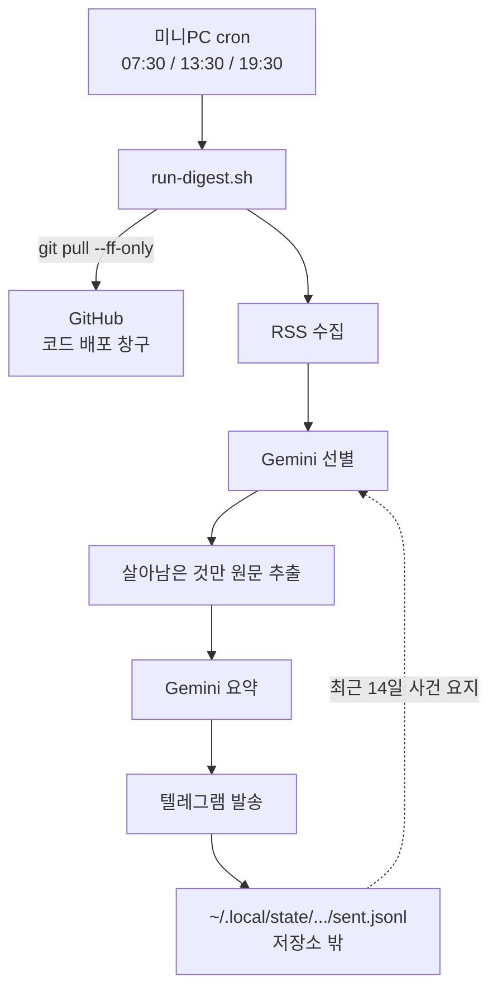

아침 브리핑이 점심에 왔다. 07시 23분에 오기로 한 것이 08시 26분에 왔고, 다음 날은 10시 36분에 왔다. 낮 회차는 저녁에 왔다.

봇이 죽은 게 아니었다. 실행은 매번 성공했고 걸린 시간도 1분 20초로 일정했다. 밀린 건 순전히 GitHub이 예약을 던져 주기까지의 대기였다.

이 문제 자체는 이 봇을 소개한 이전 글에서 이미 다뤘다. 그때 `schedule`이 보장이 아니라 best-effort 큐라는 걸 확인하고 두 가지로 대응했다. cron을 한산한 분으로 옮겼고, 회차마다 백업 cron을 48분 뒤에 하나씩 더 뒀다. 그리고 이렇게 썼다.

> 서버를 세우는 것도 검토했지만 안 했다. 실행 자체는 문제없이 돌고 결함은 트리거 하나다. 서버를 두면 가동시간·배포·시크릿 관리가 따라오고 `sent.jsonl`을 어디에 둘지도 다시 정해야 한다.

사흘 뒤에 그 결정을 뒤집었다. 그리고 그때 하기 싫다고 적어 둔 네 가지가 그대로 이번 설계의 목차가 됐다.

## 백업 크론은 폐기를 막았지 지연은 못 막았다

백업은 제 몫을 했다. 나흘간 브리핑이 한 번도 안 온 날은 없었다. 대신 도착 시각이 이렇게 됐다.

| 목표 (KST) | 실제 도착 | 밀림 |
| --- | --- | --- |
| 07:23 | 08:26 | +63분 |
| 13:23 | 16:08 | +165분 |
| 19:23 | 21:20 | +117분 |
| 07:23 | 10:36 | +193분 |

밀림의 최댓값이 3시간을 넘었다. 08월 06일 밤에는 예약 두 개가 연달아 폐기됐고 그 회차는 두 시간 뒤에야 걸렸다.

정시에 오지 않는 브리핑은 브리핑이 아니다. 저녁 9시에 도착한 "낮 소식"은 이미 다른 데서 본 것들이었다.

무료 티어의 분(minutes) 한도 문제는 아니었다. 하루 6슬롯을 다 돌아도 월 165분이고 비공개 저장소 한도는 2000분이다. 돈이 아니라 우선순위 문제였다.

## 트리거를 옮기는 것과 실행을 옮기는 것을 분리했다

처음엔 "미니PC로 옮긴다"를 한 덩어리로 생각했는데, 뜯어 보니 축이 둘이었다.

- **트리거** — 누가 실행을 시작시키는가. 지연은 전부 여기서 났다.
- **실행** — 수집·요약·발송이 어디서 도는가.

지연이 트리거 축에서만 나므로, **실행 위치를 바꿔도 정시성에는 아무 도움이 안 된다.** 이걸 분리하고 나니 선택지가 네 개로 갈렸다.

| | 트리거 | 실행 | 정시성이 의존하는 것 |
| --- | --- | --- | --- |
| A | 미니PC cron이 GitHub API 호출 | GitHub | GitHub 러너 배정 |
| B | GitHub 예약 | 미니PC 러너 | 여전히 GitHub 예약 큐 |
| C | 미니PC cron이 GitHub API 호출 | 미니PC 러너 | GitHub 잡 배정 |
| E | 미니PC cron | 미니PC 호스트 | 미니PC cron |

B가 가장 먼저 탈락했다. self-hosted 러너를 붙이는 건 5분이면 되는데, **지연은 러너가 아니라 이벤트가 만들어지는 계층에서 난다.** 러너를 내 걸로 바꿔도 이벤트가 안 오면 러너는 놀고 있을 뿐이다.

## workflow_dispatch로 가려다 측정이 안 돼서 접었다

A안이 유력했다. 미니PC의 crontab에 세 줄만 넣고 GitHub API로 `workflow_dispatch`를 부르면, 그건 예약 큐를 타지 않으니 즉시 실행된다. 미니PC에 올라가는 건 토큰 하나와 `curl` 한 줄이라 가장 싸다. 이전 글에서도 "백업까지 폐기되면 이걸 하겠다"고 적어 뒀던 안이다.

그런데 `workflow_dispatch`로 워크플로가 만들어진 뒤에도 **러너를 배정받는 큐는 여전히 GitHub 것이다.** 이 지연이 얼마나 되는지 재려고 API를 뒤졌는데 잴 수가 없었다.

```
$ gh api '.../runs' --jq '.workflow_runs[] | [.event, .created_at, .run_started_at]'
schedule   2026-08-07T01:35:24Z   2026-08-07T01:35:24Z
schedule   2026-08-06T13:02:38Z   2026-08-06T13:02:38Z
workflow_dispatch  2026-08-05T05:28:09Z  2026-08-05T05:28:09Z
```

`created_at`과 `run_started_at`이 모든 실행에서 같다. GitHub은 큐 대기가 끝나고 실행이 실제로 생성되는 시점에 `created_at`을 찍는다. **지연은 그 앞에서 일어나므로 응답에 흔적이 남지 않는다.**

목표가 "정시에 문제없이"인데 임계 경로에 측정조차 안 되는 남의 큐를 남길 이유가 없었다. A와 C를 같이 접었다.

## 러너를 공유할 수 없다는 것도 이때 확인했다

C를 검토하면서 미니PC에 이미 떠 있는 jay-wiki용 러너를 재사용하려고 했다. 안 된다.

```
$ gh api users/jaymunsh --jq .type
User
```

self-hosted 러너를 여러 저장소가 공유하려면 조직이나 엔터프라이즈 레벨에 등록해야 하는데, 개인 계정에는 그 레벨이 없다. 러너는 저장소 단위로만 붙는다. C로 가려면 같은 기계에 전용 러너를 하나 더 등록해야 했다.

덤으로 좋은 점도 있었다. 프로세스가 별개라 jay-wiki 배포가 25분을 잡아먹어도 브리핑이 그 뒤로 밀리지 않는다. 다만 이건 C를 살릴 만한 이유는 못 됐다.

## k3s로 옮기지 않기로 했다

미니PC는 이미 k3s를 돌리고 있어서 CronJob 하나 얹는 게 가장 그럴듯해 보였다. 실제로 계산해 보니 값이 비쌌다.

정시성 이득은 호스트 cron과 똑같다. 둘 다 내 기계의 스케줄러니까. 대신 치르는 값이 셋이었다.

- 텔레그램·Gemini 키가 k8s Secret으로 넘어온다
- Pod는 실행 후 사라지므로 **발송 기록을 어디 둘지 새로 설계해야 한다.** PVC를 붙이거나, git push용 토큰을 또 심거나
- 로그도 Pod와 함께 사라진다

얻는 건 매니페스트 한 벌인데, k3s 운영 사례는 [위키](https://portfolio.leneu.cloud)에 이미 여러 편 있다. 새로 배울 게 없는 곳에 상태 설계 비용을 내는 셈이라 접었다.

남은 건 호스트 cron으로 그냥 돌리는 안(E)이었다. 컨테이너도 러너도 없이 `git clone` 하고 `uv run` 한다.

## 상태 파일 한 줄이 저장소를 붙잡고 있었다

E로 가려니 걸리는 게 하나 있었다. 코드가 발송 기록의 경로를 저장소 안에 박아 두고 있었다.

```python
SENT_LOG_PATH: Final = Path("data/sent.jsonl")
```

clone해서 그대로 돌리면 매 실행이 이 추적 파일을 수정한다. 그러면 다음에 코드를 받으려고 `git pull` 할 때 로컬 변경 때문에 막힌다. 되돌리려면 push를 해야 하고, push를 하려면 쓰기 토큰을 심어야 한다. 토큰을 심으면 만료 관리가 따라온다.

경로를 환경변수로 뺐다.

```python
def sent_log_path() -> Path:
    override = os.environ.get("AI_TREND_BOT_SENT_LOG")
    return Path(override) if override else SENT_LOG_PATH
```

**상수에 값을 박지 않고 함수로 감싼 건 테스트 때문이다.** 모듈 상수는 import 시점에 한 번만 평가된다. 그러면 테스트가 환경변수를 바꿔도 반영되지 않고, 먼저 import한 테스트가 뒤의 테스트를 오염시킨다.

이 한 덩어리로 **clone이 읽기 전용이 되고 토큰이 아예 필요 없어졌다.** 기본값을 그대로 뒀으니 로컬 실행 동작도 안 바뀐다.

## 발송 기록을 git에서 서버 파일로 옮겼다

이게 이번 작업에서 가장 크게 뒤집은 결정이다. 이전 글에는 이렇게 적혀 있다.

> 지금은 `data/sent.jsonl`에 한 줄씩 붙이고 Actions가 저장소에 커밋·푸시한다. GitHub이 저장소를 유지하는 한 사라지지 않고, 별도 시크릿도 필요 없다.

그 판단 자체는 여전히 맞다. 문제는 **실행 주체가 GitHub이라는 전제 위에 서 있었다는 것이다.** 실행이 미니PC로 오면 이 구조가 그대로 뒤집힌다. 저장소에 쓰려면 토큰이 필요하고, 토큰을 안 쓰려면 저장소 밖에 둬야 한다.

지금은 `~/.local/state/ai-trend-bot/sent.jsonl`에 쓴다. 저장소의 `data/sent.jsonl`은 이관 시점 178줄에서 멈춘 스냅샷으로 남았다.

### 저장되는 건 이 파일 하나뿐이다

DB도 캐시도 없다. RSS로 받은 원문과 Gemini 요약은 텔레그램으로 나가고 버려진다. 남는 상태는 append-only JSONL 한 줄씩이 전부다.

```json
{
  "key": "URL의 sha256",
  "title": "...",
  "url": "...",
  "source": "...",
  "category": "...",
  "event": "사건 요지 한 줄",
  "sent_at": "2026-08-07T09:33:26Z"
}
```

### 이 파일은 중복 방지만 하는 게 아니다

옮기면서 코드를 다시 읽다가 알았다. 세 곳에서 읽는데 그중 하나가 요약 품질에 물려 있었다.

| 읽는 곳 | 쓰는 범위 | 없으면 |
| --- | --- | --- |
| `unseen()` | 전 기간의 `key` | 이미 보낸 항목을 다시 보낸다 |
| `last_sent_at()` | 마지막 한 줄 | 회차 중복 방지가 풀린다 |
| `recent_events(days=14)` | 최근 14일의 사건 요지 | 후속 보도를 새 소식으로 착각한다 |

세 번째 때문에 이 파일은 "지운 뒤 다시 쌓으면 되는" 로그가 아니다. 날아가면 2주간 판단 재료가 빈다.

### 첫 실행 전에 기존 기록을 복사해야 했다

`unseen()`은 파일에 없는 키를 전부 미발송으로 본다. 빈 파일로 시작하면 최근 RSS 항목이 전부 새 것으로 보여서 **이미 보낸 브리핑이 통째로 다시 간다.**

그래서 이관 순서에 이 한 줄이 들어갔다. 빼먹으면 첫 자동 실행이 대형 사고가 된다.

```bash
cp ~/apps/ai-trend-bot/data/sent.jsonl ~/.local/state/ai-trend-bot/sent.jsonl
```

### 크기를 재고 나서 가지치기를 안 하기로 했다

옮기기 전에 실제 파일로 계산했다. 167줄에 68KB, 줄당 407바이트다. 정상 회차가 평균 7.9줄이고 하루 세 번이니 24줄, 하루 9.4KB, **연 3.4MB**다.

처음 어림한 값은 연 150KB였는데 20배 틀렸다. 하루 발송 건수를 10줄로 잡은 게 원인이었고, 실제 이력을 세 보고서야 24줄인 걸 알았다.

3.4MB면 가지치기가 필요 없다. 5년이면 17MB에 4만 줄인데, 매 실행마다 전체를 파싱해도 1초 안쪽이다. 잘라내는 코드를 지금 쓰는 건 10년 뒤 문제를 오늘 푸는 일이다.

### 백업도 두지 않기로 했다

git에 있을 때는 백업이 공짜로 따라왔다. 서버 파일이 되면서 그게 사라졌다. 그래서 잃었을 때 무슨 일이 생기는지를 먼저 적어 봤다.

1. 다음 실행이 최근 항목을 미발송으로 보고 브리핑을 한 번 크게 보낸다
2. 2주간 후속 보도 판단이 흐려진다

**둘 다 자가 복구된다.** 한 번 보내고 나면 파일이 다시 채워지고, 14일 지나면 맥락도 돌아온다. 최악이 "짜증나는 아침 한 번과 어중간한 2주"라서 백업 장치가 값을 못 한다.

대신 설계 문서에 천장을 적어 뒀다. 아쉬워지면 주 1회 `cp` 크론 한 줄이면 된다.

## 토큰 대신 읽기 전용 배포 키를 썼다

비공개 저장소라 clone에 인증이 필요했다. 계정 전체에 권한이 붙는 PAT 대신 배포 키를 썼다.

- 그 저장소 하나에만 붙는다
- 쓰기 권한을 안 주면 push가 구조적으로 불가능하다
- 만료가 없어서 갱신 일정을 관리할 필요가 없다

미니PC에 jay-wiki 러너도 있어서 키가 섞이지 않게 SSH 호스트 별칭을 따로 뒀다.

```
Host github-ai-trend-bot
  HostName github.com
  User git
  IdentityFile ~/.ssh/ai-trend-bot
  IdentitiesOnly yes
```

**코드를 rsync로 밀어 넣는 안도 검토했다.** 그러면 키가 아예 필요 없다. 대신 `git pull`이 사라져서 코드 갱신이 자동에서 수동이 되고, 서버 위 코드가 어느 시점 것인지 알 수 없게 된다. 편집 기준을 담은 마크다운 파일을 자주 만지는 프로젝트라 "머지하면 다음 회차부터 반영"을 택했다.

## 발송 경로에서 GitHub을 완전히 걷어냈다



발송 경로에 GitHub이 없다. 코드를 받아오는 화살표 하나만 남았고, 그마저 실패해도 이전 코드로 발송은 그대로 나간다.

미니PC에 올라간 건 이게 전부다.

| 위치 | 무엇 |
| --- | --- |
| `~/apps/ai-trend-bot` | clone. 읽기 전용 |
| `~/.ssh/ai-trend-bot` | 읽기 전용 배포 키 |
| `~/.config/ai-trend-bot.env` | 시크릿 세 개 (0600) |
| `~/bin/run-digest.sh` | 실행 스크립트 |
| `~/.local/state/ai-trend-bot/sent.jsonl` | 발송 기록 |
| `~/logs/ai-trend-bot.log` | 실행 결과 |

스크립트에서 정작 중요한 줄은 화려한 데가 아니라 이거였다.

```bash
cd "$REPO"
```

수집처 설정과 편집 기준 파일을 현재 디렉터리 기준 상대 경로로 연다. cron은 홈 디렉터리에서 시작하므로 `cd` 없이는 설정 파일을 못 찾는다.

## 리소스는 재 보니 예상보다 훨씬 적었다

상시 도는 프로세스가 없다. cron이 시각에만 띄우고 80초 뒤에 죽는다.

| 항목 | 추정했던 값 | 실측 |
| --- | --- | --- |
| 실행 시간 | 90초 | 80초 |
| 실행 시 RAM | 수백 MB | 96MB |
| 실행 시 CPU | 1코어 미만 | 5% |
| 디스크 | 400MB | 436MB |

RAM을 3배 넘게 과대추정했다. 본문 추출 라이브러리를 무겁게 봤는데, 원문을 받아오는 건 선별을 통과한 소수뿐이라 한 번에 들고 있는 문서가 몇 개 안 된다.

같은 기계에서 도는 OpenSearch 힙 하나가 이것보다 훨씬 무겁다. **결국 리소스는 이 결정의 변수가 아니었다.** 고르는 기준이 된 건 움직이는 부품의 개수였다.

## 잃은 것도 있다

GitHub 예약을 백업으로 남길 수가 없었다.

남겨 두면 Actions는 저장소에 멈춰 있는 178줄 스냅샷을 기준으로 판단한다. 미니PC가 방금 보낸 걸 모르니 같은 브리핑을 한 번 더 보낸다. 백업과 중복 방지를 동시에 가질 수 없어서 백업을 버렸다.

**그래서 미니PC가 죽으면 그 회차는 아예 오지 않는다.** 이전 구조는 "늦게라도 온다"였으니 명백한 후퇴다.

감시 장치는 만들지 않았다. 브리핑이 안 오는 것 자체가 알림이라, 알림을 위한 알림을 또 만들 이유가 없다고 봤다. 수동 실행 창구는 남겨 뒀는데 그쪽은 낡은 스냅샷을 보므로 누르면 중복이 갈 수 있다. 그 경고를 워크플로 파일 주석에 박아 뒀다.

## 사슬을 두 토막으로 나눠서 검증했다

이관 당일 손으로 한 번 돌린 발송은 잘 왔다. 후보 251건에서 10건을 골라 보냈고, 저장소는 깨끗한 채로 상태 파일만 178줄에서 188줄로 늘었다. 발송 경로는 여기서 확인했다.

남은 건 "cron이 그 스크립트를 제대로 부르는가"였다. cron은 로그인 셸이 아니라서 `PATH`가 빈약하고, 홈 디렉터리에서 시작한다. 손으로 돌릴 때와 환경이 다르다.

그날 저녁 19시 30분 회차가 그걸 증명했다. 직전 발송이 한 시간 전이라 중복 방지 가드에 걸려 아무것도 보내지 않았는데, **로그에는 이렇게 남았다.**

```
최근 3시간 안에 발송한 기록이 있어 건너뜁니다.
2026-08-07T19:30:05+09:00 done
```

건너뛰었어도 스크립트는 끝까지 돌았다. 시크릿을 읽고, 저장소로 이동하고, 코드를 당기고, 상태 파일을 확인한 다음 마지막 줄까지 갔다. `set -euo pipefail` 아래에서 `done`이 찍혔다는 건 중간에 실패한 줄이 하나도 없다는 뜻이다.

**두 토막을 합치면 사슬 전체가 덮인다.** 수동 실행이 수집부터 발송까지를, cron 실행이 발사와 환경을 증명했다.

## 첫 자동 회차는 71초 만에 끝났고, 발사를 28분으로 당기지 않기로 했다

이관 뒤 첫 무인 회차가 08월 08일 아침에 돌았다. cron이 07시 30분 정각에 발사했고 로그의 마지막 줄이 이랬다.

~~~
텔레그램 발송 완료: 후보 244건 → 8건
2026-08-08T07:31:11+09:00 done
~~~

**발사부터 완료까지 71초.** 예상했던 80초보다 조금 빨랐다.

GitHub 시절과 나란히 놓으면 이렇다. 왼쪽은 `schedule` 이벤트 26회를 각 회차의 예정 시각과 비교해 잰 것이고, 오른쪽은 미니PC cron이다.

| | GitHub Actions (26회) | 미니PC cron (2회) |
|---|---|---|
| 최소 지연 | 15.2분 | 5초 |
| 중앙값 | **69.4분** | — |
| 최대 | 206.5분 | — |
| 3분 이내 도착 | **0회** | 2회 |
| 10분 초과 | **26회 전부** | 0회 |

**표본 수가 대칭이 아니라는 걸 그대로 적어 둔다.** GitHub 쪽은 일주일치 26회고 미니PC 쪽은 두 회차뿐이다. 어제 저녁 19시 30분 회차(중복 가드에 걸려 5초 만에 끝난 것)와 오늘 아침 회차가 전부다. 지금 말할 수 있는 건 "26회 중 3분 안에 온 적이 한 번도 없던 것이 두 번 다 1분대에 왔다"까지고, 분포를 주장하려면 며칠 더 쌓여야 한다.

GitHub 쪽에서도 확인할 게 하나 있었다. 이관 뒤로 `schedule` 이벤트가 **한 건도 생기지 않았다.** 워크플로에서 `schedule` 블록을 지웠으니 당연한 결과지만, 발송 경로에 GitHub이 남아 있지 않다는 걸 실행 목록으로도 확인한 셈이다.

남은 결정은 발사를 28분으로 당길지였다. **당기지 않기로 했다.**

이유는 71초가 상수가 아니라서다. 이번 회차는 후보 244건에서 8건을 골랐고, 첫 수동 회차는 251건에서 10건이었다. 수집량과 요약할 항목 수가 매일 다르니 실행 시간도 같이 움직인다. 상수 오프셋으로 정각을 맞추려는 시도는 **가변인 값을 상수로 취급하는 것**이고, 그러면 어떤 날은 29분에 어떤 날은 31분에 온다.

애초에 원한 것도 정각이 아니었다. 아침 브리핑이 점심에 오지 않는 것, 즉 **매일 같은 시각에 오는 것**이었다. 07시 31분에 오는 편이 07시 29분과 31분 사이를 오가는 것보다 그 목적에 맞는다.

## 사흘 전의 예측은 틀리지 않았고, 저울의 반대쪽이 바뀌었다

사흘 전에 "서버를 두면 가동시간·배포·시크릿 관리가 따라온다"고 쓰면서 안 하겠다고 했다. 실제로 해 보니 그 셋이 전부 따라왔다. 틀린 예측은 아니었다.

바뀐 건 저울의 반대쪽이었다. 그때는 "가끔 한 회차가 폐기된다"였고 지금은 "매 회차가 한두 시간씩 밀린다"였다. 폐기는 백업으로 덮이지만 지연은 백업도 같이 밀려서 덮이지 않는다.

그리고 걱정했던 세 가지 중 실제로 값이 나간 건 하나뿐이었다. 배포는 `git pull` 한 줄로 끝났고, 시크릿은 어차피 어딘가에는 있어야 하는 것이라 GitHub Secrets에서 파일로 자리만 옮겼다. 진짜로 값을 치른 건 가동시간이다. 그건 지금도 미결이고, 미니PC가 꺼져 있으면 그 회차는 오지 않는다.
