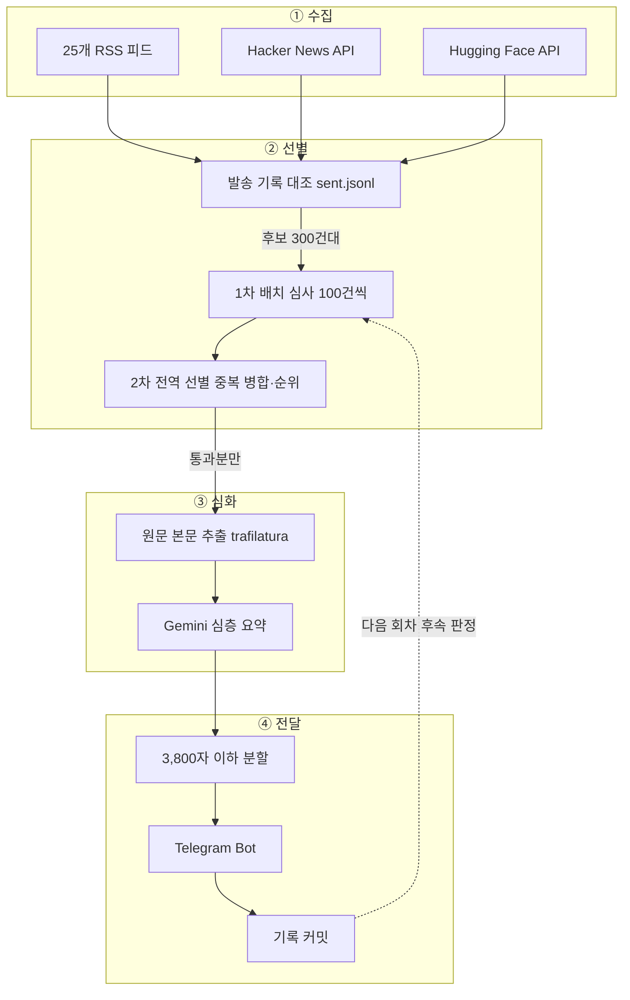

> 이 글은 2026년 8월 초, 봇이 GitHub Actions 위에서 돌던 시점의 기록이다. 그 뒤
> 예약 실행을 통제하지 못하는 문제 때문에 미니PC cron 으로 옮겼고, 발송 시각과
> 발송 기록이 사는 곳이 달라졌다. 옮긴 이야기는 별도의 글에 있다. 아래 본문은
> 그때의 판단을 그대로 둔다.

AI 소식은 한 곳에 모이지 않는다. 모델 발표는 벤더 블로그에, 그 해설은 테크 미디어에, 먼저 아는 사람들의 반응은 Threads에, 논문은 arXiv에 있다. 매일 다 도는 건 불가능하고, 안 돌면 큰 발표를 한참 뒤에 남한테 듣는다.

RSS 리더도 써봤고 뉴스레터도 구독해봤는데 둘 다 안 맞았다. 리더는 안 읽은 개수만 쌓이고, 뉴스레터는 하루나 일주일 늦는다. 내가 원한 건 **읽을 만한 것만 몇 건, 한국어로, 정해진 시각에** 오는 것이었다.

그래서 만들었다. **ai-trend-bot은 27곳에서 AI 소식을 모아 편집 기준으로 거른 뒤, 통과한 것만 한국어로 요약해 텔레그램으로 보내는 개인용 봇이다.** 하루 세 번, 07:23 / 13:23 / 19:23에 온다.


파이썬으로 짰고 GitHub Actions에서 돈다. 서버는 없다. Gemini 무료 티어와 Actions 무료 한도 안에서 운영하는 것이 처음부터 제약이었다.

## 개수를 고정하지 않고, 기준을 통과한 것만 보낸다

이 봇에서 가장 중요한 결정이다.

처음 버전은 하루 세 번 **15건씩** 보냈다. 그랬더니 조용한 날에도 15건이 왔다. 보낼 만한 게 3건뿐인 날에 나머지 12건을 어디선가 끌어와서 채우고 있었기 때문이다. "AWS Bedrock으로 챗봇 만들기" 같은 튜토리얼이 모델 출시 발표와 나란히 왔다.

그래서 개수를 없앴다. 지금은 **기준을 통과한 것만** 보내고, 통과분이 없으면 아예 안 보낸다. 실제로 회차당 3~8건 정도가 온다. 상한 30건이 있긴 한데 목표치가 아니라 폭주 방지선이다.

헤더에 건수를 표시하는 것도 이것 때문이다. `8월 3일 (월) · 7건`. 매번 개수가 다르다는 걸 드러내려고 넣었다.

## 점수 대신 분류로 거른다

거르는 방식은 몇 번 바꿨다.

처음엔 Gemini에게 0\~100점을 매기게 하고 임계값을 걸려고 했다. 안 됐다. LLM이 매기는 절대 점수는 보정되어 있지 않아서 **대부분 70\~85 구간에 몰린다.** 75에서 자르든 80에서 자르든, 그 경계에 걸린 것들 사이에 실제 품질 차이가 없다. 어디를 자르든 자의적이 된다.

그래서 점수를 버리고 "**이게 어느 칸인가**"를 묻기로 했다.

```python
class Category(StrEnum):
    RELEASE = "모델·제품 출시"
    RESEARCH = "연구 결과"
    POLICY = "정책·산업·자금"
    TOOL = "도구·오픈소스"
    TUTORIAL = "튜토리얼·사용법"
    PROMO = "홍보·사례소개"
    OTHER = "기타"


DROPPED_CATEGORIES = frozenset({
    Category.TUTORIAL, Category.PROMO, Category.OTHER,
})
```

분류는 점수보다 훨씬 안정적으로 재현된다. "AWS Bedrock으로 챗봇 만들기"가 빠지는 건 점수가 낮아서가 아니라 **종류가 다르기** 때문이다. 뒤 세 칸은 모델이 통과시켜도 코드에서 버린다. 모델이 관대해질 수는 있어도 분류까지 뒤집지는 않는다.

순위도 같은 이유로 절대 평가를 안 쓴다. "0~100으로 평가하라"가 아니라 "**이 중 무엇이 더 중요한가**"를 묻는다. 모델은 상대 비교에서 훨씬 일관적이다.

브리핑 항목마다 `[모델·제품 출시]` 같은 분류가 붙는 것도 이 구조가 그대로 드러난 것이다.

## 무엇을 보낼지는 코드가 아니라 마크다운 파일이 정한다

기준을 프롬프트에 문자열로 박지 않고 `config/editorial.md`라는 한국어 산문 파일로 뺐다. 이 파일이 그대로 선별 프롬프트에 들어간다.

```markdown
## 독자

AI를 실제로 만들고 쓰는 한 사람. 이 브리핑을 네 가지 용도로 읽습니다.

1. **내가 쓸 도구·기술 찾기** — 새 모델, 라이브러리, API 변경 중 당장 적용할 만한 것
2. **업계 흐름 따라가기** — 누가 무엇을 내놓고 판이 어떻게 움직이는지
3. **콘텐츠·글감 소재** — 남들이 아직 모를 만한 것, 이야기가 되는 것
4. **놓치면 안 되는 것** — 큰 발표는 반드시

## 반드시 걸러낼 것

- **"X로 Y 만들기" 형태의 튜토리얼·하우투.** 새 소식이 아니라 사용법입니다.
  특히 클라우드 벤더 블로그에 많습니다.
- **고객 사례·도입 후기·파트너십 홍보.**

## 판단이 애매할 때

- **새로운 사실이 있는가?** 없으면 버립니다.
- 애매하면 **버립니다.** 조용한 브리핑이 잡음 섞인 브리핑보다 낫습니다.
```

파일로 뺀 이유는 하나다. **이 기준은 계속 틀릴 것이고, 틀렸을 때 내가 고칠 수 있어야 하기 때문이다.** 브리핑이 마음에 안 들면 코드를 여는 게 아니라 이 파일 한 줄을 고치고 드라이런을 돌린다.

그래서 판정 결과에 탈락 사유를 함께 남긴다. 무엇이 왜 잘렸는지 볼 수 없으면 기준을 못 고친다.

```
uv run ai-trend-bot run --dry-run
```

터미널에 통과분과 함께 `[튜토리얼·사용법]`, `[홍보·사례소개]`, `중복:` 같은 탈락 사유가 줄줄이 찍힌다. 이 목록을 보고 `editorial.md`를 고친다.

## 통과한 것만 원문을 읽는다

초기 버전의 요약이 유난히 얕았는데, 원인을 찾아보니 Gemini에 넘기는 본문이 **RSS의 `summary` 필드**였다. 이건 대부분 두세 문장짜리 티저다. 즉 이미 압축된 두세 문장을 주고 "요약하라"고 시키고 있었다. 모델이 할 수 있는 건 제목을 다시 쓰는 것뿐이었다.

원문을 받아오면 되는데, 후보 300건의 원문을 전부 받아올 수는 없다. 그래서 순서를 정했다. **싸게 넓게 거르고, 비싸게 좁게 판다.**

```
① 수집   27개 소스 → 후보 300건 안팎
② 선별   후보 → 통과분만 (보통 3~15건)
③ 심화   통과분만 원문 fetch → 깊은 요약
④ 전달   렌더링 → 텔레그램 → 기록 커밋
```

②를 통과한 소수에게만 `trafilatura`로 원문 본문을 뽑아 요약한다. 추출이 실패하면 RSS 티저로 폴백하니 그 항목만 얕아지고 브리핑은 정상 발송된다.

요약은 세 줄 고정이다.

```
핵심: Claude Desktop에서 파일을 직접 다루는 에이전트를 공개했습니다.
왜 중요한가: 작업 범위가 채팅창 밖으로 넓어집니다.
관련 대상: Claude Desktop 사용자
```

"관련 대상"을 넣은 게 생각보다 효과가 컸다. 이게 없으면 "AI 개발자" 같은 답이 나온다. 프롬프트에 "가장 구체적인 독자를 적으라"고 못 박아 뒀다. 같은 맥락에서 `획기적`, `비약적`, `대폭` 같은 표현과 "활용하세요" 류의 근거 없는 권유도 금지어로 넣었다.

## 실제로 온 브리핑 한 항목을 뜯어본다

말로만 설명하면 잘 안 와닿아서, 8월 4일 아침에 실제로 받은 브리핑의 1번 항목을 그대로 옮긴다.

```
🌅  AI 트렌드 브리핑 · 아침 08:35
8월 4일 (화) · 8건

────────────────

01. Gemini API 관리형 에이전트 업데이트
[모델·제품 출시]

핵심: Gemini API 관리형 에이전트에 Gemini 3.6 Flash 모델이 기본 적용되었으며,
환경 훅(hooks), 모델 선택 기능, 무료 티어 접근 권한이 추가되었습니다. 샌드박스
내에서 도구 호출 전후로 사용자 정의 스크립트를 실행하는 환경 훅을 통해 보안 및
코드 품질 관리가 가능합니다.
왜 중요한가: 외부 오케스트레이션 없이도 클라우드 샌드박스 내에서 자율적인
에이전트 워크플로우를 비용 효율적으로 제어하고 자동화할 수 있습니다.
관련 대상: AI 에이전트 기반 워크플로우를 개발하는 소프트웨어 엔지니어 및 제품팀

↳ 원문: Google AI
```

한 줄씩 어디서 나온 값인지 보면 이렇다.

| 부분 | 만든 곳 |
| --- | --- |
| `· 8건` | 선별을 통과한 개수. 고정값이 아니다 |
| `[모델·제품 출시]` | 1차 선별의 `category`. 이 칸이 아니었으면 여기 없다 |
| 핵심 / 왜 중요한가 / 관련 대상 | 원문 본문을 받아온 뒤의 심층 요약 |
| `↳ 원문: Google AI` | 대표로 남은 출처. 병합됐으면 링크가 여러 개 붙는다 |

"관련 대상"에 "AI 개발자"가 아니라 "에이전트 기반 워크플로우를 개발하는 소프트웨어 엔지니어 및 제품팀"이 들어간 게 프롬프트를 조인 결과다. 그리고 이 항목은 내가 지금 쓰는 도구와 직접 닿아서, 브리핑을 읽자마자 원문을 열었다. 편집 방침의 첫 번째 용도(내가 쓸 도구·기술 찾기)가 그대로 동작한 경우다.

## Threads의 @choi.openai를 넣으려다 공식 API를 포기했다

이 봇을 만들기로 한 계기 중 하나가 Threads였다.

AI 소식은 공식 블로그보다 Threads에서 먼저 도는 경우가 많다. 국내 계정 중에서는 `@choi.openai`를 챙겨 본다. 이름이 알려진 계정들 가운데 AI 소식을 빠르게, 그러면서 내용이 있는 쪽으로 올려주는 편이라 개인적으로 관심 있게 보고 있다.

문제는 타임라인이라는 것이다. 스크롤을 놓치면 그냥 지나가고, 나중에 찾으려면 계정에 들어가 거슬러 올라가야 한다. **이 계정을 브리핑 소스로 넣고 싶었다.**

공식 Threads API를 붙였다. 그리고 막혔다.

타인의 공개 계정을 조회하려면 `threads_profile_discovery` 권한이 필요하다. Standard Access로는 `@meta`, `@threads`, `@instagram`, `@facebook` **네 개 공식 계정만** 조회된다. 그 외에는 Advanced Access가 필요하고, 이건 Meta 앱 심사를 거쳐야 한다. 2~4주가 걸리고 **실제 서비스의 사용자 플로우 스크린캐스트**를 제출해야 한다.

개인용 봇에는 제출할 사용자 플로우가 없다. 화면이 없으니까. 시간이나 노력의 문제가 아니라 **제출할 물건 자체가 없는** 문이었다. 60일마다 토큰을 갱신하는 코드까지 짜뒀는데, 권한이 선결 조건이라 의미가 없었다.

그래서 방향을 틀어 **RSSHub의 `/threads/:user` 라우트를 경유해 RSS로 받는다.** 토큰도, 갱신도, 심사도 필요 없다. 대신 공용 인스턴스라 자주 타임아웃된다. 실패해도 그날 그 소스만 빠지고 나머지는 정상 발송되도록 소스별로 실패를 격리해 뒀다.

이 우회는 실제로 제값을 했다. 8월 3일 저녁 브리핑 7건의 출처가 Google DeepMind, AI타임스, **Threads @choi.openai**, Simon Willison, VentureBeat, Hacker News, MIT Technology Review였다. 공식 API로는 절대 못 가져왔을 소스가 브리핑 한 자리를 차지했다.

`ai_trend_bot/threads.py`는 지우지 않고 남겼다. 본인 계정 조회는 `threads_basic` 권한만으로 되니까, 나중에 쓸 일이 있으면 그때 붙인다.

## 무료 티어가 322건짜리 요청을 거절했다

선별은 Gemini 호출 한 번으로 끝낼 생각이었다. 컨텍스트가 100만 토큰이고 입력이 2.5만 토큰 수준이라 계산상 여유가 컸다.

실제로 돌리니 후보 322건짜리 요청에 **503(high demand)** 이 돌아왔다. 재시도해도 안 풀렸다. 그런데 같은 키로 작은 요청은 200이 오고, 200건까지는 통과한다. 토큰 한도가 아니라 **요청 크기** 문제였다. 계산으로는 안 보이고 실제로 던져봐야 나오는 벽이다.

100건씩 배치로 나눴더니 이번엔 중복 병합이 깨졌다. 같은 사건을 다룬 두 매체가 서로 다른 배치에 떨어져 둘 다 살아남았다. 우연이 아니었다 — 후보는 우선순위 내림차순으로 정렬되어 있어서, **회사 공식 발표와 그걸 받아쓴 기사는 거의 항상 다른 배치에 들어간다.**

그래서 두 번 거른다. 1차는 100건씩 배치로 병렬 심사하고, 2차는 생존자 수십 건을 한 번에 놓고 다시 본다. 중복 병합과 순위는 2차에서 결정된다.

## 두 번 거르되, 두 번째는 다른 질문을 한다

2단으로 나눈 첫 예약 실행이 **상한 30건을 꽉 채웠다.**

원인은 프롬프트였다. 2차가 1차와 똑같은 질문을 하고 있었다. "이 항목이 보낼 가치가 있나." 수백 건을 훑을 때는 맞는 질문인데, 2차의 입력은 **이미 1차를 통과한 것들**이다. 개별로 보면 다 그럴듯하니 거의 전부 재승인됐다. 심사가 아니라 확인 도장이 되어 있었다.

로직이 아니라 프레이밍을 고쳤다. 2차에만 이 문단을 덧붙였다.

```
이것은 최종 선별입니다. 위 후보는 이미 1차를 통과한 것들이므로 개별적으로는 모두
그럴듯해 보입니다. 지금 할 일은 재심사가 아니라 **오늘 브리핑에 실을 것을 고르는
것**입니다. 하루 세 번 발송하므로 한 회차에 실리는 것은 보통 3~8건입니다. 서로
비교했을 때 상대적으로 약한 것, 같은 회사의 사소한 업데이트, 같은 사건의 다른 측면을
다룬 것은 keep=false로 떨어뜨리세요. 애매하면 버립니다.
```

"심사한다"에서 "**고른다**"로 바꾼 게 전부다. 같은 후보 풀에서 30건이 14건이 됐다.

## 보낸 기록은 git에 커밋한다

재발송을 막으려면 뭘 보냈는지 기억해야 한다. 처음엔 SQLite 파일을 GitHub Actions 캐시에 뒀는데, 가끔 이미 보낸 항목이 무더기로 다시 왔다.

Actions 캐시는 **7일 미사용 또는 용량 초과 시 evict된다.** 장애가 아니라 명세된 정상 동작이다. "언젠가 날아갈 수도 있다"가 아니라 "날아가는 게 계약"인 저장소를 영속 저장소로 쓴 내 잘못이었다.

지금은 `data/sent.jsonl`에 한 줄씩 붙이고 Actions가 저장소에 커밋·푸시한다. GitHub이 저장소를 유지하는 한 사라지지 않고, 별도 시크릿도 필요 없다. 용량은 연 2MB 수준이다.

## 예약이 실패한 게 아니라 조용히 폐기됐다

2026년 8월 4일 13:23 회차가 오지 않았다. 실패한 실행을 찾으러 갔는데 **실패가 없었다. 큐에 잡힌 기록 자체가 없었다.** 같은 날 07:23 회차는 63분 늦게 도착했다.

cron 표기도 정상이었고 워크플로 상태도 `active`였고 권한과 시크릿에도 문제가 없었다. GitHub이 그 회차를 버린 것이다.

`schedule`은 보장이 아니라 best-effort 큐다. 부하가 높으면 밀리고, 밀리다 다음 슬롯 근처까지 가면 실행하지 않고 버린다. 무료 티어에 비공개 저장소면 우선순위가 낮다. 지연이 나기는 했지만 얼마나 나는지는 재 본 적이 없었다.

| 예정 (UTC) | 실제 | 지연 |
| --- | --- | --- |
| 23:17 | 00:14 | +57분 |
| 11:17 | 12:16 | +59분 |
| 11:17 | 13:48 | +151분 |
| 22:30 | 23:33 | +63분 |
| 04:30 | 오지 않음 | 폐기 |

두 가지로 대응했다. 하나는 cron을 한산한 분으로 옮긴 것이다. `:00`과 `:30`은 큐가 가장 몰리는 값이라 `:23`으로 바꿨다. 개편하면서 원래 `:17`이던 것을 `:30`으로 옮긴 게 악화 요인이었을 수 있다. 다만 이건 완화지 해결이 아니다.

다른 하나는 **회차마다 백업 cron을 48분 뒤에 하나씩 더 둔 것이다.** 원래 슬롯과 백업이 둘 다 폐기될 확률은 훨씬 낮다.

**중복 방지 가드는 두지 않았다.** 정상 실행 직후 도는 백업은 `sent.jsonl`이 이미 보낸 항목을 후보에서 빼기 때문에 새 항목을 못 찾고 아무것도 보내지 않는다. 가드를 만드는 건 이미 있는 중복 제거를 한 번 더 구현하는 일이다.

**서버를 세우는 것도 검토했지만 안 했다.** 실행 자체는 문제없이 돌고 결함은 트리거 하나다. 서버를 두면 가동시간·배포·시크릿 관리가 따라오고 `sent.jsonl`을 어디에 둘지도 다시 정해야 한다. 트리거 하나 때문에 나머지를 전부 떠안을 이유가 없다.

백업까지 폐기되면 그때는 외부 크론이 GitHub API로 `workflow_dispatch`를 부르게 한다. 그건 예약 큐를 타지 않아서 이 문제가 원천적으로 사라지고, 실행 환경은 Actions 그대로다.

디버깅 순서도 이때 정리됐다. `gh run list --workflow digest.yml` 한 줄이면 갈린다. **목록에 아예 없으면** 트리거가 안 걸린 것이고, **`failure`로 있으면** 실행은 됐고 job이 죽은 것이다. 앞쪽은 폐기, 60일 무활동 자동 비활성화, 기본 브랜치가 아닌 워크플로, 무료 분 소진, `concurrency` 취소, 수동 비활성화 여섯 가지다.

둘은 봐야 할 곳이 완전히 다른데 증상은 똑같이 "브리핑이 안 왔다"이다.

**어느 쪽이든 항목은 유실되지 않는다.** 중복 판정이 시각이 아니라 URL 기준이라 한 회차를 통째로 놓쳐도 다음 회차가 그대로 후보로 잡는다. 그날은 평소보다 많이 온다.

여기에 URL 해시만이 아니라 **사건 요지 한 줄**을 같이 저장한다. 같은 사건을 다른 매체가 다시 쓰면 URL이 달라서 해시로는 안 걸린다. 최근 2주치 사건 요지를 다음 회차 프롬프트에 넣어 "이건 이미 보낸 사건의 후속"이라고 판단하게 한다.

## 실측한 회차에서 322건이 7건이 됐다

2026년 8월 3일 저녁 회차. 후보 **322건** → 1차 배치 심사 생존 40건 → **7건 발송.**

Gemini 3.6 Flash 공개, Qwen 3.8-Max 오픈웨이트, MiniMax H3, DeepSeek V4-Flash, Anthropic Cowork, Void 프로젝트 중단, CoT 위조 연구. 튜토리얼·홍보·arXiv 스팸은 0건이었다. 상한 30건에 걸리지 않고 **기준이 스스로 멈췄다.**



## 비용은 전부 0원이다

유료 API도 유료 인프라도 쓰지 않는 걸 처음부터 제약으로 걸었다. 개인이 혼자 읽는 브리핑에 매달 돈이 나가면 결국 안 쓰게 된다고 봐서다.

| 항목 | 무료인 근거 | 실사용 |
| --- | --- | --- |
| 실행 환경 | GitHub Actions, 비공개 저장소 Free 월 2,000분 | 월 400분대 |
| LLM | Google AI Studio 무료 티어 | 하루 24콜 안팎 |
| 발송 | 텔레그램 Bot API (무료) | 브리핑 하루 3회, 실행은 백업 포함 6회 |
| 저장 | 저장소 git 커밋 | 연 2MB |
| 본문 fetch | 대상 사이트에 직접 HTTP GET | 하루 30건 남짓 |

서버가 없다는 게 크다. Actions가 cron으로 깨어나 2~3분 돌고 끝나므로, 상시 켜 둘 인스턴스도 그 비용도 없다.

### Gemini를 어떻게 쓰는가

**AI Studio에서 API 키를 발급받아 REST를 직접 호출한다.** SDK를 쓰지 않고 `httpx2`로 `generateContent` 엔드포인트를 부른다. 의존성을 하나 줄이려던 것인데, 덕분에 타임아웃·재시도·상태코드를 내가 직접 다룰 수 있게 됐다.

모델은 **`gemini-3.1-flash-lite`** 하나만 쓴다. 선별과 요약 둘 다 같은 모델이다. 선별은 수백 건을 훑어야 해서 싼 모델이 맞고, 요약은 원문에서 사실을 뽑는 작업이라 flash-lite로 충분했다.

호출 설정은 이렇다.

| 항목 | 값 | 이유 |
| --- | --- | --- |
| `temperature` | 0.2 | 판정과 요약 모두 재현성이 중요하다 |
| `responseJsonSchema` | pydantic 모델의 JSON Schema | 파싱 실패 대신 스키마로 강제한다 |
| 타임아웃 | 300초 | 배치 심사는 수만 토큰을 출력한다. 클라이언트 기본 30초로는 부족 |
| 재시도 | 5초 → 20초 → 60초 | 429·5xx. 일시적 실패가 회차 전체를 날리지 않게 |

### 한 회차에 몇 번 부르나

호출 수는 후보 개수에 따라 정해진다.

| 단계 | 호출 수 | 내용 |
| --- | --- | --- |
| 1차 선별 | `ceil(후보 / 100)` | 후보 300건대면 3~4콜 |
| 2차 선별 | 1 | 1차 생존자 수십 건을 한 번에 |
| 요약 | 1 | 통과한 3~8건을 한 번에 |
| **회차당** | **5~6** | 브리핑 3회 + 백업 3회라 **하루 24콜 안팎** |

설계 문서에는 "하루 6~9콜"로 적혀 있는데, 그건 선별을 한 번에 끝낼 수 있다고 봤던 시점의 계산이다. 배치로 쪼개면서 실제로는 두 배쯤 된다.

### 무료 티어는 무엇을 세나

무료 티어는 **요청 수와 토큰 수 두 축**으로 잰다. 하루 요청 수(RPD), 분당 요청 수(RPM), 분당 토큰 수(TPM)다. 이 프로젝트가 기준으로 삼은 flash-lite 값은 하루 1,000~1,500 요청, 분당 25만 토큰, 컨텍스트 100만 토큰이었다.

여기에 대면 하루 24콜은 **한도의 2~3%** 다. 1차 배치 하나의 입력이 약 2.5만 토큰이라 분당 토큰도 여유가 크다.

> 무료 티어 한도는 바뀐다. 위 숫자는 이 프로젝트를 만들 때 기준으로 삼은 값이고, 지금 값은 AI Studio의 요금·한도 페이지에서 확인하는 게 맞다.

### 정작 먼저 만난 벽은 한도가 아니었다

여기서 좀 이상한 일이 있다. **한도의 몇 퍼센트밖에 안 쓰는데도 503을 맞았다.**

앞에서 쓴 후보 322건짜리 요청이 그거다. 요청 수도 토큰도 한참 남았는데, 요청 하나가 크다는 이유로 거절당했다. 무료 티어에는 문서화된 한도 말고도 **한 요청의 크기에 대한 실질적인 상한**이 있는 셈이다.

그래서 비용 계획에서 배운 건, 무료 티어를 쓸 때 봐야 할 게 "한도 안에 들어오나"만이 아니라는 것이다. **한 번에 얼마나 크게 요청하는가**도 같이 봐야 한다. 총량으로는 여유로운데 단건으로 막히는 경우가 실제로 있다.

실질적인 제약도 API 한도가 아니었다. RSSHub 공용 인스턴스의 안정성이 훨씬 자주 발목을 잡는다.

## 남은 한계

**발송량이 회차마다 흔들린다.** 같은 코드로 7건이 온 회차와 30건(상한)을 채운 회차가 있었다. 2차를 선별로 바꿔 최악은 잡았지만 편차는 남아 있다. LLM 판단이라 그렇고, 지금은 `editorial.md`를 조이는 것 말고 손쓸 방법이 없다.

**Anthropic과 Meta AI를 직접 수집하지 못한다.** 후보 URL을 전부 실제로 호출해 확인했는데 두 곳 다 RSS 피드가 없었다(404). 두 회사 소식은 TechCrunch·VentureBeat·Ars Technica 경유로만 들어온다. 커버리지 측면에서 실질적인 손실이다. 같은 이유로 The Batch(500), Microsoft Research(403), Reddit r/LocalLLaMA(403/429), ZDNet Korea(404)도 빠졌다. 27개는 **실제로 응답한 것만** 남긴 결과다.

**RSSHub가 불안하다.** 공용 인스턴스 `rsshub.app`이 403을 반환해 다른 미러를 쓰는데 여기도 자주 타임아웃된다. Threads를 안정적으로 받으려면 결국 직접 띄워야 한다.

**예약 실행을 내가 통제하지 못한다.** 백업 cron으로 확률을 낮췄을 뿐 GitHub이 회차를 버리는 것 자체는 못 막는다. 백업까지 폐기되면 그때 외부 크론으로 옮겨야 하는데, 아직 그 일이 일어나지 않아 검증된 대응은 아니다.

**`editorial.md`는 아직 튜닝 중이다.** 며칠 받아보며 조여야 한다. 기준 파일을 만든 이유가 이거였으니 이 상태 자체는 설계대로다.

## 만들고 나서

이 봇을 만들면서 지운 코드 중 가장 큰 게 `select_balanced_items`였다. 출처별 라운드로빈으로 15칸을 채우던 함수다. 그 자리에 들어온 건 더 복잡한 알고리즘이 아니라 "**보낼 만한 게 없으면 안 보낸다**"는 규칙 하나였다.

지금은 아침에 일어나서 브리핑 하나를 읽고, 대부분은 그걸로 끝낸다. 궁금한 것만 원문을 연다. 처음에 원했던 게 이거였다.
