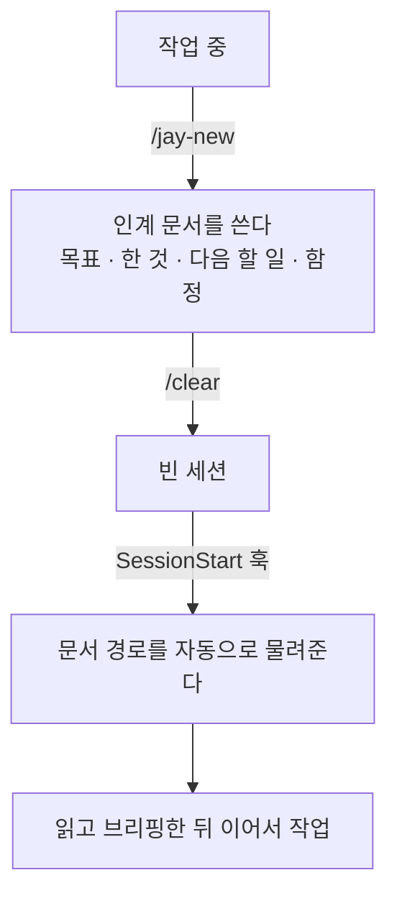

컨텍스트가 차오르면 결과가 나빠진다는 건 이제 새삼스러운 얘기가 아니다. 문제는 그다음에 뭘 하느냐다.

한동안은 `/compact`를 썼다. 대화를 요약해 자리를 만들어 주니 흐름이 안 끊긴다. 그런데 **압축한 뒤에 이어서 작업하면 아쉬운 결과가 자주 나왔다.** 요약은 결국 정보를 버리는 일이고, 하필 버릴 게 가장 많이 쌓인 시점에 돈다.

그래서 `/clear`로 바꿨다. 적어도 내 환경에서는 이쪽 결과물이 눈에 띄게 나았다. 애매하게 압축된 맥락을 안고 가는 것보다, 깨끗한 세션에 필요한 것만 다시 얹는 편이 나았다.

대신 `/clear`는 말 그대로 세션을 초기화한다. **그래서 인수인계 문서가 중요해졌다.** 지우기 전에 "지금까지 한 것, 다음에 할 것, 밟은 함정"을 정리해 달라고 요청하고, 새 세션에 붙여 넣을 프롬프트까지 받아 두는 식이었다.

이걸 매번 손으로 했다. 세션마다 같은 요청을 다시 쓰고, 받은 문서를 어딘가 두고, `/clear` 후에 그 경로를 다시 알려 줬다. **그 반복을 일부라도 자동화하려고 만든 것이 `jay-session`이다.** 추적 파일 12개에 파이썬 293줄짜리 작은 플러그인이고, 저장소는 [github.com/jaymunsh/jay-claude](https://github.com/jaymunsh/jay-claude)에 MIT로 공개해 뒀다.

## 요약에 맡기는 대신 지우기 전에 적기로 했다

동작은 단순하다.



`/jay-new`를 치면 지금까지의 작업을 문서로 남긴다. 그다음 `/clear`를 치면 훅이 새 세션에 그 문서의 경로를 자동으로 넘긴다. 압축을 기다리다 당하는 게 아니라, 내가 고른 시점에 내가 고른 내용을 넘긴다.

전에 손으로 하던 것과 비교하면 이렇다.

| | 전 | 후 |
| --- | --- | --- |
| 정리 요청 | 세션마다 같은 요청을 다시 씀 | `/jay-new` |
| 문서 보관 | 어딘가에 두고 기억 | `.claude/session/`에 규칙대로 |
| clear 후 이어받기 | 경로를 다시 알려 줌 | 훅이 자동으로 넘김 |

**없앤 건 판단이 아니라 반복이다.** 무엇을 남길지는 여전히 매번 다르고 그건 자동화 대상이 아니다. 매번 똑같이 치던 요청과 매번 똑같이 알려 주던 경로만 걷어냈다.

기능은 셋이다.

| 명령 | 하는 일 |
| --- | --- |
| `/jay-new` | 인계 문서 작성. 다음 세션이 이걸 받는다 |
| `/jay-init` | 개발일지 기록 켜기. 매 턴의 요청·결과·변경 파일을 쌓는다 |
| `/jay-brief` | 프로젝트 브리프 작성. 저장소를 처음 보는 쪽에 설명한다 |

개발일지는 인계와 별개로 겸사겸사 붙였다. 인계 문서가 "다음 세션이 이어받을 것"만 담는 데 반해, 이쪽은 **모든 요청을 그냥 다 쌓는다.** 나중에 회고하거나 "지난달에 그거 어떻게 고쳤더라"를 찾을 때 쓰려는 것이다. 성격이 달라서 기본은 꺼져 있고 `/jay-init`을 쳐야 켜진다.

## 스킬로 만들었다가 플러그인으로 다시 만들었다

처음엔 `~/.claude/skills/`에 스킬로 넣었다. 잘 돌았는데 남에게 주려니 막혔다.

**스킬은 훅을 실을 수 없다.** 자동 주입을 하려면 받는 사람이 자기 `settings.json`을 직접 손봐야 했다. 도구 하나 쓰자고 설정 파일을 편집하게 만드는 건 설치라고 부르기 어렵다.

플러그인으로 재구성하면서 훅을 플러그인 안에 넣었다. 지금은 설치해도 사용자의 `settings.json`을 건드리지 않는다.

```bash
claude plugin marketplace add jaymunsh/jay-claude
claude plugin install jay-session@jay-claude
```

## 스킬과 훅을 "잊힐 수 있는가"로 나눴다

플러그인 안에서도 어떤 걸 훅에 두고 어떤 걸 스킬에 둘지 정해야 했다. 기준을 이렇게 잡았다.

| | 어디에 | 왜 |
| --- | --- | --- |
| 판단이 필요한 일 | 스킬 | 인계 문서에 뭘 담을지, 검색 결과를 어떻게 요약할지 |
| 기계적인 일 | 훅 | 매 턴 기록, 문서 경로 주입 |

기준의 핵심은 **잊힐 수 있는가**다. "매 턴 기록해야지" 같은 지시는 세션이 길어지면 조용히 안 지켜진다. 지시가 아니라 훅으로 박아야 하는 대표적인 종류다.

반대로 "이 인계 문서에 무엇을 남길 가치가 있는가"는 기계가 못 정한다. 그건 스킬로 두고 판단에 맡겼다.

## 훅을 늘리지 않는 걸 기준으로 삼았다

이 도구는 매 세션, 매 턴 돈다. 그래서 처음부터 기준을 하나 잡았다. **가장 적은 것으로 가장 많이 얻는다.** 훅은 사용자가 부른 적 없는데 실행되는 코드이고, 늘어날수록 느려지는 것도 이상해지는 것도 사용자 탓이 아닌 자리에서 생긴다.

훅은 셋으로 끝냈다.

| 훅 | 언제 | 하는 일 |
| --- | --- | --- |
| `SessionStart` | 세션 시작 | 인계 문서 **경로**를 넘긴다 |
| `Stop` | 매 턴 종료 | 개발일지에 한 줄 쌓는다 (켠 경우만) |
| `PreCompact` | 압축 직전 | 대화 파일 **경로**를 남긴다 |

셋 다 하는 일이 짧다. 그리고 셋 중 둘은 결과물이 경로 한 줄이다.

넣을 수 있었지만 뺀 것들이 더 많다.

| 뺀 것 | 대신 | 왜 |
| --- | --- | --- |
| 문서 본문 주입 | 경로만 | 안 읽을 문서를 매번 들이마시고 버린다 |
| 압축 전 대화 사본 | 원본 경로 | 대화 파일은 디스크에 그대로 남는다 |
| 시간 컷오프 | 문서 나이 라벨 | 임의 상수는 조용한 실패를 만든다 |
| 날짜별 개발일지 분리 | 월별 | 파일이 커지는 것만 막으면 된다 |
| `CHANGELOG.md` | `git log` | 손으로 옮겨 적으면 둘이 어긋난다 |
| 테스트 프레임워크 | `--selftest` 하나 | 293줄에 붙일 만한 무게가 아니다 |
| 빌드 단계 | 없음 | `python3`만 있으면 돈다 |

외부 의존성은 하나도 없고, 설치해도 사용자의 `settings.json`을 건드리지 않는다. 개발일지도 기본은 꺼져 있다.

**기본값이 "아무것도 안 함"이 되도록 맞춘 것이다.** `/jay-init`을 쳐야 기록이 쌓이고 `/jay-new`를 쳐야 문서가 생긴다. 그래서 이 플러그인을 깔아만 두고 아무것도 안 치면, 세션에서 체감되는 변화가 없어야 한다. 뒤에 나오는 대로 그 기본 경로에서 실제로 몇 군데가 깨져 있었다.

## 훅이 문서 본문 대신 경로만 넘긴다

처음엔 `SessionStart` 훅이 인계 문서 전문을 새 세션에 밀어 넣었다. 바로 읽히니 확실해 보였다.

문제는 이 훅이 **이어서 할 때만 터지는 게 아니라는 것**이다. 전혀 무관한 작업을 하려고 `/clear`를 쳐도 똑같이 터진다. 그럴 때마다 안 읽을 문서를 수천 토큰어치 들이마신 뒤 버리게 된다.

경로만 넘기게 바꿨다. 실측으로 4,354자가 297자가 됐다.

이어서 할 거면 그 경로를 읽으면 되고, 아니면 무시하면 된다. **읽을지 말지를 판단하는 데 필요한 정보는 본문이 아니라 제목과 나이면 충분하다.**

## 시간 컷오프를 없앴다

한동안은 인계 문서가 30분보다 오래됐으면 주입하지 않았다. 오래된 문서로 엉뚱한 작업을 이어가는 걸 막으려는 것이었다.

써 보니 최악의 동작이었다. 30분을 넘기는 순간 **아무 말 없이 아무것도 안 한다.** 사용자 입장에서는 정책이 아니라 고장이다. 훅이 죽었는지, 플러그인이 안 붙었는지, 의도된 건지 구분할 방법이 없다.

지금은 컷오프 없이 문서의 나이를 라벨로 붙인다.

```
이전 세션의 인계 문서가 있습니다: .claude/session/handoff-20260807-1027.md (방금 작성)
```

"방금", "5시간 전", "31일 전"이 붙는다. 31일 전 문서라면 정말 이어서 하려는 게 맞는지 먼저 확인하라고 지시가 같이 나간다. **임의의 상수로 자르는 대신 판단 재료를 주는 쪽으로 바꾼 것이다.**

## clear와 compact의 문구를 갈랐다

같은 `SessionStart` 훅이 `/clear` 뒤에도 터지고 `/compact` 뒤에도 터진다. 처음엔 같은 문구를 썼는데 상황이 다르다.

- `clear` 뒤에는 아무것도 없다. 읽고 브리핑하고 시작해야 한다
- `compact` 뒤에는 압축 요약이 이미 있고 **작업이 진행 중이다.** 거기서 처음부터 브리핑하면 하던 일을 끊는다

그래서 `compact` 쪽에는 브리핑하지 말라는 지시가 들어간다.

이 갈래에서 테스트가 틀린 적이 있다. compact 문구에 "브리핑하지 마세요"가 들어가는데 검증을 `assert "브리핑" not in ...`으로 짰다. 실패하길래 봤더니 코드가 아니라 테스트가 틀렸다.

## PreCompact는 사본이 아니라 경로만 남긴다

자동 압축이 임박했을 때 대화를 통째로 복사해 둘까 했는데 필요 없었다.

**압축은 모델의 컨텍스트만 지운다. 대화 파일은 디스크에 그대로 남는다.** 사후에 필요한 건 복사본이 아니라 원본을 가리키는 주소다. 그래서 `PreCompact` 훅은 경로 한 줄만 남긴다.

## 개발일지를 날짜별이 아니라 월별로 쌓는다

`/jay-init`으로 켜면 매 턴의 요청·결과·변경 파일이 파일 하나에 쌓인다. "지난달에 그거 어떻게 고쳤더라"에 쓴다.

날짜별로 쪼갤 수도 있었는데 월별로 했다. 검색은 `devlog*.md`로 전체를 훑으니 몇 조각이든 상관없고, **한 파일이 무한정 커지는 것만 막으면 된다.** 월이 바뀔 때만 갈라지고 합쳐지는 일은 없다.

`Stop` 훅이 매 턴 실행되므로 어디까지 기록했는지 커서를 따로 둔다. 이게 없으면 매 턴 전체가 중복 기록된다.

## 버전을 안 올리면 고친 게 반영되지 않는다

이 프로젝트에서 가장 비싸게 배운 것이다. **두 세션을 여기에 썼다.**

코드를 고치고 push한 다음 이렇게 했다.

```bash
claude plugin marketplace update jay-claude
claude plugin update jay-session@jay-claude
```

그런데 고친 게 반영되지 않았다. `marketplace update`로 clone은 최신이 되는데, 설치본은 `cache/<이름>/<버전>/` 아래에 버전별로 들어간다. **매니페스트의 버전이 그대로면 새로 받을 게 없다고 판단한다.**

빠진 줄은 이거였다.

```bash
# jay-session/.claude-plugin/plugin.json 의 version 을 올린다
```

이게 빠지면 앞뒤 절차가 전부 무의미하다. 증상이 조용해서 더 나빴다. 에러가 없으니 "왜 안 고쳐지지"만 반복하게 된다.

비슷한 함정이 하나 더 있었다. **`/clear`는 플러그인을 다시 로드하지 않는다.** `plugin list`에는 enabled로 나오는데 스킬·명령·훅이 전부 미로드일 수 있다. 구분법은 세션의 스킬 목록에 `jay-session:*`이 있는지 보는 것이고, 해결은 `/reload-plugins`다. 한동안 재시작이 필요한 줄 알았다.

## 없는 게 정상인 경로에서 셸이 죽었다

문서에 적어둔 셸 명령들이 파일이 없을 때 죽는 문제가 있었다.

**zsh는 매치되지 않는 글롭에서 명령 자체를 실패시킨다.** `grep ... .claude/session/devlog*.md`는 파일이 없으면 `no matches found`로 죽고, `2>/dev/null`로도 안 막힌다. 글롭 확장이 명령 실행보다 먼저라서다.

글롭을 셸이 아니라 명령에 넘기는 걸로 바꿨다.

```bash
grep -r --include='devlog*.md' ...
```

그런데 이걸로도 안 끝났다. **`grep -r --include=`도 대상 디렉터리 자체가 없으면 경고를 내고 exit 2다.** 글롭 문제만 피하고 이걸 놓쳐서, 빈 프로젝트에서 명령이 에러를 하나 뱉고 시작했다. 두 문제는 별개고 둘 다 처리해야 한다.

`find`에서도 하나 밟았다. 숨김 항목을 빼려고 `-name '.*' -prune`을 썼는데, 이게 현재 디렉터리 `.`을 매치해서 전부 잘라낸다. 결과가 조용히 통째로 빈다. `-name '.?*'`이 맞다.

## 저장소 밖에서 한 사이클을 돌리고 나서야 기본 경로가 깨진 걸 알았다

마지막 세 커밋은 성격이 앞의 것들과 다르다. 기능 추가가 아니라 **이 저장소 밖에서 실제로 한 번 써 보고** 나온 수정이다.

그때까지의 검증은 전부 `.claude/session/`이 이미 있는 git 저장소 안에서만 했다. 개발하던 저장소가 그랬으니까. 그런데 이 플러그인의 기본값은 정반대다.

**개발일지는 `/jay-init`을 쳐야 쌓이고 인계 문서는 `/jay-new`를 쳐야 생긴다.** 즉 `.claude/session/`이 통째로 없는 프로젝트, git 저장소도 아닌 폴더가 처음 설치한 사람이 보는 화면이다. 그 경로를 아무도 안 밟아본 것이다.

훅 자체는 처음부터 그렇게 짜여 있었다. 깨진 건 문서에 적힌 셸 명령들이었다. 위의 zsh 글롭과 `find` 문제가 전부 여기서 나왔고, `.gitignore`를 묻는 절차가 git 저장소인지 확인도 없이 물어서 git이 아닌 폴더에 아무것도 읽지 않을 `.gitignore`를 만들 뻔한 것도 여기서 나왔다.

**`--selftest`로는 안 잡히는 종류였다.** 훅이 아니라 문서에 적힌 절차라서 실제로 빈 폴더에서 밟아봐야 나온다.

여기서 하나 더 배웠다. **문서가 "이렇게 하라"고 적어둔 셸 명령이 실제로 그렇게 동작하지 않을 수 있다.** 비-git 폴더의 구조를 뽑는 데 `ls -R`을 쓰면서 괄호에 "숨김·의존성 폴더 제외"라고 적어 뒀는데, `ls -R`에는 제외 기능 자체가 없다. 실측에서 `node_modules`를 통째로 뱉었다. 지금은 `find ... -prune`이다.

## 만들면서 규칙 몇 개를 정했다

기능과 직접 상관은 없지만 반복해서 도움이 된 것들이다.

**같은 내용을 두 곳에 쓰지 않는다.** `/jay-brief`의 전체 절차는 명령 파일에만 두고 스킬에는 결과물의 질을 좌우하는 규칙 몇 개만 뒀다. 복제하면 둘이 어긋날 자리가 생기고, 어긋나는 순간 어느 쪽이 맞는지 아무도 모른다. 같은 이유로 `CHANGELOG.md`도 두지 않는다. `git log`가 이미 그 역할을 하고, 손으로 옮겨 적는 순간 둘이 벌어지기 시작한다.

**날짜와 시각은 짐작하지 말고 `date`를 실행한다.** 01시 06분에 쓴 인계 문서에 `2115`가 박힌 적이 있다. 정렬이 파일명이 아니라 수정 시각 기준이라 훅은 멀쩡히 돌았고, 그래서 오래 안 잡혔다. 형식만 정해두고 값의 출처를 안 정하면 이렇게 된다.

**기능이 있는 것과 발견 가능한 것은 별개다.** `/jay-new`가 인자를 받는데 힌트를 안 달아서 아무도 몰랐다. 명령에 인자를 받으면 힌트를 반드시 같이 단다.

**한글이 섞인 줄에 ASCII 박스의 오른쪽 테두리를 두지 않는다.** 한글 폭이 ASCII의 정확히 2배가 아닌 폰트가 있어서 어떤 패딩으로도 안 맞는다. 왼쪽 테두리만 쓴다.

## 남은 한계

**판단의 이유는 자동으로 안 남는다.** 개발일지 자동 기록은 대화에서 요청·결과·파일만 기계적으로 뽑는 수준이다. "왜 그렇게 정했는가"는 사용자가 남겨 달라고 해야 들어간다. 결정 이력을 남기고 싶으면 의식적으로 해야 하고, 이건 이 도구가 없애려던 "잊힐 수 있는 일"에 그대로 해당한다. 아직 못 푼 부분이다.

**`/clear`는 자동화할 수 없다.** 슬래시 명령은 사용자 입력으로만 실행되고 훅도 세션을 지우지 못한다. 자동인 건 clear 이후의 주입뿐이라, 인계 문서를 쓰고 지우는 건 여전히 사람이 두 번 쳐야 한다.

**스킬은 슬래시 목록에서 숨길 수 없다.** 명령 셋과 나란히 스킬 항목이 보인다. 스킬 설정에 노출을 끄는 항목이 없어서 그렇다. 외울 건 명령 셋뿐이고 `/jay-`까지 치면 그 셋만 걸리니 실사용에 지장은 없지만, 목록이 깔끔하지는 않다.

**검증 수단이 `--selftest` 하나다.** 파이썬 293줄에 테스트 프레임워크를 붙이는 건 과하다고 봤는데, 위에서 적은 것처럼 정작 문제는 코드가 아니라 문서에 적힌 절차에서 나왔다. 그쪽은 지금도 사람이 빈 폴더에서 직접 밟아보는 것 말고는 방법이 없다.

## 만들고 나서

지금 이 글을 쓰는 세션도 인계 문서를 물려받아 시작했다. 아침에 다른 작업을 마치고 남긴 문서를 새 세션이 받아서, 그게 이미 끝난 일이라는 걸 확인하고 새 주제로 넘어갔다. 의도한 대로 동작한 것이다.

만들면서 가장 많이 고친 건 기능이 아니라 **조용히 실패하는 자리**였다. 30분 컷오프, 버전을 안 올렸을 때의 no-op, 매치 없는 글롭, 짐작으로 박은 타임스탬프. 넷 다 에러를 안 내고 그냥 아무 일도 안 일어난다는 공통점이 있다.

혼자 쓰는 도구였다면 넷 다 그냥 안고 갔을 것이다. 남에게 줄 수 있는 형태로 만들려니 "안 되는데 왜 안 되는지 알 수 없는" 상태가 제일 큰 비용이었다.

## 덧: 공식 문서는 compact와 clear를 이렇게 나눈다

내 경험만으로 쓰기엔 근거가 약해서, 만들고 나서 공식 문서를 찾아봤다. 정리해 둔다.

### 전제부터가 "컨텍스트는 채우면 나빠진다"이다

Claude Code 모범 사례 문서는 대부분의 권장 사항이 **제약 하나**에서 나온다고 적어 두었다. 컨텍스트 창은 빨리 차고, 차오를수록 성능이 떨어진다는 것이다. 창이 꽉 차 가면 앞서 준 지시를 잊거나 실수가 늘어난다고 명시한다.

즉 "컨텍스트가 차면 결과가 나빠진다"는 체감이 아니라 문서에 적힌 전제다.

### 둘은 원래 다른 상황을 위한 도구다

| | `/compact` | `/clear` |
| --- | --- | --- |
| 언제 | 같은 작업을 **이어서** 할 때 | **다른 작업**을 시작할 때 |
| 누가 정리하나 | 모델이 요약한다 | 사람이 적는다 |
| 성격 | 손실이 있지만 내가 쓸 게 없다 | 손이 가지만 남는 게 내가 고른 것이다 |
| 되돌리기 | 요약이 남는다 | **되돌릴 수 없다** |

`/compact`는 지시를 붙여 방향을 줄 수 있다. `/compact Focus on the API changes` 처럼 쓰면 무엇을 남길지 직접 정할 수 있다.

### 자동 압축의 약점도 문서에 적혀 있다

가장 인상적이었던 것은 자동 압축이 **모델이 가장 덜 똑똑한 시점에 일어난다**는 지적이다. 컨텍스트가 한계까지 찬 상태에서 요약을 시키기 때문이다.

또 하나는 **모델이 작업의 진행 방향을 예측할 수 없다**는 것이다. 문서의 예시가 정확하다. 긴 디버깅 세션 끝에 자동 압축이 돌아 조사 과정을 요약했는데, 다음 요청이 "아까 본 다른 경고를 고쳐 줘"라면, 세션이 디버깅에 쏠려 있었으므로 그 경고는 요약에서 빠져 있을 수 있다.

내가 `/compact` 뒤에 아쉬운 결과를 자주 만난 게 이 두 가지와 맞물린다.

### 공식 권장도 생각보다 `/clear` 쪽으로 기운다

문서는 무관한 작업 사이에 `/clear`를 **자주** 쓰라고 권한다. 그리고 흔한 실패 패턴 두 개를 이렇게 정리한다.

- **한 세션에 이것저것 섞기** — 다른 걸 물었다가 원래 작업으로 돌아오면 컨텍스트가 무관한 정보로 찬다
- **같은 걸 계속 고치기** — 실패한 접근으로 컨텍스트가 오염된다

두 번째의 처방이 특히 분명하다. **두 번 고쳐도 안 되면 `/clear` 하고, 배운 것을 담아 더 나은 프롬프트로 새로 시작하라**는 것이다. 깨끗한 세션에 좋은 프롬프트가, 수정이 쌓인 긴 세션보다 거의 항상 낫다고 적혀 있다.

### 내가 하는 건 문서의 두 갈래 사이에 있다

문서의 구분대로면 `/clear`는 **다른** 작업을 시작할 때 쓰는 것이다. 그런데 나는 **같은** 작업을 이어서 할 때도 `/clear`를 친다. 모델의 요약을 받는 대신 내가 적은 문서를 넘긴다.

**즉 `/compact`가 하는 일을 사람이 대신하는 셈이다.** 문서가 `/clear` 쪽에 붙여 둔 "사람이 적는다"를 이어서 하는 작업에까지 끌어온 것이고, `jay-session`은 그중 반복되는 부분만 걷어낸 것이다.

이게 모두에게 맞는 방식이라고는 생각하지 않는다. 매번 문서를 쓰는 비용이 있고, 문서에 안 적은 건 진짜로 사라진다. 다만 내 작업에서는 그 비용이 애매하게 압축된 맥락을 안고 가는 것보다 쌌다.

### 안 써 본 선택지도 있다

이번에 찾아보며 알게 된 것들이다. 순서대로 더 가벼운 방법이다.

| 방법 | 무엇 |
| --- | --- |
| `/compact <지시>` | 무엇을 남길지 지정해서 압축 |
| CLAUDE.md에 압축 지침 | "압축할 때 수정한 파일 목록과 테스트 명령은 반드시 남겨라" 같은 규칙을 고정 |
| `/rewind`의 부분 요약 | 특정 지점부터 또는 지점까지만 골라서 요약 |
| 서브에이전트 | 조사를 별도 컨텍스트에서 시켜 본 세션을 안 더럽힌다 |

특히 CLAUDE.md에 압축 지침을 박는 건 `/compact`의 손실을 줄이는 방향이라 내 방식과 목적이 겹친다. 진작 알았으면 이 플러그인을 만들기 전에 먼저 시도해 봤을 것 같다.

출처: [Best practices for Claude Code](https://code.claude.com/docs/en/best-practices) · [Using Claude Code: session management and 1M context](https://claude.com/blog/using-claude-code-session-management-and-1m-context)
