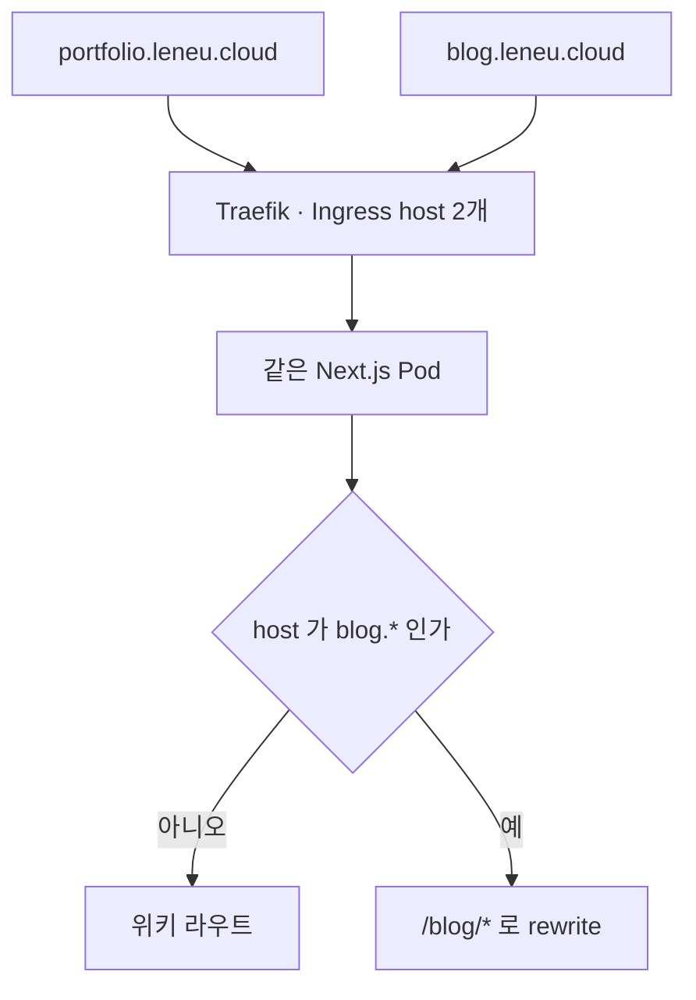

jay-wiki에는 LAB이라는 탭이 있었다. 개인 프로젝트, 팀 프로젝트, 기술 실험, 도구 워크플로 네 갈래에
글 8편이 들어 있었다. 위키의 나머지 글은 전부 그 사이트 자체를 만들고 운영한 기록인데, LAB의 8편만
성격이 달랐다. 이 사이트 밖에서 만든 것들이고, k3s도 Kafka도 나오지 않는 이야기다.

같은 탐색 구조 안에 두니 계속 걸렸다. 위키 검색에 섞이고, 탭 정렬 규칙을 공유하고, 관리자 화면에서도
같은 목록에 나왔다. 읽는 쪽에서도 인프라 운영 기록을 따라가다 갑자기 캘린더 앱 회고를 만난다.
그래서 8편을 떼어내 `blog.leneu.cloud`로 옮겼다. 지금 이 글도 그 블로그에 올라간다.

이 글의 수치는 2026-08-04 기준이다. 저장소 문서에서 가져왔고 이후 바뀔 수 있다.

탐색 구조도 위키를 따라가지 않았다. 위키는 BUILD·OPERATE·IMPROVE 같은 축과 탭으로 나뉘는데,
블로그는 카테고리와 태그, 인기 글이라는 흔한 블로그 구성으로 갔다. 글의 성격이 다르니
찾아 들어가는 방법도 달라야 했다.

## 사이트는 나누되 앱은 하나로 뒀다

두 사이트를 만든다고 해서 배포 단위까지 둘로 나눌 이유는 없었다. Pod를 하나 더 띄우고 이미지를 하나 더
빌드하면 배포와 관측과 인증서까지 전부 두 벌이 된다. 글 8편을 옮기려고 치를 비용은 아니다.

그래서 Next.js 앱 하나를 그대로 두고 host로만 갈랐다. 요청의 host가 `blog.`로 시작하면
middleware가 `/blog/*` 라우트로 rewrite한다.

인프라에서 한 일은 두 줄뿐이다. Traefik Ingress에 host를 하나 더 적고, Cloudflare Tunnel의
ingress 규칙에 같은 서비스를 가리키는 hostname을 하나 더 적었다. 새 Pod도 새 이미지도 없다.

host를 `blog.leneu.cloud` 하나로 고정하지 않고 `blog.` 접두사로 판정한 것은 로컬 때문이다.
로컬에는 그 이름이 없어서 고정하면 rewrite를 확인할 방법이 사라진다. 접두사로 보면
`blog.localhost:3000`으로 바로 열어 볼 수 있다.

rewrite에서 정적 파일을 빼는 부분은 한 번 크게 틀렸다. `public/` 아래 파일이 전부 rewrite되면서
본문 이미지가 `/blog/assets/...`로 옮겨져 전부 404가 됐다. 그렇다고 확장자로 일괄 제외하면 안 된다.
`/robots.txt`와 `/sitemap.xml`은 블로그 전용 라우트라 오히려 rewrite되어야 하기 때문이다.
통과시킬 경로를 목록으로 명시하고 테스트로 고정했다.

## 콘텐츠 수명주기를 위키와 정반대로 잡았다

위키는 시드 스크립트가 있고 revision을 쌓는다. 파일이 정본이고 DB는 그것을 펼쳐 놓은 것에 가깝다.
블로그는 반대로 갔다.

| | 위키 | 블로그 |
|---|---|---|
| 정본 | 시드 스크립트의 파일 | PostgreSQL |
| 이력 | revision 테이블에 쌓는다 | 두지 않는다 |
| 글 쓰는 곳 | 시드 파일 또는 관리자 화면 | 관리자 화면만 |
| 안전망 | 시드 재실행 | 전체 pg_dump 백업 |

시드를 두지 않은 이유는 단순하다. 시드는 파일이 정본이라 화면에서 고친 글을 다음 실행에서 되돌린다.
글을 화면에서 쓰기로 한 이상 파일을 정본으로 남겨 둘 수 없었다. 백업은 기존 pg_dump가 그대로 덮는다.
테이블 필터가 없어서 새 테이블이 자동으로 포함된다.

같은 이유로 처음에는 로컬에서 쓴 글을 운영으로 옮기는 경로를 두지 않았다. 나중에 초안 파일을
관리 API 로 올리는 스크립트를 따로 만들었는데, 정본이 DB 라는 원칙은 그대로다 — 같은 slug 를
다시 올리면 화면에서 고친 내용이 덮인다. 관리자 화면에서 올린 이미지는
MinIO에 들어가고 본문은 자산 id만 참조하는데, 로컬 MinIO와 운영 MinIO는 별개라 행만 복사하면
본문 이미지가 전부 깨진다. 글 주소가 `/<id>/<slug>`라 id도 어긋난다. ~~실제로 운영은 1부터 8이고
로컬은 3부터 10이다.~~ (**2026-08-15**: 운영은 이제 1부터 17이다. id 가 어긋난다는 사실 자체는 그대로다.) 로컬은 화면을 고칠 때 쓰고, 글은 운영 관리자 화면에서 쓴다.

이관 자체는 SQL로 했다. 같은 PostgreSQL 안의 테이블 간 복사라 쓰기 API를 거칠 이유가 없었다.
글 8편, 태그 54개, 연결 64건을 옮겼고 카테고리는 개인 3편, 팀 2편, 기술 1편, 도구 2편으로 나뉘었다.

옮긴 뒤 위키 원본을 지우는 단계에서 하나 배웠다. **SQL로 지우면 OpenSearch 색인이 따라오지 않는다.**
애플리케이션 이벤트가 돌지 않기 때문이다. PostgreSQL만 지우면 위키 검색에 유령 문서가 남아서,
누르면 블로그로 308되지만 검색 결과에는 옛 위키 본문이 그대로 보인다. 색인 문서까지 함께 지우는
스크립트로 정리했고 색인은 49개에서 41개가 됐다.

## 댓글과 통계에서 원본 IP를 저장하지 않기로 했다

블로그에는 로그인이 없다. 그러면 댓글 작성자를 무엇으로 구분하고, 방문자 수는 무엇으로 세는가.
가장 쉬운 답은 IP를 저장하는 것이고, 그건 하지 않기로 했다.

| 필요한 것 | 흔한 방법 | 이 블로그가 저장하는 것 |
|---|---|---|
| 댓글 작성자 표시 | IP 원본 | 앞 2옥텟만(`ip_prefix`) |
| 도배 차단 | IP 원본 비교 | salt를 섞은 SHA-256 해시(`ip_hash`) |
| 방문자 중복 제거 | IP를 하루 이상 보관 | `hash(salt + 날짜 + IP)`를 Redis에 하루치만 |
| 유입 경로 | referer 원본 URL | 받는 즉시 호스트 이름으로 줄이고 원본 URL 은 버린다 |

방문자 중복 제거에 날짜를 섞은 것이 이 설계의 핵심이다. 날짜가 해시 입력에 들어가 있으면
같은 사람이 다음 날 다시 와도 어제 값과 대조할 수가 없다. 하루 안의 중복만 지우고 그 이상은
추적하지 않겠다는 것을 저장 구조 자체로 못 박은 셈이다.

**이 설계 전체가 salt 한 문자열의 비밀성에 달려 있다.** salt가 새면 `ip_hash`는 되돌릴 수 있는
원본 IP를 영구 저장하는 것과 같아진다. 그런데 최종 리뷰 전까지 그 salt가 운영 설정 어디에도 없었다.
그대로 배포했으면 공개 저장소에 적힌 개발용 기본값으로 해싱될 뻔했다. 지금은 JWT secret과 똑같이
운영에서 값이 없으면 백엔드가 기동에 실패한다. 조용히 기본값으로 떨어지는 것보다 안 뜨는 편이 낫다.

같은 리뷰에서 익명 댓글에 rate limit이 아예 걸려 있지 않다는 것도 드러났다. 제한 로직은 넓혀 뒀는데
인터셉터가 게시판 경로에만 등록돼 있어서 넓힌 분기가 죽은 코드였다. 둘 다 개별 태스크 리뷰로는
안 잡혔고 전체 리뷰에서 나왔다. 각 태스크는 자기 브리프 안에서만 검증되니, 브리프가 틀린 지점은
전체를 놓고 봐야 보인다.

## 테이블은 여덟 개고, 절반이 통계다

블로그가 쓰는 테이블 전부다. 위키와 한 데이터베이스를 쓰되 접두어로만 갈랐다.

~~~mermaid
erDiagram
    tb_blog_category ||--o{ tb_blog_post : "분류한다"
    tb_blog_category ||--o{ tb_blog_category : "2단까지"
    tb_blog_post ||--o{ tb_blog_post_tag : ""
    tb_blog_tag ||--o{ tb_blog_post_tag : ""
    tb_blog_post ||--o{ tb_blog_comment : ""

    tb_blog_post {
        bigint id PK
        text slug UK
        bigint category_id FK
        text title
        text summary
        text body "raw markdown"
        text cover_asset_id "없으면 본문 첫 이미지"
        text status "draft / published"
        timestamptz published_at
        bigint view_count
    }
    tb_blog_comment {
        bigint id PK
        bigint post_id FK
        text author_name
        text password_hash "본인 삭제용"
        text ip_prefix "앞 두 옥텟만"
        text ip_hash "salt+날짜+IP"
        timestamptz deleted_at "지워도 행은 남는다"
    }
    tb_blog_post_tag {
        bigint post_id PK
        bigint tag_id PK
    }
~~~

**본문을 `text` 한 칸에 raw markdown 그대로 둔다.** 렌더는 화면이 한다. 위키처럼
개정 이력을 쌓지 않기로 했으니 본문을 쪼갤 이유가 없었다.

댓글 행은 지워도 **사라지지 않는다.** `deleted_at` 만 찍힌다. 지운 댓글 자리에 답글이
달려 있으면 대화가 통째로 무너져서다. 대신 `password_hash` 는 본인 삭제에만 쓰고
계정으로 이어지지 않는다.

나머지 셋은 날짜별 집계다. 개별 방문자를 식별하는 값이 하나도 없다.

| 테이블 | 키 | 담는 것 |
|---|---|---|
| `tb_blog_daily_stat` | `stat_date` | 조회수·방문자수와 유입 세 갈래 |
| `tb_blog_device_daily` | `stat_date` + `device` | pc / mobile |
| `tb_blog_referrer_daily` | `stat_date` + `source` | `google`·`naver`·`sns:x` 같은 호스트 이름 |

집계 테이블에 **id 컬럼이 없다.** 기본키가 날짜와 갈래의 조합(`stat_date`+`device`,
`stat_date`+`source`)이라 같은 날 같은 갈래가 두 행이 될 수 없다. 행을 세는 것이 아니라
칸을 올리는 구조다. 연결 테이블도 같은 이유로 `(post_id, tag_id)` 가 통째로 기본키다.

**그런데 `slug` 에 유니크 제약이 없었다.** 이 글을 쓰면서 확인하고 알았다. 인덱스가
`id`, `(status, published_at)`, `(category_id, published_at)` 셋뿐이었다. 주소가
`/{id}/{slug}` 라 id 가 정본이고 slug 는 읽기용이라 화면은 안 깨진다. 그런데 발행
스크립트가 slug 로 기존 글을 찾으므로, 같은 slug 가 둘이 되면 어느 쪽을 덮을지가
목록 순서에 달린다. 그 자리에서 유니크 인덱스를 넣었다.

## 응답 코드가 200이어도 화면은 깨져 있었다

이 작업에서 가장 많이 배운 부분이다. 아래는 전부 HTTP 응답만 보면 정상이었다.

| 증상 | 원인 |
|---|---|
| 본문 이미지가 전부 안 나온다 | `public/` 정적 파일까지 rewrite됐다 |
| 제목이 화면에 두 번 나온다 | 이관한 본문이 `# 제목`으로 시작한다 |
| 모바일에서 드로어가 상단바를 덮는다 | 상단바는 `sticky`, 드로어는 `fixed`라 기준이 어긋났다 |
| `robots.txt`가 404 | Next의 robots 규약은 app 루트에서만 동작한다 |
| mermaid 다이어그램이 코드 블록 그대로 남는다 | 위키에만 렌더러가 있었고 블로그 글 화면에는 없었다 |
| 통계가 전부 direct·pc, 방문자 수는 1 고정 | 글 조회가 서버 대 서버 fetch라 방문자 헤더가 백엔드까지 안 갔다 |

마지막 것이 가장 오래 안 보였다. API는 200을 주고 테이블에도 행이 쌓이고 있었다. 실패가 아니라
**한쪽으로 쏠린 성공**이라 응답 코드로는 잡히지 않는다. 대시보드에 숫자로 그려 놓고서야
이상하다는 것을 알았다.

mermaid는 이관한 8편 중 6편이 쓰고 있었고 다이어그램이 12개였다. 위키는 셸 컴포넌트가 렌더러를
들고 있었는데 블로그 글 화면에는 그게 없었다. mermaid가 브라우저에서 노드를 찾아야 해서
본문 조각만 클라이언트 컴포넌트로 떼어냈다.

글을 쓰다가 발견한 것도 있다. 한국어에서 물결표는 범위 표기인데 GitHub Flavored Markdown은
물결표 하나짜리도 취소선으로 읽는다. 한 문단에 물결표가 둘이면 그 사이가 통째로 취소선이 되고,
취소선 태그가 sanitize 허용 목록에 없어서 **물결표와 그 사이 글자가 함께 사라졌다.**
발행된 글이 범위 표기를 잘못 내보내고 있었다. 취소선은 물결표 두 개로만 인정하도록 고치고
회귀 테스트를 붙였다.

## 남은 한계

- **웹 화면은 자동 테스트가 잡지 못한다.** 테스트 러너가 node 환경이라 DOM이 없다.
  순수 함수만 테스트로 고정돼 있고 화면은 눈으로 봐야 한다. 위의 표에 있는 것들이
  전부 브라우저에서만 잡혔다는 게 그 증거다.
- ~~**목록이 커지면 느려질 자리가 두 곳 있다.** 태그별 조회와 위키의 블로그 fallback이
  전체 목록을 읽어 메모리에서 거른다. 지금은 8편이라 무해하다.~~

  **2026-08-09 해결.** 태그 조회를 조인 질의 한 번으로 바꿨다. 전에는 전체 글을 읽고
  `ids.contains(...)` 로 걸렀는데, `ids` 가 List 라 글마다 선형 탐색이 돌아
  글 수 × 태그 글 수만큼 비교했다. 위키 fallback 은 그대로 뒀다 — 위키 slug 가 404 일
  때만 도는 길이라 값이 다르다. 그쪽 조건은 코드 주석에 "수백 편" 으로 적혀 있다.

  

  
어디가 느려지는 자리였나

  태그 페이지가 부르는 엔드포인트는 "이 태그가 붙은 발행 글 목록" 하나를 돌려준다.
  전에는 이렇게 처리했다.

  ~~~java
  List<Long> ids = tagService.postIdsOf(name);
  return postService.published().stream()
          .filter(p -> ids.contains(p.id()))
          .toList();
  ~~~

  값이 나가는 자리가 두 군데다.

  - `published()` 는 **발행된 글을 전부** 읽어 요약 DTO 로 바꾼다. 태그가 무엇이든
    전체 행을 읽는다. 글 수를 `n` 이라 하면 매 요청마다 `n` 행이다.
  - `ids` 는 `List<Long>` 이라 `contains` 가 **선형 탐색**이다. 글 하나를 거를 때마다
    최대 `m` 번 비교한다. 전체로는 `n × m` 이 된다.

  둘을 합치면 시간 복잡도가 `O(n × m)` 이다. 글이 10배가 되고 태그당 글도 10배가 되면
  비교 횟수는 100배가 된다. 게다가 앞의 전체 조회는 결과에 한 편도 안 들어갈 글까지
  DTO 로 변환한다.

  지금은 조인 질의 하나로 바꿨다.

  ~~~java
  @Query("""
      select p from BlogPost p
      where p.status = 'published'
        and exists (
          select 1 from BlogPostTag pt, BlogTag t
          where pt.postId = p.id and pt.tagId = t.id and t.name = :name
        )
      order by p.publishedAt desc, p.id desc
      """)
  List<BlogPost> findPublishedByTagName(@Param("name") String name);
  ~~~

  DB 가 결과에 들어갈 행만 돌려주므로 애플리케이션은 필터링을 하지 않는다.
  `tb_blog_post_tag` 의 기본키가 `(post_id, tag_id)` 라 상관 서브쿼리의 `pt.postId = p.id`
  조회가 인덱스를 탄다. `tb_blog_tag.name` 에도 유니크 제약이 있어 태그 한 건을 바로 찾는다.

  **다만 지금 규모에서는 두 방식의 차이가 측정되지 않는다.** 글 15편에 태그당 몇 편이면
  옛 방식도 비교가 100번을 넘지 않는다. 그래서 "느려서 고쳤다" 가 아니라 "질의 하나
  바꾸는 값이 미뤄 두는 값보다 싸서 고쳤다" 가 맞다.

  같은 구조인 위키 fallback 은 그대로 뒀다. 위키 slug 가 404 일 때만 도는 경로라
  호출 빈도 자체가 다르고, 고치려면 slug 조회 API 를 새로 여는 일이 된다.

  

- ~~**`slug` 에 유니크 제약이 없다.**~~

  **2026-08-09 해결.** 유니크 인덱스를 넣었다. 화면은 `/{id}/{slug}` 라 id 로 찾으니
  안 깨지지만, 발행 스크립트가 slug 로 기존 글을 찾아서 같은 slug 가 둘이 되면 어느
  쪽을 덮을지가 목록 순서에 달렸다.

- **조회 기록이 GET 경로에서 동기로 돈다.** Redis에 문제가 생기면 글 조회가 그대로 500이 된다.
- **예약 발행이 없다.** 발행 시각을 미래로 넣어도 공개 목록에 바로 뜬다.
- **통계 테이블 두 개가 같은 것을 두 번 센다.** 유입 경로를 옛 컬럼과 새 테이블이 각각 세고 있다.
  새 테이블이 충분히 쌓이면 옛 컬럼을 지울 수 있다.
- **목록 썸네일에 쓸 데이터가 없었다.** 이관한 8편에 대표 이미지가 하나도 없었다.
  본문 첫 이미지를 대신 쓰는 길을 나중에 열어 지금은 목록에 그림이 뜬다.

위키를 나눈 것이 기능을 늘린 일은 아니다. 글 8편이 옮겨 갔을 뿐이고 화면도 크게 다르지 않다.
그래도 나눠 놓고 나니 두 사이트에 각각 무엇을 쓸지가 분명해졌다. 위키에는 이 사이트를 만들고
운영하면서 확인한 것을 쓰고, 블로그에는 그 밖에서 만든 것과 그때의 판단을 쓴다.
같은 앱 위에 올라가 있지만 쓰는 기준은 다르다.
