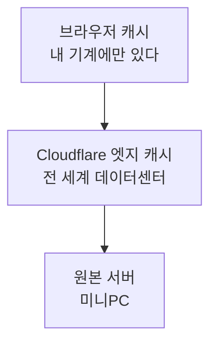

블로그 글에 실린 캡처 두 장을 다시 찍어서 갈아 끼웠다. 커밋하고 배포까지 끝냈는데
화면은 옛 사진 그대로였다. 배포가 안 됐나 싶어 로그를 봤지만 성공이었다.

```
$ curl -sI https://blog.leneu.cloud/assets/.../lobby.png
content-length: 866375        ← 새 파일이 맞다
```

서버는 새 파일을 주고 있었다. 그러니까 문제는 서버가 아니라 **그 사이 어딘가**였다.
캐시를 어디서 어떻게 지우는지 제대로 몰라서, 이참에 찾아봤다.

## 캐시가 세 겹인데 한 겹만 보고 있었다

정적 파일 하나가 화면에 뜨기까지 캐시가 세 번 끼어든다. 이걸 구분하지 않으면
"캐시 지웠는데 왜 안 바뀌지"를 반복하게 된다.



| 층 | 누가 지우나 | 내가 원격으로 지울 수 있나 |
|---|---|---|
| 브라우저 | 방문자 각자 | **못 한다** |
| Cloudflare 엣지 | 퍼지 API·대시보드 | 할 수 있다 |
| 원본 | 배포 | 할 수 있다 |

**퍼지는 가운데 한 겹만 지운다.** 방문자 브라우저에 이미 내려간 파일은 손댈 방법이 없다.
내 경우가 정확히 이거였다 — 엣지는 이미 새 파일을 주고 있었고, 내 브라우저만 옛것을 들고 있었다.

## `cf-cache-status` 가 어느 겹인지 알려 준다

응답 헤더 한 줄이면 엣지가 무엇을 했는지 나온다. 이걸 먼저 보면 헛다리를 안 짚는다.

```
$ curl -sI https://blog.leneu.cloud/assets/.../lobby.png | grep -i cf-cache
cf-cache-status: REVALIDATED
```

내가 이번에 실제로 본 값은 셋이었다.

| 값 | 뜻 | 이때 할 일 |
|---|---|---|
| `DYNAMIC` | 엣지가 아예 캐시하지 않는 대상 | 엣지 퍼지는 의미 없다 |
| `EXPIRED` | 캐시가 만료돼 원본에서 새로 받아 옴 | 이미 새것이다 |
| `REVALIDATED` | 원본에 물어보니 그대로라 캐시를 재사용 | 이미 새것이다 |

`DYNAMIC` 인데 화면이 옛것이면 **엣지 문제가 아니다.** 이걸 모르고 퍼지만 반복하면
원인은 그대로 남는다. 실제로 나는 이 값을 보고 "캐시가 아니다"라고 판단했는데,
그건 HTML 응답의 헤더였고 정작 문제였던 이미지는 다른 상태였다. 값을 볼 대상을 잘못 골랐다.

## 무엇이 캐시되는지는 **확장자**가 정한다

여기가 가장 의외였다. Cloudflare 는 기본 설정에서 **URL 확장자를 보고** 캐시 여부를 정한다.
응답의 Content-Type 이 아니다.

- 캐시함: `.css` `.js` `.png` `.jpg` `.gif` `.svg` `.woff2` `.mp3` `.mp4` `.pdf` `.ico` 등
- 캐시 안 함: HTML, JSON, **확장자가 없는 경로** → `DYNAMIC`

이 규칙 때문에 실제로 한 번 크게 걸렸다. 게임 서버가 없는 경로를 전부 SPA 진입점으로
보내도록 짜여 있었는데, 아직 올리지 않은 `theme.mp3` 를 누가 요청했다. 서버는 규칙대로
**HTML 을 200 으로** 돌려줬고, Cloudflare 는 `.mp3` 니까 그걸 그 주소의 정답으로 알고 캐시했다.

나중에 진짜 mp3 파일을 올렸는데도 계속 HTML 이 나갔다. 파일이 없어서가 아니라
**"없다"는 답이 아니라 "이거다"라는 답을 캐시해 버려서**다.

고친 방법은 퍼지가 아니라 서버 쪽이었다. 확장자가 있는데 파일이 없으면 SPA 로 보내지 않고
404 를 준다.

```ts
// 확장자가 있는데 파일이 없으면 404다. 여기서 index.html 을 200 으로 돌려주면
// CDN 이 그 HTML 을 그 주소의 정답으로 캐시한다.
if (/\.[a-z0-9]+$/i.test(url.pathname))
  return new Response("not found", { status: 404 });
```

**캐시는 잘못된 성공 응답을 오래 기억한다.** 실패를 실패로 답하지 않으면 그 대가를 나중에 치른다.

## 원본이 `max-age=0` 을 주는데 브라우저엔 4시간이 온다

이번 사진 건의 진짜 범인은 이거였다. 같은 파일인데 원본과 엣지의 헤더가 다르다.

```
원본  Cache-Control: public, max-age=0
운영  cache-control: public, max-age=14400
```

14400초는 4시간이다. **Cloudflare 의 Browser Cache TTL 기본값이 4시간**이고, 이게 원본
헤더를 덮어쓴다. 원본은 "매번 확인해라" 라고 말했는데 방문자는 "4시간 동안 묻지 마라" 를 받는다.

이걸 원본 뜻대로 돌리려면 설정에서 **Respect Existing Headers** 로 바꾸면 된다. 그러면
Cloudflare 가 `Cache-Control` 을 건드리지 않는다.

여기서 중요한 게 하나 더 있다. **엣지 퍼지를 아무리 돌려도 이 4시간은 안 줄어든다.**
이미 방문자 기계에 내려간 헤더라서다. 퍼지는 엣지의 사본을 지울 뿐이다.

## 퍼지 방법은 다섯 가지고, 이제 전부 무료 플랜에서도 된다

찾아보니 2025년 4월에 바뀌었다. 예전에는 태그·접두어 퍼지가 상위 플랜 전용이었는데
지금은 **URL·호스트명·태그·접두어·전체**를 모든 플랜에서 쓸 수 있다.

전부 같은 엔드포인트에 본문만 바꿔 보낸다.

```bash
POST https://api.cloudflare.com/client/v4/zones/{zone_id}/purge_cache
Authorization: Bearer $CLOUDFLARE_API_TOKEN
```

| 방식 | 본문 |
|---|---|
| 전체 | `{"purge_everything": true}` |
| URL | `{"files": ["https://example.com/a.png"]}` |
| 태그 | `{"tags": ["blog-images"]}` |
| 호스트명 | `{"hosts": ["blog.example.com"]}` |
| 접두어 | `{"prefixes": ["example.com/assets/"]}` |

한 번에 보낼 수 있는 개수는 요청당 **100건**이다(Enterprise 500).

속도 제한은 방식에 따라 크게 갈린다. URL 퍼지가 훨씬 후하다.

| 플랜 | 호스트·태그·접두어·전체 | URL 퍼지 |
|---|---|---|
| Free | 분당 5회 | 초당 800 URL |
| Pro | 초당 5회 | 초당 1,500 URL |
| Business | 초당 10회 | 초당 1,500 URL |
| Enterprise | 초당 50회 | 초당 3,000 URL |

무료 플랜에서 전체 퍼지가 **분당 5회**라는 게 눈에 띈다. 배포마다 전체 퍼지를 거는 습관을
들이면 배포가 잦아졌을 때 걸린다. 게다가 전체 퍼지는 모든 자산을 원본에서 다시 받게 만들어,
집에 있는 미니PC 한 대에는 그 자체가 부하다.

주의할 점도 있다. Cache Rules 로 커스텀 캐시 키(헤더·쿠키 포함)를 쓰고 있으면
**대시보드의 URL 퍼지는 안 먹는다.** 대시보드가 그 값을 못 보내기 때문이고, API 로
같은 헤더를 실어 보내야 한다. 와일드카드도 안 된다.

## Development Mode 는 퍼지가 아니다

찾다 보니 헷갈리기 쉬운 게 하나 있었다. Development Mode 는 **3시간 동안 엣지 캐시를
우회**하는 스위치다. 캐시를 **지우지 않는다.**

- 내가 작업 중일 때 내 화면에 즉시 반영하려면 → 쓸모 있다
- 방문자가 옛것을 보고 있을 때 → **소용없다.** 퍼지하거나 TTL 을 고쳐야 한다
- 3시간이 지나면 자동으로 꺼진다. 더 오래 필요하면 Cache Rules 의 bypass 를 쓴다

## 결론: 내 경우엔 퍼지가 답이 아니었다

찾아보고 나서 내린 판단은 좀 허무하다. **퍼지를 붙일 필요가 없었다.**

이유는 파일명에 있다. Vite 도 Next 도 빌드하면 내용 해시를 파일명에 박는다.

```
index-moIOHiOK.js     ← 내용이 바뀌면 이름이 바뀐다
```

이름이 바뀌면 브라우저에도 엣지에도 그 주소의 사본이 애초에 없다. **캐시를 지울 일이
생기지 않는다.** 그래서 오늘 배포에서 JS 와 CSS 는 아무 문제가 없었다.

문제가 난 건 내가 손으로 넣은 파일들이다.

| 자산 | 이름 | 결과 |
|---|---|---|
| 빌드 산출물 | `index-moIOHiOK.js` | 문제 없음 |
| 블로그 캡처 | `lobby.png` | **4시간 동안 옛것** |

정리하면 선택지는 셋인데, 값이 다르다.

| 선택지 | 값 | 비용 |
|---|---|---|
| 배포마다 전체 퍼지 | 확실하다 | 무료 분당 5회 제한, 원본 부하, 브라우저 캐시는 그대로 |
| 바뀐 URL 만 퍼지 | 정확하다 | 배포에서 바뀐 파일 목록을 뽑는 일이 는다 |
| **파일명에 판을 넣는다** | 캐시를 지울 일이 없다 | 글 본문의 경로도 같이 고쳐야 한다 |

세 번째를 택하기로 했다. 캡처를 가는 일이 잦지 않고, 잦지 않다는 게 바로 자동화를
안 붙일 이유다. `lobby.png` 를 `lobby-2.png` 로 두면 그 판은 영원히 안 바뀌고
새 판은 새 주소를 갖는다. 퍼지도, 토큰도, 스크립트도 필요 없다.

**다시 볼 조건**도 적어 둔다. 캡처 교체가 한 달에 몇 번씩 생기거나, 본문 경로를 손으로
고치다 틀리기 시작하면 그때 URL 퍼지를 배포에 붙인다. 그전에는 안 만든다.

## 남은 한계

- **Browser Cache TTL 을 아직 안 바꿨다.** `Respect Existing Headers` 로 두는 게 맞아
  보이는데, 그러면 원본이 `max-age=0` 을 주는 자산들이 매번 조건부 요청을 보내게 된다.
  미니PC 한 대에 그 왕복이 얼마나 붙는지 재 보고 정하려 한다.
- **재 본 건 이 사이트 한 곳뿐이다.** 무료 플랜, 정적 자산이 작고, 방문자가 적다.
  트래픽이 큰 곳에서는 전체 퍼지의 원본 부하가 여기서 말한 것과 다른 무게일 것이다.
- **퍼지 API 를 실제로 쏴 보지는 않았다.** 문서와 제한값을 정리했을 뿐이라, 실제 반영까지
  얼마나 걸리는지는 내가 잰 수치가 아니다.
