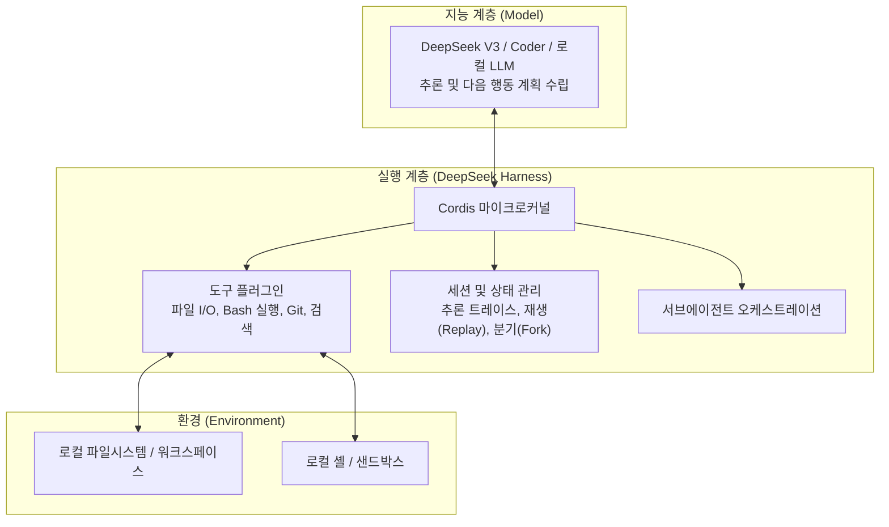
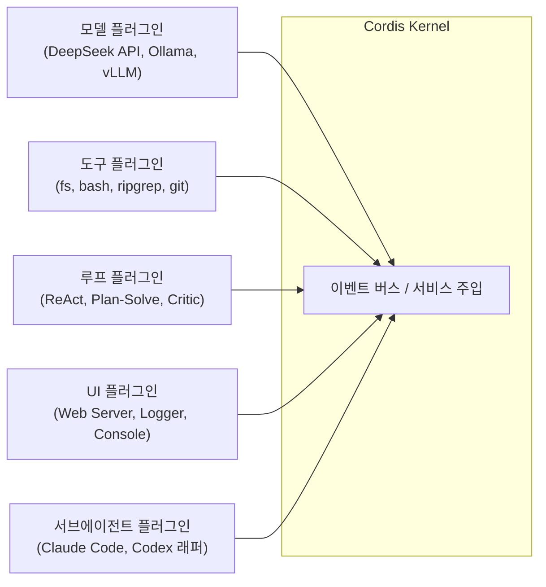
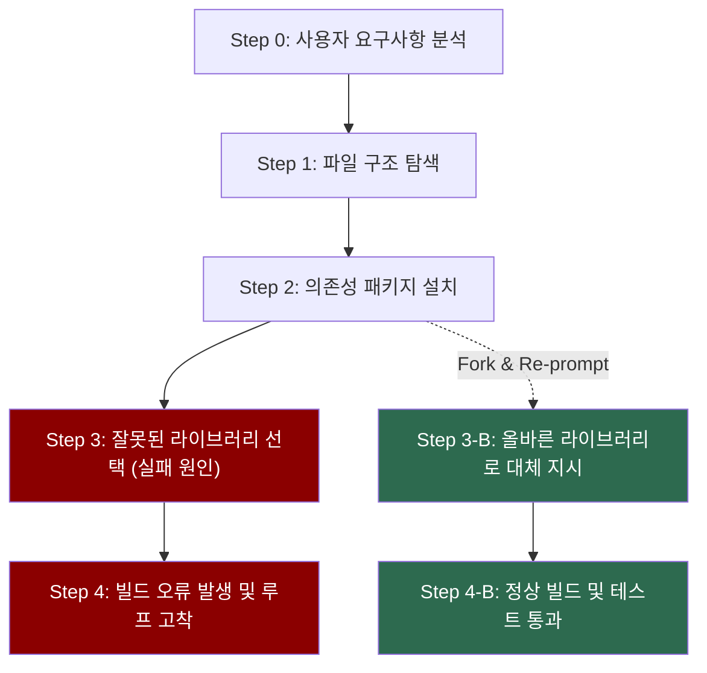
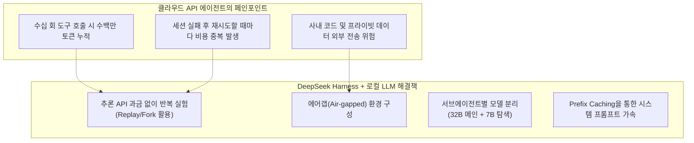

> **이 글의 대상**: 코딩 에이전트 도구를 도입하려 하거나, DeepSeek Harness의 CLI와 데스크톱 앱의 정체 및 내부 동작 구조(Cordis 아키텍처, 플러그인 시스템, 세션 추적)를 파악하고자 하는 개발자.

> **작성 시점 안내**: 2026년 8월 30일 확인 기준으로 DeepSeek Harness는 개발자 프리뷰(Developer Preview) 단계다. 세부 CLI 명령어, 설정 파일 포맷, 플러그인 API 인터페이스는 버전 업데이트에 따라 변경될 수 있다.


## 1. 모델만으로는 코딩 에이전트가 완성되지 않는다

LLM에게 복잡한 코딩 작업을 맡겨보면 금세 한계에 부딪힌다. 모델 자체는 텍스트를 입력받아 다음 토큰을 반환하는 추론 엔진일 뿐, 파일을 직접 수정하거나 터미널 명령을 실행하고 그 결과를 검증하는 능력이 내장되어 있지 않기 때문이다.

이러한 간극을 메우기 위해 모델 주변을 감싸는 **에이전트 프레임워크(Harness)** 가 필요하다. 모델이 "두뇌"라면, 하네스는 손발과 도구, 파일시스템 접근 권한, 세션 메모리를 연결하는 "신경계와 골격" 역할을 맡는다.



기존의 상용 코딩 보조 도구들은 내부 루프가 닫혀 있어 특정 도구를 교체하거나 로컬 모델을 원하는 방식으로 연결하기 어려웠다. DeepSeek Harness(이하 `dsh`)는 이 문제를 해결하기 위해 **모든 구성요소를 플러그인으로 분리한 오픈소스 에이전트 런타임**으로 공개되었다.

---

## 2. CLI와 커뮤니티 데스크톱 앱의 실체와 차이를 짚다

DeepSeek Harness를 처음 접할 때 가장 혼란스러운 지점 중 하나가 "CLI 도구인가, 데스크톱 앱인가" 하는 부분이다. 결론부터 정리하면 **공식 제품은 CLI 및 로컬 웹 서버 기반 런타임이며, 데스크톱 앱은 오픈소스 커뮤니티가 패키징한 래퍼(Wrapper)** 다.

| 비교 항목 | 공식 CLI (`dsh`) | 커뮤니티 데스크톱 앱 (`dsh-desktop` 등) |
|---|---|---|
| 배포 주체 | DeepSeek AI 공식 오픈소스 | 오픈소스 커뮤니티 (서드파티) |
| 기술 기반 | Node.js / TypeScript, Cordis | Tauri / Electron + Node.js 번들 |
| 실행 방식 | 터미널 명령 (`npx @deepseek-ai/dsh web`) | 설치형 실행 파일 (`.dmg`, `.exe`, `.deb`) |
| 사용자 인터페이스 | 브라우저 기반 로컬 웹 UI (`localhost:3080`) | 네이티브 창 내부에 웹 UI 임베드 |
| 업데이트 속도 | npm/git 저장소 기준으로 즉각 반영 | 패키징 릴리스 주기에 의존 |
| 확장성/설정 | `cordis.patch.yml`, CLI 옵션 직접 제어 | UI 설정 메뉴 + 내부 설정 파일 주입 |
| 적합한 사용자 | 개발자, 자동화 파이프라인 구성자 | 터미널 환경이 낯선 사용자, 단독 창 선호자 |

공식 런타임은 `npx @deepseek-ai/dsh web` 명령을 통해 로컬에 경량 웹 서버를 띄우고 브라우저에서 대시보드와 대화창을 제공하는 형태다. 데스크톱 앱은 이 로컬 웹 UI와 Node.js 런타임을 네이티브 데스크톱 창(Tauri 또는 Electron) 안에 묶어 원클릭 실행이 가능하도록 만든 것이다.

개발 환경에서는 설정 제어가 직관적이고 최신 패치가 즉시 반영되는 **공식 CLI 방식**으로 시작하는 것을 권장한다.

---

## 3. 모든 것이 플러그인인 Cordis 아키텍처를 파헤치다

DeepSeek Harness의 핵심 설계 철학은 **"모든 것은 플러그인(Everything is a Plugin)"** 이다. 이를 가능하게 하는 뼈대가 바로 **Cordis** 메타 프레임워크다.

Cordis는 플러그인의 생명주기(로딩, 의존성 주입, 언마운트, 이벤트 통신)를 관리하는 마이크로커널이다. DeepSeek Harness에서는 에이전트 루프 자체마저도 코어의 하드코딩이 아닌 플러그인으로 등록된다.



이 구조 덕분에 개발자는 프레임워크의 코어 코드를 수정하지 않고도 다음과 같은 확장을 손쉽게 구성할 수 있다.

- **모델 교체**: 원격 DeepSeek API 대신 사내 로컬 vLLM 서버나 Ollama를 백엔드로 교체.
- **도구 격리**: 로컬 셸 직접 실행 도구 대신 Docker 컨테이너 격리 실행 플러그인으로 변경.
- **로그 및 저장소**: 로컬 JSONL 파일 저장소 대신 원격 PostgreSQL 또는 사내 로그 수집 파이프라인으로 전송.

기본 프로필과 번들은 `cordis.yml`로 조합하고, 사용자 오버레이는 프로젝트 또는 Harness 홈의 `cordis.patch.yml`로 지정한다. 플러그인 이름과 설정 필드는 버전별로 바뀔 수 있으므로 `dsh --profile web --dump-config`와 공식 설정 카탈로그를 기준으로 확인한다.

```yaml
# cordis.patch.yml의 현재 공식 형식에 맞춘 개념 예시
- id: llm-pi-ai
  name: '@deepseek-ai/dsh-llm-pi-ai'
  config:
    providers:
      local-ollama:
        apiKeyEnv: OLLAMA_API_KEY
        api: openai-completions
        baseURL: http://localhost:11434/v1
        models:
          - id: qwen2.5-coder:32b

- id: fs-local
  name: '@deepseek-ai/dsh-fs-local'
  config:
    cwd: !!js process.cwd()

- id: fs-policy
  name: '@deepseek-ai/dsh-fs-observation-policy'

- id: tool-fs
  name: '@deepseek-ai/dsh-tool-fs'
```

---

## 4. 로컬 웹 UI로 세션을 추적하고 분기(Fork)하다

에이전트가 긴 작업 흐름을 수행할 때 가장 흔히 발생하는 문제는 **"어느 순간 잘못된 판단을 내려 이후 작업이 엉뚱한 방향으로 흘러가는 현상"** 이다.

DeepSeek Harness는 이 문제를 해결하기 위해 모든 동작을 **불변 추가(Append-only) 로그**로 기록하고, 로컬 웹 UI에서 이를 시각화한다.



### 세션 관리의 세 가지 핵심 기능

1. **사고 과정 투명화(Trace Inspection)**: 모델의 내부 추론(Thinking), 도구 호출 인자, 셸 실행 출력, 컨텍스트 주입 내역을 타임라인 형태로 단계별 검사할 수 있다.
2. **세션 재생(Replay)**: 이전에 성공했던 복잡한 리팩터링이나 마이그레이션 과정을 그대로 다시 실행하여 재현성을 확인한다.
3. **분기(Forking)**: 실패 지점(Step 2 또는 Step 3)으로 세션 상태를 되돌린 뒤, 프롬프트를 수정하거나 추가 지시를 주어 새로운 경로로 에이전트를 유도한다. 전체 작업을 처음부터 다시 실행하지 않아도 되므로 토큰 비용과 시간을 아낄 수 있다.

세션 기록은 기본적으로 사용자 로컬 머신의 `.dsh/` 디렉터리에 저장된다. 다만 원격 모델을 연결하면 프롬프트와 코드 일부가 해당 모델 제공자에게 전송될 수 있으므로, 에어갭 보장은 로컬 모델과 네트워크 정책까지 함께 구성해야 한다.

---

## 5. 서브에이전트 연동으로 복잡한 작업을 분할하다

하나의 컨텍스트 윈도우 안에 수십 개의 파일 내용과 긴 실행 로그를 모두 밀어넣으면 모델의 집중력이 분산되고 속도가 저하된다.

DeepSeek Harness는 **오케스트레이터(메인 에이전트)가 세부 작업을 전문 서브에이전트에게 위임하는 구조**를 지원한다.

| 서브에이전트 유형 | 주 역할 | 처리 작업 예시 |
|---|---|---|
| **코드베이스 조사 (Explorer)** | 읽기 전용 도구만 사용 | 심볼 검색, 호출 관계 분석, 아키텍처 파악 |
| **테스트 & 검증 (Tester)** | 테스트 러너 도구 집중 | 단위 테스트 작성, pytest/npm test 실행, 실패 로그 파싱 |
| **외부 CLI 에이전트 브리지** | 서드파티 툴 호출 | Claude Code 또는 독립 CLI를 자식 프로세스로 오케스트레이션 |

메인 에이전트는 전체 작업 계획과 최종 결과물 조립에 집중하고, 무거운 파일 검색이나 에러 로그 분석은 자식 에이전트가 격리된 컨텍스트에서 수행한 뒤 요약 결과만 부모에게 반환한다. 이를 통해 메인 세션의 컨텍스트를 깔끔하게 유지할 수 있다.

---

## 6. 로컬 LLM 생태계와 결합할 때 빛을 발하는 4가지 이유

DeepSeek Harness가 로컬 LLM 커뮤니티(특히 r/LocalLLaMA)에서 큰 호응을 얻은 가장 큰 이유는 **에이전트 워크플로 특유의 자원 소모 구조와 로컬 추론 엔진의 강점이 완벽히 맞아떨어지기 때문**이다.



### 6-1. 끝없는 에이전트 루프를 추가 API 과금 없이 반복하다

코딩 에이전트는 일반 대화와 달리 한 번의 지시에도 수십 단계(파일 검색 → 코드 읽기 → 셸 테스트 → 오류 분석 → 수정 diff 생성 → 재검증)의 루프를 돈다.

클라우드 프론티어 API를 쓰면 복잡한 버그 수정 세션 하나에 수백만 토큰이 소모되어 1회 실행에 수천 원에서 수만 원의 비용이 발생할 수 있다. 반면 **Ollama, vLLM, SGLang, MLX** 등 로컬 추론 엔진을 하네스 백엔드로 연결하면 몇 번을 실패하고 되돌리든(Fork/Replay) 추가 API 호출 비용은 발생하지 않는다. 전력과 하드웨어 비용은 별도다.

### 6-2. 기업 비밀과 프라이빗 코드의 에어갭 환경을 구성하다

상용 클라우드 기반 코딩 도구는 원격 서버로 코드 스니펫이나 텔레메트리를 전송해야 하는 제약이 있다. DeepSeek Harness는 오픈소스 마이크로커널과 로컬 파일시스템 기반으로 동작하므로, 네트워크가 차단된 폐쇄망(Air-gapped) 환경에서도 자체 호스팅 모델과 결합하여 안전하게 운용할 수 있다.

### 6-3. 서브에이전트별 모델 차등 배분으로 VRAM 한계 극복

단일 모델로 모든 작업을 처리하려면 거대한 VRAM이 필요하지만, Harness의 서브에이전트 구조를 활용하면 작업 성격에 맞게 로컬 모델을 쪼갤 수 있다.

| 작업 계층 | 추천 로컬 모델 크기 | 모델 역할 |
|---|---|---|
| **메인 오케스트레이터** | 32B급 (`Qwen2.5-Coder-32B` 등) | 작업 계획 수립, 아키텍처 판단, 최종 코드 리팩터링 |
| **탐색/검색 서브에이전트** | 7B~8B급 (`Qwen2.5-Coder-7B` 등) | 파일 목록 탐색, ripgrep 검색 결과 요약 |
| **테스트 검증 서브에이전트** | 7B~14B급 | 단위 테스트 실패 로그 파싱 및 문법 검사 |

### 6-4. Prefix Caching(프롬프트 캐싱)을 통한 추론 가속

에이전트 루프는 매 턴마다 긴 도구 정의(Tool Schema)와 시스템 프롬프트를 반복해서 보낸다. vLLM이나 SGLang, 최신 Ollama처럼 **Prefix Caching**을 지원하는 로컬 백엔드를 연결하면, 중복되는 컨텍스트를 재연산하지 않고 KV Cache에서 재사용하므로 첫 토큰 생성 속도(TTFT)가 빨라질 수 있다.

---

## 7. Ollama·vLLM과 로컬 하네스를 10분 만에 연결하다

### 7-1. Ollama 백엔드 연결 설정

로컬 머신에 Ollama가 설치되어 있다면 코딩 특화 모델을 내려받은 뒤 `cordis.patch.yml`에서 OpenAI 호환 엔드포인트로 연결한다.

```bash
# 1) Ollama에서 코딩 모델 다운로드
ollama pull qwen2.5-coder:32b
ollama pull qwen2.5-coder:7b
```

현재 공개된 설정 형식에서는 OpenAI 호환 로컬 서버를 `dsh-llm-pi-ai`의 사용자 provider로 등록한다. Ollama가 요구하는 인증 헤더를 맞추기 위해 임의의 placeholder key를 환경 변수로 둔다.

```bash
export OLLAMA_API_KEY=ollama
```

``$DSH_HOME/settings.yaml``에는 다음처럼 적는다.

```yaml
llm-pi-ai:
  providers:
    local-ollama:
      apiKeyEnv: OLLAMA_API_KEY
      api: openai-completions
      baseURL: http://localhost:11434/v1
      models:
        - id: qwen2.5-coder:32b
        - id: qwen2.5-coder:7b
```

서브에이전트별 모델을 나누는 것은 이 provider 목록을 노출하는 것만으로 끝나지 않는다. agent preset과 provider/model 선택을 함께 구성해야 하므로, 먼저 위처럼 두 모델이 정상적으로 보이는지 확인한 뒤 preset별 역할을 분리하는 순서가 안전하다.

### 7-2. 하드웨어 환경별 추천 조합

| 보유 하드웨어 | 추천 메인 모델 | 추천 서브 모델 | 특징 및 용도 |
|---|---|---|---|
| **12~16GB VRAM** (RTX 4070/4080) | `Qwen2.5-Coder-14B` (Q4_K_M) | `Qwen2.5-Coder-7B` (Q4_K_M) | 단일 파일 수정 및 가벼운 함수 단위 테스트 |
| **24GB VRAM** (RTX 3090/4090) | `Qwen2.5-Coder-32B` (Q4_K_M) | `Qwen2.5-Coder-7B` (Q8_0) | 고난도 리팩터링 및 서브에이전트 병렬 탐색 (스위트스팟) |
| **64~128GB Mac** (M시리즈 통합메모리) | `Qwen2.5-Coder-32B` (Q8) 또는 `DeepSeek-Coder-V2` | `Qwen2.5-Coder-7B` (MLX) | 32K 이상의 긴 문맥을 활용한 대규모 코드베이스 분석 |

### 7-3. 공식 CLI와 로컬 웹 UI를 실행하다

```bash
# npm에서 직접 로컬 웹 UI 실행
npx @deepseek-ai/dsh web

# 실행될 플러그인 구성을 확인
dsh --profile web --dump-config

# 소스 체크아웃에서 실행
pnpm dsh web
```

세션 목록과 재개는 기본적으로 Web UI의 세션 화면에서 처리한다. CLI 명령어와 설정 파일을 제품 기능처럼 고정해 설명하기보다, 설치한 버전의 공식 문서와 `--dump-config` 결과를 기준으로 확인하는 편이 안전하다.

---

## 8. Developer Preview 단계에서 마주친 한계와 주의점

DeepSeek Harness는 유연한 아키텍처를 제공하지만, 실제 도입 전 반드시 고려해야 할 현실적인 한계들이 존재한다.

1. **설정 포맷 및 플러그인 API의 변동성**: 현재 프리뷰 버전인 만큼 패치 버전 업데이트 시 `cordis.patch.yml`의 스키마나 플러그인 메서드 시그니처가 바뀔 가능성이 높다.
2. **커뮤니티 데스크톱 앱의 보안 검증 필요**: 서드파티 데스크톱 래퍼는 비공식 빌드인 경우가 많다. 바이너리에 악성 코드가 포함되어 있지 않은지, API 키나 로컬 파일 권한이 안전하게 관리되는지 확인해야 한다. 가능하면 소스코드가 공개된 저장소에서 직접 빌드하거나 공식 CLI를 사용하는 편이 안전하다.
3. **로컬 소형 모델 연동 시 툴 콜링 정밀도**: DeepSeek V3/Coder급 대형 모델을 API로 연결했을 때는 안정적인 플래닝과 도구 호출을 보여주지만, 8B~14B급 로컬 소형 양자화 모델을 연결할 경우 복잡한 다단계 도구 호출에서 인자 형식 오류나 무한 루프가 발생할 확률이 높아진다.
4. **명령어 실행 승인(Sandbox Approval)**: 에이전트가 파일 삭제나 파괴적인 셸 명령(`rm -rf`, DB 초기화 등)을 실행하지 않도록, 중요 작업에 대한 사용자 확인(Human-in-the-loop) 옵션을 켜두고 작업 디렉터리 범위를 명확히 제한해야 한다.

---

## 9. 커뮤니티 논의에서 확인되는 기대와 주의점

DeepSeek Harness가 공개된 뒤 Reddit, Hacker News, X(구 Twitter) 등 개발자 커뮤니티에서 주목받은 배경과 논점이 나타났다. 다만 아래 표는 정량 설문이나 대표성 있는 여론조사가 아니라, 공개 논의에서 반복된 주제를 요약한 것이다.

### 9-1. 주목받은 배경으로 거론되는 네 가지

1. **"Agent = Model + Harness" 패러다임의 적중**: 모델 파라미터 크기를 키우는 것만으로는 실무 코딩의 신뢰도를 높이기 어렵다는 공감대가 커진 상황에서, 실행 환경(Harness)의 고도화가 에이전트 성능의 핵심이라는 문제의식을 정확히 짚었다.
2. **에이전트에게 플러그인을 직접 만들게 하는 확장성**: "이런 도구가 필요하다"고 에이전트에게 지시하면 에이전트가 Cordis 플러그인 코드를 직접 생성해 런타임에 마운트하는 방식이 개발자들의 실험 욕구를 자극했다.
3. **불투명한 블랙박스 에이전트에 대한 피로감**: 상용 AI 코딩 어시스턴트들이 내부 추론 과정이나 도구 호출 로그를 숨기는 것과 달리, 전체 궤적(Trajectory)을 검사하고 재생·분기할 수 있는 투명성을 제공했다.
4. **로컬 퍼스트와 MIT 라이선스**: 데이터가 외부로 유출되지 않는 로컬 기반에 `npx` 한 줄로 구동되는 편의성과 자유도 높은 라이선스가 자가 호스팅(Self-hosting) 커뮤니티의 지지를 얻었다.

### 9-2. 주요 커뮤니티별 반응과 논의 지점

| 커뮤니티 | 주요 반응 및 논점 | 긍정 평가 / 우려 사항 |
|---|---|---|
| **Reddit (r/LocalLLaMA)** | 플러그인 생태계와 로컬 LLM 결합에 집중 | 커스텀 메모리·UI 플러그인 제작 열풍. 단, 소형 모델 연결 시 툴 호출 불안정 지적 |
| **Hacker News** | Cordis 마이크로커널 아키텍처의 구조적 평가 | Eclipse/OSGi 류의 플러그인 설계를 AI 에이전트에 성공적으로 이식했다는 평. squash-merge 중심의 기여 방식 및 문서 부족 비판 |
| **X (Twitter) / 기술 블로그** | Claude Code 등 기존 CLI 에이전트와의 비교 | "완성형 제품"이 아닌 "개발자가 뜯어고칠 수 있는 플랫폼"으로서의 차별성 강조 |

### 9-3. 주요 출처 및 참고 자료

- [DeepSeek 공식 저장소 (GitHub)](https://github.com/deepseek-ai/deepseek-harness): 공식 런타임 소스코드 및 Developer Preview 안내
- [Reddit r/LocalLLaMA 논의 스레드](https://www.reddit.com/r/LocalLLaMA/): Cordis 플러그인 자가 확장 및 로컬 모델 연동 경험기
- [Hacker News 기술 토론](https://news.ycombinator.com/): Everything-is-a-plugin 설계와 마이크로커널 구조에 대한 분석

---

## 10. 마치며 — 나만의 에이전트 스택을 구축하는 다음 단계

DeepSeek Harness의 핵심을 세 줄로 요약하면 다음과 같다.

1. **공식 런타임은 CLI와 로컬 웹 UI다.** 데스크톱 앱은 이를 편리하게 감싼 커뮤니티 래퍼이며, 두 방식의 코어 동작 엔진은 동일하다.
2. **Cordis 기반 플러그인 아키텍처를 채택했다.** 모델, 도구, 저장소, 에이전트 루프까지 내 입맛대로 교체하고 확장할 수 있다.
3. **로컬 LLM과 결합했을 때 비용·보안·서브에이전트 분리 이점이 극대화된다.** 무제한 시점 분기(Fork) 실험과 에어갭 환경 구축에 최적이다.

에이전트 도구를 상용 SaaS의 블랙박스로만 쓰지 않고, 내부 동작을 세밀하게 제어하거나 사내 인프라/로컬 LLM에 완벽히 결합하고 싶다면 DeepSeek Harness는 유의미한 출발점이 될 수 있다.
