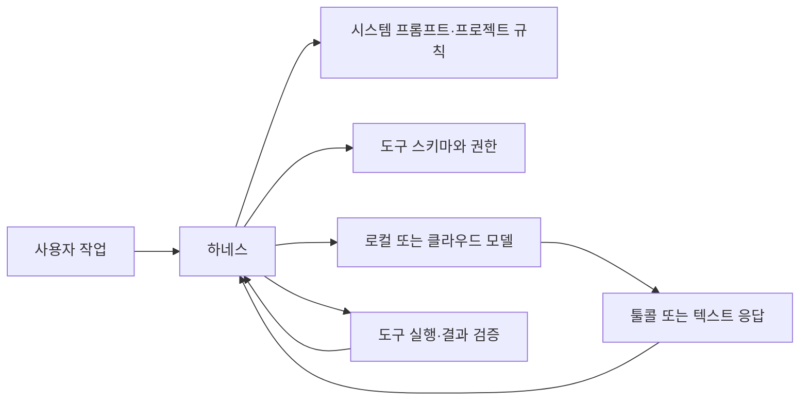
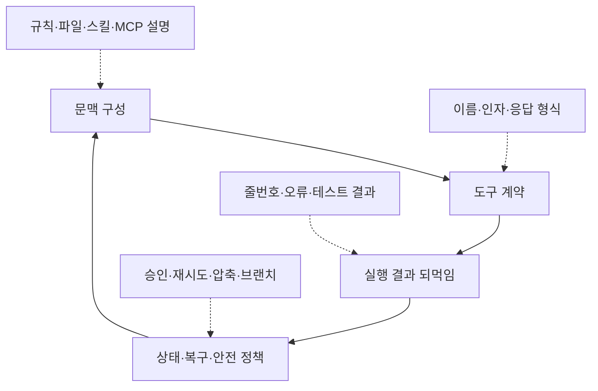

> **이 글의 대상**: 로컬 LLM을 코딩 에이전트에 연결하려 하거나, Pi·OpenCode·DeepSeek Harness·Claude Code·Qwen Code 중 어떤 하네스를 선택할지 고민하는 개발자.

> **조사 기준 안내**: 2026년 8월 31일 확인 기준으로 각 프로젝트의 공식 저장소와 문서를 대조했다. 다섯 하네스를 같은 모델·같은 태스크로 직접 재현한 공개 공통 점수표는 확인하지 못했으므로, 확인되지 않은 프롬프트 토큰 수나 성공률을 순위처럼 제시하지 않는다. 대신 공개 연구의 하네스 효과와 실제로 재현할 수 있는 측정 방법을 정리한다.

같은 모델을 연결했다고 같은 에이전트가 되는 것은 아니다. 모델은 다음 토큰을 예측하지만, 하네스는 언제 파일을 읽고, 어떤 도구를 보여주고, 결과를 어떻게 되먹이며, 실패한 작업을 어디까지 다시 시도할지를 결정한다.

이 차이는 짧은 코드 생성보다 저장소를 탐색하고, 여러 파일을 고치고, 테스트 결과를 읽고, 다시 수정하는 작업에서 크게 드러난다. 로컬 LLM에서는 문맥 창과 추론 속도가 제한돼 있으므로 하네스의 프롬프트·도구·상태 관리가 모델의 능력을 실제 성공률로 바꾸는 중요한 층이 된다.

## 1. 하네스는 모델을 감싸는 실행 루프다

에이전트 하네스는 단순한 채팅 UI가 아니다. 보통 다음 네 가지를 묶은 실행 계층이다.

1. **지시와 문맥 구성**: 시스템 지침, 프로젝트 규칙, 파일 내용, 이전 도구 결과를 모델 입력으로 조립한다.
2. **도구 계약**: `read`, `edit`, `write`, `bash` 같은 도구의 이름과 인자 스키마를 모델에 노출한다.
3. **상태와 복구**: 세션 기록, 압축, 브랜치, 되돌리기, 재시도 정책을 관리한다.
4. **안전과 종료 조건**: 권한 승인, 샌드박스, 최대 턴, 테스트 통과 여부를 결정한다.

같은 Qwen 계열 모델이라도 하네스가 도구 결과를 줄 단위로 되먹이는지, 파일 전체를 다시 넣는지, 모델이 쓸 수 있는 도구를 몇 개로 제한하는지에 따라 입력 분포가 달라진다. 따라서 “모델 점수”와 “모델·하네스 조합의 점수”를 구분해서 봐야 한다.

## 2. 다섯 하네스의 설계 철학과 로컬 연결성

아래 표는 기능의 우열이 아니라 공식 문서에서 확인되는 설계 방향을 비교한 것이다.

| 하네스 | 설계 방향 | 상태·확장 방식 | 로컬 모델 연결을 읽는 법 |
|---|---|---|---|
| **Pi (`pi-coding-agent`)** | 최소한의 터미널 코딩 하네스 | TypeScript 확장, Skills, Prompt Templates, Packages, 세션 브랜치·압축 | 기본 루프를 작게 두고 provider·extension으로 원하는 기능을 추가하는 방식 |
| **OpenCode** | 모델·프로바이더 중립적인 오픈소스 코딩 에이전트 | 터미널·데스크톱·IDE, Plan 모드, `/undo`·`/redo`, `AGENTS.md` | 75개 이상의 프로바이더와 로컬 모델을 지원하며 `baseURL`로 호환 서버를 연결 |
| **DeepSeek Harness** | “Everything is a Plugin” 런타임 | Cordis 서비스·이벤트·플러그인, 프로파일·번들·패치, web/headless | LLM 어댑터와 도구도 플러그인 계층이므로 직접 조합할 수 있지만 개발자 프리뷰다 |
| **Claude Code** | 기능이 갖춰진 개발 작업 환경 | CLAUDE.md, Skills, MCP, Subagents, Hooks, Plugins, 권한 정책 | `ANTHROPIC_BASE_URL`로 프록시·게이트웨이에 보낼 수 있지만 임의 로컬 모델 호환성은 중계 계층에 달려 있다 |
| **Qwen Code** | Qwen 생태계와 터미널 에이전트의 결합 | MCP, Skills, Subagents, headless 모드, IDE 연동 | OpenAI 호환 인증 유형과 `baseUrl`로 vLLM·Ollama·LM Studio 같은 로컬 서버를 연결할 수 있다 |

### 2-1. Pi: 작게 시작해서 직접 확장하는 하네스

[Pi 공식 저장소](https://github.com/earendil-works/pi)는 Pi를 최소한의 터미널 코딩 하네스로 설명한다. 기본 기능에는 `read`, `write`, `edit`, `bash`가 있고, Subagents나 Plan 모드 같은 기능은 기본 내장보다 확장으로 해결하는 철학에 가깝다.

이 선택은 로컬 LLM에 두 가지 의미가 있다. 기본 시스템을 작게 유지해 입력을 직접 통제하기 쉽고, 부족한 기능을 TypeScript extension·Skills·Packages로 추가할 수 있다. 대신 확장을 직접 고르고 검토해야 한다. 공식 저장소도 패키지와 확장이 전체 시스템 권한으로 실행될 수 있다고 경고한다.

### 2-2. OpenCode: 일상 작업과 프로바이더 교체에 강한 선택

[OpenCode 공식 문서](https://opencode.ai/docs/)는 OpenCode를 터미널 인터페이스·데스크톱 앱·IDE 확장을 제공하는 오픈소스 코딩 에이전트로 소개한다. [프로바이더 문서](https://opencode.ai/docs/providers/)에 따르면 75개 이상의 프로바이더와 로컬 모델을 지원하고, 설정의 `baseURL`로 프록시나 호환 엔드포인트를 지정할 수 있다.

`/undo`와 `/redo`, Plan 모드, 프로젝트의 `AGENTS.md`, 사용자 명령 파일은 일상적인 저장소 작업의 진입 장벽을 낮춘다. 다만 LSP는 문서 버전을 확인해야 한다. 현재 V2 문서에는 LSP 설정 형식은 남아 있지만 내장 서버를 시작하거나 진단을 도구 결과에 붙이는 런타임은 아직 제공되지 않는다고 적혀 있다.

### 2-3. DeepSeek Harness: 런타임 자체를 조립하고 싶은 사람을 위한 구조

[DeepSeek Harness 공식 저장소](https://github.com/deepseek-ai/deepseek-harness)는 모든 기능을 플러그인으로 구성하고 그 아래에 Cordis를 둔다. [Cordis 튜토리얼](https://github.com/deepseek-ai/deepseek-harness/blob/master/docs/cordis-tutorial/index.md)은 도구·LLM 어댑터·파일 접근·에이전트 루프까지 공유 컨텍스트에 마운트되는 플러그인으로 설명한다.

[아키텍처 문서](https://github.com/deepseek-ai/deepseek-harness/blob/master/docs/architecture.md)에 따르면 프로파일은 번들을 쌓고 `cordis.patch.yml`과 오버레이를 적용하는 구성 단위다. 자체 도구, 승인 정책, 모델 어댑터를 정밀하게 바꾸고 싶은 엔지니어에게 매력적이지만, 공식 저장소가 개발자 프리뷰와 호환성 변경 가능성을 명시하므로 안정적인 일상 도구보다 실험 가능한 런타임으로 보는 편이 정확하다.

### 2-4. Claude Code: 확장 계층이 촘촘한 완성형 환경

Claude Code는 기본 파일·검색·실행 도구 위에 프로젝트 규칙, Skills, MCP, Subagents, Hooks, Plugins를 얹는 구조다. [공식 확장 개요](https://code.claude.com/docs/en/features-overview)는 각 기능이 언제 컨텍스트에 들어오는지까지 구분한다. `CLAUDE.md`는 지속 문맥이고 Skills는 필요할 때 본문을 불러오며 Subagent는 격리된 컨텍스트에서 작업한다.

로컬 모델을 붙일 때는 구분이 필요하다. [환경 변수 문서](https://code.claude.com/docs/en/env-vars)는 `ANTHROPIC_BASE_URL`을 프록시나 게이트웨이로 라우팅하는 변수로 설명한다. 이는 Claude Code가 임의의 로컬 모델을 공식적으로 동일 품질로 지원한다는 뜻이 아니다. 중계 서버가 Claude API 형식과 툴콜·스트리밍·모델 응답을 얼마나 잘 호환하는지가 별도 변수다.

### 2-5. Qwen Code: Qwen과 로컬 OpenAI 호환 서버의 접점

[Qwen Code 공식 문서](https://github.com/QwenLM/qwen-code)는 Qwen 모델에 최적화된 오픈소스 터미널 에이전트이면서 OpenAI·Anthropic·Gemini 호환 프로바이더를 선택할 수 있다고 설명한다. [모델 프로바이더 문서](https://github.com/QwenLM/qwen-code/blob/main/docs/users/configuration/model-providers.md)는 vLLM·Ollama·LM Studio 같은 로컬 추론 서버를 `openai` 인증 유형과 로컬 `baseUrl`로 연결하는 예를 제공한다.

[MCP 문서](https://github.com/QwenLM/qwen-code/blob/main/docs/users/features/mcp.md)는 HTTP·SSE·stdio 서버를, [Subagents 문서](https://github.com/QwenLM/qwen-code/blob/main/docs/users/features/sub-agents.md)는 하위 에이전트별 모델과 도구를 설정하는 방법을 설명한다. Qwen 모델과 로컬 서버를 주력으로 삼는다면 먼저 시험할 만하지만, Qwen 전용 기능이 모든 비-Qwen 모델의 툴콜 품질을 자동으로 보장하지는 않는다.

## 3. 로컬 LLM에서 실제 차이를 만드는 네 가지 층

하네스 비교를 “프롬프트가 짧은 순서”로 줄이면 중요한 원인을 놓친다. 실제로는 다음 네 층이 서로 영향을 준다.

### 3-1. 시스템 프롬프트 토큰 수는 직접 캡처해야 한다

하네스별 초기 프롬프트가 몇 토큰인지 공식 문서만 보고 확정하기는 어렵다. 프로젝트 규칙, 활성 도구 수, MCP 서버, Skills 설명, 모델 어댑터가 매 요청의 입력을 바꾸기 때문이다.

따라서 프롬프트 토큰을 비교하려면 하네스와 버전·설정·시스템 프롬프트 원문·도구 목록·MCP 상태·프로젝트 규칙 파일을 함께 고정해야 한다. 측정하지 않은 토큰 수는 성능 지표가 아니라 추정치다.

### 3-2. 툴콜 호환성은 모델 이름보다 어댑터 경로가 중요하다

로컬 서버가 OpenAI 호환 API를 제공한다고 해서 모든 하네스와 모델 조합이 같은 방식으로 작동하지는 않는다. 확인할 경로는 다음과 같다.

1. 하네스가 보내는 `tools` 배열과 `tool_choice`를 서버가 받는가
2. 모델이 생성한 tool call을 서버가 구조화해 반환하는가
3. 하네스가 `tool_call_id`, 인자 JSON, 오류 응답을 다음 턴에 정확히 되먹이는가
4. 여러 턴 뒤에도 산문 대신 올바른 도구 호출을 계속 내놓는가

Qwen Code가 OpenAI 호환 로컬 서버를 연결할 수 있다는 것은 연결 경로의 장점이지, Qwen의 학습 포맷을 모든 하네스가 그대로 쓴다는 뜻은 아니다. JSON·XML·특수 태그 중 어느 쪽이 안정적인지는 모델 체크포인트, 서버 템플릿, 하네스 어댑터를 함께 시험해야 한다.

### 3-3. 파일과 규칙을 넣는 방식이 컨텍스트를 결정한다

| 방식 | 장점 | 로컬에서 생기는 trade-off |
|---|---|---|
| 전체 파일 주입 | 모델이 바로 내용을 본다 | 긴 파일과 반복 프리픽스가 문맥과 프리필 시간을 잠식한다 |
| 검색·참조 기반 주입 | 필요한 부분만 보낸다 | 모델이 먼저 올바른 파일과 심볼을 찾아야 한다 |
| 요약·서브에이전트 | 메인 컨텍스트를 작게 유지한다 | 요약 과정의 누락과 추가 추론 비용이 생긴다 |
| 규칙 파일·스킬 | 프로젝트 지식을 재사용한다 | 항상 로드되는 내용과 필요할 때 로드되는 내용을 구분해야 한다 |

Pi의 `AGENTS.md`와 Skills, OpenCode의 `AGENTS.md`와 명령 파일, Claude Code의 `CLAUDE.md`·Skills·Subagents, Qwen Code의 설정·Skills는 이름이 비슷해도 로드 시점과 범위가 다르다. 이 차이를 기록하지 않고 하네스만 비교하면 문맥 전략의 차이를 하네스 성능으로 잘못 해석하게 된다.

### 3-4. 실패 복구는 기능표보다 운영 부담을 바꾼다

| 하네스 | 공식 문서에서 확인되는 복구·확장 장치 | 운영상 의미 |
|---|---|---|
| Pi | 세션 브랜치·압축, TypeScript 확장; 기본 권한 격리는 제공하지 않음 | 가볍고 자유롭지만 컨테이너·외부 샌드박스와 승인 정책을 별도로 준비해야 함 |
| OpenCode | `/undo`, `/redo`, Plan 모드, 권한·정책 설정 | 계획과 실행을 오가고 변경을 되돌리기 쉬움 |
| DeepSeek Harness | Cordis의 서비스·이벤트·가역 효과, 프로파일·패치 | 런타임을 교체할 수 있지만 프리뷰 버전 운영 부담이 큼 |
| Claude Code | Subagents, Hooks, Plugins, MCP 권한, worktree 격리 옵션 | 조직형 워크플로를 구성하기 좋지만 권한 범위 관리가 중요함 |
| Qwen Code | Subagents, Skills, headless·daemon 경로, MCP 설정 | Qwen 중심 파이프라인과 자동화·CI 연결에 유리함 |

## 4. 벤치마크 점수는 어떻게 읽어야 하나

원고에 있던 하네스별 초기 토큰·툴콜 성공률·리팩터링 완료율 표는 동일한 태스크, 요청 로그, 버전, seed, 실행 예산이 공개되지 않으면 재현할 수 없다. 그런 숫자를 그대로 순위표로 게시하면 측정 결과가 아니라 정밀해 보이는 추정이 된다.

대신 하네스 효과를 직접 다룬 공개 연구가 있다. [The Scaffold Effect in Coding Agents](https://arxiv.org/abs/2607.22585)는 Qwen 3.6 Plus와 MiniMax M2.5를 Goose·OpenCode·OpenHands-SDK에 연결해 Terminal-Bench Pro 50개 태스크에서 비교했다.

| 공개 연구에서 확인된 결과 | 수치 또는 관찰 | 해석 |
|---|---:|---|
| 같은 모델 안에서 하네스별 pass rate 차이 | **2~8%p 범위** | 하네스가 결과에 영향을 주지만 한 번의 pass rate만으로 우열을 확정하기는 어려움 |
| 해결된 태스크 하나당 토큰 비용 | **최대 약 40배 차이** | 성공률이 비슷해도 비용·대기·감독 부담은 크게 달라질 수 있음 |
| 실패 양상 | Goose는 REASON, OpenHands-SDK는 VERIFY/MAX_TURNS, OpenCode는 TIME·HANG 경향 | 하네스마다 실패 지문이 다르므로 실패 유형도 함께 기록해야 함 |

이 연구는 다섯 도구의 최종 순위를 제공하지 않는다. 그러나 “하네스는 고정된 포장지라서 모델만 보면 된다”는 가정을 반박하는 근거로는 충분하다.

[Terminal-Bench 공식 저장소](https://github.com/harbor-framework/terminal-bench)는 태스크 데이터셋과 실행 하네스를 분리하고, 각 태스크에 검증 스크립트를 둔다. [Harness-Bench 연구](https://arxiv.org/abs/2605.27922)도 공통 태스크·예산·평가 프로토콜을 유지하면서 각 하네스의 native 실행 행동을 보존하는 방향을 제안한다.

### 4-1. 현재 공개 자료로 만들 수 있는 비교표

아래 표는 점수표가 아니라 공식 문서에서 확인한 기능·운영 특성 표다. `○`는 문서상 경로가 있고, `△`는 구성이나 별도 확장·프록시에 의존한다는 뜻이다.

| 비교 항목 | Pi | OpenCode | DeepSeek Harness | Claude Code | Qwen Code |
|---|---:|---:|---:|---:|---:|
| 로컬 OpenAI 호환 서버 연결 | ○ | ○ | △ | △ | ○ |
| MCP | △ 확장 | ○ | △ 플러그인 | ○ | ○ |
| Subagent | △ 확장 | ○ | ○ 구성 가능 | ○ | ○ |
| Plan 모드 | △ 확장 | ○ | △ 프로파일 의존 | ○ 구성 가능 | ○ 구성 가능 |
| 세션 브랜치·복구 | ○ | ○ | ○ 구성·로그 계층 | ○ 세션·worktree 계층 | ○ 세션·headless 계층 |
| 런타임 확장성 | ○ TypeScript | ○ 설정·플러그인·SDK | **○ Cordis 중심** | ○ Plugins·Hooks·Skills | ○ Extensions·Skills·MCP |
| 안정성 주의 | 확장 권한 검토 | LSP V2 기능 범위 확인 | **개발자 프리뷰** | 프록시 호환성 검증 | 로컬 provider 설정 검증 |

이 표에서 “○”는 곧 품질 보장을 뜻하지 않는다. Claude Code의 MCP와 Subagent가 풍부해도 로컬 프록시가 도구 호출과 스트리밍을 완전히 호환하지 못하면 해당 조합의 실용성은 떨어진다.

### 4-2. 다섯 하네스를 직접 비교하는 재현 프로토콜

실제 순위를 만들려면 하네스가 아니라 **모델·하네스·백엔드 조합**을 하나의 실험 단위로 삼아야 한다.

1. **모델과 서버 고정**: 같은 체크포인트·양자화·추론 서버·컨텍스트 상한·temperature·seed를 사용한다.
2. **하네스 설정 고정**: 버전, 시스템 프롬프트, 프로젝트 규칙, 활성 도구, MCP, 승인 모드, 최대 턴을 저장한다.
3. **태스크 고정**: 첫 툴콜, 3턴 파일 수정, 툴 결과 충실도, 테스트 실패 수정, 다중 파일 변경, 안전한 명령 승인 태스크를 준비한다.
4. **실행 환경 격리**: 태스크별 새 worktree나 컨테이너를 사용하고 이전 세션·파일·캐시가 다음 실행에 섞이지 않게 한다.
5. **원시 로그 보존**: 모델 입력·출력, 툴콜, 툴 결과, 타임스탬프, 종료 이유를 모두 저장한다.
6. **성공률 외 지표 기록**: 해결률, 첫 유효 툴콜, 잘못된 인자율, 해결 토큰, wall time, no-action 턴, 재시도 횟수, 메모리·스왑을 함께 기록한다.

이 프로젝트의 로컬 실험 리포트가 `harness-tool-first`, `harness-multiturn`, `harness-stub-fidelity`를 따로 둔 이유도 여기에 있다. 한 번 툴을 부르는지와, 툴 결과를 읽고 다음 턴에 정확한 수정으로 이어가는지는 서로 다른 능력이다.

## 5. 목적별로 고르는 하네스

“최고의 하네스” 대신 현재 작업의 제약에 맞춰 고르는 편이 현실적이다.

| 우선순위 | 먼저 볼 선택지 | 이유 | 주의할 점 |
|---|---|---|---|
| 최소 문맥과 직접 확장 | **Pi** | 기본 루프가 작고 TypeScript 확장·Skills·패키지로 직접 바꿀 수 있음 | 권한 격리와 Subagent·Plan은 직접 구성해야 함 |
| 일상적인 터미널 개발과 모델 교체 | **OpenCode** | 프로바이더 폭이 넓고 Plan·Undo·Redo·AGENTS.md가 갖춰짐 | 현재 V2 LSP는 설정과 실제 런타임을 구분해야 함 |
| 런타임·도구·정책 자체를 조립 | **DeepSeek Harness** | Cordis 서비스와 플러그인 계층이 에이전트 루프까지 열어 둠 | 개발자 프리뷰라 버전 고정과 소스 확인이 필수 |
| Claude 생태계의 확장 기능 활용 | **Claude Code** | Skills·MCP·Subagents·Hooks·Plugins를 한 환경에서 조합 | 로컬 모델 연결은 `ANTHROPIC_BASE_URL` 뒤의 프록시 품질에 좌우됨 |
| Qwen과 로컬 OpenAI 서버 중심 | **Qwen Code** | Qwen 모델·MCP·Subagent와 vLLM/Ollama/LM Studio 연결 문서가 잘 맞음 | 비-Qwen 모델과 특수 툴콜은 별도 검증 필요 |

### 로컬 연결 전에 확인할 최소 체크리스트

- 서버가 `/v1/chat/completions`와 `tools` 요청을 실제로 지원하는가
- 모델 ID와 tokenizer template이 하네스가 기대하는 형식과 맞는가
- `read` 결과의 줄번호·경로·오류 메시지가 다음 턴에 보존되는가
- `edit`·`bash`를 자동 승인할지, 사람 승인 또는 샌드박스를 둘지 정했는가
- 첫 요청과 동일 프리픽스 반복 요청을 나눠 TTFT와 전체 시간을 측정했는가

## 6. 로컬 하네스 생태계의 공통 한계

1. **하네스가 모델의 약점을 없애주지는 않는다**: 7B~14B 모델에서는 여러 턴의 도구 인자와 테스트 결과를 안정적으로 유지하기 어렵다. 하네스는 실패를 줄일 수 있지만 추론 능력 자체를 대체하지 않는다.
2. **호환성은 기능 이름이 아니라 프로토콜에서 깨진다**: “OpenAI 호환”이라는 문구만으로 structured tool call, streaming, `tool_call_id`, JSON Schema, 긴 출력이 모두 호환된다고 가정하면 안 된다.
3. **권한 설정은 성능보다 먼저 검토해야 한다**: 특히 Pi는 공식 저장소가 기본 권한 제한을 제공하지 않는다고 설명한다. 로컬 셸과 파일을 열어주는 하네스는 작은 테스트 저장소와 별도 계정으로 시작하는 편이 안전하다.
4. **버전과 설정이 바뀌면 하네스가 바뀐 것이다**: 모델, 서버, 하네스, MCP, 규칙 파일 중 하나만 바뀌어도 이전 점수와 직접 비교하기 어렵다. 실험 결과에는 전체 설정과 원시 요청을 함께 보존해야 한다.
5. **속도와 성공률은 서로 다른 축이다**: 빠른 첫 툴콜, 높은 tok/s, 낮은 토큰 비용이 저장소 작업 성공을 보장하지 않는다. pass rate, 해결 비용, wall time, 감독 부담을 함께 봐야 한다.

## 7. 마치며 — 로컬에서는 “모델·하네스 쌍”을 고르자

로컬 코딩 에이전트에서 모델은 두뇌지만 하네스는 작업 방식이다. 같은 모델이라도 어떤 도구를 보고, 어떤 규칙을 읽고, 실패 뒤에 어디서 다시 시작하는지에 따라 실제 결과가 달라진다.

- 가볍게 시작하고 직접 뜯어고치려면 **Pi**
- 일상적인 터미널 개발과 프로바이더 교체에는 **OpenCode**
- 에이전트 런타임 자체를 플러그인으로 조립하려면 **DeepSeek Harness**
- Skills·MCP·Subagents가 결합된 완성형 환경이 필요하면 **Claude Code**
- Qwen 모델과 로컬 OpenAI 호환 서버를 중심으로 운영하려면 **Qwen Code**

이 선택은 절대 순위가 아니다. 공개 연구가 보여주듯 하네스는 해결률뿐 아니라 토큰 비용과 실패 지문까지 바꾼다. 최종 결정은 같은 모델을 붙여 작은 저장소에서 첫 툴콜·멀티턴 수정·테스트 복구를 직접 재고, 내 작업의 pass rate와 감독 부담을 확인한 뒤 내려야 한다.

### 참고 자료

- [Pi 공식 저장소](https://github.com/earendil-works/pi)
- [OpenCode 공식 문서](https://opencode.ai/docs/)
- [OpenCode 프로바이더 문서](https://opencode.ai/docs/providers/)
- [OpenCode LSP 문서](https://opencode.ai/docs/lsp/)
- [DeepSeek Harness 공식 저장소](https://github.com/deepseek-ai/deepseek-harness)
- [DeepSeek Harness 아키텍처](https://github.com/deepseek-ai/deepseek-harness/blob/master/docs/architecture.md)
- [Claude Code 확장 개요](https://code.claude.com/docs/en/features-overview)
- [Claude Code 환경 변수](https://code.claude.com/docs/en/env-vars)
- [Qwen Code 공식 저장소](https://github.com/QwenLM/qwen-code)
- [Qwen Code 로컬 모델 프로바이더](https://github.com/QwenLM/qwen-code/blob/main/docs/users/configuration/model-providers.md)
- [Terminal-Bench 공식 저장소](https://github.com/harbor-framework/terminal-bench)
- [The Scaffold Effect in Coding Agents](https://arxiv.org/abs/2607.22585)
- [Harness-Bench](https://arxiv.org/abs/2605.27922)
