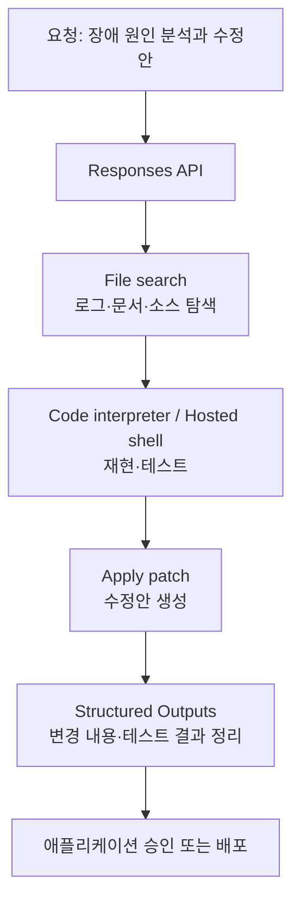

> **이 글의 대상**: GPT-6 Astra가 어떤 모델인지 빠르게 파악하고, 코드·브라우저·문서 작업에 어디까지 활용할 수 있을지 감을 잡고 싶은 개발자와 기술 리드.

> **자료 기준일**: 2026년 9월 4일. 모델의 기능·가격·접근 정책은 [OpenAI 공식 문서](https://developers.openai.com/api/docs/models/gpt-6-astra)와 [GPT-6 Astra 모델 가이드](https://developers.openai.com/api/docs/guides/latest-model?model=gpt-6-astra)를 기준으로 정리했다.

## 1. GPT-6 Astra는 어떤 모델인가

OpenAI가 공개한 **GPT-6 Astra**는 가장 어려운 종단 간 작업을 겨냥한 플래그십 모델이다. 공식 모델 ID는 `gpt-6-astra`이며, 복잡한 추론·코딩·컴퓨터 사용·리서치·문서 작성이 주요 용도로 소개되어 있다.

이 모델의 인상적인 점은 단순히 한 번의 답변 품질을 높이는 데 있지 않다. 사용자의 목표를 이해하고, 필요한 자료를 찾고, 코드를 실행하거나 화면을 조작하고, 결과를 확인한 뒤 다음 단계로 이어가는 **긴 작업 흐름**을 하나의 모델 안에서 다루는 데 초점이 맞춰져 있다.


### 1-1. 공식 사양 한눈에 보기

| 항목 | GPT-6 Astra |
|---|---|
| 모델 ID | `gpt-6-astra` |
| 포지션 | 가장 어려운 종단 간 작업을 위한 플래그십 |
| 입력 | 텍스트·이미지 |
| 오디오·비디오 | 지원하지 않음 |
| 컨텍스트 윈도우 | 1,050,000토큰 |
| 최대 출력 | 128,000토큰 |
| 지식 기준일 | 2026년 4월 30일 |
| 추론 강도 | `low`·`medium`·`high`·`xhigh`·`max` |
| 입력 가격 | $10 / 1M 토큰 |
| 출력 가격 | $50 / 1M 토큰 |

컨텍스트가 105만 토큰에 달하기 때문에 대규모 코드베이스, 여러 설계 문서, 긴 로그를 한 세션의 맥락으로 가져갈 여지가 커졌다. 다만 컨텍스트가 크다고 해서 저장소 전체를 매 요청마다 넣는 것이 좋은 설계라는 뜻은 아니다. 검색과 캐싱을 함께 구성해야 비용과 응답 시간을 관리할 수 있다.

현재 공개 문서는 Astra를 API와 ChatGPT 제품에서 사용하는 호스팅 모델로 설명한다. 공개 가중치나 로컬 실행 패키지가 안내된 모델은 아니므로, M-series Mac에 내려받아 실행하는 로컬 모델과는 성격이 다르다.

## 2. 가장 기대되는 변화: 답변 모델에서 작업 파트너로

OpenAI는 Astra를 코드, 브라우저, 전문 소프트웨어를 가로지르는 다단계 작업에 강한 모델로 소개한다. 여기서 말하는 변화는 “더 긴 답변을 생성한다”에 가깝기보다, 작업 중간에 도구를 사용하고 결과를 다시 읽으면서 목표를 계속 좇는 흐름에 있다.

### 2-1. 계획하고, 실행하고, 확인하는 흐름

Astra에 프로젝트의 문제를 설명하면 모델은 다음과 같은 작업 흐름을 구성할 수 있다.

1. 저장소와 요구사항을 읽고 작업 범위를 정한다.
2. 파일 검색이나 웹 검색으로 필요한 맥락을 모은다.
3. 코드 인터프리터나 호스팅 셸에서 명령과 테스트를 실행한다.
4. 패치나 함수 호출로 변경을 제안하거나 적용한다.
5. 결과를 확인하고, 실패하면 원인을 찾아 다음 시도를 이어간다.

이 흐름은 기존의 “질문하고 답을 받는” 사용법보다 에이전트에 가깝다. 모델이 모든 단계를 알아서 실행한다는 의미는 아니다. 애플리케이션이 어떤 도구를 연결하고, 어떤 명령을 허용하고, 어떤 단계에서 사람의 승인을 받을지 함께 설계해야 한다.

### 2-2. 긴 작업 중간에 방향을 바꿀 수 있다

GPT-6 Astra의 모델 가이드에는 작업 중간의 상호작용을 돕는 기능이 소개되어 있다.

| 기능 | 어떤 상황에서 유용한가 |
|---|---|
| Async tool calling | 오래 걸리는 도구가 실행되는 동안 다른 작업을 계속 진행할 때 |
| Mid-turn steering | 모델이 작업 중일 때 요구사항이나 우선순위를 바꿀 때 |
| `configuration_update` | 같은 대화 안에서 추론 강도를 높이거나 낮출 때 |
| Prompt caching | 긴 지침과 프로젝트 맥락을 반복해서 사용할 때 |

예를 들어 테스트 실행을 기다리는 동안 독립적인 문서 작업을 진행하게 하거나, “기능은 그대로 두고 성능만 개선해달라”처럼 중간에 새 제약을 추가할 수 있다. `configuration_update`를 활용하면 대화의 캐시 가능한 접두사를 다시 만들지 않고 추론 강도를 바꿀 수 있다는 점도 긴 세션에서 의미가 있다.

단, 이 기능들은 애플리케이션이 비동기 작업 상태와 `call_id`, WebSocket 이벤트, 결과 전달 시점을 관리해야 비로소 작동한다. 모델 문자열 하나만 바꾸면 얻어지는 기능은 아니다.

### 2-3. 105만 토큰 컨텍스트가 바꾸는 것

대규모 컨텍스트는 다음과 같은 작업에서 특히 편리할 수 있다.

- 여러 패키지로 나뉜 저장소의 구조 파악
- 설계 문서와 실제 구현의 차이 찾기
- 긴 빌드 로그와 테스트 결과의 원인 추적
- 여러 계약서·보고서·회의록을 함께 읽고 비교하기
- 하나의 장기 작업에서 이전 결정과 변경 이력 유지하기

반대로 컨텍스트가 길어질수록 입력 비용과 검색 품질 관리가 중요해진다. 자주 쓰는 규칙과 프로젝트 설명은 캐시하고, 필요한 파일만 검색으로 가져오며, 오래된 대화는 요약하거나 정리하는 구성이 현실적이다.

## 3. 지원 도구: 브라우저부터 코드와 외부 시스템까지

공식 모델 페이지에서 확인되는 GPT-6 Astra의 Responses API 도구 지원은 다음과 같다.

| 도구 | 지원 여부 | 활용 예 |
|---|---:|---|
| Web search | 지원 | 최신 자료 조사와 근거 수집 |
| File search | 지원 | 연결된 문서와 코드 검색 |
| Code interpreter | 지원 | 계산·데이터 분석·코드 실행 |
| Hosted shell | 지원 | 호스팅 환경에서 셸 명령 실행 |
| Apply patch | 지원 | 코드 변경안 적용 |
| Computer use | 지원 | 브라우저와 화면 기반 작업 |
| MCP·Skills·Tool search | 지원 | 외부 도구와 작업 지침 연결 |
| Function calling·Structured Outputs | 지원 | 애플리케이션 기능 호출과 결과 형식 고정 |

이 조합이 중요한 이유는 모델이 하나의 답변만 만드는 대신, 작업에 필요한 여러 표면을 오갈 수 있기 때문이다. 예를 들어 “지난주 장애 원인을 찾아 수정안을 만들어줘”라는 요청은 로그 검색, 코드 탐색, 재현 테스트, 수정안 작성으로 이어질 수 있다.



### 3-1. “네이티브 OS 제어”라고 부르기 전에

Astra가 Computer use를 지원한다는 것은 브라우저나 화면 기반 컴퓨터 작업을 연결할 수 있다는 뜻이다. 이것을 모델이 운영체제의 모든 권한을 직접 가지거나 Excel·PowerPoint·VS Code의 내부 API를 자동으로 호출한다는 의미로 확대해서 이해할 필요는 없다.

실제 권한은 모델이 아니라 연결된 도구와 애플리케이션이 갖는다. 따라서 다음과 같은 구조가 안전하다.

- 읽기·검색 도구는 넓게 열어도 되지만 쓰기·삭제 도구는 제한한다.
- 셸은 샌드박스와 명령 allowlist 안에서 실행한다.
- 파일 삭제, 외부 전송, 결제, 배포는 사람 승인 단계를 둔다.
- Computer use는 별도 브라우저 프로필과 테스트 계정에서 먼저 검증한다.
- 도구 호출과 결과를 모두 기록해 사후에 재현할 수 있게 한다.

모델이 화면을 이해하고 클릭할 수 있다는 기능보다, 그 클릭이 어떤 권한 경계 안에서 일어나는지를 함께 보는 것이 실제 도입에서는 더 중요하다.

## 4. 추론 강도는 품질 조절이자 운영 조절이다

GPT-6 Astra는 `low`, `medium`, `high`, `xhigh`, `max`의 추론 강도를 제공한다. 모든 요청을 가장 높은 단계로 보내는 방식은 간단하지만, 비용과 지연이 커질 수 있다.

| 추론 강도 | 먼저 시도해볼 작업 |
|---|---|
| `low` | 짧은 요약, 단순 변환, 정형화된 추출 |
| `medium` | 일반적인 코드 수정, 문서 작성, 도구 기반 조사 |
| `high` | 여러 파일을 가로지르는 디버깅, 복합 리서치 |
| `xhigh` | 실패 비용이 큰 설계·분석 작업 |
| `max` | 가장 어려운 종단 간 작업과 마지막 검토 |

위 표는 공식 점수표가 아니라 운영을 시작할 때의 실무적인 라우팅 예시다. 실제 서비스에서는 같은 작업 세트를 각 단계로 돌려 성공률·토큰량·완료 시간을 기록하는 것이 좋다.

또한 Astra는 `none` 추론 강도를 지원하지 않는다. 기존 모델에서 `none`이나 `minimal`을 사용하고 있었다면 `low`부터 결과와 비용을 비교하는 방식으로 옮기는 편이 안전하다.

## 5. 벤치마크로 보면 어디가 강한가

이번에는 벤치마크를 빼고 소개하기 어렵다. OpenAI가 공개 발표문에 여러 영역의 비교표를 함께 제공했고, Artificial Analysis도 출시 직후 독립 측정 결과를 공개했다. 두 자료를 같이 보면 Astra의 장점과 한계가 조금 더 입체적으로 보인다.

### 5-1. OpenAI 공식 발표의 대표 점수

아래 표는 OpenAI가 2026년 9월 3일 발표문에서 공개한 수치 중, 컴퓨터 사용·전문 업무·코딩·학술 추론·장문 컨텍스트를 대표하는 항목만 추린 것이다. 이번 비교에는 GPT-5.6 Sol뿐 아니라 OpenAI 발표표에 함께 실린 Claude Fable 5.1·Fable 5·Opus 5와 Gemini 3.8 Flash도 포함했다. 빈칸은 해당 발표 표에서 점수가 공개되지 않았다는 뜻이며, 0점이 아니다. 모델 열이 많아 좁은 화면에서는 표를 좌우로 움직여 볼 수 있다.

| 평가 항목 | GPT-6 Astra | GPT-5.6 Sol | Claude Fable 5.1 | Claude Fable 5 | Claude Opus 5 | Gemini 3.8 Flash |
|---|---:|---:|---:|---:|---:|---:|
| Artificial Analysis Intelligence Index | **61.2** | 60.9 | 65.7 | 62.1 | 63.1 | 58.7 |
| OSWorld 2.0 (offline, partial) | **72.6%** | 65.7% | — | — | 70.2% | — |
| ScreenSpot-Pro (no tools) | **92.7%** | 76.9% | — | — | 87.3% | — |
| AutomationBench | **41.4%** | 18.1% | 31.4% | 17.4% | 26.9% | — |
| BrowseComp | **91.5%** | 90.4% | — | — | 87.4% | 90.8% |
| Terminal-Bench 4.0 | **57.9%** | 37.3% | 55.8% | 42.0% | 52.3% | 19.1% |
| DeepSWE v1.1 | 74.1% | 72.7% | 67.4% | 69.9% | 73.7% | 73.8% |
| FrontierCode 1.1 Extended | **64.5%** | 60.6% | 63.6% | 64.9% | 63.6% | 56.3% |
| Terminal-Bench Science 0.1 | **64.6%** | 22.4% | 52.6% | 21.4% | 30.0% | — |
| FrontierMath Tier 4 (v2) | **97.6%** | 80.5% | 78.0% | 87.8% | 73.2% | — |
| GPQA Diamond | **96.0%** | 94.6% | 93.7% | 92.6% | 93.7% | 95.3% |
| ARC-AGI-3 | **99.9%** | 7.8% | — | — | 30.2% | — |
| MRCR v2 8-needle, 512K–1M | **96.3%** | 73.8% | — | — | — | — |

이 표만 보면 Astra는 컴퓨터 사용, 브라우저·전문 업무 자동화, 터미널 코딩, 수학·학술 추론, 장문 컨텍스트에서 특히 강하게 나타난다. 반면 모든 평가에서 1위를 차지하는 것은 아니다. 예를 들어 공식 표의 Artificial Analysis Intelligence Index에서는 Claude Fable 5.1이 65.7, Claude Opus 5가 63.1로 Astra의 61.2보다 높다. DeepSWE에서는 Astra가 74.1로 Claude Fable 5.1의 67.4보다 높지만, Gemini 3.8 Flash의 73.8과는 큰 차이를 보이지 않는다. FrontierMath에서는 Claude Fable 5가 87.8로 Astra의 97.6보다 낮지만, 다른 코딩·전문 업무 평가에서는 모델별 강점이 달라진다.

OpenAI는 이 점수들이 각 평가에서 기록한 **최고 추론 강도 기준**이라고 설명한다. 또한 GPT 평가는 연구 환경이나 API에서 수행되어 실제 ChatGPT 제품의 시스템 프롬프트·도구 구성과 다를 수 있다고 밝힌다. 따라서 “모든 환경에서 이 순위가 그대로 재현된다”기보다, OpenAI가 정의한 조건에서 나온 공식 비교 결과로 읽는 편이 정확하다.

### 5-2. Artificial Analysis의 독립 측정

Artificial Analysis는 자체 평가를 종합한 두 가지 관점을 제시한다.

| 지표 | GPT-6 Astra | 비교해서 볼 수 있는 결과 |
|---|---:|---|
| Intelligence Index v4.1.1 | **61** | GPT-5.6 Sol과 동일한 61, Claude Fable 5.1은 66 |
| Coding Agent Index | **67** | Claude Fable 5.1의 70보다는 낮지만 상위권과 비슷한 구간 |
| Intelligence Index 작업당 비용 | **$1.67** | 평가용 가중 토큰 사용량을 반영한 비용 |
| 1M 토큰 혼합 단가 | **$7.70** | 캐시 적중·입력·출력 7:2:1 가중 기준 |
| Intelligence Index 출력 토큰 | **42M** | 비슷한 가격대 모델 중앙값 62M보다 적음 |

Artificial Analysis의 해석은 꽤 흥미롭다. Astra는 GPT-5.6 Sol과 종합 지수 점수는 비슷하지만 더 적은 출력 토큰을 사용한다. 코딩 에이전트 평가에서는 높은 토큰 효율 덕분에 작업당 비용 곡선이 좋아진다. 반대로 Intelligence Index 전체 작업에서는 토큰 단가가 2.5배로 오른 영향이 더 커, GPT-5.6 Sol보다 작업당 비용이 약 75% 높다고 분석한다.

즉 Astra의 핵심은 “모든 종합 지수에서 압도적인 1위”라기보다, **복잡한 에이전트 코딩과 장기 작업을 더 짧은 출력으로 끝낼 가능성**에 있다. 그 이득이 실제 서비스에서도 유지되는지는 도구 구성과 재시도 횟수를 포함해 따로 확인해야 한다.

### 5-3. 추론 강도에 따른 종합 지수 변화

Artificial Analysis의 9월 3일 공개 결과를 보면 Astra의 Intelligence Index는 추론 강도에 따라 다음처럼 움직인다.

| 추론 강도 | Artificial Analysis Intelligence Index |
|---|---:|
| `low` | 57 |
| `medium` | 59 |
| `high` | 60 |
| `xhigh` | 61 |
| `max` | 61 |

점수는 `xhigh`에서 61까지 올라간 뒤 `max`에서 같은 수준으로 유지됐다. 이것은 `max`가 모든 작업에서 무조건 더 높은 종합 점수를 보장한다는 뜻이 아니다. 작업당 토큰과 지연까지 함께 봐야 하므로, 일반 업무를 `medium`으로 처리하고 어려운 작업만 `high` 이상으로 올리는 라우팅을 기대해볼 수 있다.

### 5-4. 벤치마크를 실제 기대치로 번역하면

| 기대 포인트 | 벤치마크가 보여주는 근거 | 실제로 기대할 수 있는 변화 |
|---|---|---|
| 화면을 보며 작업하기 | OSWorld 72.6%, ScreenSpot-Pro 92.7% | 브라우저·GUI 작업의 인식과 조작 성공률 향상 가능성 |
| 코드베이스를 오래 다루기 | Terminal-Bench 57.9%, MRCR 512K–1M 96.3% | 긴 맥락을 유지하며 탐색·수정·검증하는 흐름 |
| 수학·과학 문제 풀기 | FrontierMath 97.6%, GPQA Diamond 96.0% | 고난도 분석과 연구 보조 |
| 개발 작업을 완주하기 | FrontierCode 64.5%, DeepSWE 74.1% | 패치 작성보다 실행·검증을 포함한 작업 흐름 |
| 값비싼 모델의 비용 정당화 | AA 분석의 출력 토큰 감소 | 한 번에 끝내 재시도와 사람 검토를 줄일 때 의미 |

벤치마크 점수는 기능의 방향을 보여주지만, 실제 사용 경험을 그대로 보장하지는 않는다. 특히 Computer use는 화면 해상도, 브라우저 상태, 도구 지연에 영향을 받고, 코딩 평가는 하네스·초기 저장소·테스트 구성에 따라 결과가 달라진다. 도입 전에는 내 작업 세트에서 첫 시도 성공률·완료 시간·재시도 횟수·총비용을 함께 기록해야 한다.

## 6. 가격과 모델 선택

GPT-6 Astra의 표준 토큰 가격은 입력 $10, 출력 $50로 1M 토큰 기준이다. 캐시 입력은 $1, 캐시 쓰기는 $12.50이며, Batch와 Flex는 표준 가격의 50%로 안내된다. Fast mode는 적용 가격의 2배다.

입력 프롬프트가 272K토큰을 넘으면 전체 요청에 대해 입력·캐시 단가는 2배, 출력 단가는 1.5배가 적용된다. 긴 문서를 다룰 수 있다는 점과 긴 문서를 매번 그대로 전송해도 된다는 점은 서로 다르다.

### 6-1. 같은 계열에서 고를 때

| 모델 | 입력 / 출력 가격·1M 토큰 | 컨텍스트 | 포지션 |
|---|---:|---:|---|
| **GPT-6 Astra** | **$10 / $50** | **1.05M** | 가장 어려운 종단 간 작업 |
| GPT-5.6 Sol | $4 / $20 | 1.05M | 복합 전문 작업 |
| GPT-5.6 Terra | $2 / $12 | 1.05M | 지능과 비용의 균형 |
| GPT-5.6 Luna | $0.20 / $1.20 | 1.05M | 비용 민감·대량 처리 |

이 표는 품질 순위가 아니라 OpenAI 공식 모델 목록에 기재된 가격과 포지션을 비교한 것이다. Astra가 한 번에 복잡한 작업을 끝내 재작업을 줄여준다면 높은 토큰 단가가 정당화될 수 있고, 짧은 분류·요약 작업이라면 Terra나 Luna가 더 자연스러운 선택일 수 있다.

예를 들어 캐시와 도구 호출을 제외하고 입력 10만 토큰과 출력 2만 토큰을 사용하면 Astra의 단순 토큰 비용은 약 $2.00이다.

```text
입력: 0.1M × $10 = $1.00
출력: 0.02M × $50 = $1.00
합계: 약 $2.00
```

실제 비용은 여기에 도구 호출, 재시도, 캐시 적중률, 추론에 사용된 토큰이 더해진다. “Astra는 몇 퍼센트 더 비싸다”라고 고정하기보다 성공한 작업 하나를 완성하는 데 실제로 얼마가 들었는지를 기록하는 편이 정확하다.

## 7. 어떤 작업에서 먼저 기대해볼 수 있을까

### 대규모 코드베이스와 장기 코딩

여러 파일의 관계를 파악하고, 테스트를 실행하고, 변경 사항을 다시 검토해야 하는 작업은 Astra의 포지셔닝과 잘 맞는다. 특히 저장소 전체를 한 번에 설명받고 싶은 경우보다, 이슈를 전달하고 탐색·수정·검증까지 이어지는 흐름을 맡길 때 장점이 더 드러날 가능성이 있다.

### 복합 리서치와 문서 작성

웹 검색, 파일 검색, 구조화된 출력, 긴 컨텍스트를 조합하면 자료를 모으고 비교한 뒤 보고서나 기술 문서로 정리하는 흐름을 만들 수 있다. 최신 사실은 모델의 지식 기준일에 기대지 말고 검색 결과와 출처를 함께 전달하는 방식이 적합하다.

### 브라우저와 화면 기반 업무

여러 페이지를 이동하며 정보를 확인하거나, 웹 애플리케이션의 반복 작업을 수행하는 자동화에 활용할 수 있다. 다만 로그인·결제·삭제·배포처럼 되돌리기 어려운 행동은 사람 승인과 별도 계정을 두는 것이 기본이다.

### 이미지가 포함된 문서 이해

이미지 입력을 지원하므로 화면 캡처, 도표, 스캔 문서가 포함된 작업도 하나의 흐름으로 다룰 수 있다. 오디오와 비디오 입력은 지원하지 않으므로 음성·영상이 핵심인 파이프라인은 별도 전처리나 전용 모델과 조합해야 한다.

## 8. 도입할 때의 현실적인 시작점

현재 공식 문서는 Astra가 기업 대상 Trusted Access Program으로 먼저 롤아웃되고, API와 Plus·Pro·Business·Enterprise 플랜에도 순차적으로 제공될 예정이라고 안내한다. 계정과 제품에 따라 실제 접근 시점이 다를 수 있다.

접근 권한을 얻은 뒤에는 다음 순서가 무난하다.

1. Responses API에서 `model: "gpt-6-astra"`로 단일 요청을 연결한다.
2. `low`와 `medium`으로 기존 작업 세트를 먼저 실행한다.
3. 웹 검색·파일 검색·셸·Computer use를 각각 하나씩 붙인다.
4. 성공률, 첫 응답 시간, 전체 완료 시간, 입력·출력 토큰, 재시도 횟수를 기록한다.
5. 실패 비용이 큰 작업만 `high` 이상으로 올리고, 반복 작업은 GPT-5.6 계열과 라우팅을 비교한다.
6. 쓰기·삭제·외부 전송·배포 도구에는 모델과 별도의 승인 레이어를 둔다.

기존 GPT-5.6 계열에서 전환한다면 모델 ID만 바꾸지 말고, `reasoning.effort` 지원 범위와 Responses API 도구 호출 방식을 함께 점검해야 한다. 공식 가이드는 `temperature`, `top_p`, `top_logprobs` 같은 일부 매개변수도 제거하거나 재검토하도록 안내한다.

## 9. 마치며 — Astra를 기대할 만한 이유

GPT-6 Astra는 105만 토큰 컨텍스트, 128K 최대 출력, 다섯 단계의 추론 강도, 웹·파일·코드·셸·Computer use·MCP를 포함한 폭넓은 도구 지원을 앞세운 OpenAI의 새 플래그십이다.

가장 기대되는 부분은 모델이 잘 쓰는 문장을 생성한다는 사실보다, 복잡한 목표를 여러 단계로 나누고 필요한 도구를 사용하면서 작업을 이어갈 수 있다는 점이다. 코드베이스를 읽고 테스트를 돌리거나, 자료를 찾고 문서를 작성하거나, 브라우저 작업을 수행하는 흐름이 하나의 인터페이스 안에서 가까워진다.

물론 발표 수치와 실제 운영 성능은 구분해야 한다. Astra를 도입한다면 공식·제3자 벤치마크를 출발점으로 삼되, 내가 맡기려는 작업 세트에서 얼마나 덜 멈추고, 덜 재시도하고, 더 적은 비용으로 끝내는지를 측정하는 것이 좋다.

결국 Astra의 자리는 모든 요청의 기본 모델이라기보다, **실패 비용이 높고 여러 단계를 거치는 작업을 맡길 수 있는 강력한 상위 계층**에 가까워 보인다. 짧은 요청은 더 저렴한 모델로 처리하고, 어려운 작업만 Astra로 올리는 구조를 만들면 기능과 비용을 함께 살릴 수 있다.

## 10. 공식 출처

- [GPT-6 Astra 공식 모델 페이지 — 사양·가격·도구·접근 정책](https://developers.openai.com/api/docs/models/gpt-6-astra)
- [OpenAI GPT-6 Astra 발표 — 공식 벤치마크와 활용 사례](https://openai.com/index/gpt-6-astra/)
- [GPT-6 Astra 모델 가이드 — 사용법·새 기능·마이그레이션](https://developers.openai.com/api/docs/guides/latest-model?model=gpt-6-astra)
- [OpenAI 공식 모델 목록 — Astra와 GPT-5.6 계열 비교](https://developers.openai.com/api/docs/models)
- [OpenAI 모델 비교 페이지](https://developers.openai.com/api/docs/models/compare)
- [Artificial Analysis — GPT-6 Astra 벤치마크와 비용 분석](https://artificialanalysis.ai/articles/benchmarking-gpt-6-astra)
