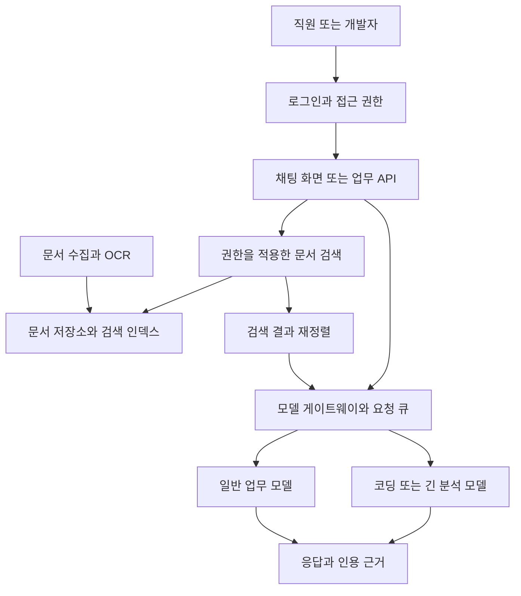

사내에서 쓸 로컬 LLM을 알아보면 먼저 GPU와 모델 크기 이야기가 나온다. 그런데 실제 도입안을 쓰려면 직원 몇 명이 쓸 수 있는지, 어떤 업무와 개발까지 맡길 수 있는지, 누가 운영할 것인지가 함께 나와야 한다. 장비 견적만 받아서는 이 질문에 답하기 어렵다.

이 글은 **2026년 9월 9일 모델 후보·실행 문서와 주요 가격을 재확인한, 초기 예산 1,000만원~10억원의 기업용 로컬 LLM 도입 자료**다. 장비비, 초기 구축비, 3년 운영비를 구분한다. 사무실 안에 둔 PC뿐 아니라 기업이 소유하고 IDC에서 운영하는 서버도 포함한다. 직접 장비를 구매하거나 측정한 기록은 아니다. 기존 벤치마크는 원래의 모델과 측정 조건을 유지하며, 서버 가격 중 재조회하지 않은 표본은 9월 8일 기준이다.

읽고 나면 업무와 이용자 수를 정하고, 후보 장비·모델·도구를 고른 뒤, 공급사에 같은 조건으로 성능 검증과 견적을 요청할 수 있도록 구성했다. 가격은 공개 표시값, 성능은 외부 실측, 사용자 수와 예산 배분은 조건을 명시한 설계 계산으로 나눈다.

사내 문서를 검색해 근거와 함께 답하는 서비스가 필요하다면 [기업용 RAG 구축 가이드](/72/enterprise-rag-postgresql-pgvector-cost)를 함께 읽는다. PostgreSQL·pgvector 구성과 문서·권한·갱신 처리, RAG 추가 구축비·운영비를 별도로 정리했다.

이 글은 **예산으로 어떤 구성과 업무 범위를 검토할 수 있는지**를 다룬다. 모델 후보와 여섯 활용 시나리오를 고른 뒤, 완제품 견적 항목과 참고자료를 확인한다. 회사의 요구사항을 PoC·발주 조건으로 바꾸는 과정은 [도입 검토 실무: 요구사항부터 PoC·견적·발주까지](/71/enterprise-local-llm-procurement-playbook)에서 다룬다.

## 부서의 병목에 따라 같은 예산도 다르게 쓴다

전사 공용 모델 하나부터 정하면 부서마다 다른 실패 원인을 놓치기 쉽다. 먼저 **반복량이 많은가, 틀렸을 때 손실이 큰가, 긴 문서가 필요한가, 외부 도구를 실행하는가**를 구분한다. 부서별 첫 도입안은 다음처럼 달라진다.

| 부서·업무 | 첫 적용 범위 | 먼저 해결할 병목 | 예산을 우선 쓸 곳 |
|---|---|---|---|
| 인사·총무 | 규정 질의, 서식 안내, 회의·문서 요약 | 문서 최신성, 직원별 접근 권한, 답변 근거 | 27~35B급 모델보다 문서 정리·RAG·SSO에 먼저 배분 |
| 재무·법무 | 계약 조항 찾기, 규정 비교, 검토 초안 | 작은 오류의 비용, 긴 문서, 인용 정확성 | 실제 문서 평가와 승인 절차부터 확보, 실패한 항목으로 상위 모델 비교 |
| 고객지원·영업 | 문의 분류, 답변 초안, 상품 자료 검색 | 피크 시간의 동시 요청과 응답 지연 | 큰 모델 한 개보다 검증된 작은 모델의 독립 복제본과 요청 큐 확보 |
| 개발 | 코드 설명·완성, 테스트 초안, 저장소 작업 | 첫 제안 지연, 긴 작업의 도구 호출, 테스트 격리 | 짧은 제안과 Flash-Next 등 저장소 작업 후보를 구분, CI runner와 권한 통제 확보 |
| 연구·기획 | 자료 비교, 긴 보고서 초안, 모델 실험 | 긴 문맥의 prefill과 모델 품질 | 이용자 수보다 96GB 이상 메모리와 재현 가능한 평가 환경을 우선 검토 |
| 전사 공용 | 여러 부서의 검색·채팅·업무 API | 인증, 부서별 권한, 장애 복구, 용량 배분 | 복수 노드, 게이트웨이, 관측, 백업과 운영 담당자에 배분 |

인사·총무가 규정 질의를 시작한다면 70B를 먼저 사는 것보다 문서 소유자와 갱신 절차를 정하는 편이 낫다. 상담팀의 답변 초안이 목적이면 한 요청의 최고 점수보다 점심 직후 몰리는 요청을 처리하는 복제 수가 중요하다. 법무 검토와 개발 에이전트는 같은 30 tok/s를 만족해도 합격한 것이 아니다. 전자는 근거 누락을, 후자는 실제 저장소의 수정·테스트 성공률을 따로 본다.

## 업무별로 비교할 모델을 두세 개로 좁힌다

속도 근거가 충분한 모델과 현재 품질을 시험할 모델은 다를 수 있다. 조사 시점에는 Qwen3.8-27B도 공개되어 있다. 27B dense 구조의 비전 언어 모델이며, 공식 카드에는 SWE-bench Pro 61.7, GPQA Diamond 89.2, IFBench 79.5가 제시되어 있다. [Qwen3.8-27B 공식 모델 카드](https://huggingface.co/Qwen/Qwen3.8-27B)

이는 **개발사 보고값**이다. SWE-bench Pro의 경우 256K 문맥과 특정 에이전트 실행 환경, 수정된 평가 과제를 사용했다고 명시한다. 사내에서 4-bit·8K 문맥으로 실행했을 때의 품질이나 한국어 규정 질의 정확도로 옮겨 적을 수 없다. 참고자료의 Qwen3.5 MoE 속도 역시 Qwen3.8 dense 속도의 근거로 사용하지 않는다.

**2026년 9월 9일에 공식 모델 카드를 다시 확인해 신규 도입 후보를 정리했다.** Qwen3.5-35B-A3B는 뒤쪽 참고자료의 속도 측정을 재현하는 용도로 남긴다. Qwen3.6-35B-A3B는 작은 활성 파라미터의 MoE가 필요한 경우의 비교군이다. 두 모델을 최신 품질 추천의 첫 줄에 놓지는 않는다. Qwen3.8-27B는 공식 저장소가 2026년 8월 14일 공개를 명시한다. [Qwen 공식 출시 이력](https://github.com/QwenLM/Qwen3.8/blob/main/README.md)

아래 순서는 공식 카드의 구조·용도와 이 글의 업무 조건을 연결한 **필자의 PoC 제안**이다. 동일 조건의 한국어 품질·속도 순위는 아직 확보하지 못했다. 메모리 구간도 적재 시험의 출발점이며, 실제 양자화 파일·KV 캐시·동시성을 확인하기 전에는 구매 사양으로 확정하지 않는다.

| 먼저 시험할 업무 | 구체적인 후보 | 적재·장비 검토 방향 | 선택을 바꿀 조건 |
|---|---|---|---|
| 총무·상담의 분류, 추출, 짧은 초안 | Gemma 4 12B instruction-tuned | 16~32GB급에서 양자화 실행을 먼저 시험 | 한국어 업무 품질이 부족하면 Qwen3.8-27B로 비교 확대 |
| 인사·기획의 문서 질의와 일반 업무 | Qwen3.8-27B | 32GB급 Q4 후보. 8K 입력에서 품질·속도를 함께 측정 | 지연이 크면 소형 모델, 속도 우선 비교군으로 Qwen3.6 MoE 검토 |
| 개발팀의 다중 파일 수정·도구 실행 | 품질 우선은 Qwen3.8-Flash-Next, 메모리 제약 시 Qwen3-Coder-Next·Qwen3.8-27B | Flash-Next는 실행 문서에 맞춘 다중 GPU·offload 검증. Coder-Next도 전체 80B로 Q4 가중치 단순 계산만 40GB | 같은 저장소 이슈에서 완료율과 사람의 수정 시간을 비교해 선택 |
| 긴 문서·이미지·도구를 함께 사용하는 업무 | Qwen3.8-Flash-Next | 본체 외 n-gram·MTP까지 포함한 실제 파일과 offload 경로 확인 | 아키텍처 preview라는 명칭만으로 배제하지 않고, 필요한 기능·장기 부하·복구 시험으로 운영 여부 결정 |
| 서버급 개발·복합 업무 | DeepSeek-V4-Flash-0731, GLM-5.3-Flash | 다중 GPU 후보. 공급사에 정확한 checkpoint·정밀도의 적재·부하 시험 요청 | 27B·Coder-Next 대비 실제 업무 개선이 없으면 증설 구매 보류 |

[Gemma 4 공식 모델 카드](https://ai.google.dev/gemma/docs/core/model_card_4), [Qwen3.8-27B](https://huggingface.co/Qwen/Qwen3.8-27B), [Qwen3-Coder-Next](https://huggingface.co/Qwen/Qwen3-Coder-Next), [Qwen3.8-Flash-Next](https://huggingface.co/Qwen/Qwen3.8-Flash-Next), [DeepSeek-V4-Flash-0731](https://huggingface.co/deepseek-ai/DeepSeek-V4-Flash-0731), [GLM-5.3-Flash](https://huggingface.co/zai-org/GLM-5.3-Flash)

GLM-5.3-Flash는 공식 설명상 전체 320B·활성 18B다. DeepSeek-V4-Flash-0731은 이전 preview를 대체하는 정식 버전이며 speculative decoding 모듈을 포함한다. **Flash라는 이름은 32GB 카드용 소형 모델이라는 뜻이 아니다.** DeepSeek 공식 실행 예의 4×GB300 구성을 H200 두 장으로 그대로 환산하지 않는다. Qwen3-Coder-Next 역시 활성 3B만 보고 3B 모델의 메모리로 계산하면 안 된다.

법무·재무에는 별도의 확정 우승 모델을 적지 않는다. 현재 확인한 자료에는 동일한 한국어 계약·재무 평가가 없기 때문이다. Qwen3.8-27B로 근거 추출을 먼저 평가하고 실패한 문항을 서버급 후보에도 그대로 준다. 큰 모델이 그 오류를 줄였을 때에만 추가 지출을 설명할 수 있다. 최신 모델이라는 이유만으로 통과시키지 않는 대신, 어느 모델부터 어떤 실패를 비교할지는 구체적으로 정한다.

Flash-Next를 개발용 우선 평가 후보로 두는 근거는 공식 코딩 평가다. 개발사 보고값은 SWE-bench Pro 62.5, DeepSWE 1.1 58.7이다. 다만 Coder-Next가 같은 비교표에 없고, SWE-bench Pro는 256K 문맥과 수정된 과제를 사용했다. 구형 모델의 별도 점수와 단순 차감해 향상률을 계산하지 않는다. [Flash-Next 공식 평가 조건](https://huggingface.co/Qwen/Qwen3.8-Flash-Next#benchmark-results)

업무 범위는 다음처럼 설정하는 것이 합리적이다. 아래는 특정 모델의 정확도 보증이 아니라 **초기 도입 과제를 고르기 위한 제안**이다.

| 업무 | 우선 적용 방식 | 품질을 판정할 기준 |
|---|---|---|
| 사내 규정·매뉴얼 질의 | 검색한 문단을 주고 출처와 함께 답변 | 조항·날짜·예외 조건·접근 권한 |
| 회의록·보고서 요약 | 원문 기반 초안, 담당자 검토 | 숫자·주체·일정 누락과 사실 추가 |
| 문의 분류·정보 추출 | 정해진 라벨과 JSON 스키마 사용 | 정확도, 필수 필드, 형식 준수 |
| 메일·보고서 작성 | 템플릿과 근거 자료를 제공 | 문체·용어·근거 없는 내용 |
| SQL·코드 보조 | 초안 생성 후 테스트·리뷰 | 실행 결과와 기존 동작 유지 |
| 복잡한 계약 해석·최종 승인·장시간 자율 작업 | 비교 평가 대상으로 두고 책임자 검토 유지 | 실패 비용과 오류 탐지 가능성 |

RAG는 필요한 문서를 검색해 모델에 전달하는 방식이다. 사내 정보에 접근하게 해주지만 추론 오류를 자동으로 해결하지는 않는다. 문서가 낡거나 검색이 빗나가면 답변도 틀릴 수 있다. 부서별 문서 접근 권한은 검색 단계부터 적용해야 한다.

## 도입비와 3년 운영비를 같은 표에 넣는다

아래는 **가격 통계나 외주 견적이 아닌 예산 배분 예시**다. 내부 인력을 사용하는 경우에도 업무 투입 시간을 비용으로 기록한다. 단위는 만원이다.

아래 배분은 다음 절의 여섯 시나리오와 같은 값이다. 장비 항목에는 해당 시나리오의 대여·검증비도 포함하며, 범위를 바꿀 때는 표와 시나리오를 함께 수정한다.

| 초기 상한 | 장비·검증 (만원) | 앱·데이터·연동 (만원) | 인증·운영 준비 (만원) | 예비비 (만원) |
|---|---:|---:|---:|---:|
| 1,000만원 | 650 | 150 | 100 | 100 |
| 3,000만원 | 1,400 | 900 | 400 | 300 |
| 1억원 | 6,000 | 2,000 | 1,000 | 1,000 |
| 3억원 | 18,000 | 6,000 | 4,000 | 2,000 |
| 5억원 | 30,000 | 9,000 | 6,000 | 5,000 |
| 10억원 | 62,000 | 15,000 | 13,000 | 10,000 |

3억원 예시에서는 장비 상한이 1.8억원이므로 약 2.4억원인 H200 2장 서버 표본을 그대로 선택할 수 없다. 대형 장비를 선택하는 대안은 총예산이나 업무 연동 범위를 바꾼 별도 안으로 비교한다.

전담 투입량도 미리 정한다. 아래 역시 인력시장 통계가 아닌 역할 배정 제안이다. FTE는 한 사람이 전일 근무하는 양이며, 여러 사람이 나누어 맡을 수 있다.

| 운영 범위 | 초기 구축 역할·기간의 검토안 | 안정화 이후 투입량 검토안 |
|---|---|---|
| 단일 부서 PoC | 개발·인프라 담당 1명, 업무 담당 겸임, 2~4주 | 기술 담당 0.1~0.3 FTE와 문서 담당 |
| 여러 부서 서비스 | 앱/RAG·인프라·업무 담당 2~3개 역할, 1~3개월 | 0.5~1.5 FTE + 부서별 문서 소유자 |
| 전사 플랫폼 | 앱·데이터·플랫폼·보안 담당 3~6개 역할, 3~6개월 이상 | 1~3 FTE와 장애 대응 계약 |

SSO나 문서 API가 준비되지 않았거나 스캔·한글 문서가 많으면 기간과 비용이 늘어난다. 장비가 한 대여도 업무 데이터 연결이 복잡하면 인력은 줄지 않는다.

3년 총비용은 `초기비 + 36 × (월 인력비 + 월 전력/IDC비 + 월 지원/사용권비) + 교체비`로 작성한다. 예를 들어 완전원가를 **임의로 월 1,000만원/FTE**로 놓으면 0.2 FTE도 3년간 7,200만원이다. 인건비 단가는 회사의 실제 원가로 교체해야 한다.

따라서 **10억원이 초기 구축비인지, 3년 전체 예산인지 반드시 구분**한다. 3년 총액 10억원에서 인력 1 FTE를 위 가정으로 두면 인력만 3.6억원이다. 여기에 6.18억원 장비를 더하면 전력·시설·앱 구축비를 거의 남기지 못한다.

서버실 비용도 달라진다. DGX B200의 최대 시스템 전력은 14.3kW다. 이를 평균 전력으로 사용하면 안 되지만, 전원·UPS·냉방 설계에는 최대치와 공급사 설치 조건을 반영해야 한다. 별도의 **가정 계산**으로 IT 평균 10kW, 시설 계수 1.4, 단가 200원/kWh를 두면 연간 에너지는 122,640kWh, 약 2,453만원이다. IDC 견적에 전력·냉방이 포함되어 있다면 이 계산을 다시 더하지 않는다. [DGX B200 설치 요구사항](https://docs.nvidia.com/dgx/dgxb200-user-guide/introduction-to-dgxb200.html)

## 예산을 실제 부서의 하루에 대입해 본다

다음은 실제 고객 사례가 아닌 **가상 도입 시나리오**다. 금액은 부가세 포함 초기 집행 상한의 배분 제안이며, 시장 견적이나 효과 실측이 아니다. 구축 항목에는 내부 인력 투입 원가도 포함한다. 안정화 이후 인건비·전력·지원은 앞의 3년 총비용으로 별도 편성한다. 공통 합격 조건은 목표 동시성에서의 응답 성능, 업무별 정답 평가, 문서 권한과 복구 시험이다.

### 1,000만원이면 총무팀의 반복 질문 하나를 줄인다

직원 50명의 회사에서 총무 담당자 두 명이 출장비·휴가·비품 문의를 반복해서 받는 상황을 가정한다. 회사 전체에 챗봇 계정을 열기 전에 담당자 5명이 규정 검색과 답변 초안을 시험한다. 하루 50건을 예상하고, 동시에 1건부터 시험해 대기 시간을 기록한다. 5명은 시험 참가자 수이며 GPU의 보장 수용량이 아니다.

**첫 구성은 32GB급 장비 한 대와 Gemma 4 12B·Qwen3.8-27B 비교**다. 규정 100개를 버전·시행일과 함께 정리하고, 검색한 조항 링크를 답변에 붙인다. 오전에는 직원 문의의 초안을 만들고, 오후에는 잘못 답한 질문과 바뀐 규정을 담당자가 등록한다. 숫자 계산은 규정의 계산식이나 기존 시스템을 사용한다.

예산은 장비 650만원, 문서·검색 구축 150만원, 로그인·백업 100만원, 예비비 100만원으로 둔다. 참고자료의 가격 표본에서는 R9700 호스트 구성의 일부가 장비 상한에 들어오며, RTX 5090 완제품은 넘을 수 있다. 이미 가진 장비가 합격하면 구매비를 집행하지 않는다. 상용 외주 구축 전체를 150만원에 맡길 수 있다는 가정은 아니다.

4주 시범 운영의 제안 합격선은 평가 질문 100개 중 근거까지 맞는 답변 90개 이상, 권한 밖 문서 노출 0건, 담당자의 확인 시간을 포함한 문의 처리 시간 중앙값 20% 감소다. 통과하면 이용자를 늘린다. 품질이 낮으면 문서 검색과 실패 유형부터 수정하고, GPU를 추가하지 않는다.

### 3,000만원이면 영업·상담팀의 답변 초안 흐름을 연결한다

상담원 20명이 하루 400건의 문의를 처리하고, 평균 입력 4K·출력 300토큰을 사용하는 상황이다. 오전에 접수된 문의를 분류하고 상품·정책 자료를 검색한 뒤 답변 초안을 만든다. 상담원이 수정하고 발송하며, 수정 이유를 다음 평가에 남긴다. 고객에게 자동 발송하는 범위는 첫 단계에서 포함하지 않는다.

**모델은 Gemma 4 12B와 Qwen3.8-27B 중 분류·초안 평가를 통과한 쪽을 고른다.** 32GB급 독립 노드 두 대를 견적 후보로 두되, 처음부터 모델을 둘로 쪼개지 않고 요청을 분산하는 구성을 먼저 시험한다. 한 대가 멈추면 남은 노드에서 처리량을 줄이고 대기를 허용한다. 장애 시에도 정상 처리량을 유지한다고 약속하지 않는다.

장비 1,400만원, 상담 화면·검색·문서 연결 900만원, 인증·로그·복구 400만원, 예비비 300만원을 배정한다. 이 장비비에 두 대가 안 들어오면 한 대로 시작하고 두 번째 노드는 실제 피크 기록 뒤에 산다. 동시 2·4·8건은 시험 구간이며, 통과한 값만 서비스 한도로 설정한다.

합격 기준은 제품·환불 정책의 근거 정확성, 상담원 수정 시간, 문의 재접수율이다. 예를 들어 초안 작성·검토 시간을 20% 줄이되 잘못된 약속과 재접수가 늘지 않아야 한다. 문장 생성은 빠른데 상품 정보를 틀리면 모델 복제보다 데이터 연결에 먼저 쓴다.

### 1억원이면 개발팀의 작업 성공률을 먼저 산다

개발자 8명이 사내 저장소의 버그 수정·테스트 보강·작은 기능 구현을 맡기는 상황이다. 오전에 이슈와 허용 파일 범위를 주면 에이전트가 격리된 작업 공간에서 패치를 만들고 테스트한다. 개발자는 오후에 diff와 결과를 검토한다. 모델이 제안한 코드는 기존 PR 절차를 거쳐 들어간다.

**첫 품질 후보는 Qwen3.8-Flash-Next**다. 구매 전에 대여 장비에서 완료된 이슈 30개를 재구성해 Qwen3-Coder-Next·Qwen3.8-27B와 같은 작업 도구·시간 상한으로 비교한다. Flash-Next는 thinking 사용량까지 포함해 측정한다. 가장 높은 점수보다 테스트를 통과한 작업당 총시간과 사람의 수정 시간이 구매 이유가 된다.

예산은 모델 장비·대여 검증 6,000만원, 격리 실행·CI runner·저장소 연동 2,000만원, 인증·관측·복구 1,000만원, 예비비 1,000만원으로 둔다. 96GB 복수 GPU와 지원 가능한 양자화·offload 구성을 견적 후보로 보지만, 이 금액에 Flash-Next의 공식 FP8 구성이 들어온다고 전제하지 않는다. 예산 안의 Flash-Next 구성이 검증에 실패하면 Coder-Next 또는 27B로 범위를 줄인다.

8명이 각자 하루 60회 호출하고 호출당 점유 시간이 90초라는 가정에 뒤의 용량 산정식을 적용하면 필요한 동시 용량은 C=8이다. 실제 에이전트 호출 기록으로 다시 계산하며 동시 1·2·4·8건을 시험한다. 인수 조건은 숨겨둔 테스트 통과, 무관한 파일 변경 여부, 사람의 수정 시간 감소다. 한 모델을 위해 GPU 두 장을 묶으면 그 두 장은 서로의 장애 대체 장비가 아니다.

### 3억원이면 인사·법무·개발의 사용 경로를 나눈다

일간 일반 업무 이용자 100명과 개발자 8명이 사용하는 회사를 가정한다. 인사는 규정을 검색하고, 법무는 계약 조항을 비교하며, 개발자는 저장소 작업을 한다. 인사 문의가 들어온 순간 긴 코드 작업 때문에 기다리지 않도록 일반 업무·긴 분석·개발 큐를 분리한다.

일반 질의는 Gemma 4 12B·Qwen3.8-27B 중 합격 모델로 처리하고, 어려운 분석과 개발에는 Flash-Next를 우선 비교한다. 사용자가 큰 모델을 무조건 선택하게 하기보다 업무 유형에 따라 경로를 정하고, 실패한 질의를 담당자가 상위 모델에 재요청한다. 법무 결과에는 조항 위치와 원문을 함께 보여준다.

장비 1억8,000만원, 문서·업무 앱 연결 6,000만원, 인증·권한·백업·설치 4,000만원, 예비비 2,000만원을 배정한다. **약 2.4억원의 H200 2장 서버 표본은 이 시나리오의 장비 상한을 넘는다.** 따라서 96GB급 복수 노드를 먼저 견적하고, H200을 선택하려면 총액이나 앱 범위를 명시적으로 바꾼다.

뒤의 용량 산정 절에 제시한 부하 가정에서는 일반 업무 C=7, 개발 C=8을 각각 검증한다. 서로 다른 모델·부하의 숫자이므로 한 번의 C=15 벤치마크로 합격시키지 않는다. 법무 담당자의 검토 시간, 규정 갱신 지연, 부서 밖 문서 검색 차단과 서비스 재시작 후 복구를 함께 확인한다.

### 5억원이면 검증된 업무를 여러 부서로 복제한다

이미 한 부서에서 효과를 확인했고 일간 업무 이용자 300명으로 확대하는 상황이다. 오전에는 규정·상품 질의가 몰리고 오후에는 계약·보고서 분석이 늘어난다. 밤에는 문서 변환과 인덱스 갱신을 돌린다. 온라인 질의와 야간 작업이 같은 GPU·저장장치를 독점하지 않도록 실행 시간과 자원 한도를 나눈다.

장비 3억원, 업무 연동 9,000만원, 권한·관측·복구 6,000만원, 예비비 5,000만원을 배정한다. 검증된 소형 모델의 복제 서비스와 Flash-Next용 분석 경로를 비교하고, 큰 모델은 별도의 용량을 예약한다. DeepSeek-V4-Flash-0731·GLM-5.3-Flash는 실패한 업무의 개선 가능성을 시험할 후보이며, 모두 상시 적재할 계획은 세우지 않는다.

일반 업무만 뒤의 용량 산정식을 적용하면 C=21이다. 이는 필요 용량의 설계값이며 이 예산으로 달성한 실측값이 아니다. 합격 기준은 피크 시간의 요청별 지연, 부서별 권한, 장애 뒤 제공할 축소 서비스 범위다. 장애 때 작은 모델로 대체하면 답변 품질도 달라지므로 해당 경로 역시 평가한다.

### 10억원이면 전사 운영과 모델 실험을 분리한다

일간 업무 이용자 500명과 개발자 30명이 있는 조직을 가정한다. 직원용 서비스는 버전이 고정된 모델을 사용하고, 모델 평가 담당자는 별도 자원이나 예약 시간에 새 checkpoint를 시험한다. 평가를 통과한 버전만 일부 사용자에게 먼저 적용한 뒤 확대한다. 장애가 나면 이전 모델과 설정으로 돌아간다.

장비 6억2,000만원, 앱·데이터 연결 1억5,000만원, 시설·운영 준비·복구 1억3,000만원, 예비비 1억원을 배정한다. 일반 업무는 검증된 작은 모델 복제, 개발·고난도 분석은 Flash-Next와 서버급 대안을 비교한다. **약 6.18억원짜리 H200 8장 서버 한 대에 장비비를 거의 전부 쓰면 독립 대체 노드 예산이 남지 않는다.** 전사 업무의 연속성이 목표라면 더 작은 복수 노드를 먼저 견적한다. 대형 모델 연구가 우선이면 중단을 허용하는 별도 연구 시나리오로 바꾼다.

뒤의 용량 산정식에 따라 일반 업무 C=35와 개발 C=29를 각각 검증하고, 장애 후 어느 업무를 몇 건까지 유지할지도 계약에 적는다. 개발 30명을 계정 수로만 세지 않고 실제 호출·생성 길이를 기록한다. 이 예산의 인수 결과물은 GPU 목록에 더해 부서별 품질 성적표, 부하 시험 결과, 복구 기록, 운영 담당자와 월별 비용표다.

이 여섯 사례에서 늘어나는 것은 모델 크기만이 아니다. 1,000만원에서는 한 업무의 효과를 확인하고, 3,000만원에서는 업무 화면에 연결하며, 1억원에서는 개발 작업의 성공률을 검증한다. 3억원 이후에는 부서별 자원·권한·운영 책임을 나누고, 5억~10억원에서는 이미 검증한 서비스를 복제하고 복구한다. **다음 예산으로 넘어가는 이유는 앞 단계에서 관측한 품질·처리량·복구의 부족이어야 한다.**

## 사용자 수는 검증한 동시 처리 용량에서 역산한다

도입안에는 계정 수, 일간 실제 이용자 수, 동시에 접수된 요청 수, 동시에 생성하는 요청 수를 따로 쓴다. GPU가 직접 감당하는 것은 마지막 두 항목이다. 사람 한 명이 에이전트 여러 개를 실행할 수도 있다.

GPU 모델별 인원 보장표는 사용하지 않는다. 먼저 회사의 호출량에서 필요한 동시 용량 C를 계산하고, 공급사가 제안한 장비·모델로 그 C를 통과하는지 시험한다. **C는 구매 전에 계산하는 요구량과, 시험 뒤 확인하는 수용량을 구분해서 기록한다.**

업무 이용자 수는 다음 가정을 사용했다. 하루 8시간, 1인 하루 10건, 요청당 서버 점유 시간 30초, 피크가 평균의 4배, 검증된 용량 중 60%만 계획에 사용한다. 점유 시간 30초는 600토큰 출력 20초에 입력 처리 등 10초를 더한 설계 가정이다.

```text
필요한 동시 처리 용량 C
  = 올림(일간 이용자 N × 1인 요청 q × 점유 시간 T × 피크 계수 F
         ÷ (업무 시간 H × 3,600 × 계획 사용률 u))

검증한 C에서 계산한 이용자 N
  = 내림(C × H × 3,600 × u ÷ (q × T × F))

업무 예시: H=8, q=10, T=30초, F=4, u=0.6
  → N ≈ 내림(14.4 × C)
```

이것은 평균 부하와 피크 배수를 이용한 1차 용량 계산이며, 지연의 p95를 보장하는 대기행렬 모델은 아니다. 60% 사용률도 보편적인 정답이 아니라 여유를 두기 위한 가정이다. 실제 요청 기록을 얻으면 피크 배수와 점유 시간을 교체한다.

예를 들어 **일간 이용자 100명은 C=7, 300명은 C=21, 1,000명은 C=70**부터 검토한다. 이 요구량을 공급사에 보내 대여·PoC를 요청한다. 이미 보유한 작은 모델로 같은 C를 통과하면 상위 GPU를 살 이유가 줄어든다.

개발자는 따로 계산한다. 1인 하루 모델 호출 60건, 호출당 점유 90초, 피크 3배를 가정하면 `N ≈ 1.07 × C`다. **일간 업무 이용자 약 115명을 계산한 C=8 구성도, 이 개발 부하에서는 약 8명**에 해당한다. 여기서 60건은 사람이 입력한 프롬프트 수가 아니라 도구 실행 뒤 이어지는 호출까지 포함한다. 병렬 에이전트가 더 많은 호출을 발생시키면 이 값도 내려간다.

내부 추론을 포함해 출력이 3배가 되거나 문맥이 8K에서 64K로 늘어나면 해당 구성의 수용량을 다시 측정한다. 일반 업무·긴 문서·코딩·야간 일괄 처리는 큐와 사용 한도를 나누는 것이 좋다. GPU 한 장이 고장 나도 같은 인원을 수용해야 한다면, 고장 난 뒤 남은 구성에서 C를 다시 검증한다.

## 30 tok/s는 사용자 한 명의 출력 속도로 정의했다

tok/s는 초당 토큰 수다. 토큰은 글자나 단어와 일치하지 않으며 한국어와 영어, 모델의 토크나이저에 따라 나뉘는 방식도 다르다. 이 글에서는 30 tok/s를 **답변을 생성하는 동안 사용자 한 명이 받는 출력 속도**로 둔다.

| 지표 | 무엇을 재는가 | 사내 사용에서 필요한 이유 |
|---|---|---|
| Prefill / prompt processing | 입력 문서를 처리하는 속도 | 긴 규정집을 넣었을 때의 대기 시간을 좌우한다 |
| TTFT | 요청부터 첫 토큰까지의 시간 | 생성이 빨라도 시작이 늦을 수 있다 |
| Decode / token generation | 생성 구간의 출력 속도 | 여기서 30 tok/s를 목표로 한다 |
| 전체 출력 처리량 | 동시에 처리한 모든 요청의 출력 합계 | 사용자 한 명의 속도와 구분해야 한다 |
| 전체 완료 시간 | 대기·검색·입력 처리·추론·출력이 끝나는 시간 | 직원이 실제로 기다리는 시간이다 |

출력 600토큰은 30 tok/s에서 약 20초, 1,500토큰은 약 50초가 걸린다. 여기에 입력 처리와 대기열 시간이 더해진다. 추론 모델이 답변 전에 내부 추론 3,000토큰을 생성한다면, 같은 속도에서 그 단계만 약 100초다. 이 값들은 실측이 아닌 단순 계산이다.

첫 추론 토큰이 도착하는 시간과 사람이 읽을 **최종 답변의 첫 토큰**이 도착하는 시간도 구분해야 한다. 일반 문서 질의에서는 thinking을 끈 설정을 우선 시험하고, 복잡한 분석은 별도 모드로 두는 편이 도입 시험을 설계하기 쉽다.

vLLM의 공식 벤치마크 도구도 TTFT, 토큰 간 지연, 토큰당 출력 시간, 전체 지연과 백분위수를 별도 지표로 제공한다. 평균 출력 속도 하나로 구매를 결정하지 않는 이유다. [vLLM bench serve 문서](https://docs.vllm.ai/en/latest/cli/bench/serve/)

## 구매 전에 같은 한국어 업무로 합격 여부를 판단한다

다음은 이번 조사에서 제안하는 PoC 기준이다. 업계 공인 표준이나 이미 달성한 결과가 아니다. 한 번의 대화 시연 대신 **모델 품질과 서비스 성능을 같은 구성에서 함께 측정**한다.

| 시험 항목 | 제안 조건 | 확인할 결과 |
|---|---|---|
| 한국어 업무 품질 | 사내 질문 100~200개. 규정·요약·추출·답이 없는 질문 포함 | 근거 정확성, 누락, 사실 추가, 거절 적절성 |
| 기본 문맥 | 입력 2K·8K, 출력 600토큰, 실제 채팅 템플릿 | 사용자별 생성 속도와 첫 답변 시간 |
| 긴 문서 | 입력 32K, 출력 600토큰 | prefill 대기, 속도 저하, 메모리 부족 |
| 동시성 | 동일 작업을 동시 1·2·4·8건 | 요청별 속도 분포, 전체 처리량, 대기열 |
| 지속 부하 | 목표 동시성으로 최소 1시간, 이후 업무일 시범 운영 | 오류, 메모리 누수, 열·전력 제한, 재시작 |
| 복구 | 서버 재시작과 모델 재적재 | 복구 시간과 요청 실패 처리 |

일반 채팅의 초기 성능 합격선은 **목표 동시성·8K 입력에서 요청별 평균 decode 속도의 하위 5% 값이 30 tok/s 이상**, 사람이 읽을 첫 답변까지의 p95가 5초 이내인 조건으로 제안한다. 32K 문서 분석은 별도 대기 기준을 합의한다. 5초는 사용자 경험을 위한 제안값이며 하드웨어 성능을 예측한 수치가 아니다.

생성 구간의 평균 속도뿐 아니라 토큰 간 끊김도 기록한다. thinking 사용 여부, prefix cache의 warm/cold 상태, 실제 입력·출력 토큰 수, 양자화 파일 해시, GPU·드라이버, 런타임 버전, KV 정밀도와 offload 설정을 결과에 남긴다. 준비된 같은 질문을 반복해 캐시가 적중한 시연만으로는 실제 사내 사용을 판단하기 어렵다.

엔진의 기초 성능은 llama-bench로 확인하고, 동시성·지연·실제 서비스 경로는 별도의 API 부하 시험으로 확인한다. 무작위 토큰 성능 시험과 실제 한국어 질의 평가도 함께 수행한다. [llama-bench 사용 문서](https://github.com/ggml-org/llama.cpp/tree/master/tools/llama-bench), [vLLM 서비스 벤치마크 문서](https://docs.vllm.ai/en/latest/cli/bench/serve/)

품질 점수의 합격선은 업무별로 정한다. 분류 정확도와 규정 답변의 근거 정확성을 한 평균으로 합치면 중요한 오류를 숨길 수 있다. 접근 권한을 어기는 문서 노출은 별도 실패 조건으로 둔다. 공개 영문 벤치마크만으로 한국어 사내 업무 품질을 확정하지 않는다.

## 공개 완제품 가격을 대입하면 구매 가능한 범위가 달라진다

2026년 9월 10일 직접 확인한 판매 페이지를 비교했다. 아래는 **한 판매사의 공개 표시 구성·가격 표본**이다. 재고와 최종 납기, 설치·앱 구축·모델 성능을 확약받은 견적이 아니며 시장 최저가 비교도 아니다. 검색 결과에 남은 예전 가격 대신 제품 페이지에서 확인한 값을 적었다.

| 공개 제품 | 표시 구성 | 부가세 포함 표시 가격 (원) | 구매 전에 보완할 항목 |
|---|---|---:|---|
| S773 / DELL Precision 7960 Tower | Xeon W5-3423, RAM 16GB, SSD 512GB, RTX PRO 6000 Max-Q 96GB 1장 | 40,768,500 | RAM·모델 저장공간 증설, 실제 OS·지원 범위 |
| S849 / ASUS ESC4000A-E12 | EPYC 9115, RAM 512GB, NVMe 1.92TB, RTX PRO 6000 Max-Q 96GB 2장 | 114,699,400 | 모델 병렬화·연결, 저장장치·백업, 시설 조건 |
| S846 / ASUS ESC8000A-E13 | EPYC 9115 2개, RAM 512GB, NVMe 7.68TB, H200 PCIe 141GB 2장 | 239,594,300 | GPU 연결·모델 실행 검증, OS·설치·운영 지원 |

[S773 구성·가격](https://sugarcube.co.kr/v2/product_view.php?mode=server&no=773), [S849 구성·가격](https://sugarcube.co.kr/v2/product_view.php?mode=server&no=849), [S846 구성·가격](https://sugarcube.co.kr/v2/product_view.php?mode=server&no=846)

S773은 페이지에 3년 보증이 표시되어 있지만, 응답 시간·출장 수리·대체 장비까지 포함하는지는 별도로 확인해야 한다. GPU 메모리 96GB와 시스템 RAM 16GB도 서로 다른 자원이다. 큰 GPU를 장착했다고 문서 처리와 CPU offload에 필요한 RAM까지 확보된 것은 아니다.

이 표를 앞의 예산 배분에 대입하면 선택이 달라진다. **1억원 개발팀 시나리오의 장비·검증 상한은 6,000만원**이다. S773 한 대를 고르면 증설·검증비로 약 1,923만원이 남지만, 두 대의 기본 가격만 약 8,154만원이라 상한을 넘는다. S849 역시 1억원 전체 상한을 넘는다. 따라서 앞의 96GB 복수 GPU 구성은 가격이 확정된 구매안이 아니라 별도 견적을 받아야 하는 후보다.

3억원 시나리오의 장비 상한 1.8억원에는 S849가 들어오지만 S846은 들어오지 않는다. 남는 돈이 있다고 곧바로 추가 GPU를 사지 않고 모델 적재·동시성·업무 연동·복구 비용을 먼저 확정한다. 특정 판매 표본에서 예산을 넘었다는 사실만으로 같은 GPU를 쓰는 모든 조립·OEM 구성이 불가능하다고 판단하지는 않는다.

### 구매 전 한 달 검증과 상시 호스팅 비용을 따로 계산한다

같은 판매사의 공개 호스팅 목록에는 H862가 RTX PRO 6000 96GB 1장·RAM 128GB·SSD 2TB에 월 330만원, H863이 96GB 2장·RAM 256GB·SSD 2TB에 월 600만원으로 표시되어 있다. 모두 무약정 월 표시값이며, 세금·설치·모델 세팅·스토리지·지원 포함 범위는 서면 확인해야 한다. 회사 소유 장비 구매와 다른 계약이다. [호스팅 구성과 요금](https://sugarcube.co.kr/v2/hosting.php)

월 600만원을 한 달 PoC 비용으로 쓰는 판단과 36개월 운영 계약은 다르다. 요금이 그대로라면 36개월 단순 합계는 2억1,600만원이다. 월 330만원은 1억1,880만원이다. 이는 할인·추가비를 제외한 산술이며 구매와 같은 서비스 범위의 총비용이 아니다. 장기 비교에는 회사 소유 장비의 인력·전력·지원비도 더한다.

외부 IDC 검증이 회사 정책상 허용되지 않으면 이 호스팅 경로는 제외한다. 사내 반입 대여 또는 공급사 현장 시험을 별도 견적으로 요청한다. 허용된다면 비식별·공개 샘플로 실행부터 확인하고, 내부 문서 사용은 회사의 승인된 범위에서 진행한다.

## 가격·적재·속도·업무 품질의 근거를 따로 대조한다

제품 가격과 모델 실행 사례를 붙여도 곧바로 추천 조합이 되지는 않는다. 아래는 지금 확보한 근거와 구매 전에 비어 있는 부분을 나눈 표다.

| 후보 조합 | 현재 확보한 근거 | 확보하지 못한 근거 | 현재 가능한 판단 |
|---|---|---|---|
| RTX 5090 / Qwen3.5-35B-A3B Q4 | 참고자료의 외부 단일 요청 실측 | 최신 모델의 같은 속도, 회사 업무 품질·피크 부하 | 구형 실행 재현용. 최신 품질 추천으로 환산하지 않음 |
| S773 96GB / Coder-Next 또는 27B | 완제품 가격·구성, 모델 공식 구조 | 해당 완제품·양자화에서의 속도·품질 | 구매 전 동일 장비 PoC 요청 |
| 96GB 2장 / Flash-Next 양자화 | 장비 판매·대여 표본과 모델 구조 | 선택한 파일·offload·엔진의 실제 적재·동시성 | 메모리 합계만으로 발주하지 않음 |
| 4×H100 / Flash-Next FP8·offload | vLLM 실행·부하 시험 사례 | 해당 회사 업무 품질, 국내 완제품 가격, 사용자별 30 tok/s 보장 | 엔진 구성의 참고 근거로 사용 |
| S846 H200 2장 / Flash-Next | 완제품 가격과 GPU 메모리 | 이 정확한 구성에서의 실행·부하·품질 결과 | 공식 다른 GPU 수의 예를 대입하지 않고 실증 요구 |

vLLM의 4×H100 사례는 입력 1,024·출력 256 무작위 토큰, 동시 64건에서 약 1,430 출력 tok/s를 기록한 것이다. **이는 합산 처리량이며, 한국어 RAG나 요청별 30 tok/s 합격 자료가 아니다.** 같은 문서는 MTP를 켰을 때 처리량이 나빠진 시험도 기록한다. [실행 조건과 측정 한계](https://recipes.vllm.ai/Qwen/Qwen3.8-Flash-Next)

따라서 현재 자료로 확정할 수 있는 순서는 가격 표본으로 후보를 거르고, 실제 양자화 파일을 적재하고, 회사 질문으로 품질과 피크 성능을 확인하는 것까지다. **미측정 칸을 추정 속도로 채우지 않고 공급사가 제출할 결과물로 바꾸는 것이 구매 단계의 다음 작업**이다.

## 장비 견적은 GPU 이름 대신 완성된 구성으로 받는다

같은 GPU 이름을 붙인 견적도 실제로는 다른 제품이다. 카드·호스트·연결·실행 소프트웨어·보증을 한 묶음으로 받고, 제안받은 모델 파일을 그 장비에서 실행한 기록을 요청한다. 다음 표는 공급사가 견적서에 답하도록 보낼 항목이다.

| 견적 항목 | 반드시 명시할 내용 | 구매 판단에 미치는 영향 |
|---|---|---|
| GPU | 정확한 SKU, 수량, VRAM, 워크스테이션·서버형, 신품·중고·리퍼 여부 | 메모리 합계가 같아도 냉각·보증·연결 방식이 다름 |
| CPU·보드 | CPU 모델, PCIe 슬롯별 세대·실제 레인, 장착 후 슬롯 배치 | 여러 장 장착 시 링크 축소와 물리적 간섭 확인 |
| RAM | 총량·모듈 구성·ECC, 증설 슬롯, offload에 필요한 여유 | GPU에서 넘긴 가중치·문서 처리·캐시가 함께 사용 |
| GPU 간 연결 | NVLink 지원 여부·브릿지 포함 여부, 실제 병렬화 설정 | 두 장의 VRAM을 합산하는 방식과 통신 비용 확인 |
| 저장장치 | OS·모델·문서·백업 용량, NVMe 모델·내구성, 별도 백업 위치 | RAID와 백업을 같은 항목으로 간주하지 않음 |
| 전원·냉각 | 전체 시스템 최대 소비전력, 전원장치 여유, 입력 회로·랙·풍량 조건 | 사무실 설치 가능 여부와 시설 추가비 판단 |
| 네트워크 | 사용자 접속, 스토리지, 서버 간 추론 통신을 구분 | 독립 복제 노드에 분산 추론용 네트워크를 자동 추가하지 않음 |
| 실행 구성 | 모델 revision·양자화 파일, 드라이버·엔진·이미지 버전, 문맥·동시성 | 성능 시험과 납품 환경이 같은지 대조 |
| 지원 | 현장·택배 수리, 응답·복구 목표, 부품 보유, 대체 장비, 업데이트 담당 | GPU 제조사 보증과 서비스 전체 복구 계약은 별개 |
| 견적 조건 | 부가세·설치·배송·교육·라이선스·연간 지원비, 유효기간·납기 | 장비값 외 비용과 구매 후 반복비 식별 |

RTX PRO 6000의 Workstation Edition과 Server Edition은 제품을 구분해 주문한다. R9700도 사용할 OS·드라이버·추론 엔진을 정확히 지정한다. 제조사 제품 지원과 특정 최신 모델의 모든 기능 지원은 같은 보장이 아니다. [NVIDIA 서버 제품](https://www.nvidia.com/en-us/data-center/rtx-pro-6000-blackwell-server-edition/), [AMD R9700 제품](https://www.amd.com/en/products/graphics/workstations/radeon-ai-pro/ai-9000-series/amd-radeon-ai-pro-r9700.html)

### 먼저 받아볼 견적은 세 가지면 충분하다

**32GB 단일 노드안**은 소형·27B급 양자화 모델로 한 부서를 검증하는 출발점이다. CPU 8~16코어, RAM 128GB, NVMe 2~4TB를 호스트 검토안으로 보내고 문서량에 따라 조정한다. RAM에 모델을 일부 넘겨 적재했다면 속도 기록에 offload를 명시한다.

**96GB급 단일·복수 노드안**은 32GB에서 적재나 품질 목표를 충족하지 못했을 때 비교한다. 큰 모델 하나를 분할 적재하는 안과, 업무별 모델을 독립 서비스하는 안을 별도 견적으로 받는다. 앞의 금액 배분은 구매 상한이고 실제 부품 수량은 견적·성능으로 결정한다.

**서버급 다중 GPU안**은 Flash-Next·DeepSeek·GLM의 선택한 checkpoint를 실제로 실행한 공급사에 요청한다. 특정 장비가 공식 실행 예에 나온다는 이유만으로 동일 GPU 수를 최소 사양으로 고정하지 않는다. 공식 예와 다른 양자화·엔진이면 인수 시험도 그 구성에 맞춰 다시 한다.

세 안 모두 먼저 보유 장비의 재사용 가능성을 확인한다. 증설에는 GPU 가격뿐 아니라 보드·전원·섀시 교체비가 들어갈 수 있다. 독립 노드 두 대를 선택해도 자동 장애 전환은 별도 구현 항목이다.

## 모델과 지원을 함께 구매한다

Flash-Next는 품질 우선 후보지만 사용 조건과 실행 지원도 견적에 포함한다. 9월 10일 확인한 라이선스에는 특정 사업 형태의 별도 사용권 조건과 내부 사용 예외가 있다. 공급사가 재판매·호스팅하는 구조까지 포함해 해당 라이선스 원문으로 적용 범위를 확인한다. 이름이 비슷한 Qwen 모델에 같은 라이선스를 일괄 적용하지 않는다. [Flash-Next 라이선스](https://huggingface.co/Qwen/Qwen3.8-Flash-Next/blob/main/LICENSE)

가중치를 내려받을 수 있다는 사실만으로 공급사가 장애를 책임지는 것은 아니다. 견적서에는 모델 업데이트 담당자, 버전 고정 기간, 지원 종료 시 교체 방안, 사용권 비용의 포함 여부를 적는다. 클라우드 API 버전에서 제공되는 도구나 문맥 기능이 로컬 checkpoint에도 동일하게 들어 있다고 전제하지 않는다.

사내 문서 검색이 필요하면 RAG를 별도 작업 항목으로 편성한다. 문서 수집·변환·검색·갱신·권한과 평가에 비용이 든다. 이 글은 장비와 활용 범위를 다루므로 RAG 세부 설계는 포함하지 않되, 생성 모델 서버만 구매한 견적을 사내 문서 서비스 전체 견적으로 받아들이지는 않는다.

## 구매 후보는 업무 품질과 납품 조건이 함께 맞아야 한다

적은 예산에서는 검증된 작은 모델로 좁은 업무를 완성하고, 예산을 늘릴 때에는 품질·처리량·복구 중 무엇을 개선할지 정한다. 최신 모델은 우선 평가할 후보이며, 예산별 시나리오의 GPU 수와 이용자 수는 구매 성능 보장값이 아니다.

견적 비교에 필요한 결과물은 정확한 모델·장비 구성, 같은 업무로 측정한 성능, 초기비와 반복비, 운영·지원 범위다. 여기에 회사의 요구사항과 인수 기준을 붙이는 방법은 [도입 검토 실무 글](/71/enterprise-local-llm-procurement-playbook)에서 이어간다.

## 견적과 기술 검토에 필요한 근거를 확인한다

본문의 초안을 작성한 뒤 필요한 항목만 펼쳐 확인한다. 가격·모델 확인일은 2026년 9월 8~9일이며, 이 절의 구형 모델 실측은 최신 후보의 성능 보장값이 아니다.

<details>
<summary>국내 가격으로 계산하면 GPU 선택이 달라진다</summary>

출시 당시 달러 가격을 환산해 예산을 잡으면 현재 국내 구매비와 어긋날 수 있다. 아래는 조사일에 확인한 **특정 제품 페이지의 표시 가격**이다. 시장 전체의 최저가나 실제 발주 가능한 확정 견적을 뜻하지 않는다.

| 제품 | 확인한 표시 가격 | 가격을 읽는 조건 |
|---|---:|---|
| GIGABYTE RTX 5090 GAMING OC 32GB 제이씨현 | 7,990,000원 | 9월 9일 재조회한 일반 최저가. 포인트·회원 혜택 제외 |
| GIGABYTE Radeon AI PRO R9700 AI TOP 32GB 피씨디렉트 | 2,721,090원 | 9월 9일 재조회한 일반 최저가. 배송비는 판매처별 확인 |

[RTX 5090 가격 페이지](https://prod.danawa.com/info/?pcode=75184280), [R9700 가격 페이지](https://prod.danawa.com/info/?pcode=99714743)

기업 구매에서는 세금계산서, 부가세 포함 여부, 배송비, 실제 재고, 보증 조건을 최종 견적에서 맞춰야 한다. 아래 계산은 GPU에 일반 표시 가격을 사용한다. 나머지는 시장 실측 가격이 아닌 **예산 배정 가정**이다.

기본 호스트는 CPU 8~16코어급, RAM 64~128GB, NVMe 2~4TB, 적정 전원·케이스·냉각을 검토 대상으로 둔다. 듀얼 GPU는 PCIe 연결과 슬롯 간격 때문에 다른 플랫폼 비용을 잡는다. UPS·백업·주변 장비를 합친 항목은 현장 조건에 따라 조정한다.

| 초기 구성 | GPU 비용 | 호스트 예산 가정 | UPS·백업 등 가정 | 계산 합계 |
|---|---:|---:|---:|---:|
| R9700 ×1, 32GB | 약 272만원 | 200~300만원 | 80~150만원 | **약 552~722만원** |
| RTX 5090 ×1, 32GB | 약 799만원 | 200~300만원 | 80~150만원 | **약 1,079~1,249만원** |
| R9700 ×2, 합산 64GB | 약 544만원 | 250~400만원 | 80~150만원 | **약 874~1,094만원** |
| RTX 5090 ×2, 합산 64GB | 약 1,598만원 | 300~500만원 | 100~200만원 | **약 1,998~2,298만원** |

이는 장비 구성 방향을 비교하는 산술표다. 설치·RAG 구축·보안 연동·장애 대응 계약은 포함하지 않았다. 부품과 지원 범위를 확정하면 다시 견적을 받아야 한다.

**천만원 상한이 엄격하다면 R9700 한 장과 운영 준비에 예산을 나누는 방안이 먼저 검토할 만하다.** 다만 채택할 모델과 런타임의 호환성·성능을 담당자가 재현할 수 있어야 한다. AMD를 운영해 본 사람이 없다면 장비비 절감액과 검증 시간을 함께 비교해야 한다.

**CUDA 기반 도구와 지원 경험이 이미 있다면 RTX 5090 한 장의 구성을 비교한다.** 이번 가격 표본에서는 천만원을 조금 넘는다. 다른 보드 제조사·완제품 견적이 유리할 수도 있으므로 한 제품의 가격을 전체 NVIDIA 구성의 가격으로 일반화하지 않는다.

GPU 두 장의 메모리는 자동으로 단일 64GB GPU처럼 동작하지 않는다. 모델을 나누어 적재하면 GPU 간 통신이 들어간다. 작은 모델 두 개를 각각 실행하면 요청을 분산할 수 있지만, 같은 호스트의 장애까지 분리되는 것은 아니다. 듀얼 R9700의 합계가 예산에 들어온다는 계산만으로 70B·30 tok/s 달성을 주장하지 않는다.

</details>

<details>
<summary>서버급 구성에서는 메모리와 연결 방식을 함께 주문한다</summary>

| 하드웨어 | GPU당 메모리·대역폭 | 설계에서 주의할 점 |
|---|---|---|
| RTX PRO 6000 Blackwell Workstation Edition | 96GB GDDR7 ECC, 1,792GB/s | 600W 카드. 서버용 수동 냉각 제품과 구분 |
| RTX PRO 6000 Blackwell Server Edition | 96GB GDDR7 ECC | OEM 서버의 전력·냉각·지원 구성을 기준으로 구매 |
| H200 | 141GB HBM3e, 최대 4.8TB/s | PCIe NVL과 SXM/HGX를 구분하고 NVLink 구성을 확인 |
| AMD Instinct MI350X | 288GB HBM3E, 최대 8TB/s | ROCm·모델·커널 지원을 같은 업무로 검증 |
| DGX B200 | GPU 8장, GPU 메모리 합계 1,440GB | 14.3kW 최대 시스템 전력의 랙 장비 |

[RTX PRO 워크스테이션 사양](https://www.nvidia.com/content/dam/en-zz/Solutions/data-center/rtx-pro-6000-blackwell-workstation-edition/workstation-blackwell-rtx-pro-6000-workstation-edition-nvidia-us-3519208-web.pdf), [RTX PRO 서버 사양](https://www.nvidia.com/en-us/data-center/rtx-pro-6000-blackwell-server-edition/), [H200 사양](https://www.nvidia.com/en-us/data-center/h200/), [MI350 사양](https://www.amd.com/en/products/accelerators/instinct/mi350.html), [DGX B200 설치 사양](https://docs.nvidia.com/dgx/dgxb200-user-guide/introduction-to-dgxb200.html)

MI350X와 B200은 비교 견적 후보이지, 이번 조사에서 국내 납품 가격을 확인한 추천 구매안은 아니다. H200의 가격을 B200에 적용하지 않는다. 가속기의 최신 세대 여부보다 납기, 지원되는 모델, 실제 업무 성능과 총비용을 비교한다.

다음은 공급사와 이야기할 때 사용할 **호스트 사양 출발점**이다. 모델이 요구하는 최소 사양이나 측정된 최적값은 아니다. RAM과 저장장치는 모델 파일, 문서 처리량, 체크포인트 수에 따라 조정한다.

| GPU 구성 | CPU·시스템 RAM 검토안 | 로컬 NVMe 검토안 | 네트워크·설치 검토안 |
|---|---|---|---|
| 32GB 1~2장 | 8~16코어, RAM 128GB | 2~4TB, 백업 별도 | 사내 1~10GbE, 냉각·소음 확인 |
| 96GB 1~2장 | 16~32코어, ECC RAM 256~512GB | 4~8TB | 10~25GbE, PCIe 레인·전원 확인 |
| 96GB 4장 / H200 2~4장 | 서버 CPU 32~64코어급, ECC RAM 512GB~1TB | OS 미러와 모델용 8~16TB 분리 | 25~100GbE, 랙·원격 관리·이중 전원 |
| H200 8장급 | OEM 듀얼 소켓 등, ECC RAM 1~2TB | 모델·체크포인트용 16~32TB 검토 | 서버 간 분산 추론이면 RDMA 200~400Gb/s급도 비교 |

GPU 간 NVLink, 서버 간 RDMA, 직원 PC가 접속하는 사내 LAN은 역할이 다르다. 독립적인 모델 복제본으로 요청을 분산한다면, 한 모델을 여러 서버로 쪼개는 경우와 같은 네트워크를 무조건 구매할 필요는 없다. 반대로 서버 간 tensor parallel을 쓰면서 일반 LAN만 준비하면 통신이 병목이 될 수 있다. vLLM은 모델 크기와 GPU 수에 따른 tensor·pipeline·data parallel 구성을 설명한다. [vLLM 병렬화 가이드](https://docs.vllm.ai/en/stable/serving/parallelism_scaling/)

**국내 서버 가격은 구성과 조회 시점을 함께 남긴다**

| 공개 가격 표본 | 표시된 핵심 구성 | 조사 중 재조회한 가격 |
|---|---|---:|
| SUGARCUBE S846 | ASUS 서버, H200 141GB 2장, RAM 512GB, NVMe 7.68TB | 239,594,300원 |
| SUGARCUBE S819 | ASUS 서버, H200 141GB 4장, RAM 1TB, NVMe 7.68TB | 445,686,400원 |
| SUGARCUBE S757 | DELL XE9680, H200 SXM5 8장 | 618,116,400원 |

[S846 제품 페이지](https://sugarcube.co.kr/v2/product_view.php?mode=server&no=846), [S819 제품 페이지](https://sugarcube.co.kr/v2/product_view.php?mode=server&no=819), [S757 제품 페이지](https://sugarcube.co.kr/v2/product_view.php?mode=server&no=757)

위 판매 페이지는 부가세 포함으로 표시한다. 조사 중 검색 도구에 노출된 과거 페이지와 직접 재조회한 가격이 다른 경우가 있었고, 일부 RAM·코어 수 표기도 제목과 설명 사이에 차이가 있었다. 표는 재조회 가격과 명확한 핵심 구성만 사용한다. 최종 BOM, GPU 형식, NVLink 브릿지, RAM, 보증·설치·지원 범위는 서면 견적으로 확정한다. 표시 가격은 견적의 크기를 판단하는 참고값이다.

서버급 모델도 30 tok/s를 넘는 사례는 있다. NVIDIA는 8×B200에서 DeepSeek-R1을 입력 1K·출력 2K·단일 동시 요청으로 최적화한 결과를 공개했다. 혼합 정밀도와 MTP, relaxed acceptance 등을 적용한 최대 368 tok/s 사례다. **특수 최적화·정확도 조건을 포함한 제조사 결과이며, H200이나 동시 사용자 수의 근거로 환산할 수 없다.** 고가 장비도 런타임 설정과 모델 구현이 성능을 크게 바꾼다는 근거로 사용한다. [NVIDIA DeepSeek-R1 최적화 실험](https://nvidia.github.io/TensorRT-LLM/blogs/tech_blog/blog01_Pushing_Latency_Boundaries_Optimizing_DeepSeek-R1_Performance_on_NVIDIA_B200_GPUs.html)

</details>

<details>
<summary>모델이 메모리에 들어가는 것과 빠르게 도는 것은 다르다</summary>

가중치만 계산하면 `파라미터 수 × 비트 수 ÷ 8`이다. 아래 GB는 십진 단위이며 양자화 메타데이터, 일부 고정밀 텐서, KV cache, 실행 버퍼와 비전 인코더 등을 제외한 계산값이다.

| 모델 크기 | 4-bit 가중치 단순 계산 | 메모리를 검토할 때의 해석 |
|---|---:|---|
| 8B | 4GB | 작은 모델로 속도와 동시성을 확보하는 출발점 |
| 14B | 7GB | 24~32GB GPU에서 가중치 외 여유를 남기기 쉬운 범위 |
| 27B | 13.5GB | 24~32GB에서 양자화 파일과 문맥 길이를 함께 확인 |
| 32B | 16GB | 32GB 단일 GPU의 우선 검토 범위 |
| 35B MoE | 17.5GB | 활성 파라미터가 작아도 전체 가중치를 저장해야 한다 |
| 70B dense | 35GB | 가중치만으로 32GB를 초과한다 |
| 120B MoE | 60GB | 큰 메모리가 필요하며 속도는 활성 구조에도 좌우된다 |

실제 예로 Qwen3.5-35B-A3B Q4_K_M을 RTX 5090에서 측정한 자료는 모델 파일을 약 23GB로 기록한다. 35B의 단순 계산값 17.5GB와 다르다. 양자화 이름에 4-bit가 들어간다고 전체 모델이 정확히 4-bit로 저장되는 것은 아니다. [측정 환경과 파일 크기](https://github.com/taco-devs/5090-windows11-benchmarks/blob/master/qwen3.5-35b-a3b/README.md)

동시 사용자마다 대화의 KV cache도 필요하다. 일반적인 full-attention 구조를 가정하면 `2 × 레이어 수 × KV head 수 × head 차원 × 토큰 수 × 원소당 바이트`로 한 요청의 캐시 크기를 먼저 계산할 수 있다. 예를 들어 **80층·KV head 8개·차원 128·FP16·문맥 8,192토큰이라는 가상 구성**은 요청당 약 2.5GiB다. 동시에 16개면 캐시만 약 40GiB다. 가중치와 실행 버퍼는 별도다.

이는 특정 모델의 실제 메모리 측정값이 아니다. GQA 구성, MLA, sliding window, hybrid attention, prefix 공유와 캐시 양자화에 따라 달라진다. 같은 70B를 같은 GPU에 적재해도 지원 문맥과 동시 요청 수가 달라지는 이유다. GPU 메모리에서 가중치를 뺀 나머지를 모두 사용자 캐시에 쓸 수 있다고 계산하지 않는다.

MoE는 토큰마다 일부 전문가를 선택해 사용한다. Qwen3.6-35B-A3B의 공식 사양은 전체 35B, 활성 3B다. 그래서 dense 35B와 계산량·메모리 접근 양상이 다르다. **35B MoE의 속도를 dense 35B의 속도로 읽어서도, 품질을 dense 35B와 동급이라고 가정해서도 안 된다.** [Qwen3.6 모델 카드](https://huggingface.co/Qwen/Qwen3.6-35B-A3B)

메모리 대역폭도 중요하다. 제조사 사양에서 RTX 5090은 32GB·1,792GB/s, Radeon AI PRO R9700은 32GB·640GB/s, DGX Spark는 128GB 통합 메모리·273GB/s다. 용량 순서와 대역폭 순서가 다르다. [NVIDIA RTX 5090 사양](https://www.nvidia.com/en-sg/geforce/graphics-cards/50-series/rtx-5090/), [AMD R9700 사양](https://www.amd.com/en/products/graphics/workstations/radeon-ai-pro/ai-9000-series/amd-radeon-ai-pro-r9700.html), [NVIDIA DGX Spark 사양](https://www.nvidia.com/en-us/products/workstations/dgx-spark/)

단일 요청의 dense decode에서 매 토큰마다 약 40GB의 가중치를 메모리에서 읽는다고 가정하면, 273GB/s를 40GB로 나눈 약 6.8 tok/s가 가중치 읽기만 고려한 이상화된 값이다. 계산·캐시·통신·KV 읽기 등은 빠져 있다. 이는 실측이나 보편적인 상한 공식이 아니며, batching·MoE·speculative decoding에 그대로 적용할 수 없다. 다만 큰 메모리만 보고 속도를 기대하면 안 되는 이유는 설명한다.

</details>

<details>
<summary>공개 실측에서는 30 tok/s를 넘는 조합이 확인된다</summary>

아래 값은 **서로 다른 실험 조건의 외부 측정**이다. 장비 순위를 매기는 동일 조건 비교표가 아니다. 특히 llama-bench의 짧은 생성 시험은 RAG 서비스의 전체 지연이나 동시 사용자 성능을 재현하지 않는다.

| 장비·모델 | 실행·양자화 조건 | 보고된 생성 속도 | 근거와 한계 |
|---|---|---:|---|
| RTX 5090 ×1 / Qwen3.5-35B-A3B | Windows 11, Ollama 0.17.1-rc2, Q4_K_M, 단일 사용자, 최대 출력 2,048토큰 | 139.9 tok/s | 개인 실측. 서버 내부 생성 시간 기준 [A] |
| 같은 구성 | 입력 17,498토큰, 설정 문맥 32,768, 출력 512토큰 | 129.9 tok/s | 각 지점 단일 실행. 전사 서비스 보장값이 아니다 [A] |
| R9700 ×1 / Qwen3.5-35B-A3B | Vulkan, llama.cpp `244641955`, ubergarm Q4_0 혼합 양자화, 전체 GPU 적재, FA on, KV q8_0 | 평균 TG 111.9 tok/s | 개인 비교 실험의 후속 측정. 해당 요약표의 TG 문맥 조건은 충분히 세분화되지 않았다 [B] |
| DGX Spark ×1 / Qwen3-30B-A3B | llama.cpp CUDA, Q8_0, FA on, `tg32 @ d4096` | 54.77 ± 0.28 tok/s | 프로젝트 저장소에 실린 32토큰 생성 마이크로벤치마크 [C] |
| 같은 구성 | `tg32 @ d32768` | 30.21 ± 0.04 tok/s | 깊은 문맥에서는 목표선에 거의 붙는다 [C] |
| DGX Spark ×1 / Llama 3.1 70B | SGLang, FP8, batch 1 | 약 2.7 tok/s | LMSYS의 2025년 10월 측정. 현재 최적화 구성의 최고 속도는 아니다 [D] |

[A: RTX 5090 측정 원문](https://github.com/taco-devs/5090-windows11-benchmarks/blob/master/qwen3.5-35b-a3b/README.md), [B: R9700 측정 원문과 후속 댓글](https://github.com/ggml-org/llama.cpp/discussions/19890), [C: llama.cpp DGX Spark 벤치마크](https://github.com/ggml-org/llama.cpp/blob/master/benches/dgx-spark/dgx-spark.md), [D: LMSYS DGX Spark 측정](https://www.lmsys.org/blog/2025-10-13-nvidia-dgx-spark/)

A의 Ollama와 vLLM 비교는 양자화 파일도 다르므로 런타임만의 우열을 입증하지 않는다. B의 최초 UD-Q4_K_XL 결과에는 댓글에서 양자화 레시피 문제가 제기되어 후속 Q4_0 값을 사용했다. B 본문의 R9700 대역폭 표기도 제조사 사양과 다르므로 하드웨어 설명은 AMD 사양으로 확인했다.

이 표에서 확인할 수 있는 것은 **30~35B급 MoE를 이용하면 단일 장비에서도 30 tok/s를 넘는 공개 사례가 있다**는 사실이다. 최신 모델 모두가 같은 속도로 동작한다거나, 70B 모델을 Spark에서 언제나 2.7 tok/s로만 실행할 수 있다는 뜻은 아니다.

</details>

<details>
<summary>모델 선택은 크기보다 업무와 적재 방식에서 시작한다</summary>

현재 후보의 우선순위는 본문의 업무별 표를 따른다. 아래는 최신 추천과 과거 실측용 모델을 혼동하지 않도록 적재 관점에서 역할을 구분한 것이다.

| 후보 | 구조·메모리를 읽는 방법 | 도입안에서 맡길 역할 |
|---|---|---|
| Gemma 4 12B / Qwen3.8-27B | 소형·중형 dense의 실제 양자화 크기 확인 | 메모리 제약이 있는 부서 업무의 첫 비교 |
| Qwen3-Coder-Next | 전체 80B·활성 3B, Q4 가중치 단순 계산 40GB | Flash-Next의 자원 요구를 감당하기 어려울 때 개발용 비교 |
| Llama 3.3 70B Instruct | dense 70B, Q4 가중치 단순 계산 35GB | 기존 70B 적재·품질 평가의 기준. 최신 추천 순위를 뜻하지 않음 |
| Qwen3.8-Flash-Next | 본체 125B·활성 6B 외에 n-gram 51B와 MTP 4B가 추가 | 큰 MoE 후보. GPU·호스트별 적재 방식 확인 |
| DeepSeek-V4-Flash-0731 / GLM-5.3-Flash | 수백 B급 전체 가중치와 추가 모듈을 포함해 계산 | Flash-Next와 함께 서버급 업무·개발 품질 비교 |
| DeepSeek-R1 원본 | 전체 671B·활성 37B, Q4 단순 계산 335.5GB | 서버급 대형 추론의 재현 기준. 소형 distill 모델과 구분 |
| EXAONE 4.0 32B | 한국어 업무 비교 후보, 별도 모델 라이선스 | 사용권 확보 가능성을 확인한 뒤 평가 |
| BGE-M3 / bge-reranker-v2-m3 | 생성 모델과 별개의 임베딩·재정렬 모델 | 검색 품질 개선과 문서 질의 지원 |

[Llama 모델 카드](https://huggingface.co/meta-llama/Llama-3.3-70B-Instruct), [Qwen Flash-Next 모델 카드](https://huggingface.co/Qwen/Qwen3.8-Flash-Next), [DeepSeek-R1 모델 카드](https://huggingface.co/deepseek-ai/DeepSeek-R1), [EXAONE 모델 카드](https://huggingface.co/LGAI-EXAONE/EXAONE-4.0-32B), [BGE-M3](https://huggingface.co/BAAI/bge-m3), [BGE reranker](https://huggingface.co/BAAI/bge-reranker-v2-m3)

Flash-Next는 본체 125B만 보고 4-bit 62.5GB라고 끝내면 n-gram·MTP·비전·캐시 비용을 놓친다. 추가 구조의 저장 정밀도와 CPU offload 지원을 함께 확인해야 한다. 최신 모델의 설치 성공과 원하는 속도 달성은 별개다.

9월 9일 확인한 vLLM 실행 문서는 Flash-Next의 FP8 checkpoint를 172.78GiB로 적고, 전용 컨테이너 이미지를 사용하도록 안내한다. GB300은 FP8 TP2 검증 예, H200 8장은 expert parallel을 함께 사용하는 TEP8 예가 있다. 51B n-gram offload에는 최소 51GB에 실행 여유를 더한 호스트 메모리가 필요하다. **이는 문서가 검증한 구성이지, 모든 런타임의 최소 구매 사양은 아니다.** Q4나 다른 엔진의 소형 구성을 제안받으면 그 파일·설정으로 별도 확인한다. [vLLM Flash-Next 실행 가이드](https://recipes.vllm.ai/Qwen/Qwen3.8-Flash-Next)

같은 가이드의 4×H100 시험에서는 MTP를 켰을 때 처리량이 오히려 나빠졌다. 따라서 새 최적화 기능도 기본 활성화로 고정하지 않는다. 총 출력 tok/s보다 실제 작업 완료 시간과 요청별 지연을 함께 비교한다.

DeepSeek-R1 Q4의 계산값 335.5GB는 96GB 네 장의 합산 384GB보다 작지만, 여유가 충분한 운영 구성이라는 뜻은 아니다. 실제 파일과 캐시, 분할 방식 때문에 적재나 동시 처리에 실패할 수 있다. 전체 671B를 읽는 메모리와 활성 37B의 계산량도 다르다.

회사 문서 질의는 우선 한국어 100~200문제로 평가하고, 1억 이상을 집행할 때는 부서·문서 유형별 수백~수천 문제로 평가셋을 확장하는 방안을 제안한다. 모델 교체 시 같은 질문을 재시험한다. 임베딩 모델을 바꾸면 문서 인덱스 재생성 비용도 고려한다.

</details>

<details>
<summary>Spark와 Mac은 큰 메모리를 원하는 경우에 비교한다</summary>

DGX Spark는 128GB 통합 메모리로 큰 모델을 시험할 수 있고, 앞서 확인한 Qwen MoE에서는 30 tok/s를 넘긴다. 반면 dense 70B에서는 대역폭이 제약이 되는 측정이 있다. **큰 모델 실험과 CUDA 개발 환경이 목적이면 후보가 되지만, 메모리 용량만으로 70B 대화 속도를 약속할 수는 없다.** 국내 구매는 공식 파트너의 본체·지원 견적을 받아 비교하는 것이 맞다. [NVIDIA 국내 파트너 안내](https://blogs.nvidia.co.kr/blog/dgx-spark-reserve-now/)

Mac Studio도 통합 메모리를 활용하는 대안이다. 다만 조사일에 열린 Apple 한국 스토어는 M5 Ultra 96GB 구성을 9월 22일 출시 예정으로 안내한다. **이 자료에서는 해당 신형 장비의 재현 가능한 30 tok/s 실측과 최종 구매 가격을 확보하지 못했으므로 예산 추천표에 넣지 않았다.** 구형 M3 Ultra의 측정을 신형 성능으로 옮기지 않는다. [Apple 한국 Mac Studio 주문 페이지](https://www.apple.com/kr/shop/buy-mac/mac-studio/m5-ultra-%EC%B9%A9-30%EC%BD%94%EC%96%B4-cpu-64%EC%BD%94%EC%96%B4-gpu-96gb-%EB%A9%94%EB%AA%A8%EB%A6%AC-1tb-%EC%A0%80%EC%9E%A5-%EC%9E%A5%EC%B9%98)

기존에 보유한 24GB GPU가 있다면 먼저 같은 평가를 돌리는 편이 낫다. 작은 모델이나 양자화 모델로 업무 기준을 만족한다면 새 하드웨어 구매를 늦출 수 있다. 중고 다중 GPU 구성은 가능성 자체보다 보증·전원·소음·유지보수 조건이 회사의 요구에 맞는지 먼저 판단한다.

</details>

<details>
<summary>장비값 외에 운영비와 담당 시간을 남겨둔다</summary>

전력은 GPU 최대 전력 대신 콘센트에서 측정한 시스템 평균 전력으로 계산해야 한다. 참고로 제조사 최대 전력은 RTX 5090 575W, R9700 300W이며 실제 시스템 평균 소비전력과 같지 않다. [NVIDIA 전력 사양](https://www.nvidia.com/ko-kr/geforce/graphics-cards/50-series/rtx-5090/), [AMD 전력 사양](https://www.amd.com/en/products/graphics/workstations/radeon-ai-pro/ai-9000-series/amd-radeon-ai-pro-r9700.html)

아래는 전력비의 크기를 보는 **가정 계산**이다. 평균 시스템 전력 0.5kW, 전력 단가 200원/kWh를 임의로 둔다. 실제 산업용·일반용 요금표를 적용한 견적이 아니며 기본요금·계절·시간대·냉방·세금도 제외한다.

| 운전 시간 가정 | 연간 소비량 | 가정 단가로 계산한 전력비 |
|---|---:|---:|
| 하루 8시간, 연 250일 | 1,000kWh | 연 20만원 |
| 하루 24시간, 연 365일 | 4,380kWh | 연 87.6만원 |

예를 들어 장비 700만원을 사고 3년간 24시간 운전하면, 위 가정에서 장비와 전력 합계는 약 963만원이다. 여기에 초기 구축, 담당자 유지보수 시간, 냉방, 장애·교체, 문서 정리와 품질 평가 비용이 더해진다. 낮은 전력비만으로 로컬 운영이 저렴하다고 결론 내리기 어렵다.

총비용은 `장비 + 초기 구축 + 운영 인건비 + 전력·냉방 + 지원·교체`로 본다. 사용량이 적고 외부 전송이 허용된다면 외부 서비스 비용도 같은 기간으로 비교한다. 이 글은 최신 API 가격이나 손익분기점을 조사한 자료는 아니다.

일반 기업에서 우선 맡겨야 할 운영 업무는 모델·런타임 버전 고정과 복구, 사용자 인증, 문서 접근 권한, 로그 보관 정책, 문서 갱신, 장애 알림이다. 로컬에 설치했다고 이 기능들이 자동으로 생기지는 않는다. 처음에는 모델 사전학습보다 기존 모델 추론과 검색 연결에 범위를 두는 것이 이 예산의 목적에 맞다.

</details>

<details>
<summary>구축 도구는 추론·업무 앱·배포를 나눠 고른다</summary>

도구는 전부 설치하는 목록이 아니다. 각 층에서 요구 기능을 만족하는 최소 조합을 고른다. 빌드 도구에는 모델 실행 엔진뿐 아니라 업무 앱 제작, 문서 처리, 이미지 빌드·배포와 운영 도구까지 포함한다.

| 층 | 후보 도구 | 선택 기준과 맡는 일 |
|---|---|---|
| 간단한 로컬 실행 | Ollama, llama.cpp | 모델 적재·양자화 실행·기초 API. 단일 장비 검증 출발점 |
| Apple 실행 | MLX-LM | Apple Silicon용 추론·튜닝. CUDA 환경과 동일 지원을 가정하지 않음 |
| 다중 사용자 추론 | vLLM, SGLang | batching·캐시·병렬화와 요청 처리. 동일 모델로 성능 비교 |
| NVIDIA 최적화 | TensorRT-LLM | 지원 모델·정밀도·GPU에 맞춘 최적화. 설치 버전과 재현 절차 고정 |
| 직원용 채팅 화면 | Open WebUI 또는 자체 웹 앱 | 로그인·대화·파일 입력·모델 선택 |
| 업무 앱·워크플로 제작 | Dify 또는 자체 API 서비스 | RAG·분류·승인·도구 호출을 업무 흐름으로 연결 |
| 문서 변환 | Docling와 필요한 OCR | PDF·표·이미지 전처리. HWP/HWPX는 실제 샘플로 별도 변환 경로 확인 |
| 검색 저장소 | PostgreSQL + pgvector | 벡터 검색과 문서 메타데이터 저장. 한국어 키워드 검색도 별도 평가 |
| 개발자 클라이언트 | Continue, aider | IDE·저장소 작업을 로컬 모델 API에 연결 |
| 모델 튜닝 | PEFT, LlamaFactory | LoRA/QLoRA 등. 학습과 운영 자원 분리 |
| 패키징·배포 | Git, Docker/OCI 이미지, Compose; 여러 노드는 Kubernetes 검토 | 설정·이미지 버전 고정, 롤백, 재시작·스케줄링 |
| GPU·서비스 관측 | Prometheus/Grafana, NVIDIA DCGM exporter | 메모리·전력·오류·큐·TTFT·출력 속도·서비스 지연 |

추론 도구의 지원 범위는 [Ollama FAQ](https://docs.ollama.com/faq), [llama.cpp](https://github.com/ggml-org/llama.cpp), [MLX-LM](https://github.com/ml-explore/mlx-lm), [vLLM](https://docs.vllm.ai/en/stable/serving/parallelism_scaling/), [SGLang](https://docs.sglang.io/), [TensorRT-LLM](https://nvidia.github.io/TensorRT-LLM/)에서 확인한다.

업무 앱·데이터 처리의 출발점은 [Open WebUI](https://github.com/open-webui/open-webui), [Dify](https://github.com/langgenius/dify), [Docling](https://github.com/docling-project/docling), [pgvector](https://github.com/pgvector/pgvector)다. NVIDIA 다중 노드 환경에서는 [GPU Operator](https://github.com/NVIDIA/gpu-operator)와 [DCGM exporter](https://github.com/NVIDIA/dcgm-exporter)를 검토한다. Kubernetes는 단일 장비 도입의 필수 조건이 아니다.

단일 노드의 기본 흐름은 다음처럼 잡을 수 있다. 채팅 UI와 워크플로 도구는 하나로 통합할 수도 있다.



PoC는 **Ollama 또는 llama.cpp + Open WebUI**로 시작할 수 있다. 업무 흐름이 중요하면 **Dify + 모델 API + 검색 저장소**를 검토한다. 여러 부서가 사용하면 **인증·게이트웨이 + vLLM/SGLang + 검색 서비스 + 관측·배포 체계**로 확장한다. 모델 API 호환만으로 도구 호출·이미지 입력·thinking 파싱까지 동일하게 작동한다고 보지 않는다.

**무료로 내려받는 것과 회사에서 사용할 조건은 구분한다**

EXAONE 4.0 모델 카드는 NC 라이선스를 명시하므로, 무료 상용 사용을 전제로 비용표에 넣지 않는다. Dify 라이선스에는 workspace로 정의한 multi-tenant 환경에 추가 조건이 있고, Open WebUI에는 브랜딩 변경 조건이 있다. 여러 부서 workspace 운영이나 자체 브랜드 배포 계획이 있다면 필요한 사용권·지원비를 견적에 반영한다. [EXAONE 사용 조건](https://huggingface.co/LGAI-EXAONE/EXAONE-4.0-32B), [Dify LICENSE](https://github.com/langgenius/dify/blob/main/LICENSE), [Open WebUI LICENSE](https://github.com/open-webui/open-webui/blob/main/LICENSE)

인터넷을 끊은 운영이 목적이라면 모델 가중치만 내부에 두는 것으로 끝나지 않는다. OCR·임베딩·외부 검색·플러그인 호출, 패키지 다운로드와 컨테이너 이미지, 로그 전송까지 내부 경로로 바꾸거나 차단한 뒤 기능 시험을 해야 한다. 필요한 기능과 지원 범위는 선택한 제품 버전에서 확인한다.

</details>

<details>
<summary>개발 활용은 코드 보조부터 저장소 작업까지 단계적으로 넓힌다</summary>

개발 범위는 **로컬 LLM으로 개발자를 돕는 일**, **로컬 LLM을 이용한 업무 앱 개발**, **모델 자체를 튜닝하는 일**로 나눈다. 셋은 비용과 합격 기준이 다르다.

| 개발 활용 | 우선 시험할 모델·구성 | 기대할 수 있는 작업 | 검증할 경계 |
|---|---|---|---|
| 코드 설명·함수 초안·테스트 초안 | 8~32B, 단일 GPU부터 | 반복 코드, SQL 초안, 오류 설명 | 언어·프레임워크별 정답과 실행 결과 |
| IDE 자동완성 | 빠른 소형 코드 모델을 별도 서비스 | 타이핑 중 짧은 제안 | 30 tok/s보다 첫 제안 지연이 중요. 예: p95 500ms 목표 별도 시험 |
| 몇 개 파일의 버그 수정·리팩터링 | 27~35B 품질 후보, 16~64K 문맥부터 | 관련 파일 검색·수정·테스트 반복 | diff 정확성, 회귀 테스트, 사람의 검토 시간 |
| 저장소 단위 기능 구현 | 27B·35B·70B·큰 MoE를 같은 이슈로 비교 | 제한된 범위의 기능 구현과 PR 초안 | 긴 문맥·도구 호출 신뢰성·재시도 비용 |
| 서비스 간 설계 변경·대규모 마이그레이션 | 큰 모델과 도구 환경을 함께 평가 | 설계 대안, 작업 분할, 부분 구현 | 아키텍처 이해·데이터 이전·운영 영향은 담당자가 책임 |
| 사내 RAG·보고서·문의 분류 앱 | 1,000만원급부터 프로토타입 가능 | API·검색·워크플로와 기존 시스템 연결 | 운영 앱 완성도는 연동·데이터·테스트·권한 구현에 달림 |

Continue는 IDE에서 로컬 Ollama endpoint를 연결할 수 있고, aider도 로컬 모델로 저장소 작업을 수행하는 연결 방식을 제공한다. 이 연결 지원은 특정 모델의 코드 품질 보장이 아니다. [Continue 설정](https://docs.continue.dev/customize/model-providers/top-level/ollama), [aider 로컬 모델 연결](https://aider.chat/docs/llms/ollama.html)

**3,000만원 장비로도 실제 소프트웨어 개발 보조는 가능하지만, 10억원 장비가 개발팀을 대체한다는 근거는 없다.** 모델을 바꾸지 않고 GPU만 늘리면 주로 동시 실행·문맥·속도 여유가 늘어난다. 단일 함수 생성, 다중 파일 편집, 긴 에이전트 작업은 서로 다른 시험으로 평가해야 한다.

개발 평가에는 실제 저장소의 완료된 이슈 20~50개를 재구성하는 방안을 제안한다. 작은 버그·기능·리팩터링·낯선 모듈을 섞고, 숨겨둔 테스트 통과율, 잘못 건드린 파일, 완료 시간, 호출·생성 토큰, 사람이 수정한 시간을 기록한다. 공개 SWE 점수보다 이 결과가 사내 개발 범위를 결정하는 데 직접적이다.

모델 서버와 빌드·테스트 실행 머신도 구분한다. GPU가 답변을 만드는 동안 Maven·Gradle·npm·컴파일러·테스트 DB는 CPU·RAM·디스크를 사용한다. 코딩 에이전트가 병렬 작업을 하면 격리된 실행 환경과 CI runner 용량이 필요하다. 읽기→패치 작성→테스트→리뷰→병합 순서를 유지하고, 실제 배포 자격 증명을 모든 에이전트에 공통으로 제공하지 않는다.

</details>

<details>
<summary>모델 개발은 RAG와 파인튜닝의 목적을 구분한다</summary>

| 개발 방식 | 바꾸는 것 | 예산과 장비 관점 |
|---|---|---|
| 프롬프트·출력 스키마·도구 연결 | 모델 사용 방식 | 모든 구간의 첫 단계 |
| RAG | 답변할 때 참고하는 회사 자료 | 문서 갱신·출처·접근 권한이 중요할 때 우선 |
| LoRA / QLoRA | 일부 학습 파라미터·어댑터 | 작은 모델·짧은 문맥부터 단일 GPU 시험 가능. 32GB에서 모든 32B 학습을 보장하지 않음 |
| 27~70B 어댑터 학습 | 문체·형식·특정 작업 행동 | 96GB 또는 다중 GPU에서 학습 길이·batch·정밀도를 정해 시험 |
| 전체 파라미터 파인튜닝 | 모델 전체 가중치 | 서버급 메모리·분산 학습·체크포인트·평가가 필요 |
| 기초 모델 사전학습 | 처음부터 언어 모델 학습 | 작은 연구 실험은 가능하지만 10억원으로 최상위 범용 모델을 새로 만든다는 계획은 세우지 않음 |

PEFT와 LlamaFactory는 어댑터 학습 등 효율적인 튜닝 경로를 제공한다. 그러나 추론에 적재된다는 사실은 같은 장비에서 학습 가능하다는 뜻이 아니다. [PEFT](https://github.com/huggingface/peft), [LlamaFactory](https://github.com/hiyouga/LlamaFactory)

전체 학습의 메모리 부담은 단순 계산으로도 볼 수 있다. 가중치·gradient·optimizer state·master weight 합계를 파라미터당 16바이트로 놓는 혼합 정밀도 Adam 계열의 한 가정에서는 32B에 약 512GB, 70B에 약 1.12TB가 필요하다. activation과 임시 버퍼는 빠진 값이다. 구현·optimizer·분산·offload에 따라 달라지며, H200 8장의 합산 1,128GB만 보고 70B 전체 학습에 충분하다고 단정할 수 없다.

새 규정이 들어올 때마다 모델을 재학습하는 방식보다 문서 인덱스를 갱신하는 RAG가 목적에 맞는 경우가 많다. 튜닝은 원하는 분류·형식·행동이 프롬프트만으로 안정되지 않고, 양질의 학습·평가 데이터가 있을 때 비교한다. 학습 시간에는 GPU를 점유하므로 운영 서비스와 분리하거나 중단 시간에 합의한다.

</details>
