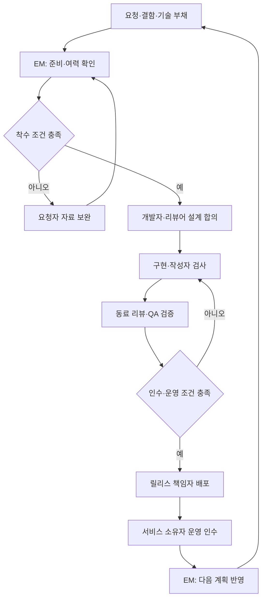
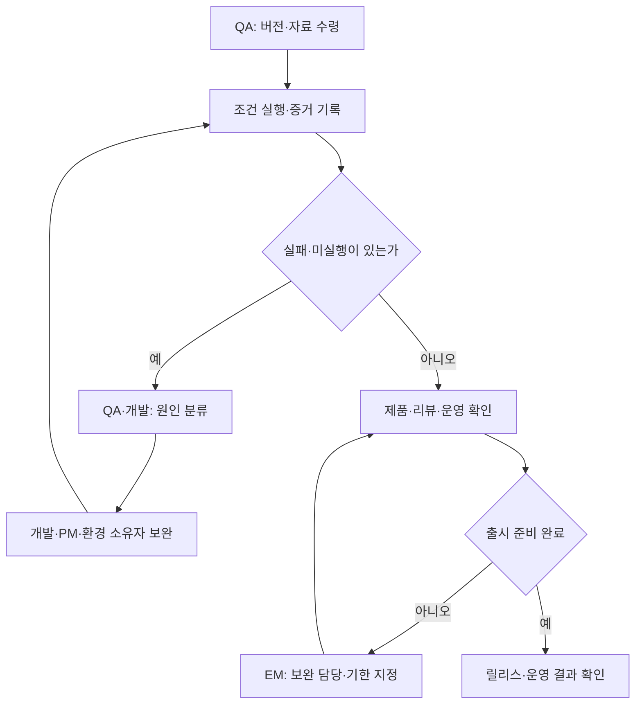

[시리즈 종합편과 전체 목차](/96/scenario-modeline-17-company-overview)

> 가상 의류몰 모드라인의 개발 조직 운영을 설명한다. 인물·검사 기록·실행 계약은 창작이며 이 저장소 기능의 실제 테스트 결과가 아니다. 운영 지표의 집계 방식과 실행 상한은 별도로 정한 내부 가정이다.

오전 9시 30분, 개발팀은 PM 이지은이 넘긴 `DEV-F26-012`를 연다. 사이즈 선택 순간에 실측과 판매 상태를 보여 주는 요청이다. 구현은 짧아 보이지만 리뷰할 사람과 QA 환경이 없으면 완료 날짜를 약속할 수 없다. 개발자는 어떤 코드를 바꿀지와 함께 누가 검사하고 누가 운영할지를 확인한다.

개발 업무는 코드 작성, 동료의 코드 검토, 고객 행동 검증, 실제 서비스 반영, 이후 결함 처리로 이어진다. QA는 약속한 행동과 위험을 검증하는 품질 업무이고, 릴리스는 특정 버전과 설정을 고객에게 제공하는 변경 단위다. 코드를 저장한 시점, 검토가 끝난 시점, 고객이 사용한 시점은 다르다.

## 개발 15명은 서비스 소유권과 검토 책임을 나눠 가진다

모드라인의 개발 조직은 CTO 1, EM 1, 커머스 백엔드 4, 프런트엔드 3, 데이터·추천 2, 플랫폼·SRE 2, QA 2명이다. EM은 작업 배정과 팀의 실행 여력을 조정하는 개발 관리자다. 제품·디자인 6명은 이 15명에 포함하지 않는다. 이 글과 다음 세 편은 같은 개발 조직의 업무를 나눠 설명한다.

| 역할 | 반복해서 책임질 일 | 결정·인계 경계 |
|---|---|---|
| CTO 강태준 | 기술 방향·위험, 인력·투자 우선순위 | 모든 PR의 유일한 승인자가 되지 않음 |
| EM | 계획, 진행 중 작업, 리뷰·QA 용량, 인수인계 | 제품 범위 변경은 지은과 합의 |
| 서비스 개발 담당 | 설계·구현·리뷰·서비스 결함·운영 절차 | 자신이 만든 서비스의 장애 분석을 계속 맡음 |
| QA 조은서와 동료 | 인수 조건·경계조건·회귀·검증 증거 | 실패를 지우지 않고 출시 위험을 제시 |
| 플랫폼 최현우와 동료 | 공통 실행·배포·관측·복구 기반 | 상품·결제 정책을 대신 결정하지 않음 |

PR은 코드 변경을 동료에게 검토받는 묶음이다. 작성자는 변경 목적과 영향을 설명하고 리뷰어는 정확성, 유지보수, 실패 경로를 확인한다. QA에게 모든 품질 책임을 넘기지 않는다. 개발자가 구현 단계에서 자기 검사를 수행하고, 은서는 고객 여정과 부서 간 상태 연결에서 빠진 위험을 찾는다.

정기 산출물은 주간 실행 계획, 설계 결정, 검토된 변경, QA 기록, 릴리스 기록, 운영 인수 확인, 결함·기술 부채 목록이다. 기술 부채는 지금의 편의를 위해 남긴 구조나 반복 작업이 이후 변경 비용·장애 위험을 키우는 상태다. 막연히 코드를 정리하고 싶다는 제안과 영향이 확인된 부채를 구분한다.

## 착수할 일은 팀의 실제 여력 안에서 정한다

월요일 EM은 새 요청보다 진행 중 작업, 리뷰 대기, 운영 대응, 휴가·교육 시간을 먼저 본다. 한 명이 구현과 리뷰를 모두 맡는 시간을 이중 계산하지 않는다. 다음 주 검토자가 비어 있다면 더 많은 구현을 시작하는 대신 기존 변경을 작게 나누거나 출시 순서를 조정한다.

준비 완료 요청에는 문제와 범위, 원천 계약, 상태별 디자인, 인수 조건, 제외 범위, 운영자가 있어야 한다. 빠진 정책은 PM에게 반환한다. 기술적 불확실성은 짧은 조사 작업으로 분리해 확인할 질문과 종료 조건을 적는다. 조사 중이라고 기능 구현 전체가 착수된 것으로 계산하지 않는다.

계획 회의에서 고정하는 것은 변경 단위, 담당자·리뷰어·QA, 선행 자료, 검증 환경, 예상 완료 범위다. 예상이 달라지면 이유를 기록하고 지은과 범위·일정을 다시 선택한다. 긴급 거래 장애가 들어와 기존 일을 멈췄다면 운영 대응 시간이 계획에서 사라지지 않게 한다.



준비 부족은 작성자의 속도로 해결할 문제가 아니다. 반면 합의한 동작을 구현하지 못한 실패는 다시 구현으로 돌아간다. 마지막 운영 인수에서는 실제 확인할 화면, 오류 신호, 복귀 방법을 받은 사람이 읽고 수행할 수 있는지 확인한다. 배포 파일만 전달한 일은 운영 인수 완료가 아니다.

## 설계 검토는 데이터와 복구까지 설명할 수 있을 때 끝낸다

담당 개발자는 DEV-F26-012의 현재 선택 흐름을 읽고 상품 실측·SKU 상태를 어디서 받는지 확인한다. 화면 영역이 작더라도 조회 시점과 구매 시점의 재고가 다를 수 있다. 정상 상태뿐 아니라 빈값, 늦은 응답, SKU 삭제, 선택 후 품절을 어떻게 표현할지 설계에 남긴다.

설계 문서는 영향을 받는 화면·서비스·데이터, 외부 계약, 검증 방식, 관측 항목, 호환·복귀 조건을 담는다. 모든 변경에 큰 위원회를 열 필요는 없다. 한 화면의 국소 변경은 담당자와 리뷰어가 검토하되, 결제 상태나 공통 데이터 계약을 바꾸면 관련 서비스 소유자와 QA가 함께 확인한다.

| 설계 질문 | 이 요청의 결정 | 검토 증거 |
|---|---|---|
| 어떤 사실을 표시하는가 | 승인 실측과 현재 SKU 상태 | 상품 계약·자료 버전 |
| 없는 값은 어떻게 보이는가 | 미등록 안내, 임의 치수 생성 없음 | 빈값 시안·시험 자료 |
| 재고가 바뀌면 누가 확정하는가 | 주문 단계에서 다시 확인 | 실패 안내와 구매 경로 검사 |
| 어디까지 바꾸는가 | 상세 선택 영역과 관련 검사 | 허용 범위·제외 목록 |
| 문제가 생기면 무엇을 되돌리는가 | 새 화면 노출을 끄고 기존 화면 복귀 | 기능 설정·복귀 절차 |

데이터 구조 변경이 필요한 작업에서는 신·구 버전이 함께 동작할 기간과 되돌릴 수 없는 변경을 따로 적는다. 프로그램 버전 복귀로 이미 승인된 결제나 외부 출고가 사라지는 것은 아니다. 거래 보정은 커머스·재무의 별도 확인 절차로 넘긴다.

작성자는 기준 버전에서 기존 검사를 먼저 확인하고, 변경 목적과 관련 없는 정리를 한 PR에 섞지 않는다. 리뷰어가 한 번에 판단할 수 없는 크기라면 사용자에게 의미 있는 동작 단위로 나눈다. 리뷰 도중 요구를 바꾸는 의견이 나오면 원래 인수 조건과 개선 제안을 구분해 PM과 결정한다.

## QA는 실행한 조건과 반려 이유를 같은 버전에 남긴다

은서는 요구와 시험을 연결한 표를 준비한다. 단위 검사는 작은 규칙, 통합 검사는 연결된 구성요소, 사용자 여정 검사는 실제 화면에서 시작부터 결과까지의 흐름을 확인한다. 자동 검사로 볼 수 없는 조작·문구도 있고, 화면 관찰만으로 확인할 수 없는 중복 처리도 있다.

검사 자료에는 환경·코드 버전, 준비 상태, 조작 순서, 기대 결과, 실제 결과, 통과·실패·미실행을 남긴다. 이미 실패한 검사를 수정 결과에 맞춰 기대값만 바꾸지 않는다. 불안정하게 통과하는 검사는 성공률을 높이려고 몰래 제외하지 않고 소유자·영향·보완 검사·해결일을 둔다.

| 검사 묶음 | 확인할 내용 | 통과해도 별도로 남는 판단 |
|---|---|---|
| 정적·타입 검사 | 계약 불일치와 기본 오류 | 고객이 의미를 이해하는가 |
| 규칙·통합 검사 | 품절·누락·재조회·상태 경계 | 실제 브라우저에서 조작 가능한가 |
| 브라우저 검사 | 모바일·데스크톱·키보드·오류 안내 | 다양한 고객의 사용성 |
| 독립 인수 검사 | 합의한 사용자 행동과 제외 범위 | 운영 준비와 출시 시점 |
| 회귀 검사 | 기존 선택·구매 흐름의 유지 | 모든 미래 결함의 부재는 아님 |



QA가 실패라고 적었다고 모두 같은 코드 수정이 필요한 것은 아니다. 환경 접속 실패라면 환경 소유자가 복구하고 같은 검사를 수행한다. 기대 결과가 모호하면 PM이 계약을 확정한다. 합의한 키보드 행동을 구현하지 못했다면 인수 조건의 결함이므로 구현을 고친다.

기존 가상 QA 기록에서는 12개 중 11개가 통과하고 색상 변경 뒤 키보드 초점이 사라지는 1개가 실패했다. 담당 개발자는 마우스로는 정상이라고 설명했지만 키보드는 처음부터 약속한 조건이었다. 출시 날짜를 맞추려고 실패한 항목을 목록에서 빼지 않는다.

| 가상 QA 기록 | 판단 | 다음 결과 |
|---|---|---|
| 첫 검토 11개 통과 | 판매 상태·실측·빈값 등의 준비된 조건 충족 | 수정 후 회귀에 포함 |
| 초점 검사 1개 실패 | 원래 인수 조건 미충족 | 이벤트 처리 범위를 좁혀 수정 |
| 수정 후 같은 12개 통과 | 새 코드 버전에서 가상 재검사 완료 | 코드 리뷰·제품 확인으로 인계 |

11÷12는 이 검사 집합의 첫 통과 비율일 뿐 출시 성공률이나 DORA 변경 실패율이 아니다. 수정 후 12개 통과도 실제 운영 결함이 없다는 보장이 아니다. 은서는 화면 크기·조작 순서·결과를 새 버전 증거에 연결하고 지은은 미등록 안내가 이해 가능한지 확인한다.

## 릴리스는 배포 준비와 고객 노출을 함께 관리한다

릴리스 담당자는 변경 목록, 승인 버전, 남은 위험, 운영 알림, 고객 안내, 복귀 조건을 한 기록으로 받는다. 코드가 병합됐어도 외부 계약이나 운영 인수 준비가 부족하면 릴리스 대기다. 배포와 기능 노출을 분리하는 작업이라면 두 시각과 설정 버전을 모두 남긴다.

먼저 제한된 범위에서 적용하고 합의한 오류·지연·업무 신호를 확인한다. DEV-F26-012에서는 선택 상태와 실측 안내, 구매 경로를 운영자가 확인한다. 새 화면의 결함이 드러나면 노출을 중단하고 기존 화면으로 복귀하며, 이미 발생한 고객 문의나 거래는 별도로 처리한다.

운영 인계에는 서비스 담당자와 대체 담당자, 확인 화면, 위험 신호, 조치 순서, 도움을 요청할 상대가 필요하다. 현우가 문서를 받았다는 표시만으로 서비스 개발자의 책임이 사라지지 않는다. 배포 후 이상을 조사할 개발자가 누구인지 근무 교대 전에 확정한다.

결함은 영향 고객·거래, 재현 조건, 임시 조치, 원인 조사, 영구 수정으로 이어지는 하나의 기록으로 관리한다. 재현이 아직 안 됐다는 이유로 고객 영향을 지우지 않는다. 긴급 수정 후에는 같은 실패 유형을 막는 검사와 관측, 팀의 작업 방식까지 검토한다.

## 기술 부채와 개발자의 여력을 정기 계획에 포함한다

기술 부채 카드는 “모듈을 정리한다”에서 멈추지 않는다. 반복 결함이나 변경 지연의 근거, 현재 위험, 제안 대안, 작업 범위와 검증 조건을 적는다. 예를 들어 같은 SKU 상태를 여러 화면에서 다르게 해석한다면 계약 통일과 회귀 검사 보완을 후보로 비교한다. 전면 개편이 항상 첫 대안은 아니다.

EM은 기능·결함·보안 보완·운영·부채 작업 시간을 같은 계획에서 본다. 남는 시간에만 부채를 처리한다면 남는 시간이 없는 팀에서는 계속 미뤄진다. 위험과 근거를 지은·태준에게 설명하고 분기 여력 안에서 개선 슬롯을 확보한다. 비율 목표를 업계 정답처럼 만들지는 않는다.

리뷰가 특정 개발자에게만 몰리면 문서와 동료 학습으로 대체 가능한 범위를 넓힌다. 휴가 전에 운영·설계 지식을 넘기고, 새 동료가 기존 절차로 작은 변경을 검토할 수 있는지 확인한다. 생성된 코드 양으로 여력을 판단하면 리뷰·교육·사고 대응 노동이 사라진다.

## 일·주·월의 검토를 분기와 연간 투자에 연결한다

| 주기 | 입력과 담당자의 결정 | 산출물·다음 수신자 |
|---|---|---|
| 매일 09시 | 야간 장애·실패 검사·릴리스 이상을 서비스 소유자가 분류 | 긴급 조치와 고객 영향, EM 일정 조정 |
| 매일 업무시간 | 구현·리뷰·QA의 막힌 조건과 남은 범위 확인 | 작은 검토 묶음, 보완 질문·수락 |
| 매일 14시 전후 | 출고 연동 변경이 있으면 운영 마감 영향 확인 | 물류·커머스의 보류·관찰 조건 |
| 매일 17시 | 진행 코드·검사 버전·미완료·대체 담당자 확인 | 다음 근무자 인계와 운영 대응 경로 |
| 매주 | 준비 요청, 진행 수, 리뷰·QA 적체, 휴가·운영 여력 | 실행 계획·릴리스 순서·범위 변경 |
| 매월 | 서비스별 전달 지표, 결함·재작업·부채·환경 비용 | 개선 과제, PM·경영에 위험과 여력 보고 |
| 분기·시즌 | 로드맵·피크 일정·누적 사고·외부 계약 변경 | 기술 투자·호환 전환·훈련 계획 |
| 매년 | 연간 사업 방향, 유지 서비스, 인력·기술 수명 | 다음 해 인력·예산·주요 개선 제안 |

전년도 10~12월에는 제품·경영의 다음 해 계획을 받아 필요한 개발 여력과 서비스 유지 비용을 계산한다. 과거 처리량을 그대로 약속하기보다 장애 대응·교육·휴가·검토 시간을 반영한다. 신규 사업이 기존 시스템에 주는 영향을 먼저 조사할 일정도 제안한다.

1~3월에는 전년 결함과 전달 흐름을 검토하고 승인된 첫 계획을 실행한다. 4~6월에는 상반기 적체와 가을 준비를 맞춰 하반기 여력을 갱신한다. 7~9월에는 가을 판매와 피크 대응을 앞두고 릴리스·복귀·대체 담당자 준비를 확인한다. 10~12월에는 연말 운영과 다음 해 기술 투자안을 함께 정리한다.

분기 검토가 곧 대규모 일괄 배포를 뜻하지는 않는다. 고객 변경은 작은 단위로 전달하고 투자·의존성은 긴 주기로 조정한다. 월간 개선 과제는 다음 주 담당자와 완료 조건으로 내려와야 한다. 회고 문서만 늘고 다음 배정이 없으면 운영 방식은 달라지지 않는다.

## DORA 다섯 지표와 내부 대기 지표를 함께 읽는다

2026-09-12 확인한 DORA 공식 가이드는 변경 리드 타임, 배포 빈도, 실패 배포 복구 시간, 변경 실패율, 배포 재작업률의 다섯 지표를 설명한다. 변경에서 운영까지 걸리는 시간과 안정성을 함께 보며 서비스별 맥락을 유지한다. 모든 원인의 장애 복구 시간을 실패 배포 복구 시간과 혼용하지 않는다. [DORA의 소프트웨어 전달 성과 지표](https://dora.dev/guides/dora-metrics/)

아래의 28일 창, 사건 연결 방식, 중앙값·p90 선택은 모드라인의 내부 집계 계약이다. 기간은 한국 시간의 최근 완료된 28일이며 매주 추세를 보고 매월 원인을 검토한다. 한 서비스에서 운영 버전·설정을 바꾸는 고유 릴리스 ID를 배포 단위로 센다. 단계적 확대는 같은 ID로 묶고 새 롤백·긴급 수정 릴리스는 별도 ID로 기록한다.

분모·누락·잠정치 표시는 [시리즈 공통 해석 규칙](/96/scenario-modeline-17-company-overview#지표의-공통-해석-규칙을-먼저-맞춘다)을 따른다.

### 지표의 계산 기준을 한눈에 본다

| 지표·단위 | 계산·관찰 기준 | 원천·책임·검토 주기 |
|---|---|---|
| 변경 리드 타임 | 기간 내 처음 운영 반영된 변경별 최초 해당 커밋 시각부터 운영 반영까지 경과 시간의 중앙값·p90 | 버전관리·배포 매핑 / EM·서비스 소유자 |
| 배포 빈도 | 기간 내 운영에 반영된 고유 릴리스 수÷28일 | 배포 이력 / 서비스 소유자·플랫폼 |
| 실패 배포 복구 시간 | 기간 내 실패가 발생한 배포별 서비스 영향 시작부터 정상 확인까지 시간; 복구 완료 건의 중앙값·p90 | 배포·사고 타임라인 / 서비스 소유자 |
| 변경 실패율 | 기간 내 배포 중 즉각 개입이 필요했던 고유 릴리스 수÷기간 내 릴리스 수×100 | 배포·사고 연결 / 서비스 소유자·QA |
| 배포 재작업률 | 기간 내 운영 사고로 발생한 계획 밖 릴리스 수÷기간 내 릴리스 수×100 | 릴리스 사유·사고 ID / EM |
| 첫 리뷰 대기 시간 | 기간 내 첫 실질 리뷰가 시작된 PR별 리뷰 준비부터 첫 리뷰까지 시간의 중앙값·p90 | PR 상태·리뷰 기록 / EM |
| 부채 조치 기한 준수율 | 월내 기한인 부채 조치 중 기한까지 검증·수락된 수÷그달 기한인 조치 수×100 | 부채·검증 이력 / EM·태준 |

### 수치를 해석하고 다음 행동으로 연결한다

실패를 배포에 귀속하는 관찰은 배포 후 7일을 내부 초기 조사 창으로 두되, 나중에 인과 근거가 확인되면 해당 배포 집단을 정정한다. 최근 배포의 변경 실패율은 잠정치다. 배포 자체가 운영에 도달하지 않은 빌드 실패는 배포 분모에 넣지 않고 준비 단계 실패로 별도 보고한다.

배포 재작업률은 실패한 배포가 몇 개인지를 세는 변경 실패율과 다르다. 하나의 실패 배포가 여러 긴급 수정 릴리스를 만들 수 있다. 같은 서비스 안에서도 정의를 바꾸면 이전 기간을 재집계하거나 비교 단절을 표시한다. 공통 코드 변경은 서비스별 실제 배포에 연결하되 여러 서비스 수치를 합쳐 개인 순위를 만들지 않는다.

| 지표 | 해석할 때 주의할 점 | 다음 행동 |
|---|---|---|
| 변경 리드 타임 | 미배포 변경은 분포에 없으므로 대기 건수·최장 나이를 병기 | 오래된 변경의 리뷰·테스트·릴리스 병목 분리 |
| 배포 빈도 | 무의미한 쪼개기로 늘리지 않음; 실패·재작업 동시 확인 | 일괄 변경의 의존성과 승인 대기를 축소 |
| 실패 배포 복구 시간 | 미복구 건수·현재 경과를 병기; 사고 없는 창은 0 대신 해당 없음 | 탐지·판단·복귀·검증 중 느린 단계 훈련 |
| 변경 실패율 | 사고 미신고·귀속 지연 감시, 최근 값 잠정 표시 | 실패 유형을 인수·회귀·배포 관찰에 추가 |
| 배포 재작업률 | 계획된 유지보수와 사고 긴급 수정을 구분 | 반복 사고와 급한 수정의 추가 결함 조사 |
| 첫 리뷰 대기 | 자동 봇 댓글은 리뷰 시작으로 세지 않음; 미리뷰 잔량 병기 | 리뷰어 배정·작업 크기·리뷰 시간 조정 |
| 부채 기한 준수 | 기한 연장 전후를 보존, 닫은 티켓만으로 완료 불인정 | 근거·범위를 재검토하고 여력 또는 대안 확정 |

0건인 분모는 해당 없음, 누락된 기록은 집계 불가로 표시한다. p90은 관측값을 정렬했을 때 90% 지점의 경과 시간이며 소수 표본에서는 표본 수와 개별 큰 사례를 함께 읽는다. 목표와 실적은 구분하고 이 표를 개발자 한 명의 자동 평가 기준으로 쓰지 않는다.

## 개발·AI 활용은 업무 운영과 구분해 설계한다

### 실행 계약은 업무 요청과 개별 실행을 구분한다

개발 하네스는 모델에게 도구를 주는 실행 환경과 권한·검증·기록을 묶은 체계다. `DEV-F26-012`는 제품 요청, `H-F26-012`는 그 요청을 수행하는 업무 작업이다. 재시작할 때는 하위 실행 ID를 새로 만들며 모델 호출을 새 기능 완료로 세지 않는다.

아래는 제안 계약의 일부이며 특정 도구의 실제 설정 파일이 아니다. 경로도 모드라인 설계상의 경로다.

```yaml
task_id: H-F26-012
request_id: DEV-F26-012
scope:
  - apps/storefront/product-detail/
  - tests/storefront/size-selector/
limits:
  wall_time_minutes: 20
  tool_calls: 80
  repair_attempts: 2
  model_cost_usd: 5
acceptance_suite: size-selector-v1
completion: ready_for_review
```

20분·80호출·수정 2회·5달러는 초기 실험 상한이며 달성 성능이나 권장 업계 기준이 아니다. 실행기는 호출별 제한과 누적 사용량을 관리한다. 비용 집계가 늦는 제공자는 요청별 예상 상한도 두어 초과 폭을 제한한다. 검토 준비 상태는 사람의 승인·릴리스와 분리한다.

### AI에게는 격리 구현과 증거 묶음을 맡긴다

입력은 승인된 요청·디자인·API·기준 코드와 검사다. 허용한 작업공간에서 조회·코드 수정·시험·초안 PR 준비를 수행하게 한다. 운영 고객 데이터·비밀값·배포 권한을 주지 않고, 인수 조건이나 CI 통과 기준을 임의로 변경하지 못하게 권한과 변경 검사를 둔다.

출력은 코드 차이, 검사 버전과 결과, 실행하지 못한 조건, 남은 질문이다. 코드 기반 검사, 보조 모델 검토, 담당자의 설계·화면 검토가 서로 다른 근거를 남긴다. 모델의 완료 문구 대신 실제 산출물과 검증 기록으로 상태를 바꾼다. [Anthropic의 에이전트 평가 설명](https://www.anthropic.com/engineering/demystifying-evals-for-ai-agents)

중단 후에는 변경 파일과 검사 상태를 저장하고, 다음 실행이 실제 파일과 기준 버전을 다시 대조한다. 기준 코드가 바뀌면 오래된 성공 결과를 재사용하지 않는다. 작은 변경과 다음 실행용 기록을 남기는 접근은 Anthropic의 장시간 실행 설계에서도 다룬다. 이 문서의 제안이 해당 실험 성과를 재현했다는 뜻은 아니다. [Anthropic의 장시간 하네스 설계](https://www.anthropic.com/engineering/effective-harnesses-for-long-running-agents)

### 채택된 변경의 전체 비용으로 도입을 평가한다

같은 실패의 수정 상한에 닿으면 요구·환경·구현 문제를 담당 개발자와 은서가 분류한다. 재호출로만 해결하려 하지 않는다. 비용은 채택된 변경을 분모로 모델·환경 비용과 사람의 검토·재작업·교육·운영 시간을 함께 본다. 비교 가능한 작업 집단이 없으면 개선률을 선언하지 않는다.

별도 기술 심화에서는 격리 작업공간과 권한 검사, 검사 증거의 코드 버전 연결, 중단·재개 상태 복구, DORA 사건·배포 매핑을 다룰 수 있다. 이 장의 완료 조건은 그런 도구를 도입했다는 사실이 아니라, 개발팀이 무엇을 수락하고 검증하고 운영에 넘기는지 설명할 수 있는 것이다.
