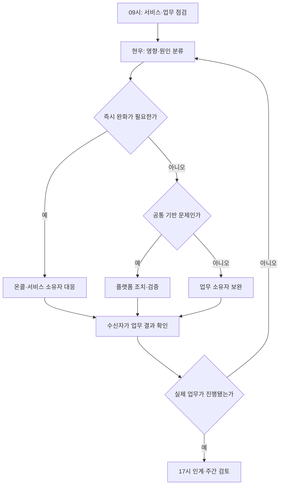
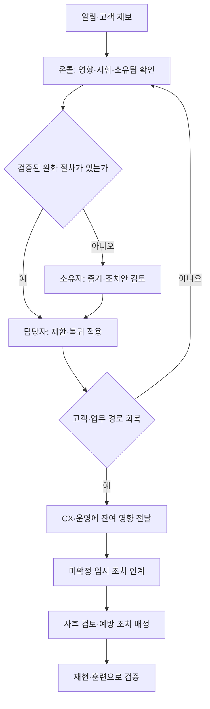
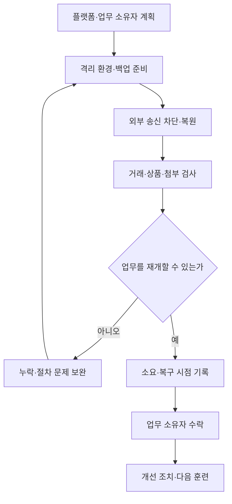

[시리즈 종합편과 전체 목차](/96/scenario-modeline-17-company-overview)

> 가상 의류몰 모드라인의 플랫폼 운영 모델이다. 플랫폼·SRE 2명은 개발 15명에 포함된다. 대기열·훈련·목표는 설계와 가상 자료이며 서비스 가용성이나 복구를 실제 검증한 결과가 아니다.

오전 9시, 최현우는 서버 사용률보다 밤새 끝나지 않은 고객·직원 업무부터 본다. 결제 결과가 미확정인지, 창고가 주문을 받았는지, 검색이 오래된 상품을 보여 주는지, 검토를 기다리는 작업이 있는지 확인한다. 서버가 켜져 있다는 사실만으로 회사가 정상 운영 중이라고 말할 수 없기 때문이다.

플랫폼팀은 개발자가 공통으로 사용하는 실행·배포·관측·권한·복구 기반을 운영한다. SRE는 서비스의 신뢰성을 유지하는 공학·운영 업무다. 두 명이 모든 서비스의 야간 문제와 업무 규칙을 독점하는 구조로 만들지 않는다. 서비스 소유자, 업무 담당자, 대체 담당자가 함께 대응하도록 절차와 증거를 준비한다.

## 공통 기반과 서비스의 책임을 나눠야 두 명이 운영할 수 있다

현우는 서비스 목록마다 소유자·대체 담당자, 고객 기능, 외부 의존, 중요 데이터, 관측·복구 절차를 연결한다. 새 서비스를 받으면 코드가 배포되는지만 보지 않고 장애 때 누구에게 연락하고 무엇을 줄이거나 복구할 수 있는지 확인한다. 이 정보가 없으면 운영 인수의 미완료 항목으로 남긴다.

| 영역 | 플랫폼이 책임질 일 | 함께 책임지는 사람 |
|---|---|---|
| 관측·알림·온콜 | 공통 수집·알림·연락·교대 절차 | 서비스 소유자가 업무 오류·복구 판단 |
| 배포 기반 | 승인 버전 전달·설정·복귀 경로 | 개발·QA가 변경의 정확성 검증 |
| 용량·비용 | 사용량·한도·자원 배분과 비용 근거 | 서비스 소유자·재무가 필요·예산 결정 |
| 계정·보안 | 접근 통제·이력·취약점 조치 체계 | 자료 소유자 승인, 피플이 직무·퇴사 확정 |
| 백업·복원 | 저장·복원 경로·격리 훈련·결과 기록 | 데이터·커머스·재무가 업무 정합성 확인 |
| 외부 서비스 | 의존·만료·장애 연락·대체·종료 관리 | 계약·예산 소유자가 조건과 갱신 승인 |

온콜은 장애 알림을 받고 대응을 시작할 차례의 담당자다. 근무표에는 1차 담당자와 대체·상향 연락 경로, 인수 시각, 조치할 수 있는 범위를 둔다. 커머스 장애는 커머스 담당자가 조사하고 현우는 공통 환경을 지원한다. 담당 공백이 생기면 EM·태준이 근무·범위를 조정하고 기능 확장을 포함한 계획을 다시 검토한다.

피로와 반복 야간 호출도 운영 입력이다. 사후 기록에는 호출 시각·원인·실제 필요 조치·소요와 다음 근무 영향이 남는다. 개인이 기억으로 처리한 일을 반복 정상 운영으로 받아들이면 휴가나 교체 때 서비스가 멈춘다. 다른 담당자가 문서를 읽고 같은 확인을 수행할 수 있어야 인계가 성립한다.

## 서비스 목표는 고객이 성공한 요청으로 정한다

SLI는 서비스 수준을 읽는 측정값이고 SLO는 그 측정값에 대해 합의한 목표다. 예를 들어 상품 조회가 정상 결과를 반환한 비율과 얼마나 빨리 반환했는지는 서로 다른 측정이다. 목표는 고객 영향과 운영 비용을 함께 고려해 업무 소유자·플랫폼이 정한다. 외부 계약상 보상 조건까지 포함하는 SLA와도 구분한다. [Google SRE의 SLI·SLO 설명](https://sre.google/sre-book/service-level-objectives/)

현우는 상품 조회, 주문 상태 조회, 내부 작업 처리처럼 성격이 다른 경로의 목표를 분리한다. 정상적인 품절 안내는 서버 장애와 다르지만, 주문 결과를 알 수 없어서 고객이 다시 결제하는 상황은 중요한 실패 신호다. HTTP 응답 코드와 커머스 미확정 거래 목록을 함께 읽어야 한다.

측정 계약에는 경로·적격 요청, 정상 결과, 지연 측정 시작·끝, 시간 창, 누락 처리, 원천과 담당자를 적는다. 테스트 트래픽을 뺄 경우 규칙을 미리 고정한다. 장애 중 로그가 사라진 구간을 정상 요청으로 채우지 않고 관측 불가로 표시해 측정 기반 자체도 복구한다.

허용 실패량을 오류 예산이라고 부른다. 내부 목표를 비율 `s`, 같은 창의 적격 요청 수를 `N`이라 하면 허용 실패 건수는 `(1−s)×N`이다. 소진 속도가 커지면 새로운 노출 확대를 멈출지, 신뢰성 개선을 우선할지 서비스 책임자와 결정한다. 긴 창과 짧은 창을 함께 보는 경보 설계는 Google SRE의 공식 안내를 참고한다. [SLO 기반 알림 설계](https://sre.google/workbook/alerting-on-slos/)

목표 숫자는 아직 회사 실측으로 확정하지 않았다. 업계에서 자주 보이는 가용성 수치를 그대로 모드라인의 운영 보장으로 쓰지 않는다. 어떤 고객 행동을 어느 비용으로 지킬지 합의한 뒤 실제 관측과 부하·복원 훈련으로 검토한다.

## 매일의 점검은 다음 담당자가 움직일 수 있는 목록으로 만든다

알림을 확인했다는 표시와 업무 복구를 분리한다. 권한을 갱신했더라도 멈춘 작업을 다시 수행하지 않았다면 복구 검증 대기다. 서비스 담당자가 다음 결과를 확인하고 업무 수신자가 인수해야 조치를 종료한다. 밤으로 넘어가는 미완료에는 첫 발견 시각과 다음 확인 담당자를 남긴다.

기존 09시 자료는 하네스로 접수한 업무 24건의 가상 상태다. 하네스는 업무 실행·검증·기록을 관리하는 공통 도구이며 상세 구현은 마지막 절에서 다룬다. 주문 24건이나 하루 전체 회사 실적이 아니다.

| 작업 상태 | 건수 | 다음 행동 |
|---|---:|---|
| 검토·인계 완료 | 12 | 결과와 비용 기록 보존 |
| 사람 검토 대기 | 6 | 검토자와 작업 크기·우선순위 확인 |
| 입력 자료 대기 | 4 | 요청 부서에 누락·재개 조건 전달 |
| 실행 오류 조사 | 2 | 원인·외부 실행 여부 확인 |
| 합계 | 24 | 완료 12·미완료 12를 별도 추적 |

미완료 12건 중 10건은 자료나 사람 검토를 기다린다. 현우는 서버 증설보다 검토 담당자 배정과 자료 보완을 우선한다. 실행 오류 2건은 같은 원인인지 먼저 조사한다. 외부 실행이 이미 일어났는지 모르면 재시작 버튼보다 결과 조회가 먼저다.

이 표의 완료 12÷24는 해당 접수 묶음의 현재 완료 비중이다. 시간별 접수·종료 기록이 없으므로 처리량 향상이나 평균 소요를 계산하지 않는다. 다음부터 실제 실행, 자료 대기, 검토 대기, 재작업 시간을 각각 쌓아 어떤 투자가 필요한지 판단한다.

## 배포 기반과 용량 계획은 서비스의 복귀 조건을 받는다

새 릴리스는 버전·설정·위험·관측·중단·복귀 절차를 함께 받는다. DEV-F26-012의 사이즈 선택 화면은 기존 화면으로 돌아갈 수 있는지, 어떤 운영자가 선택·구매 경로를 확인할지 점검한다. 데이터 변경은 신·구 호환, 적용 순서, 되돌릴 수 없는 부분을 따로 검토한다.

제한된 범위에 먼저 적용한 뒤 오류·지연·업무 신호를 확인한다. 합의한 조건에 닿으면 확대를 중단하고 서비스 소유자가 복귀 또는 보완을 결정한다. 주문량 감소 하나만으로 새 화면 탓이라고 단정하지 않고 다른 캠페인·품절·계측 변화를 함께 확인한다.

용량 검토에는 평균 요청량 외 피크 동시 작업, 큐 대기, 데이터베이스 연결, 외부 호출 한도, 저장 증가를 넣는다. 커머스 요청과 대량 콘텐츠·분석 작업이 같은 자원을 경쟁한다면 거래 경로의 여유를 어떻게 지킬지 정한다. 평균 주문 1,000건/일이라는 회사 배경값에서 피크 부하를 임의 계산해 보장하지 않는다.

비용을 줄일 때는 사용하지 않는 자원, 반복 실패·재시도, 중복 저장, 외부 서비스 계약부터 조사한다. 단순히 가장 싼 장비나 요금제로 바꾸는 결정은 복구 여력과 처리 지연을 함께 검토해야 한다. 현우는 예산 전망과 실제 사용을 재무에 전달하고, 최종 계약·지출은 승인권자의 판단으로 이어진다.

## 사고 대응은 영향 완화와 원인 조사를 나누어 진행한다

장애 알림이 오면 온콜은 실제 고객 영향과 범위를 확인하고 지휘 담당자를 정한다. 지휘·기술 조치·고객 안내의 역할을 구분하되 작은 사건에서는 한 사람이 여러 역할을 맡을 수 있다. 누가 무엇을 맡는지 기록해 중복 명령이나 공백을 막는다.

사건 기록에는 최초 관측, 영향 경로, 최근 변경, 확인된 사실, 가설, 조치와 결과를 남긴다. 원인 확정 전에도 검증된 제한 조치로 영향을 줄일 수 있다. 모델 제공자가 느리면 추천 설명을 기본 목록으로 전환하고 콘텐츠 초안 작업을 대기시킨다. 주문·결제 경로가 정상인지 별도로 확인한다.

프로그램 버전을 되돌려도 PG 승인이나 창고 출고는 자동 취소되지 않는다. 커머스가 원장과 외부 상태를 대조하고 재무·CX·물류가 후속 처리를 맡는다. 현우는 서비스 복구 시각과 미완료 업무의 종료 시각을 따로 기록한다.

사후 검토는 책임질 사람을 정하는 것과 개인 탓을 찾는 것을 구분한다. 발견까지 오래 걸렸는지, 연락이 막혔는지, 복귀 절차가 틀렸는지, 결과 검증이 없었는지를 읽는다. 조치에는 담당자·기한·검증 조건이 필요하다. 회고 문서가 완성돼도 예방 조치가 미검증이면 남은 작업이다.

## 접근 권한과 취약점은 예외의 만료까지 관리한다

계정 요청에는 사용자·서비스 계정, 업무 목적, 대상 데이터·도구, 필요한 작업, 승인자, 만료를 적는다. 데이터·업무 소유자가 필요 범위를 승인하고 플랫폼이 실제 접근을 반영한다. 주문 조회 권한이 환불 실행 권한까지 포함하지 않으며, 인사 자료 접근이 일반 디버깅 권한에 따라 열리지 않게 한다.

입사·직무 변경·퇴사는 김나래의 확정 자료와 연결한다. `ONB-F26-009`는 기존 인원의 교체 입사이며 회사 총원 80명은 유지된다. 필요한 접근 6개 중 5개 준비, 테스트 접근 1개 대기라는 기존 자료에서 현우는 승인과 실제 사용 확인을 나눠 본다. 승인되지 않은 접근을 편의를 위해 다른 사람 계정으로 대신하지 않는다.

취약점은 자산·버전·외부 노출·실제 악용 가능성·업무 영향을 함께 확인한다. 탐지된 모든 항목을 같은 긴급도로 처리하지 않는다. 서비스 소유자가 패치·설정 변경·기능 제한·임시 완화 대안을 검토하고, 적용 후 재검사와 운영 확인으로 닫는다. 위험 수용을 택하면 승인자·이유·만료·재검토 조건을 남긴다.

월간에는 오래된 계정·만료 예외·미처리 취약점·관리자 접근을 점검하고 분기에는 중요 서비스와 외부 계정까지 범위를 확인한다. 보안 사고가 의심되면 확인된 증거를 보존하고 사고 대응 담당자에게 연결한다. 실제 법적 신고·보존 의무는 담당 전문가와 별도 확인하며 임의의 기한을 만들지 않는다.

## 백업은 격리 복원 후 같은 업무가 이어질 때 검증된다

백업 대상에는 거래 데이터뿐 아니라 상품 자료·첨부 참조, 필요한 설정·복구 절차가 포함된다. 현우는 백업 작업 성공과 저장 위치의 접근 가능 여부를 확인한다. 다른 장애 영역의 사본과 복원 권한이 실제로 준비됐는지 검토하고, 보존 범위·비용·접근은 데이터 소유자와 정한다.

RTO는 서비스 중단부터 복구까지 허용하는 시간 목표, RPO는 사고 시점에서 시간으로 표현한 허용 데이터 손실 범위다. 업무 소유자가 고객·거래 영향을 설명하고 플랫폼이 복원 방법·비용을 제시한 뒤 합의한다. [AWS의 재해 복구 목표 정의](https://docs.aws.amazon.com/wellarchitected/latest/reliability-pillar/disaster-recovery-dr-objectives.html)

이 회사의 RTO·RPO 수치는 아직 확정하지 않았다. 백업 주기만 보고 실제 손실 범위를 보장하지 않는다. 연속해서 복원 가능한 마지막 데이터 시점과 외부 거래 대사 범위를 실제로 확인해야 한다.

복원 환경에서 PG·창고·고객 메시지로 요청이 나가지 않게 먼저 확인한다. 오래된 출고 대기 기록이 복원됐다고 실제 창고에 다시 보내면 복구 훈련이 새 사고를 만든다. 외부 거래는 복원한 내부 상태와 실제 외부 결과를 대사해 재개할 범위를 정한다.

검사에서는 주문 A와 `PAY-F26-10482`, `RES-F26-10482`, `EX-F26-021`의 연결을 확인하고 B의 `REF-F26-032`가 원결제에 연결되는지 본다. 이것은 두 사례를 훈련 검증 대상으로 삼는 설계이며 실제 복원 통과 기록은 아니다. 목표 시간 안에 파일을 되살려도 거래 연결이 맞지 않으면 업무 복원은 실패다.

대체 담당자가 절차를 읽고 수행하는 훈련도 필요하다. 현우만 알고 있는 수동 단계가 발견되면 문서를 보완하고 다시 검증한다. 훈련 종료 때 미해결 차이, 실제 소요, 확인 가능한 마지막 데이터 시점, 외부 대사 필요 구간을 업무 소유자에게 넘긴다.

## 외부 서비스는 갱신과 장애와 종료를 하나의 목록으로 관리한다

외부 의존 목록에는 PG, WMS, 클라우드, 메시지·모델 제공자별로 계약·기술 소유자, 지원 연락, 호출·사용 한도, 갱신·종료 통지, 보관 자료와 대체 경로를 적는다. 결제·정산 같은 업무 규격은 커머스·재무가 확인하고 플랫폼은 공통 연결·자격증명·관측의 영향을 조사한다.

제공자가 바뀌면 응답 형식과 속도 외 데이터 이동·보관·권한·비용·장애 복귀를 검토한다. 비필수 설명 기능은 꺼도 거래가 가능한지, 핵심 서비스는 언제 중단하고 고객에게 무엇을 안내할지 정한다. 실제로 검증하지 않은 대체 공급자를 즉시 전환 가능한 백업이라고 부르지 않는다.

계약 종료에는 미완료 작업과 보관 의무 확인, 자료 회수·정리, 계정·자격증명 회수, 비용 종료 확인이 따른다. 서비스가 더 이상 호출되지 않는지 관측하고 재무가 후속 청구를 확인해야 운영 목록에서 닫을 수 있다.

## 일·주·월의 운영 결과를 연간 투자와 연결한다

| 주기 | 입력·담당자 판단 | 산출물·다음 수신자 |
|---|---|---|
| 매일 09시 | 서비스 SLI·업무 미완료·백업·보안 이상 확인 | 소유팀별 조치·사고 인계 |
| 매일 10시 | 판매·캠페인 준비의 의존·용량·변경 확인 | 운영 가능 조건과 제한 조치 |
| 매일 14시 전후 | 창고 마감·거래 연동의 이상·지연 확인 | 커머스·물류의 확인·안내 |
| 매일 17시 | 온콜 교대, 미해결·임시 권한·조치 만료 | 다음 담당자의 수락과 확인 순서 |
| 매주 | 알림·사고·반복 수동 작업·배포·작업 대기 | 경보 조정·개선 우선순위·훈련 준비 |
| 매월 | 신뢰성·권한·취약점·비용·계약·백업 결과 | 경영·재무 보고, 예산·조치 갱신 |
| 분기·시즌 | 피크 전망·복원 훈련·접근 재검토·대체 담당 | 용량·복구·보안·근무 계획 |
| 매년 | 사업 방향·유지 비용·자산 수명·의존 위험 | 다음 해 예산·인력·기반 개선 계획 |

전년도 10~12월에는 다음 해 고객·상품·채널 계획을 받아 필요한 용량과 유지 비용, 담당자 공백, 교체가 필요한 기반을 제안한다. 1~3월에는 전년 사고와 복원 결과를 반영해 승인된 계획을 실행한다. 4~6월에는 상반기 비용·성능과 가을 전망으로 하반기 계획을 고친다.

7~9월에는 가을 판매와 피크 물류·CS 여력에 맞춰 서비스 부하·복귀·온콜 준비를 확인한다. 10~12월에는 연말 운영과 다음 해 계약·예산 준비를 함께 진행한다. 대규모 변경을 어느 시즌에나 무조건 금지하는 규칙 대신 고객 영향과 복귀·대응 여력을 근거로 시점을 정한다.

월간 비용 자료는 청구 확정분과 사용량 추정분을 나누고 재무와 대조한다. 주간에 결정한 개선은 담당자·기한·검증 증거로 이어져야 한다. 서비스 목록을 넓히는 속도가 운영·검토 여력을 앞서면 태준과 범위를 다시 정한다.

## KPI는 고객 영향과 복구 가능성과 운영 부담을 함께 읽는다

아래는 내부 계약이다. 한국 시간으로 보고하며 비율은 분자÷분모×100이다. 상품 조회와 주문 상태 조회 등 경로별로 분리하고 테스트·직원·봇 제외 규칙을 고정한다. 표의 소유자는 지표 관리 책임이며 개인 자동 평가 대상이 아니다.

분모·누락·잠정치 표시는 [시리즈 공통 해석 규칙](/96/scenario-modeline-17-company-overview#지표의-공통-해석-규칙을-먼저-맞춘다)을 따른다.

### 지표의 계산 기준을 한눈에 본다

| 지표·단위 | 계산·관찰 기준 | 원천·책임·검토 주기 |
|---|---|---|
| 조회 가용 SLI | 최근 28일 적격 조회 중 계약상 올바른 응답으로 끝난 수÷같은 적격 조회 수 | 입구 요청·응답·검증 / 서비스 소유자·현우 / 매일·월간 |
| 조회 지연 충족 SLI | 같은 조회 중 정상 응답이며 경로별 합의 지연 이내 완료 수÷전체 적격 조회 수 | 요청 시작·종료 / 서비스 소유자 / 매일 |
| 오류 예산 소진율 | 최근 28일 실패 요청 수÷같은 창의 `(1−s)×N`; 비율 표시 때 ×100 | 가용 SLI·합의 목표 s / 현우 / 매일·이상 시 |
| 업무 복원 검증률 | 분기 예정 훈련 중 기한 내 필수 업무 검사와 소유자 수락을 마친 수÷그 분기 예정 훈련 수 | 훈련·검사·수락 / 현우·데이터 소유자 / 분기 |
| 복원 소요·손실 구간 | 훈련별 가정 서비스 중단부터 업무 수락까지 시간, 가정 사고 시각−연속 복원 검증된 마지막 데이터 시각 | 훈련 시각·원천 대조 / 현우 / 매 훈련·분기 |
| 접근 회수 적기율 | 월내 만료·퇴사·변경으로 회수할 접근 건 중 확정 기한까지 회수·확인한 수÷같은 회수 대상 수 | 피플 확정·권한 이력 / 현우·나래 / 매일·월간 |
| 취약점 조치 적기율 | 월내 기한인 자산·취약점 조합 중 기한 내 재검사 통과한 수÷그달 기한인 조합 수 | 자산·탐지·조치 / 서비스 소유자·현우 / 주간·월간 |
| 조회 1천 건당 기반 비용 | 월내 해당 서비스 배부 기반 비용÷같은 월 적격 조회 수×1,000 | 청구·배부 규칙·요청 / 현우·재무 / 월간 |

### 수치를 해석하고 다음 행동으로 연결한다

적격 조회는 정상 형식·권한으로 서비스가 처리해야 하는 요청이다. 지원하는 품절·없음 안내가 계약상 올바른 결과라면 가용성에서는 정상으로 볼 수 있지만 기술 오류·시간초과는 실패다. 결제 승인 거절이나 미확정 거래는 커머스 지표로 따로 읽는다. 지연은 입구에서 받은 시각부터 응답 완료까지이며 실패·시간초과는 지연 충족 분자에서 제외한다.

오류 예산은 `0 < s < 1`인 합의 목표가 있을 때만 계산한다. 관측 불가 구간이 있으면 소진율의 완전성을 표시하고 측정 복구를 우선한다. 짧은 창의 실패 비율을 `1−s`로 나눈 소진 속도를 보조로 볼 수 있으나, 경보 기준은 부하·고객 영향·오탐을 검증한 뒤 정한다.

복원 검증률과 복원 소요는 다르다. 일찍 실패한 훈련을 빠른 복원으로 기록하지 않는다. 실패 훈련은 상태·현재 경과·누락을 남기며 평균에서 조용히 버리지 않는다. 권한은 사용자 수가 아니라 사용자 또는 서비스 계정과 권한 범위의 조합으로 센다. 하나만 회수하고 그 사람의 모든 접근이 닫혔다고 처리하지 않는다.

| 지표 | 해석할 때 주의할 점 | 다음 행동 |
|---|---|---|
| 조회 가용 SLI | 경로별 분모·관측 누락 병기 | 영향 경로 완화, 서비스 소유자 사고 대응 |
| 지연 충족 SLI | 빠른 오류 응답으로 지연을 좋게 만들지 않음 | 외부 의존·큐·저장·입구 지연 분리 조사 |
| 오류 예산 소진율 | 전체 평균으로 피크 악화 숨기지 않음 | 확대·배포 위험 검토와 신뢰성 작업 우선 |
| 복원 검증률 | 훈련 취소·범위 축소를 과거 분모에서 삭제하지 않음 | 실패 단계 담당자 지정 후 재훈련 |
| 복원 소요·손실 | 실제 확인한 데이터 시점 사용, 목표와 실측 분리 | 저장·절차·권한·외부 대사 경로 보완 |
| 접근 회수 적기율 | 단순 비활성 표시 외 세션·관련 키 등 회수 범위 확인 | 피플 통지와 플랫폼 반영 사이 공백 제거 |
| 취약점 조치 적기율 | 위험 수용을 패치 성공으로 세지 않음; 예외 잔량 병기 | 노출·영향 재평가, 완화·패치·만료 결정 |
| 단위 기반 비용 | 공유비 배부 버전·미청구 추정 병기; 장애로 요청 감소 가능 | 미사용·반복 실패·과도한 자원과 계약을 조사 |

아직 실제 회사 기준선이나 훈련 결과는 없다. 24건 작업 표로 서비스 가용성이나 권한 회수율을 계산할 수 없다. 적체 원인을 분리한 예시와 실제 관측 KPI를 구분하고, 수치가 악화했을 때 누구의 어떤 업무가 바뀌는지부터 정한다.

## 개발·AI 활용은 업무 운영과 구분해 설계한다

### 실행 기반은 업무 작업과 외부 결과를 연결한다

공통 실행기는 접수·실행·검증·승인 대기·외부 요청·결과 확인을 기록한다. `DEV-F26-012`, `H-F26-012`, 개별 실행·도구 호출을 연결하고 거래 조사는 주문·결제·환불 ID로 추적한다. 모델의 비공개 사고 과정 대신 검토 가능한 결과 요약·원천·검사·승인 증거를 남긴다.

커머스 요청과 긴 AI 작업의 자원 풀·대기열을 분리하고 워커의 동시 조회·비용·시간 상한을 둔다. 검토 대기를 실행 자원 부족으로 오해해 동시 실행만 늘리지 않는다. 입력·실행·검토·재작업 시간과 채택 결과를 별도로 집계한다.

### 도구 권한은 승인한 대상과 행동에 묶는다

도구 요청의 사용자·업무·대상·행동·금액·만료를 실행 직전에 검증한다. `REF-F26-032`의 53,100원 환불 승인을 다른 결제에 재사용할 수 없게 한다. 자격증명은 해당 어댑터가 필요한 범위로 사용하고 모델 출력에 포함하지 않는다.

외부 문서·고객 입력은 권한을 바꾸는 지시가 될 수 없다. 최소 권한, 입력·출력 검증, 위험한 행동의 승인·실행 분리는 프롬프트 인젝션 영향을 줄이기 위한 방어다. 이 조합으로 모든 공격을 막았다고 주장하지 않는다. [OWASP의 프롬프트 인젝션 안내](https://genai.owasp.org/llmrisk/llm01-prompt-injection/)

### AI 조사는 확인된 증거와 다음 질문을 제시한다

입력은 마스킹된 관측 기록·최근 변경·승인된 운영 절차다. 읽기 전용 조회와 사고 타임라인 초안을 허용한다. 출력은 사실·가설·근거·미확인 구간이고 지휘 담당자가 확인한 뒤 공지·조치를 결정한다. AI가 제안한 데이터 수정 명령을 검증 없이 실행하지 않는다.

미리 검증한 비필수 작업 접수 중단 같은 제한 조치는 별도 정책 아래 자동화 후보가 될 수 있다. 거래 원장 수정과 같은 권한을 주지 않는다. 조치 실패에는 재시도 상한과 사람의 다음 행동이 필요하다. 도입 효과는 조사 시간뿐 아니라 오탐·재작업·교육·도구 유지비를 포함해 평가한다.

별도 기술 심화에서는 업무 추적 키와 관측 설계, 오류 예산 기반 경보, 권한 승인과 도구 실행 결합, 외부 송신을 막은 복원·재생 훈련, 작업 대기와 비용 배부를 다룰 수 있다. 현재 남은 한계는 실제 부하·복원·보안 검증과 운영 인력의 지속 가능성이다. 설계 문서가 있다는 이유로 그 검증을 대신하지 않는다.
