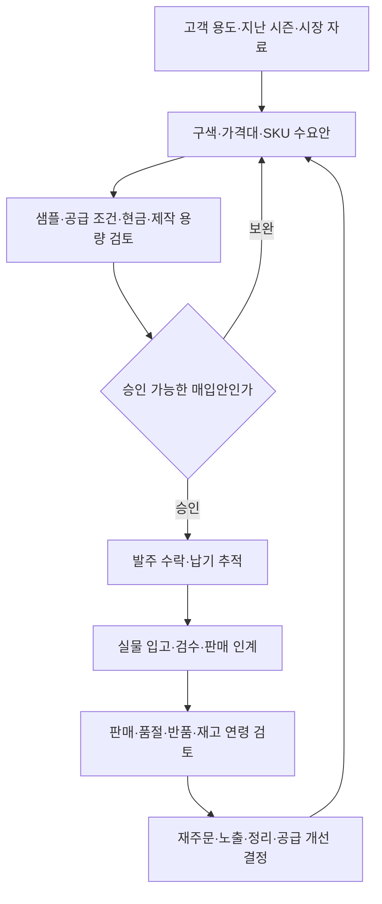
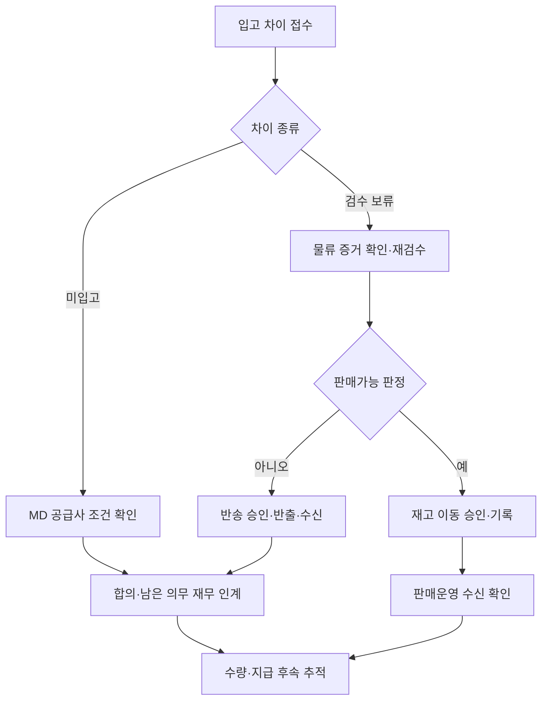

[시리즈 종합편과 전체 목차](/102/scenario-modeline-17-company-overview)

> 가상 회사 모드라인의 가을 시즌 준비를 거슬러 올라간다. 수량·회의·자료는 창작이며 실제 발주나 공급 조건이 아니다.

판매가 시작되기 전, MD 리드 한지민은 출근복 기획에 들어갈 셔츠를 고른다. 지난 상품의 판매량만 보지 않고 사이즈별 품절 기간, 할인, 반품 사유와 공급 기간을 함께 읽는다. 오래 품절된 상품의 적은 판매량을 수요 부족으로 해석하지 않기 위해서다.

지민의 업무는 좋은 상품을 찾는 데서 끝나지 않는다. 어떤 조건으로 사들이고 언제 어떤 상태로 받을지, 회사가 그 비용을 감당할 수 있는지까지 연결한다. 대표 상품 데일리 코튼 셔츠의 기록은 이 자리에서 시작한다.

MD는 이 회사에서 팔 상품의 구성과 매입을 책임지는 담당자다. 발주서는 공급사에 어떤 상품을 얼마나 어떤 조건으로 주문하는지 적은 문서이고, 입고 검수는 실제 도착한 물건이 그 요청과 맞는지 확인하는 과정이다. 주문한 수량과 받은 수량은 따로 기록한다.

## MD는 상품의 선택부터 재고의 마지막 처분까지 책임진다

모드라인의 MD·매입 조직은 12명이다. 이 글에서 나누는 카테고리 기획, 공급사 소싱, 발주 관리, 판매 분석은 그 조직 안의 업무 역할이며 새 부서를 뜻하지 않는다. 한지민은 상품 구성과 매입 제안을 책임지고, 담당 MD는 자기가 맡은 상품군의 가설·진행 발주·판매 후 문제를 끝까지 관리한다.

구색은 상품 수를 많이 채우는 일이 아니다. 고객 용도, 스타일, 가격대, 색상, 사이즈, 계절별로 어떤 선택을 제공할지 정하는 일이다. 스타일 2만 개·SKU 12만 개를 가진 회사에서는 새 상품 도입과 함께 겹치는 상품 축소, 옵션 보완, 판매 종료를 다뤄야 한다.

| 책임 영역 | 담당자가 반복해서 하는 일 | 남기는 정기 자료 |
|---|---|---|
| 고객·카테고리 기획 | 구매 용도, 미충족 가격대, 기존 상품 간 중복과 대체 가능성 검토 | 시즌 구색표·상품 역할·도입/유지/종료 후보 |
| 수요·물량 계획 | SKU별 판매, 품절 시간, 행사, 교환 방향과 반품을 분리해 수요 가설 갱신 | 예측 버전·초도/재주문 제안·재검토 조건 |
| 소싱·샘플 | 후보 공급사 발굴, 샘플 확인, 견적과 생산·납기 능력 비교 | 공급사 비교표·샘플 판정·미확인 질문 |
| 매입·변경 관리 | 승인 범위 확인, 발주 수락, 납기 추적, 수량·조건 변경 협의 | 발주 원본·변경 합의·입고 예정표 |
| 판매·재고 운영 | 옵션별 판매와 가용 재고 확인, 가격 조정·기획전·재주문 대안 제시 | 주간 상품 리뷰·재고 연령표·처분 제안 |
| 공급사 품질·관계 | 입고 차이, 반복 품질 문제, 시정조치와 협의 이행 확인 | 공급사 평가·차이 목록·다음 시즌 협상 자료 |

가격대와 상품의 목표 경제성은 MD가 제안하지만 지급 가능성은 재무가 확인한다. 위임 한도 안의 구매는 정해진 승인권자가 결정하고, 한도 밖의 신규 투자·예외 조건은 경영으로 올린다. 이 원고는 승인 금액 한도를 새로 정하지 않는다. 콘텐츠의 사실 검수, 창고의 실물 판정, 재무의 지급 실행도 각 부서의 책임으로 남는다.

담당 MD가 쉬는 날에는 대체 담당자가 공급사 연락과 납기 확인을 이어 간다. 인수인계에는 진행 발주, 약속한 회신 시점, 아직 승인받지 않은 변경안을 담는다. 개인 메신저에만 있는 합의는 발주 관리자가 근거와 수신자를 등록한 뒤 사용한다.

## 일간 점검이 주간 상품회의와 연간 매입 계획으로 이어진다

아래는 가상 내부 운영 달력이다. 납품업체의 실제 계약 일정이나 업계의 고정 시즌을 뜻하지 않는다. 회의는 보고서 낭독보다 결정이 필요한 차이에 집중하고, 일반 상태 갱신은 담당자가 미리 적는다.

| 주기·회의 | 들어오는 자료·참여 책임 | 결정과 다음 산출물 |
|---|---|---|
| 매일 09시 납기·품절 점검 | 담당 MD, 야간 판매·취소·반품, 가용/예약/입고 예정, 공급사 회신 | 오늘 품절 위험·납기 지연·협의 대기를 배정한 실행 목록 |
| 매일 10시 판매 준비 | MD·콘텐츠·판매운영·그로스가 필요한 상품만 확인 | 판매 가능한 옵션·콘텐츠 준비·행사 대상 확정 또는 보류 |
| 매일 17시 발주 인계 | 담당 MD와 대체 담당, 미수락 발주·미회신 질문 | 다음 확인 시각·담당자·중단된 작업을 남긴 납기표 |
| 매주 상품·수요회의 | 지민, 민수, 유라, 수진의 판매/재고/행사/VOC 자료 | 재주문 검토, 노출 조정, 할인 후보와 추가 조사 배정 |
| 매월 매입·재고 리뷰 | MD·재무, 매입 계획 대비 확정/예정, 재고 연령·평가 자료 | 남은 매입 여력, 장기재고 처분안, 미합의 차이의 다음 조치 |
| 매분기·시즌 공급 리뷰 | 지민·공급사·물류, 납기/품질/반품 및 다음 시즌 초안 | 유지·개선·대체 소싱, 샘플/생산/촬영 일정을 연결한 계획 |
| 매년 계획·협상 | 경영·재무·MD, 고객/상품 가정·시즌별 현금 필요·공급 위험 | 승인된 연간 구색 방향·매입 한도·공급사 협상 과제 |

전년도 10~12월에는 다음 해 고객 용도와 가격대별 구성을 만들고 매입 예산·공급 조건을 검토한다. 1~3월에는 전년 반품까지 확인한 결과를 다음 상품에 반영하고 봄 판매와 다음 시즌 조달을 병행한다. 작년 많이 팔린 상품을 그대로 늘리는 대신 할인·노출·재고가 달랐는지 비교한다.

4~6월에는 여름 운영과 가을 수요·샘플·촬영 준비를 연결한다. 7~9월에는 가을 판매 준비와 파일럿 결과, 피크 입고·출고 용량을 확인한다. 10~12월에는 가을·겨울의 남은 재고와 반품, 미입고·공급사 합의를 정리해 다음 해 계획에 넘긴다. 연간 실적이 없는 현재 사례에서 목표 달성률을 만들어 내지 않는다.

주간 상품회의 자료는 상품별로 지난 결정, 이번 관찰, 원인 가설, 선택지, 필요한 승인 순서로 쓴다. 결론을 못 내리면 “추가 검토” 대신 필요한 자료와 담당자, 언제 다시 결정할지를 남긴다. 월간 회의에서는 지난달 조치가 실제 발주·판매 설정에 반영됐는지도 확인한다.

## 구색과 수요를 먼저 정하고 그다음 매입안을 만든다

상품 계획의 출발점은 판매할 고객과 용도다. 출근복 셔츠라면 일상복과 겹치는 구간, 가격대별 선택지, 반복 구매 가능성, 함께 제안할 하의와의 관계를 본다. 구색표에는 상품이 맡을 역할과 빠져도 되는 이유까지 적는다. 새 스타일 수를 성과로 삼으면 비슷한 상품이 재고와 촬영 대기만 늘릴 수 있다.

수요 표는 스타일 합계에서 멈추지 않고 색상·사이즈로 내려간다. 판매 수량 옆에 판매 가능했던 시간, 가격·할인, 노출, 교환 유입/유출을 붙인다. 품절 중에는 관측 판매가 수요를 가린다. 해당 구간을 정상 판매와 그대로 비교하지 않고 별도 표시하며, 자료가 없으면 추정값과 불확실성을 남긴다.

기준 수요안에 낮은 수요·높은 수요안을 붙이고 공급 기간과 남은 판매 기간에 맞춰 검토한다. 준비할 수량은 판매가능 재고, 기존 고객에게 예약된 수량, 확정 입고 예정, 미확정 납품을 나눠 본 뒤 정한다. 예약분을 이미 제외한 가용 수량에서 다시 빼는 이중 차감도 점검한다.

공급 조건이 좋은데 촬영이나 현금이 준비되지 않으면 매입안을 다시 조정한다. 도표의 판매 인계는 발주 발송으로 완료되지 않는다. 물류가 검수한 상태를 판매운영이 받고, 콘텐츠·그로스가 실제 판매할 옵션으로 계획을 수정해야 한다.

견적은 단가 외에 최소 주문 수량, 색상·사이즈별 묶음 조건, 샘플과 양산품 차이, 납기 확정 방식, 분할 납품, 포장·라벨, 검사, 변경·반송, 지급 조건을 같은 칸에 놓고 비교한다. 확인되지 않은 조항은 싼 가격에 포함된 혜택으로 간주하지 않는다. 두 견적의 비용 포함 범위가 다르면 총액을 먼저 맞춘다.

신규 공급사는 샘플과 실제 납품의 일치, 연락·변경 대응, 생산·출고 증빙을 단계적으로 확인한다. 관계가 오래된 공급사도 반복 지연이나 동일 품질 문제가 있으면 시정조치 담당자와 재평가 조건을 남긴다. 대체 공급 가능성을 검토하되 계약을 일방적으로 바꾼 것으로 서술하지 않는다.

## 시즌 계획에 가설과 재검토 조건을 적는다

지민은 `PLAN-F26-SHIRT`에 고객 용도, 기존 구성에서 비어 있는 가격·스타일 구간, 비교할 상품과 예상 판매 기간을 적는다. 디자인과 수요에 대한 판단은 가설로 표시한다. 미래 주문을 이미 확보한 수량처럼 쓰지 않는다.

| 검토 항목 | 지민이 읽는 근거 | 다음 부서와 합의할 것 |
|---|---|---|
| 상품 구성 | 유사 상품·고객 용도·시즌 계획 | 콘텐츠 촬영과 기획전 위치 |
| 수량 | SKU별 수요 가설·품절·반품 기록 | 초기 발주와 추가 발주 조건 |
| 공급 | 샘플·납기·최소 수량·검수 조건 | 창고 입고 가능일과 차이 처리 |
| 자금 | 견적·지급 일정·다른 발주 | 재무의 지급 가능 여부 |

태준은 이 회의에서 상품을 대신 고르지 않는다. 데이터의 집계 범위와 시스템 제약을 설명한다. 상품 구성은 지민이, 지출 승인 범위는 회사의 위임 규칙에 따라 경영과 재무가 책임진다.

## 샘플과 계약 조건을 확인한 뒤 발주한다

지민은 네이비·아이보리 두 색상과 S·M·L 세 사이즈를 정한다. 샘플 실측과 표시 자료는 소연에게 넘기고, 포장·라벨·입고 규칙은 민수와 맞춘다. 판매 설명에 사용할 근거와 실제 입고 검수 기준이 달라지지 않게 한다.

가상 발주서 `PO-F26-041`에는 각 SKU 100장씩 총 600장이 적힌다. 단가와 공급사 책임 범위는 이 시리즈에서 임의의 실제 계약으로 확정하지 않는다. 수량 흐름은 추적하되 금액 지급은 승인된 별도 조건을 읽어야 한다.

발주를 보낸 뒤 공급사 확인을 받아야 인계가 끝난다. 이메일 전송 성공과 납기 수락은 같은 상태가 아니다. 변경 합의가 생기면 기존 발주를 덮지 않고 변경 이력과 승인자를 연결한다.

## 창고가 받은 실물을 발주 수량과 대조한다

입고 당일 외부 창고가 실물 수량을 기록한다. 모드라인 물류관리 리드 박민수는 `IN-F26-041`에서 발주와 검수 결과를 대조한다. 첫 검수 직후의 가상 스냅샷은 다음과 같다.

| SKU | 발주 | 실물 | 보류 | 판매가능 | 미입고 |
|---|---:|---:|---:|---:|---:|
| SH017-NV-S | 100 | 100 | 2 | 98 | 0 |
| SH017-NV-M | 100 | 98 | 2 | 96 | 2 |
| SH017-NV-L | 100 | 100 | 1 | 99 | 0 |
| SH017-IV-S | 100 | 100 | 1 | 99 | 0 |
| SH017-IV-M | 100 | 98 | 1 | 97 | 2 |
| SH017-IV-L | 100 | 100 | 1 | 99 | 0 |
| 합계 | 600 | 596 | 8 | 588 | 4 |

미입고 4장은 창고에 없는 수량이고, 보류 8장은 실물은 있으나 아직 판매할 수 없는 수량이다. 둘을 같은 “불량 12장”으로 합치지 않는다. 추가 입고, 반송, 보류 해제나 금액 조정은 담당자가 근거를 보고 확정해야 한다.

## 차이를 해결하는 동안 확정된 범위만 넘긴다

민수는 판매가능 588장을 판매운영에 넘긴다. 이 값은 첫 검수 직후의 상태이며 이후 예약·판매·반품에 따라 바뀐다. 그로스팀에 발주 600장을 광고용 가용 수량으로 전달하지 않는다.

지민은 미입고와 보류 내역을 공급사에 각각 확인한다. 재무 남도현에게는 원 발주, 실물 입고, 검수 차이와 협의 상태를 함께 보낸다. 미확정 차이가 있다고 모든 지급을 임의로 막거나, 차이를 무시하고 전액 지급하는 규칙을 만들지 않는다. 계약과 승인 결과에 따른다.

납기가 지연되는 별도 분기라면 소연의 촬영과 유라의 캠페인 일정을 함께 조정한다. 창고가 늦는다는 티켓만 닫아서는 고객에게 약속한 판매일이 정리되지 않는다. 다음 부서가 수정된 일정을 받아 확인해야 한다.

## 검수 보류 여덟 장은 전화가 아니라 판정 기록으로 풀린다

첫 입고 다음 날, 아직 판매를 시작하기 전의 장면이다. 민수는 보류 8장의 위치와 사진, 검수 메모를 창고에서 받는다. 지민은 공급사에 이를 전달하고 재확인할 항목을 정한다. 아래 결과는 이 시리즈에서 추가한 가상 후속 판정이다.

| 후속 처리 | 수량과 대상 | 연결할 기록 |
|---|---|---|
| 재검수 후 판매가능 전환 | 6장 · NV-S 2, NV-M 2, IV-S 1, IV-M 1 | 검수자·판정 근거·재고 이동 |
| 공급사 반송 완료 | 2장 · NV-L 1, IV-L 1 | 반송 접수·창고 반출·공급사 수신 |
| 미입고 확인 계속 | 4장 · NV-M 2, IV-M 2 | 공급사 답변 대기·다음 확인 담당자 |

보류 8장은 6장 해제와 2장 반송으로 나뉜다. 판매 전 스냅샷에서 판매가능은 588장에 6장을 더한 594장이고, 실물은 596장에서 반송 2장을 뺀 594장이다. 발주 600장은 판매가능 594장, 반송 2장, 미입고 4장으로 설명된다. 이후 주문이 발생하면 이 수량을 현재 재고로 재사용하지 않는다.

도현에게 보내는 자료도 수량 594 하나가 아니다. 원 발주, 최초 입고표, 보류 해제 기록, 반송 수신 증거, 미입고 협의 목록이다. 이 자료만으로 지급액을 자동 차감하지 않고 실제 계약과 공급사 합의를 확인한다. 공급사의 수신 확인이 없는 반송은 반송 요청 상태에 남긴다.

판매운영은 확정된 594장을 받았다는 시각을 남기고 콘텐츠·그로스팀은 판매 준비 상태를 다시 읽는다. 지민의 할 일에는 미입고 4장만 별도로 남는다. 해결된 건과 기다리는 건을 나누니 다음날 같은 12장을 처음부터 다시 조사할 필요가 없다.

## 재주문은 판매량 하나로 결정하지 않는다

판매가 시작된 뒤 지민은 SKU별 판매와 품절 시간, 교환 방향, 반품 사유를 함께 본다. 고객 A가 네이비 M에서 S로 교환했다는 한 건은 점검할 신호이지 전체 사이즈 수요를 바꿀 통계적 근거가 아니다.

재주문 제안에는 현재 가용·예약·입고 예정, 공급 기간, 남은 판매 기간과 현금 제약을 적는다. 담당 MD가 대안을 만들고 지민이 수요 근거와 매입 조건을 검토한다. 경영회의에서 승인된 안만 새 발주로 이어진다.

지민이 남기는 일의 결과는 셔츠 600장을 샀다는 사실만이 아니다. 무엇을 근거로 샀고, 얼마를 판매할 수 있게 받았고, 어떤 차이가 아직 미해결인지 설명하는 연결 기록이다. 수요 가설이 틀릴 수 있다는 한계를 남겨야 다음 시즌에 판단을 고칠 수 있다.

## 입고 차이는 수량 복구와 공급 조건 협의를 따로 닫는다

보류 해제는 물류의 실물 판정이 필요하고, 미입고의 해법은 공급사 합의가 필요하다. 공급사에 사진을 보낸 상태와 공급사가 반송을 수신한 상태를 나눠 둔다. 수량 문제가 끝나도 지급·차감 조건이 미확정이면 MD의 협의 목록과 재무의 차이 목록을 연결해 추적한다.

| 가상 인계 카드 | 확정 사실·진행 상태 | 다음 수신자의 완료 기준 |
|---|---|---|
| PO-F26-041 → IN-F26-041 | 발주 600, 최초 실물 596·보류 8·미입고 4 | 민수가 SKU별 원본과 차이 증거를 확인 |
| IN-F26-041 후속 → 판매운영 | 판매 전 해제 6·반송 2, 가용 594 | 최신 재고 반영 시각·판매 대상 SKU 회신 |
| PO-F26-041 차이 → 재무 | 반송 수신 2, 미입고 4는 협의 대기 | 도현이 지급 판단에 필요한 계약·합의를 접수 |
| PLAN-F26-SHIRT → 콘텐츠 | 여섯 SKU, 샘플·속성·표시 근거 | 소연이 누락 자료와 제작 착수 가능 여부 회신 |
| 주간 상품 리뷰 → 그로스 | 최신 가용·품절 위험·유지할 가격 조건 | 유라가 대상 옵션·노출·예산 변경 필요를 확인 |

이 표는 전체 회사 거래 목록이 아니라 대표 상품의 연결 카드다. 미입고 4장을 받는 것으로 끝낼지, 다른 합의를 할지는 여전히 미정이다. 원발주를 594장으로 고치면 요청과 이행의 차이가 사라지므로 원본과 후속 기록을 함께 보존한다.

## 재주문과 장기재고는 같은 회의에서 다른 기준으로 결정한다

재주문은 지금 잘 팔리는 상품을 더 사는 결정이고, 장기재고 관리는 이미 사 둔 상품의 남은 위험을 줄이는 결정이다. 두 업무는 매입 여력과 창고 용량을 공유한다. 판매가 늘어도 반품이 많거나 잔여 시즌보다 공급 기간이 길면 새 물량이 늦게 도착할 수 있다.

재주문 카드에는 현재 수량의 기준 시각, 판매 가능 일수, 진행 발주, 납기 신뢰도, 최소 수량, 예상 판매 종료, 반품 성숙도, 현금 필요 시점을 담는다. 대안은 즉시 발주·소량 분할 협의·다른 상품 노출·발주 보류로 나누고 각 대안의 비용과 놓치는 수요를 설명한다. 확정 전에는 예정 매입과 승인 매입을 합치지 않는다.

장기재고 표는 입고 차수별 잔량과 체류 기간을 유지한다. 재입고가 있었다는 이유로 오래된 재고의 나이를 초기화하지 않는다. 노출이 부족한지, 옵션이 편중됐는지, 설명이 혼동을 주는지, 가격·상품 자체의 문제인지 나눠 본다. 고객 A의 교환 한 건으로 전체 사이즈 발주 비중을 바꾸는 대신 교환 방향과 실측 문의를 추가로 관찰한다.

| 처분 대안 | 검토할 조건 | 승인 뒤 확인할 결과 |
|---|---|---|
| 유지·노출 개선 | 판매 근거가 있으나 노출/정보가 부족한지 | 대상 옵션의 실제 노출, 문의와 판매 변화 |
| 가격·묶음 제안 | 할인 후 분석 경제성, 다른 상품 잠식, 사용 조건 | 승인 가격이 화면·주문에 일치하는지 |
| 공급사 협의 | 계약상 가능한 반송·교환 조건과 비용 | 서면 합의·반출·수신·재무 처리 |
| 판매 종료·별도 처리 | 품질 판정·회수 가능성·잔여 의무 | 노출 종료와 실물/회계 상태의 각각 완료 |

품질 의심 상품을 가격만 낮춰 처리하는 것으로 결론 내리지 않는다. 실물·고객 영향 확인이 먼저다. 다음 시즌 결정 `DEC-F26-REORDER`에서도 추가 대량 발주는 수요·공급·자금 확인 전 보류한다. 현재 자료로 새 발주량이나 시즌 전체 수익을 확정할 수 없다.

## 상품 지표는 단위와 판매 가능 시간을 맞춰 읽는다

다음은 이 회사에 제안하는 내부 KPI 정의다. 목표 수치는 상품군·시즌 기준선을 확보한 뒤 승인한다. 매출만 높이거나 재고만 낮추는 방식으로 개인을 평가하지 않는다.

분모·누락·잠정치 표시는 [시리즈 공통 해석 규칙](/96/scenario-modeline-17-company-overview#지표의-공통-해석-규칙을-먼저-맞춘다)을 따른다.

### 지표의 계산 기준을 한눈에 본다

| 지표·단위 | 계산·관찰 기준 | 원천·책임·검토 주기 |
|---|---|---|
| 판매 예측 WAPE · SKU-주 수량 | 같은 평가 집합의 Σ절대값(고정 예측−실제 판매수량) ÷ Σ실제 판매수량 ×100; 주 시작 전 예측을 고정 | 예측 버전·주문 항목·품절 이력, MD 분석 담당, 주간/월간 |
| 시간 기준 품절률 · SKU-시간 | 판매 계획이 있던 시간 중 가용 0인 시간 ÷ 판매 예정 시간 ×100; 주간, 종료/계획 휴지는 제외 | 판매 계획·가용 상태 이력, MD·민수, 일일 경보/주간 평가 |
| 판매소진율 · 시즌 SKU 수량 | (시즌 누적 출고수량−재판매 재입고된 고객 반품수량) ÷ (시즌 기초 판매가능 수량+기간 중 처음 판매가능으로 확정된 입고 수량) ×100 | 상태별 재고 이동·출고, 담당 MD, 주간/시즌 |
| 납기 수량 충족률 · 발주행 수량 | 합의 납기까지 실물 수령한 수량을 발주행별 약정수량 한도로 합산 ÷ 해당 납기 약정수량 ×100 | 수락 발주·변경 이력·입고, 매입 담당, 주간/공급사 분기 |
| 최초 검수 보류율 · 입고 수량 | 최초 검수 보류 수량 ÷ 실제 입고 수량 ×100; 입고 차수별·월간 | IN 검수 원본, 민수·담당 MD, 일일/월간 |
| 장기재고 비중 · 보유원가 | 상품군별 승인 연령 기준 초과 잔량의 원가 ÷ 같은 시점 전체 보유 재고 원가 ×100 | 입고 차수·잔량·재무 원가, 지민·도현, 월간 |

### 수치를 해석하고 다음 행동으로 연결한다

WAPE는 평가 집합 전체의 실제 판매수량에 대해 절대 오차가 얼마나 큰지 보는 지표다. 여기서 예측과 실제의 판매수량은 성공 결제 항목의 수량으로 맞추고 취소·반품은 별도 설명 자료로 둔다. 품절로 관측하지 못한 수요를 실제 판매라고 만들어 넣지 않는다.

판매소진율은 출고와 재판매 재입고를 명시한 수량 지표다. 최초 보류 해제는 처음 판매가능해진 입고 수량에 한 번 포함하고 고객 반품은 분모에 다시 넣지 않는다. 출고 후 아직 돌아오지 않은 반품은 그 시점에 차감하지 않고 대기 수량을 옆에 표시한다.

교환은 SKU별 실물 이동으로 센다. A의 NV-M이 재판매 가능한 상태로 돌아오면 NV-M의 분자에서 한 장을 빼고, 교환용 NV-S가 출고되면 NV-S의 분자에 한 장을 더한다. 새 결제나 신규 입고로 세지 않는다. 아직 검수 중인 회수품은 차감하지 않으며 그 수량을 별도로 표시한다.

상품 종료와 폐기는 판매소진율의 분자에 넣지 않으며, 초기 재고를 분모에서 빼는 방식으로 소진율을 올리지 않는다. 재분류와 재입고를 중복으로 잡지 않았는지 상태 이동의 원인을 확인한다.

| 지표 | 해석할 때 주의할 점 | 다음 행동 |
|---|---|---|
| WAPE | 품절로 관측 판매가 작아지면 수요 예측 오류와 섞인다. 전체와 품절 없는 평가 집합을 함께 본다 | 오차 큰 SKU의 노출·행사·품절 원인을 분리하고 다음 예측 가정을 수정 |
| 품절률 | 판매 종료 SKU까지 포함하면 무의미해진다. 잘 팔려 생긴 품절도 고객 영향이 있다 | 입고 신뢰도 확인, 대체 노출·재주문·광고 범위 조정 |
| 판매소진율 | 짧은 판매 기간·고할인·반품 대기를 숨기면 비교가 왜곡된다 | 같은 경과기간·할인 조건으로 재분석하고 재주문/처분 선택 |
| 납기 충족률 | 검수 합격률과 다르며, 사후 납기 변경으로 지연을 지우지 않는다 | 지연 이유·약속 변경 원본을 보존하고 공급사 개선/대체 소싱 검토 |
| 검수 보류율 | 보류는 불량 확정이 아니다. 품질 문제와 자료 미비를 나눈다 | 재검수·표시 자료 보완·공급사 시정 요청, 해제까지 체류 추적 |
| 장기재고 비중 | 고가 상품 몇 개가 비중을 좌우하므로 수량·원가를 함께 본다 | 가격·노출·반송·종료 대안과 현금/공간 영향을 재무·운영과 결정 |

## 개발·AI 활용은 업무 운영과 구분해 설계한다

### 상품·발주·재고의 원본과 상태 이력을 연결한다

시스템에는 상품/SKU, 시즌 계획 버전, 발주행, 공급사 수락·변경, 입고 차수, 검수 판정, 재고 이동, 공급사 협의와 지급 근거를 구분해 둔다. 발주 합계를 현재 가용 재고로 노출하지 않는다. 수량 검사는 코드로 수행하고 원본 수정과 후속 이동을 다른 사건으로 남긴다.

실행 화면은 미수락 발주·보류 재고·미합의 차이에 다음 담당자와 확인 시각을 요구하도록 설계한다. 읽기 화면을 열 때마다 예측을 바꾸거나 원본 검수 결과를 재작성하지 않는다. 예약 재고의 포함 여부, 반송 수신과 재무 합의의 독립성은 개발 요청의 인수 조건이 된다.

### AI는 수요 가설과 견적 비교를 돕고 승인자가 근거를 확인한다

입력은 승인된 SKU별 집계, 비식별 반품 사유, 공급사 문서와 정책 버전이다. 출력은 수요 시나리오, 비교표, 누락 질문, 발주·입고 차이 설명과 원문 위치다. 외부 문서의 지시문은 업무 자료로만 취급하고 도구 권한을 바꾸지 않는다.

단가·수량·납기 추출은 원문과 대조하고 합계는 정해진 계산으로 검사한다. 자료가 없는 판매 예측을 확정 주문으로 쓰거나 사진에서 추측한 불량을 재고 상태로 반영하지 않는다. 발주 발송·계약 체결·지급·보류 해제는 각각 승인된 담당자와 실행 절차에 남긴다.

입력 버전·출력·검토자·반려 이유를 보존하고, 평가 자료에는 부분 납품, 납기 변경, 단위가 다른 견적, 600/596/588과 후속 594의 구분을 넣는다. 효율은 초안 시간과 함께 검토·재질문·오발주 위험·도구 비용으로 본다. 실제 개선율은 아직 측정하지 않았다.

별도 기술 심화 후보는 품절을 반영한 수요 예측 평가, 발주·입고 상태 원장, 공급사 문서 추출 검증이다. 이 편은 운영 설계이며 해당 시스템이나 예측 모델을 구현·검증했다는 보고가 아니다.
