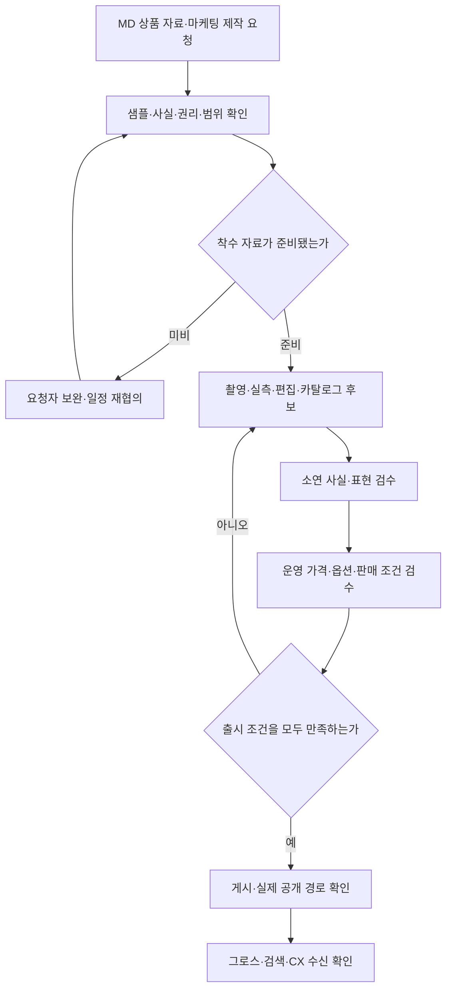
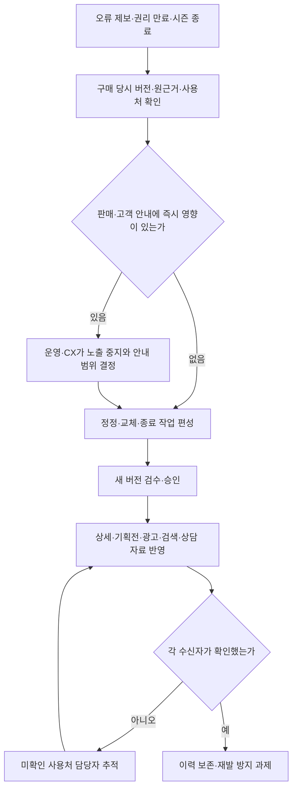

[시리즈 종합편과 전체 목차](/96/scenario-modeline-17-company-overview)

> 모드라인의 상품 제작·판매 준비를 설명하는 가상 기록이다. 소재·촬영·검수 예시는 실제 제품 인증이나 권리 확인 결과가 아니다.

콘텐츠 리드 배소연의 책상에는 데일리 코튼 셔츠 샘플과 공급사 자료가 놓여 있다. MD가 상품을 골랐다고 고객이 살 수 있는 페이지가 완성된 것은 아니다. 사진, 옵션, 실측, 설명과 판매 조건을 서로 맞춰야 한다.

소연은 촬영 일정부터 잡지 않고 상품 ID `P-F26-017`로 자료 폴더를 만든다. 사진 파일 이름만으로 상품을 구분하면 비슷한 셔츠의 사진과 치수가 섞일 수 있다. 고객이 보게 될 내용의 근거를 상품과 버전에 묶는 것이 하루의 시작이다.

## 콘텐츠 제작과 판매 설정은 서로 다른 승인을 연결한다

콘텐츠·스튜디오 8명은 배소연을 중심으로 촬영 기획, 샘플 관리, 실측, 사진·영상 제작, 문안·편집, 자산 검수 업무를 나눠 수행한다. 상품 등록과 가격·프로모션·판매 상태 설정은 박민수의 영업운영·물류관리 조직이 맡는다. 이 글에서 두 업무를 연결해 설명하지만 조직 인원을 추가하지 않는다.

카탈로그는 상품을 찾고 비교하고 살 수 있게 만드는 정보 묶음이다. 정적인 설명과 사진만 아니라 상품·옵션 관계, 분류, 검색에 사용할 속성, 판매 가능한 상태를 함께 맞춰야 한다. 스튜디오가 예쁜 사진을 납품한 뒤에도 옵션이 잘못 연결되면 판매 준비가 끝나지 않는다.

| 담당 업무 | 구체적인 책임 | 완료 자료·승인 경계 |
|---|---|---|
| 제작 기획·샘플 운영 | 시즌 요청 접수, 샘플 인수/반출, 촬영 순서·스태프·외주 예약 | 제작 의뢰서·샘플 대장·일정, 소연이 우선순위 결정 |
| 사실·실측 관리 | 소재·색상·취급 정보와 측정 원본을 상품/SKU에 연결 | 필드별 근거·확인자, 충돌은 MD/측정 담당에게 반환 |
| 촬영·편집 | 필수 컷·착용/상세·색상 확인, 보정, 매체별 파생본 제작 | 원본·편집본·촬영 조건, 소연이 표현과 제품 일치 검수 |
| 브랜드·기획전 콘텐츠 | 고객 용도에 맞는 이야기, 배너·구성·문안·썸네일 편성 | 캠페인 목적·상품 연결, 유라와 메시지 합의 |
| 권리·자산 관리 | 모델·작가·음원 등 사용 근거, 매체/기간/범위 추적 | 계약 확인 상태·사용처·만료 조치, 계약 담당과 확인 |
| 카탈로그·판매 설정 | 옵션·분류·노출, 가격·혜택·판매 기간·배송 안내 설정 | 판매 승인표, 거래 조건은 영업운영/해당 정책 승인자가 확정 |
| 게시 후 유지 | 정정·시즌 교체·권리 만료·판매 종료와 기존 사용처 확인 | 변경/종료 기록·부서 수신, 게시 버전을 보존 |

콘텐츠가 확인할 수 없는 기능·인증·품질 보증을 문장으로 만들지 않는다. MD는 공급 근거를 제공하고 스튜디오는 직접 측정한 범위를 확인한다. 실제 상품군의 표시·광고 검토는 해당 업무 담당자가 따로 확정한다. 이 글의 검수표는 특정 상품의 법정 표시를 모두 충족했다는 확인서가 아니다.

외주 촬영을 써도 소연의 검수 책임은 남는다. 요청서에는 컷 수만 아니라 촬영 대상, 필요한 비교 정보, 보정 허용 범위, 납품 형식, 수정 범위, 사용권 확인과 최종 수신자를 적는다. 출고용 상품을 샘플로 가져올 때는 재고 담당자가 이동을 기록하고 반납 상태를 확인한다.

## 제작 달력에는 촬영뿐 아니라 검수와 정정 여력을 남긴다

| 주기·회의 | 입력 자료·참여 담당 | 정할 일·남길 결과 |
|---|---|---|
| 매일 제작 시작 | 제작 담당, 샘플 도착·미확인 속성·당일 작업·재촬영 | 착수 가능한 작업과 대기 사유, 샘플 위치 |
| 매일 10시 판매 준비 | 소연·판매운영·MD·그로스, 승인 후보·가격·최신 옵션 | 공개/부분 공개/보류, 공개 뒤 확인 담당자 |
| 매일 17시 제작 인계 | 작업자·대체자, 편집본·검수 의견·외주 회신 | 다음 작업 파일·버전·반려 이유·확인 시각 |
| 매주 편성·용량회의 | 소연·지민·유라, 출시 요청·예상 공수·샘플 확정 | 촬영/편집/검수 순서, 기획전 슬롯, 외주 필요 |
| 매월 품질·자산 리뷰 | 소연·운영·CX, 게시 정정·반려·권리 만료·사용처 | 반복 오류 개선·권리 갱신/교체·재촬영 계획 |
| 매분기·시즌 제작계획 | MD·그로스·피플/계약 담당, 시즌 구색·외주 가용 | 제작 용량·휴가 대체·촬영 규격·시즌 톤과 편성 |
| 매년 자산·계약 계획 | 소연·재무·계약 담당, 연간 시즌·장비·사용권·비용 | 장비/외주 계획, 자산 정리 기준, 계약/교육 일정 |

전년도 10~12월에는 연간 시즌의 제작 물량과 필요한 인력·외주·장비를 계획한다. 1~3월에는 봄 자산과 지난 시즌 정정을 정리하고 다음 촬영 방식을 점검한다. 4~6월에는 여름 제작과 가을 샘플·모델·스튜디오 일정을 확보하고, 7~9월에는 가을 출시와 피크 정정 수요를 반영한다. 10~12월에는 가을·겨울 결과와 자산 사용 기간을 확인해 다음 해 계획에 돌린다.

제작 공수는 상품 수만으로 세지 않는다. 새 촬영, 기존 자산 재편집, 단순 문안 수정, 새 실측은 필요한 역할과 시간이 다르다. 주간 보드에는 역할별 가용 시간에서 고정 업무·휴가·교육을 제외하고 이미 승인된 작업과 대기 요청을 비교한다. 모든 칸을 새 촬영으로 채우면 검수와 게시 후 오류 대응이 밀린다.

급한 기획전이 들어오면 유라는 기대 효과와 공개 시점을 설명하고, 소연은 기존 작업 중 밀릴 출시와 외주·축소 대안을 제시한다. 승인권자가 선택한 변경을 MD와 판매운영도 받는다. “긴급”이라는 말만으로 선행 검수와 사용권 확인을 생략하지 않는다.

## 제작 요청은 근거가 준비됐을 때 착수 상태로 바꾼다

요청은 MD의 상품 계획이나 마케팅의 기획전 브리프에서 시작한다. 상품 ID, 대상 고객·용도, 공개 희망일, 판매 옵션, 필요한 매체, 사실 근거, 샘플·권리 준비 상태가 있어야 소연이 범위를 정할 수 있다. 빠진 자료는 누가 언제 줄지 정하고, 미준비 작업을 촬영 완료 예상에 포함하지 않는다.

기획전은 개별 상품 설명을 모으는 작업보다 넓다. 핵심 메시지, 상품 배열, 옵션 품절 시 대체 원칙, 배너와 상세의 표현 일치, 혜택 적용 조건, 시작·종료 후 이동 경로를 함께 설계한다. 기획전 문구가 특정 가격을 약속하면 운영의 승인 가격표와 연결해 변경 시 재확인하도록 한다.

반려 지점이 촬영인지 가격 설정인지에 따라 담당자를 다르게 지정한다. 가격만 잘못됐는데 촬영 전체를 다시 만들 필요는 없지만, 바뀐 거래 조건이 배너 문구에도 영향을 주는지는 재검수한다. 마지막 수신자는 파일 폴더가 아니라 실제 공개 주소와 확정 버전을 받아 다음 업무를 시작한다.

## 사실 자료와 표현 자료를 분리해 받는다

공급사가 보낸 문서, 직접 잰 실측, 촬영 원본, 사용 권한 자료를 각각 등록한다. 문서가 있다고 내용이 자동으로 맞는 것은 아니므로 담당자와 확인 상태를 둔다. 충돌하는 수치가 있으면 최신 파일이라는 이유만으로 하나를 택하지 않는다.

| 자료 | 확인하는 사람 | 판매 전 확인할 것 |
|---|---|---|
| 소재·취급 정보 | MD·콘텐츠 | 공급 근거와 제품 표시의 일치 |
| 사이즈별 실측 | 스튜디오 | 측정 위치·단위·방법과 누락 |
| 상품·착용 사진 | 스튜디오 | 색상·옵션 일치, 보정 범위 |
| 촬영·사용 권한 | 담당 계약 관리자 | 사용 매체·기간·범위 |
| 가격·판매 상태 | 판매운영 | 승인된 가격과 판매가능 SKU |

실측값은 `content-v1`에 숫자와 단위, 측정 방법을 함께 저장한다. 임의의 오차 허용 범위를 일반적인 사실처럼 붙이지 않는다. 그 상품에 적용할 안내 문구도 확인된 운영 정책으로 관리한다.

## 촬영물이 고객의 선택을 방해하지 않게 검수한다

촬영 담당자는 네이비와 아이보리 사진을 옵션에 연결한다. 소연은 대표 이미지, 앞·뒤·세부 사진, 실측 안내를 실제 상품 상세 순서로 본다. 사진이 충분해도 선택한 색상과 다른 이미지가 열리면 고객 경험은 잘못된다.

편집자는 배경과 노출을 조정한 범위를 남기고 제품 색·핏·재질이 원본과 달라지지 않았는지 확인한다. 모델 착용 사진과 제품 단독 사진의 역할도 나눠 고객이 비교할 수 있게 한다.

대체 텍스트도 상품과 사진에서 확인할 수 있는 내용을 쓴다. 이미지 한 장에서 확인할 수 없는 기능성이나 인증을 설명에 추가하지 않는다. 고객의 접근성에 필요한 정보와 광고 문구를 구분한다.

## 판매 승인은 콘텐츠와 거래 조건을 함께 확인한다

오전 10시 판매 준비 회의에서 소연은 `content-v1` 검수 상태를, 민수는 현재 판매가능 SKU를, 유라는 연결할 기획전 정보를 확인한다. 첫 검수 직후 588장이었어도 판매 시작 시점에는 최신 상태를 다시 읽는다.

| 판매 준비 항목 | 통과 조건 | 미충족 시 처리 |
|---|---|---|
| 상품 정보 | 필수 필드와 근거 확인 | 누락 담당자에게 반환 |
| 옵션·사진 | 색상·사이즈 연결 일치 | 해당 자산 또는 옵션 수정 |
| 가격 | 승인된 정책으로 표시·견적 일치 | 판매 개시 보류 |
| 재고 | 판매 가능한 상태 조회 | 품절·미판매 상태로 유지 |
| 화면 | 모바일 선택·실측·구매 경로 확인 | 수정 후 재검수 |

상품 설명 승인자는 소연이고 가격·판매 상태는 별도 책임자가 확정한다. 게시 담당자는 해당 승인이 같은 후보 버전과 공개 시점을 대상으로 하는지 확인한다. 검수 완료된 설명이 있다고 상품이 자동으로 판매되는 것은 아니다.

정상 경로에서는 게시 버전과 승인자를 남기고 검색 색인 갱신을 요청한다. 그로스팀은 공개된 페이지를 실제 광고 랜딩으로 열어 확인한다. 스튜디오가 파일을 보냈다는 사실보다 고객이 올바른 상품을 볼 수 있는지가 인계의 끝이다.

## 게시 전 점검표에서 사진 연결과 측정 안내를 바로잡는다

게시 전날 소연은 신규 동료에게 공개 예정 페이지를 열어 보게 한다. 카탈로그는 고객에게 보여 줄 상품 정보 묶음이고, 미리보기는 아직 판매에 반영하기 전 확인하는 화면이다. 폴더 안에서 파일을 보는 것과 실제 옵션을 눌러 보는 것은 검수 범위가 다르다.

가상 검수에서 여섯 SKU의 사진·실측 연결을 살피다가 두 문제를 찾는다. 아이보리 M을 선택했을 때 네이비 사진이 뜨고, 실측표에는 소매 길이를 어디서부터 쟀는지 안내가 없다. 숫자를 새로 만들 문제가 아니라 자산 연결과 측정 근거를 확인할 일이다.

| 발견한 문제 | 담당자의 실제 수정 | 다시 확인하는 사람 |
|---|---|---|
| IV-M 사진 연결 오류 | 촬영 원본 ID와 옵션 매핑 수정 | 소연이 여섯 옵션을 모두 전환 |
| 측정 위치 안내 누락 | 스튜디오 측정 기록을 확인해 안내 추가 | 실측 담당자가 원기록과 대조 |
| 가격·재고는 별도 영역 | 콘텐츠 수정으로 거래 값을 바꾸지 않음 | 판매운영이 게시 시점에 재조회 |

담당자는 수정된 자료를 content-v1의 승인 후보로 묶고 검수 결과를 남긴다. 승인 전 후보 수정과 게시 후 content-v2 변경을 구분한다. 유라는 최종 공개 주소에서 기획전 링크와 대표 옵션을 확인하고, 민아는 색인에 들어갈 상품 버전을 받는다.

소연은 메신저에 “수정 완료”만 보내지 않는다. 바뀐 필드, 최종 버전, 확인 화면과 남은 제한을 전달한다. 유라가 랜딩을 확인했다는 수신 기록까지 남아야 콘텐츠에서 마케팅으로의 인계가 끝난다.

판매 후 소매 길이 문의가 오면 같은 자료를 다시 찾을 수 있다. 원 측정이 틀렸는지, 안내 위치가 보이지 않는지, 고객 기대와 실제 핏이 다른지 분리해 조사한다. 문의를 받았다고 곧바로 치수 숫자를 바꾸지 않는 이유다.

## 수정은 새 버전으로 남기고 영향을 찾아간다

판매 후 실측 표시 위치가 고객에게 혼동을 준다는 문의가 들어왔다고 하자. 소연은 원 실측과 화면 문구를 확인하고, 내용 오류인지 표현 문제인지 나눈다. 수치를 바꿀 필요가 있다면 측정 근거와 검수부터 다시 수행한다.

`content-v2`에는 바뀐 필드와 이유를 남긴다. 검색 설명, 광고 소재, 상담 지식에 이전 표현이 남았는지도 확인한다. 수정한 페이지 하나만 보고 일을 닫으면 다른 부서는 오래된 정보를 계속 사용한다.

상품 상태에 영향을 줄 만큼 중요한 오류라면 판매운영과 CX가 노출 중단·고객 안내 범위를 판단한다. 판매 중단 뒤에도 이미 주문한 고객의 조회·상담에 필요한 구매 당시 정보는 담당 절차로 확인할 수 있어야 한다.

소연은 누락 필드, 검수 반려 이유, 게시 후 정정과 다음 부서의 재질문을 본다. 수정한 자료가 실제 사용처까지 도달했는지 확인해야 반복 문의를 줄일 수 있다.

## 판매 설정은 가격표와 공개 화면을 같은 조건에서 대조한다

판매운영은 상품/SKU 식별자, 카테고리, 옵션 순서·표시명, 정상가와 할인 조건, 판매 기간, 배송 안내, 구매 가능 상태를 점검한다. 이 회사의 채널은 자체 웹·모바일 웹이다. 오픈마켓 등록이나 해외 판매가 이미 운영 중인 것처럼 새 업무를 넣지 않는다.

가격은 문안에 손으로 한 번 적어 끝내지 않는다. 적용 고객, 대상 옵션, 기간, 쿠폰 중복, 구매 수량에 따라 달라지는 조건을 승인 자료와 비교한다. 대표 주문 A·B의 59,000원 표시·5,900원 할인·53,100원 결제는 두 고객 예시의 조건이며 모든 접속자의 상시 가격을 뜻하지 않는다.

검수자는 정상 구매 외에도 품절 옵션 선택, 행사 시작 전/종료 후, 혜택 미적격, 수량 변경을 확인한다. 주문 금액까지 확인해야 할 경우 운영의 승인된 검증 절차를 사용하고, 글에서 실제 고객 결제나 환불을 실행한 것으로 서술하지 않는다. 차이가 생기면 가격·혜택 담당자에게 돌려보내 공개를 보류한다.

게시자는 공개 후 모바일에서 대표 이미지, 옵션 전환, 실측 위치, 구매 경로를 확인한다. 검색 담당자는 전달받은 상품 버전과 검색 결과의 연결을 확인하고, 그로스는 배너→기획전→상품의 경로와 판매 가능 옵션을 확인한다. CX는 고객에게 안내할 근거의 위치를 확인한다.

## 정정과 종료는 사용 중인 자산을 찾아 전파한다

오류의 크기는 오탈자 개수만으로 판단하지 않는다. 한 개의 잘못된 치수나 옵션 사진도 구매 결정을 바꿀 수 있다. 반대로 측정 위치 설명을 보완하는 일과 제품 자체의 치수 오류는 다른 판단이다. 바꾼 사실, 바꾸지 않은 원측정, 영향을 받는 고객·매체를 분리한다.

권리 만료나 시즌 종료 때는 새 판매 노출, 과거 주문 조회, 내부 보존 자료를 각각 검토한다. 어떤 자산을 내리고 무엇을 보존할지는 실제 계약과 담당 절차로 확인한다. 파일을 삭제한 것만으로 광고 계정·CRM 템플릿의 사용이 끝나지 않으므로 사용처별 완료 기록이 필요하다.

| 가상 작업 자료 | 이번 대표 상품에서 기록한 내용 | 인계 완료 증거 |
|---|---|---|
| P-F26-017 제작 의뢰 | 네이비/아이보리·S/M/L, 촬영·실측 근거, PLAN-F26-SHIRT 연결 | 소연의 착수 확인·누락 담당자 |
| content-v1 후보 검수 | IV-M 사진 연결 오류와 소매 측정 위치 안내 누락 | 담당자 수정·여섯 옵션 재확인 |
| content-v1 출시 카드 | 승인 후보·공개 버전·가격/재고 확인 시각·게시 담당 | 유라의 랜딩 확인, 검색·CX의 수신 |
| 게시 후 content-v2 후보 | 문의와 원근거를 비교한 변경 필드·이유·사용처 목록 | 소연 승인 뒤 운영·그로스·CX 반영 확인 |

두 문제는 게시 전 후보 검수에서 고친 것이다. 그 수정만으로 content-v2를 만들었다고 쓰지 않는다. 게시 후 실제 변경이 생길 때 새 버전을 부여하고 이전 버전을 당시 상담과 분석에 연결한다. 현재 사례는 잘못된 치수 수치나 효과 개선율을 새로 확정하지 않는다.

## 제작 지표는 작업 속도와 고객에게 나간 오류를 같이 본다

아래 KPI는 내부 정의다. 작업 유형별 기준선을 먼저 만들며 업계 공통 합격률이나 처리시간을 가정하지 않는다. 책임자는 해당 업무의 흐름을 개선하는 사람이며 단일 지표로 작업자를 자동 평가하지 않는다.

분모·누락·잠정치 표시는 [시리즈 공통 해석 규칙](/96/scenario-modeline-17-company-overview#지표의-공통-해석-규칙을-먼저-맞춘다)을 따른다.

### 지표의 계산 기준을 한눈에 본다

| 지표·단위 | 계산·관찰 기준 | 원천·책임·검토 주기 |
|---|---|---|
| 준비 리드타임 · 제작 요청 | 착수 자료 완비 시각부터 판매 승인 시각까지 시간의 중앙값/P90; 월 완료 집단 | 요청·승인 이력, 제작 운영 담당, 주간/월간 |
| 첫 검수 통과율 · 승인 후보 | 최초 공식 검수에서 필수 조건을 모두 통과한 후보 수 ÷ 첫 검수 후보 수 ×100; 주간 | 검수표, 소연, 주간 |
| 게시 후 중대 정정률 · 게시 버전 | 게시 후 30일 안에 구매 판단에 영향 있는 오류가 확인된 버전 수 ÷ 30일 경과 게시 버전 수 ×100 | 정정 카드·게시 이력, 소연·CX, 월간 |
| 계획 출시 준수율 · 출시 항목 | 합의 공개일까지 공개 확인한 항목 수 ÷ 그 기간 공개 예정 항목 수 ×100; 주간/월간 | 고정 편성표·일정 변경·공개 확인, 판매운영, 주간 |
| 권리 확인 완전율 · 활성 자산 | 사용 매체·기간·범위 근거가 확인된 활성 자산 수 ÷ 확인 대상 활성 자산 수 ×100; 월말 스냅샷 | 자산 사용처·권리대장, 자산 담당, 월간 |
| 제작 부하율 · 역할-주 시간 | 확정 작업의 예상 필요시간 ÷ 휴가·고정업무 제외 가용시간 ×100; 다음 주 계획 | 작업 추정·근무계획, 소연, 주간 |

### 수치를 해석하고 다음 행동으로 연결한다

P90은 완료 건의 90%가 그 시간 안에 들어오는 경계값이다. 완료 건 지표만 보면 오래 열린 작업이 사라지므로 대기 중 작업의 나이와 대기 사유를 별도로 붙인다. 리드타임 시작 전 자료 준비에 걸린 시간도 보조 지표로 남겨 앞단 지연을 숨기지 않는다.

| 지표 | 해석할 때 주의할 점 | 다음 행동 |
|---|---|---|
| 준비 리드타임 | 신규 촬영과 간단 수정이 섞이면 평균이 의미 없다 | 유형·단계별 대기 분해, 샘플/검수 병목 해소 |
| 첫 검수 통과율 | 쉬운 작업만 먼저 제출하거나 검수를 약하게 하면 수치만 좋아진다 | 반려 사유를 입력/실측/편집/설정으로 나누고 의뢰서·교육 수정 |
| 중대 정정률 | 게시 직후 집단은 관찰 시간이 짧다 | 영향 자산 전파와 근거 검수 보강, 발견까지 시간 함께 확인 |
| 출시 준수율 | 마감 직전 일정 변경으로 지연을 지우지 않는다 | 원계획·변경계획을 함께 보존, 범위/일정/외주 대안 결정 |
| 권리 완전율 | 미확인은 곧 침해 확정이 아니지만 공개 판단 근거가 없다 | 계약 담당 확인, 해당 사용 보류·대체 자산 준비 |
| 제작 부하율 | 추정 공수 오류와 역할 편중을 숨길 수 있다 | 실제 공수로 추정 보정, 검수/정정 여력을 반영해 편성 조정 |

## 개발·AI 활용은 업무 운영과 구분해 설계한다

### 상품 자료와 판매 설정의 버전을 연결한다

시스템은 상품/SKU·자산 ID·측정 원본·권리 근거·승인 후보·게시 버전·사용처를 연결한다. 콘텐츠 승인과 가격/재고 승인을 서로 다른 상태로 보존하고 같은 공개 후보에 대한 유효한 승인인지 확인한다. 원본 사진·편집본·매체별 파생본을 구별해야 정정 범위를 찾을 수 있다.

필수 필드, 단위, 옵션 매핑, 링크, 변수 누락은 자동 검사 후보가 된다. 모바일에서 옵션을 바꿨을 때 사진·가격·가용 상태가 맞는지는 별도 경로 검증으로 둔다. 게시 전 후보 수정과 게시 후 새 버전 발행은 다른 작업이며 검색·캐시·CRM 반영 지연도 관측 대상으로 남긴다.

### 초안은 근거 필드와 함께 만들고 가격·게시 권한은 분리한다

AI 입력은 승인된 속성·실측·브랜드 표현 규칙·사용 가능한 자산 목록이다. 출력은 제목·설명·검색 보조 문구·대체 텍스트 후보와 필드별 근거다. 가격 설정·할인 확대·판매 시작 도구는 문안 작업에 제공하지 않는다.

자료에 없는 “구김이 없다”는 주장을 제안하면 소연은 근거 없음으로 반려한다. 완곡하게 바꾸는 것만으로 해결하지 않는다. 생성·보정 이미지도 색·핏·재질이 제품과 일치하는지 사람이 확인하고, 사용권 검토를 생성 결과 자체로 대체하지 않는다.

공급사 문서 안의 지시문은 데이터로 취급한다. 상품 자료 해시·정책 버전을 작업 키로 관리해 같은 입력을 열 때마다 새 후보가 생기지 않게 하고, 반려 사유를 지정해 수정 범위를 제한한다. 수치·출처 대조와 사람의 표현 검수를 모두 통과해야 승인 후보가 된다.

별도 심화 후보는 상품 정보 모델, 자산 권리·사용처 추적, 승인 버전과 게시 정합성, 근거 기반 문안 평가다. 아직 실제 구현이나 제작시간 개선을 측정하지 않았으며, 시스템 검사를 통과해도 제품 사실과 권리의 최종 확인은 담당자의 업무로 남는다.
