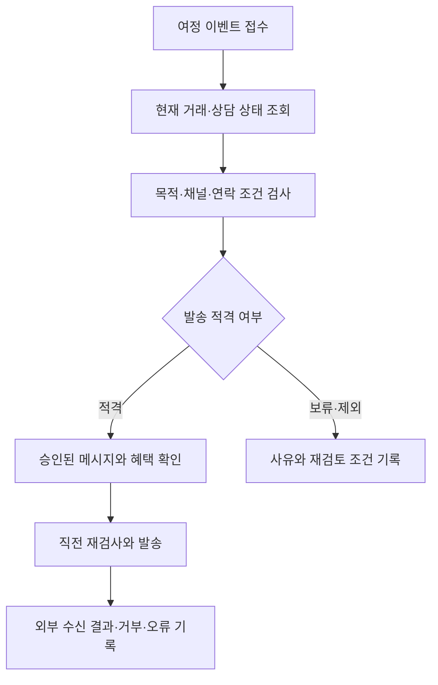
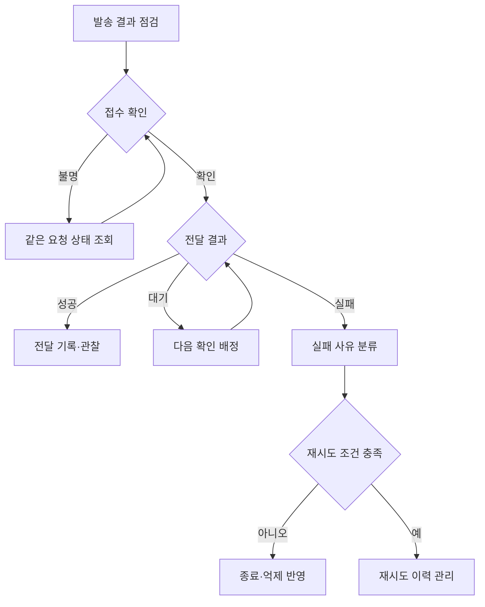

[시리즈 종합편과 전체 목차](/96/scenario-modeline-17-company-overview)

> 가상의 고객 관계 운영 설계다. 발송 시점·횟수는 예시이며 실제 광고 발송의 적법성 판단이나 개인정보 처리 자문이 아니다.

CRM 담당자는 아침에 구매 고객 목록과 처리 중인 상담을 함께 본다. 고객 A는 네이비 M 셔츠를 샀지만 이후 사이즈 교환을 접수한다. 구매 완료라는 이벤트 하나만 보고 다음 추천 메시지를 보내면, 해결되지 않은 고객 경험을 무시할 수 있다.

CRM은 고객과의 관계를 관리하는 업무다. 앞 마케팅편이 시장·브랜드·고객 유입과 캠페인을 다뤘다면 CRM편은 회원·구매·문의·선호·연락 조건을 이어서 본다. 세그먼트는 같은 조건으로 묶은 고객 집단이며, 이 회사에서는 발송할 명단뿐 아니라 보내지 않을 명단도 결과물이다.

그로스 리드 정유라는 CRM의 목표를 메시지를 많이 보내는 것으로 두지 않는다. 고객이 현재 어떤 관계 상태에 있는지 확인하고, 허용된 목적과 채널에서 다음 행동을 돕는 일로 정의한다. 발송 시스템은 이 판단을 실행할 수 있어야 한다.

## CRM은 회원 상태와 고객 경험을 다음 접촉에 연결한다

CRM은 그로스·CRM 10명 조직 안의 업무다. 유라가 마케팅·관계 전략을 함께 책임지고, 여정 기획·대상 운영·문안/혜택 검수·결과 대사를 역할로 나눈다. 정해진 인원 모두가 발송만 하는 팀이 아니며, 캠페인과 CRM이 같은 고객에게 쓰는 접촉 기회를 함께 관리한다.

회원이 가입했다고 구매를 한 것은 아니고, 구매했다고 제품을 잘 사용하고 있는 것도 아니다. 고객이 직접 알려 준 선호, 현재 주문·상담, 접촉을 허용한 목적과 채널을 바탕으로 다음 행동을 정한다. 구매 전 탐색 고객과 구매 후 교환 고객을 같은 매출 후보 명단으로 묶지 않는다.

| 책임 영역 | 담당자가 하는 일 | 결과·협업 상대 |
|---|---|---|
| 회원·선호 관리 | 가입 경로·직접 제공 선호·연락 조건과 변경 요청 확인 | 프로필/선호의 출처·현재 상태, 제품·개인정보 담당 |
| 생애주기 기획 | 가입·첫 구매·배송·사용·반복 구매·장기 미구매의 진입/종료 조건 정의 | 여정 지도·상태별 접촉 목적, 마케팅·CX |
| 대상·빈도 운영 | 세그먼트 조건, 제외/보류, 채널 간 중복과 예약 순서 확인 | 대상 스냅샷·제외 사유·접촉 달력 |
| 메시지·혜택 | 승인 상품·템플릿·쿠폰 조건을 고객 여정에 맞춤 | 미리보기·혜택 검수·발송 승인 |
| 전달·예외 대사 | 요청·접수·전달·실패·불명, 거부·불만 처리 | 메시지 원장·재확인 목록, 외부 제공자·CX |
| 관계 효과 평가 | 성숙 코호트의 반복 구매·기여·거부, 비교군 실험 검토 | 월간 관계 보고·여정 유지/수정/종료안 |

개인정보의 정정·삭제·이용 관련 요청은 담당 절차로 넘기고 처리 완료를 확인한다. CRM 담당자가 분석을 쉽게 하려고 신원을 추정해 회원을 합치거나 임의로 연락 조건을 바꾸지 않는다. 고객 A의 교환 상태를 이해하는 데 다른 고객의 상담이나 전체 결제 정보가 필요하지 않다.

상품 가격·쿠폰 비용 한도는 승인된 정책에서 가져온다. 상담 처리와 거래 안내는 CX가 소유한 경로와 합의하고, 주문·배송 사실은 거래·물류 담당자가 확정한다. CRM은 고객 경험의 정보를 받아 다음 권유를 조절하는 책임을 가진다.

## 여정마다 진입·기다림·종료·재진입 조건을 적는다

여정은 날짜별 메시지 목록보다 먼저 고객 상태를 정의해야 한다. 같은 고객이 가입 여정, 구매 여정, 기획전 대상에 동시에 들어올 수 있기 때문이다. 우선순위·접촉 목적·거래 안내 소유자를 정하고, 상태가 바뀌면 예약된 권유를 다시 검토한다.

| 고객 상태 | 진입 근거·여정 목적 | 정상 종료와 보류 조건 |
|---|---|---|
| 가입·선호 설정 | 실제 가입/직접 설정, 필요한 이용법·선택 도움 | 설정/첫 구매에 따라 종료·이동, 연락 목적 불명은 접촉 보류 |
| 첫 구매 전 탐색 | 허용된 관측과 대상 규칙, 상품 선택 도움 | 구매 발생 시 권유 중복 방지, 관측 누락은 추정 확정 금지 |
| 첫 구매·배송 | 결제·출고/배송 사실, 현재 주문 이해 | 실제 배송 단계별 안내, 지연·취소 시 CX 경로 우선 |
| 구매 후 이용 | 배송·승인 상품 정보, 이용 도움 | 반응과 현재 거래 상태 확인, 교환/불만이면 권유 보류 |
| 반복 구매·관계 유지 | 직접 제공 선호·과거 구매, 적합한 다음 상품 | 최근 구매/품절/빈도 제한 재검사, 혜택 중복 조절 |
| 장기 미구매 | 내부에 정의한 미구매 관찰 기간 경과 | 적격한 재접촉 또는 발송 종료, 개인정보 보유 규칙과 혼동 금지 |
| 교환·반품·불만 | CX 접수·처리 상태 | 필요한 거래 안내 유지, 처리 종료 후에도 재접촉 적격성 재검사 |

이 글의 “장기 미구매”나 “휴면”은 관계 분석용 분류다. 이를 법률상의 계정 처리나 일률적인 파기 시점으로 사용하지 않는다. 고객이 오래 구매하지 않았다는 이유만으로 수신 거부를 초기화하거나 동의가 갱신됐다고 간주하지 않는다.

재구매 주기는 상품군과 고객 용도에 따라 다를 수 있어 하나의 간격을 모든 의류에 적용하지 않는다. 먼저 반복 구매의 분포, 상품 구성, 고객의 직접 선호와 거부 신호를 살핀다. 내부 빈도 기준을 정할 때도 매출뿐 아니라 불만·운영 비용과 채널 간 중복을 함께 검토한다.

탐색 중단 권유는 구매가 실제로 완료됐는지부터 재확인한다. 행동 로그만 보고 결제하지 않았다고 단정하면 이미 주문한 고객에게 같은 상품 구매를 권할 수 있다. 생애주기 간 이동 시 기존 예약 작업의 남은 상태를 점검하는 이유다.

## 일간 발송 점검을 주간 접촉 계획과 연간 관계 전략으로 묶는다

| 주기·회의 | 입력 자료·참여 책임 | 결정·산출물 |
|---|---|---|
| 매일 09시 여정 점검 | CRM 운영, 예약 대상·주문/상담 변경·거부·전달 불명 | 발송/보류/조회 담당을 정한 실행 목록 |
| 매일 판매 준비 이후 | CRM·그로스·운영, 실제 옵션·혜택·콘텐츠 버전 | 당일 메시지 후보·제외 조건·최종 검수 |
| 매일 17시 접촉 인계 | 담당·대체자, 미확인 제공자 결과·새 거부·고객 약속 | 다음 조회 시각·담당자·예약 변경과 안내 소유권 |
| 매주 접촉·여정회의 | 유라·CRM·CX, 캠페인 일정·고객 중복·불만·대기 | 고객군별 접촉 순서, 억제·혜택·실험 조정 |
| 매월 관계·비용 리뷰 | CRM·민아·재무, 성숙 코호트·혜택 사용/환불·메시지 비용 | 유지/수정/종료할 여정, 다음 비용 전망 |
| 매분기 여정·정책 검토 | 유라·제품·CX·담당 전문가, 선호 흐름·정책 변경·표본 QA | 상태 정의·템플릿·접촉 기준·교육 갱신 |
| 매년 관계 계획 | 경영·그로스·재무, 고객군·채널·계약·자원 가정 | 획득/유지 역할·연간 비용·여정/선호 개선 우선순위 |

전년도 10~12월에는 다음 해 고객 관계 목표와 채널·혜택 비용, 회원 설정 개선을 계획한다. 1~3월에는 전년 집단의 관찰 결과와 봄 여정을 점검한다. 4~6월에는 상반기 관계 품질과 가을 캠페인의 접촉 충돌을 준비하고, 7~9월에는 가을 구매 후 여정과 피크 상담 억제를 운영한다. 10~12월에는 성숙한 결과를 다음 연간 계획에 반영한다.

일간 점검에서는 보내지 못한 건뿐 아니라 보내면 안 되는 건을 본다. 주간 회의에서는 한 고객에게 여러 부서의 안내가 겹치는지, 월간 회의에서는 발송 후 매출과 혜택·거부·불만이 함께 어떻게 바뀌었는지 본다. 관찰 시간이 부족한 집단은 다음 회의의 평가 일정에 남긴다.

## 세그먼트와 혜택은 사람이 다시 읽을 수 있는 작업 카드로 만든다

세그먼트 정의에는 기준 시각, 고객 식별 단위, 거래 범위, 진입·제외 순서, 관찰 기간, 사용 목적과 허용 채널을 적는다. 추출 당시 명단과 발송 직전 적격 명단을 구분하며, 제외 사유의 우선순위를 정해 한 고객을 여러 번 차감하지 않는다.

메시지 요청서에는 여정 단계, 해결할 고객 과제, 상품·콘텐츠 버전, 혜택 조건, 링크, 변수를 포함한다. 쿠폰은 적용 대상·기간·사용 횟수·중복 조건·비용 책임자가 승인한 정책을 사용한다. 고객에게 보낸 약속과 주문에서 적용되는 조건을 판매운영과 대조한다.

미리보기는 대표 고객 한 명만 보지 않는다. 이름이 없는 경우, 긴 상품명, 품절 옵션, 혜택 미적격, 이미 구매한 고객, 상담 중인 고객을 확인한다. 수신자와 문구가 뒤섞이는 사고는 표현 수정으로 해결할 수 없으므로 발송을 멈추고 대상·개인화 자료의 연결부터 확인한다.

| 가상 업무 카드 | 이번 예시의 내용 | 승인·수신 확인 |
|---|---|---|
| CRM-F26-018 | 배송 후 상품 이용 안내 초안, 승인 정보만 사용 | 목적·현재 상태·템플릿 확인, 실제 발송과 구분 |
| CRM-F26-019 | 별도 재구매 권유, 대상·제외·접수·전달 대사 | 유라의 범위 승인·운영자의 직전 검사·결과 확인 |
| 고객 A 억제 사유 | EX-F26-021 교환 진행, 일반 재구매 권유 보류 | CX 처리 변경 수신, 필요한 거래 안내는 CX 유지 |
| 전달 불명 후속 | 제공자 ID·마지막 조회·다음 확인 시각 | CRM 운영 담당이 접수/전달 상태를 확인 |
| 월간 효과 카드 | 대상/비교군·배정·관찰 창·혜택·구매 후 비용 | 민아가 정의 확인, 유라가 유지/수정 결정 |

## 고객의 거래 상태와 연락 선호를 따로 관리한다

주문 완료, 배송 중, 교환 처리 중은 거래 상태다. 이메일 수신 선호와 채널별 동의·거부 기록은 접촉 조건이다. 둘을 하나의 “활성 고객” 표시로 합치면 담당자가 왜 연락할 수 있는지 설명하기 어렵다.

| 확인할 정보 | 원천 | CRM의 사용 범위 |
|---|---|---|
| 구매·배송 상태 | 주문·물류 | 후속 여정의 현재 단계 |
| 교환·상담 진행 | CX | 해결 전 부적절한 권유 억제 |
| 채널별 연락 조건 | 고객 설정·동의 기록 | 발송 적격성 검사 |
| 최근 발송 | 메시지 원장 | 빈도·중복 통제 |
| 직접 제공한 선호 | 승인된 고객 프로필 | 필요한 범위의 상품 제안 |

개인정보 이용 목적과 처리 근거, 광고성 정보 전송에 적용되는 조건은 채널·업무별로 검토한다. 구매 이력 보유가 모든 마케팅 이용을 허용한다는 뜻으로 설계하지 않는다. [개인정보 보호법 원문](https://www.law.go.kr/법령/개인정보보호법)을 비롯한 적용 규정과 실제 동의·계약을 담당자가 확인해야 한다.

담당자는 검토한 목적·채널·조건을 정책 버전으로 관리하고 변경 시 기존 예약에도 적용할 범위를 확인한다. 법령 확인이 필요한 구체적 조건은 담당 전문가에게 근거와 함께 넘긴다. 광고성 정보 전송 검토에는 [정보통신망법 원문](https://www.law.go.kr/법령/정보통신망이용촉진및정보보호등에관한법률)도 연결하되, 여기서 채널별 법적 허용이나 기한을 확정하지 않는다.

## 고객 여정은 메시지보다 상태 전이로 만든다

고객 A에게 필요한 배송 안내와 출근복 추가 구매 권유는 목적이 다르다. 거래 안내 경로와 마케팅 캠페인 경로를 분리하고, 각각의 적격 조건과 템플릿 승인 절차를 둔다.

가상 CRM 작업 `CRM-F26-018`은 배송 후 상품 이용 안내의 초안을 준비하는 업무다. 어떤 고객에게 어떤 목적의 메시지를 보낼지는 별도 정책이 결정한다. 교환 진행 중인 고객 A는 일반 재구매 권유에서 보류하고 CX 처리 완료를 기다린다.

고객이 캠페인 대상 선정 후 수신을 거부할 수 있으므로 선정 시 검사만으로 끝내지 않는다. 발송 직전에 현재 정책과 선호를 다시 확인한다. 예약 메시지에서도 같은 검사를 수행한다.

## 발송 요청과 전달 결과를 같은 성공으로 세지 않는다

발송 담당자는 캠페인·고객·채널·여정 단계로 요청을 추적하고 재처리를 같은 작업에 연결한다. 예약과 수동 발송이 겹치면 담당자가 중복 여부를 확인하며, 결과를 모르는 요청을 새 캠페인으로 다시 보내지 않는다.

외부 발송 요청의 응답이 끊기면 제공자 결과를 확인한 뒤 다음 행동을 정한다. 요청 접수, 전달 성공, 열람과 클릭은 서로 다른 사실이다. 전달 결과를 알 수 없으면 미확인 상태와 확인 담당자를 남긴다.

고객 A의 교환 진행 중에는 수진이 확인한 처리 정보로 거래 안내를 이어간다. CX와 CRM이 같은 사실을 안내할 때는 발송 소유권을 하나로 정한다. 부서별 자동화가 고객에게 두 번 연락하는 문제가 되지 않게 한다.

## 후보 천이백 명이 실제 전달 결과로 바뀌는 숫자를 따라간다

유라는 신규 동료와 재구매 권유 작업의 대상 추출 결과를 읽는다. 아래는 CRM-F26-018의 상품 이용 안내 초안과는 구분되는, 같은 운영 점검일의 가상 마케팅 발송 자료다. 작업 ID는 `CRM-F26-019`로 둔다. 동의 판단이 모두 끝난 실제 고객 명단이나 법적 허용 기준을 뜻하지 않는다.

후보 1,200명에서 먼저 채널·연락 조건 미충족 180명을 제외한다. 남은 사람 중 상담·교환 진행 100명, 그다음 최근 발송 제한 80명을 뺀다. 순서대로 남은 집단에서 제외하므로 중복 사유가 있는 사람을 두 번 차감하지 않는다. 최초 적격 후보는 840명이다.

| 발송 단계의 가상 결과 | 인원 | 남겨야 할 상태 |
|---|---:|---|
| 최초 적격 후보 | 840 | 추출 조건·정책·기준 시각 보존 |
| 발송 직전 새 수신 거부 | 10 | 발송 제외, 뒤의 요청에 포함하지 않음 |
| 외부 발송 요청 대상 | 830 | 고객별 동일 작업 키 사용 |
| 제공자 접수 확인 | 825 | 전달 결과와 별도로 보관 |
| 접수 여부 미확인 | 5 | 조회 대기, 새 작업으로 재발송 금지 |

접수된 825명도 전부 전달된 것은 아니다. 점검 시점에 전달 확인 790명, 실패 25명, 전달 결과 대기 10명이다. 여기에 접수 미확인 5명을 더하면 요청한 830명과 맞는다. 담당자는 825를 전달 성공으로 보고하지 않는다.

고객 A는 교환 처리 중이라는 이유로 권유 대상에서 빠진다. 이 판단은 고객 A에게 필요한 교환 진행 안내를 끊는 결정이 아니다. 거래 안내는 CX가 소유한 경로에서 이어 간다. 두 메시지의 목적과 담당자가 다르다는 것을 명단에서 확인할 수 있다.

오후에는 미확인 5명의 외부 메시지 ID를 조회하고 결과 대기 10명의 상태를 갱신한다. 실패 25명은 오류 사유와 실제 제공자 규칙을 확인한 뒤 재시도 가능 여부를 정한다. 수신 거부나 유효하지 않은 주소를 기술 오류와 같은 방식으로 반복 전송하지 않는다.

유라가 받은 일일 결과물은 전달률 하나가 아니다. 대상 추출 조건, 제외 인원과 사유, 요청·접수·전달의 각 상태, 미확인 담당자와 다음 확인 시각이다. 이후 구매를 분석할 때도 이 기록으로 누가 실제 메시지를 받았는지 구분한다.

## 관계의 성과는 적게 보낸 고객과도 비교한다

유라는 발송량과 열람률만 보지 않는다. 수신 거부, 불만, 중복 발송, 후속 구매와 혜택 비용을 함께 읽는다. 재구매율의 대상은 정해진 첫 구매 집단과 관찰 기간으로 고정하고 교환·환불을 어떻게 취급했는지 밝힌다.

효과를 판단할 실험이라면 미발송 비교군과 배정 방식을 사전에 정한다. 다만 필수적인 거래 안내를 임의로 빼는 실험과 마케팅 권유의 효과 실험을 같은 방식으로 처리하지 않는다.

하루를 마칠 때 CRM은 발송·제외·보류 목록과 이유를 남긴다. 고객 거부는 이후 작업에 반영하고, 데이터 정정·삭제 요청은 개인정보 담당 절차에 연결한다. 동의와 목적이 불명확하면 생성 품질이 아무리 좋아도 발송 준비 완료가 아니다.

이 업무의 한계는 고객의 의도를 완전히 알 수 없다는 점이다. 직접 선택한 선호와 현재 거래를 기반으로 돕되, 상세한 추정 프로필을 많이 쌓는 것을 관계 개선과 동일시하지 않는다.

## 전달 불명과 고객 거부는 서로 다른 후속 경로로 처리한다

접수 불명은 실패 확정이 아니며, 전달 실패도 모두 재시도 대상은 아니다. 담당자는 제공자 상태와 현재 고객의 연락 조건을 함께 확인한다. 전달 성공 뒤 고객이 거부하면 과거 성공을 지우는 대신 이후 접촉에 거부 상태를 적용한다.

고객 불만이 오면 메시지 버전·발송 사유·당시 정책·최근 접촉을 함께 CX에 전달한다. CX는 상담을 소유하고 CRM은 예약 중단이나 대상 수정이 반영됐는지 확인한다. “명단에서 뺐다”는 말만 남기면 이미 예약된 다른 채널의 발송이 계속될 수 있어 범위를 점검한다.

월간 여정 리뷰에는 정상 경로뿐 아니라 장기간 보류, 실패 반복, 종료되지 않는 여정을 올린다. 반복 구매를 유도할 수 있는 고객이라는 이유로 계속 대기 목록에 남겨두지 않는다. 발송을 종료할 조건과 재진입에 필요한 새로운 근거를 명확히 한다.

## 관계 KPI는 같은 고객 집단의 관찰 시간이 지난 뒤 비교한다

다음은 내부 KPI다. 재구매 평가 예시는 첫 성공 결제 고객을 시작 집단으로 하고 이후 90일 미만을 관찰한다. 이는 운영 분석 창이며 법정 기한·업계 목표가 아니다. 09편의 30일 주문 비용 창과 다른 정의이므로 보고서에 분리해서 적는다.

분모·누락·잠정치 표시는 [시리즈 공통 해석 규칙](/96/scenario-modeline-17-company-overview#지표의-공통-해석-규칙을-먼저-맞춘다)을 따른다.

### 지표의 계산 기준을 한눈에 본다

| 지표·단위 | 계산·관찰 기준 | 원천·책임·검토 주기 |
|---|---|---|
| 요청 대비 전달 확인율 · 고객-작업 | 전달 확인 수 ÷ 외부 요청 고유 고객-작업 수 ×100; 작업별 기준시각 | 메시지 요청·제공자 결과, CRM 운영, 일일 |
| 접수 불명 비율 · 고객-작업 | 접수 여부 미확인 수 ÷ 요청 수 ×100; 같은 점검시각 | 요청·조회 이력, CRM 운영, 일일 |
| 의도하지 않은 중복 발송률 · 고객-작업 | 정책상 한 번이어야 하나 중복 전달 확인된 고객-작업 수 ÷ 전달 확인 고유 고객-작업 수 ×100; 주간 | 전달·중복 판정 기록, CRM·개발, 주간/사건 즉시 |
| 수신 거부율 · 전달 고객 | 전달 후 7일 미만 해당 채널의 새 거부를 남긴 고유 고객 ÷ 같은 성숙 전달 고객 ×100 | 전달·선호 변경, CRM 담당, 주간/월간 |
| 90일 재구매율 · 첫 결제 고객 | 첫 결제 뒤 90일 미만 추가 성공 결제가 있는 고객 ÷ 90일 관찰이 끝난 첫 결제 고객 ×100 | 고객·주문·환불, CRM·민아, 월간 |
| 마케팅 증분 재구매 · 배정 고객 | 발송안 배정 고객 재구매율−미발송안 배정 고객 재구매율; 사전 고정한 동일 창 | 무작위 배정·주문, 민아·유라, 실험 종료 |
| 혜택 비용 비율 · 캠페인 거래 | 관찰 창 내 재무 정의로 확정한 혜택 부담액 ÷ 같은 캠페인 연결 주문의 환불 반영 분석 금액 ×100 | 쿠폰 사용/환불·부담 정책, CRM·재무, 월간 |

### 수치를 해석하고 다음 행동으로 연결한다

재구매율의 성공 결제에는 이후 환불된 주문도 포함하는 정의를 썼으므로 환불 후 남은 구매와 기여를 함께 봐야 한다. 혜택 비용은 발급 액면 합계와 실제 부담을 나누고, 할인 후 금액에서 이미 차감된 할인을 분석 기여 계산 때 다시 비용으로 빼지 않는다.

| 지표 | 해석할 때 주의할 점 | 다음 행동 |
|---|---|---|
| 전달 확인율 | CRM-F26-019에서 요청 기준은 790/830이며 접수 기준 790/825와 다르다 | 실패25·전달대기10·접수불명5로 나눠 후속 담당 배정 |
| 접수 불명 비율 | 제공자 확인 지연을 미전달 확정으로 읽지 않는다 | 같은 요청 조회, 지연 체류와 제공자 문제 점검 |
| 중복 발송률 | 의도된 서로 다른 안내와 사고성 중복을 구분한다 | 영향 여정 중지·예약/수동 충돌 조사·고객 영향 확인 |
| 거부율 | 여러 메시지가 가까이 있으면 한 캠페인의 원인으로 단정할 수 없다 | 접촉 빈도·대상·표현 점검, 채널 전체 억제 반영 확인 |
| 재구매율 | 최근 고객은 관찰이 덜 됐고 고할인 재구매는 비용을 숨길 수 있다 | 성숙 집단·상품/고객 구성·기여와 함께 여정 수정 |
| 증분 재구매 | 전달된 사람만 비교하면 배정의 장점이 깨질 수 있다 | 원래 배정 기준으로 분석하고 누락·오염·표본 한계 점검 |
| 혜택 비용 | 발급액·사용액·환불 뒤 부담의 차이가 크다 | 부담 정의 대사, 한도·대상·쿠폰 조건과 경제성 재검토 |

미발송 비교군은 마케팅 권유 효과를 살피는 용도다. 고객에게 필요한 거래 안내를 임의로 빼는 실험을 같은 방식으로 운영하지 않는다. 최소 구분할 효과, 필요한 표본, 종료·중단 규칙을 사전에 정하고 성과가 좋아 보일 때만 임의로 종료하지 않는다.

이 회사의 실제 90일 성과나 메시지로 인한 매출 상승은 아직 측정하지 않았다. 고객 선호를 모두 추정할 수 없다는 한계와 관측 누락을 보고서에 남긴다. 발송량을 늘리는 것만으로 관계가 좋아졌다고 말할 수 없다.

## 개발·AI 활용은 업무 운영과 구분해 설계한다

### 고객 상태와 접촉 이력을 독립적으로 보존한다

시스템은 고객 식별, 직접 제공 선호, 목적/채널별 정책과 변경, 주문/상담 상태, 세그먼트 버전, 메시지 작업, 제공자 접수·전달을 구분한다. 여정 진입·종료와 예약 취소를 연결하고, 대상 추출 뒤 발송 직전에도 현재 적격성을 검사하도록 설계한다.

중복 방지는 캠페인·고객·채널·여정 단계의 업무 키와 실행 기록으로 구현한다. 동시 실행이나 재시도에서 같은 작업이 새 발송으로 바뀌지 않게 검증한다. 제공자의 중복 키·조회 지원을 계약과 실제 API에서 확인해야 하며 타임아웃만으로 재발송하지 않는다.

검사 자료에는 1,200→840→830, 접수825/불명5, 전달790/실패25/대기10, 직전 거부와 교환 중 고객, 중복 이벤트·상태 변경을 넣는다. 제외 우선순위와 합계 보존을 확인하고, 거래 안내와 권유의 작업 소유권이 충돌하는 경우도 평가한다.

### AI는 승인 템플릿의 표현 후보를 작성한다

입력은 승인 상품 정보·템플릿·캠페인 목적·사용 가능한 변수다. 주소·결제 상세 등 문장에 불필요한 정보는 주지 않는다. 출력은 문구와 근거, 누락 변수·잘못된 혜택 가능성의 점검 후보이며 고객 연락 조건이나 법률 적용을 모델이 결정하지 않는다.

쿠폰은 승인된 정책 객체에서 적용하고 모델이 임의 할인율·기간을 만들거나 발급하지 못하게 한다. 변수·링크·혜택 조합을 자동 검사한 뒤 유라와 담당자가 부담스럽거나 오해를 부르는 표현을 읽는다. 입력·정책·출력·반려 이유를 보존하고 실제 발송 권한은 검수된 실행 경로로 제한한다.

별도 심화 후보는 여정 상태 모델, 발송 원장과 중복/불명 복구, 동의·선호 변경 전파, 코호트·비교군 평가다. 이 원고는 실제 메시지를 보낸 결과나 법적 적격성 검증 결과가 아니며, 법령 원문 링크만으로 채널별 적용 조건을 확정하지 않는다.
