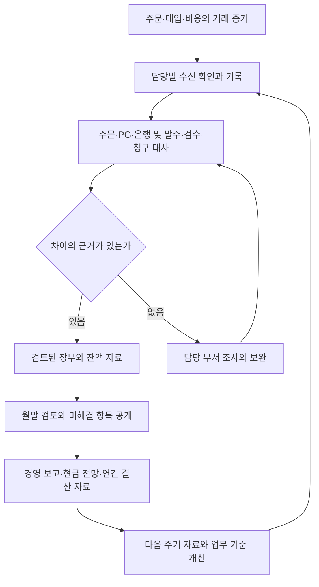
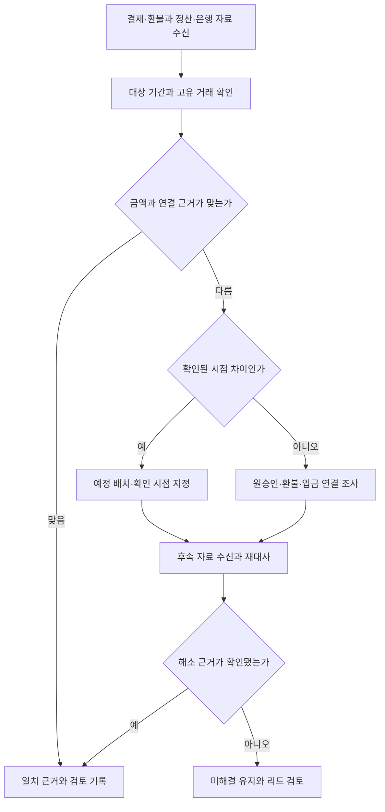

[시리즈 종합편과 전체 목차](/102/scenario-modeline-17-company-overview)

> 모드라인은 이 시리즈를 위해 만든 가상 회사다. 인물·거래·회의·금액은 창작이며 실제 회사의 실적이나 AI 도입 성공 사례가 아니다. 업무 절차와 지표는 이 회사의 운영 설정이며 실제 적용에는 조직의 정책과 전문 검토가 필요하다.

월말, 재무 리드 남도현에게 세 자료가 도착한다. CX는 환불 성공을 알리고, 물류는 입고 수량 차이를 보내며, 그로스는 광고비 청구서를 전달한다. 은행 입출금만 읽으면 각각 어떤 거래인지, 이번 기간에 무엇을 설명해야 하는지 알 수 없다. 자료를 기다리는 동안에도 다음 지급일은 다가온다.

모드라인은 사내 80명의 가상 의류몰이다. 재무·회계는 남도현을 포함한 4명이며, 14편의 예산·현금 담당자도 이 네 사람이다. 이 글의 문서·회의·수치는 합성 운영 사례다. 거래 두 건의 산술을 회사 전체 매출이나 이익으로 확대하지 않으며, 내부 마감 일정은 법정 신고기한과 구분한다.

대사는 서로 다른 기록을 맞춰 차이를 찾는 일이다. 정산은 계약에 따라 받을 돈과 차감을 계산하는 과정이고, 결산은 일정 기간의 거래·잔액을 검토해 재무 보고를 만드는 과정이다. 마감은 그 자료의 검토 범위와 버전을 확정하는 운영 절차다. 재무의 일은 차이를 0으로 보이게 하는 데서 끝나지 않는다. 왜 그 금액인지 다음 담당자가 다시 설명할 수 있어야 한다.

## 네 사람이 거래 기록과 검토 책임을 나눠 맡는다

도현은 월말에 증빙을 한꺼번에 수집하는 방식으로는 일이 쌓인다고 본다. 매일 받을 자료와 확인할 잔액을 정하고, 판단이 필요한 항목만 별도 목록으로 모은다. 아래는 네 명 안에서의 역할 분담이며 별도 채권팀·구매팀을 신설한 설정이 아니다.

| 역할 | 평소 담당 업무 | 검토와 다음 수신자 |
|---|---|---|
| 남도현, 재무 리드 1명 | 회계 쟁점, 마감 검토, 예산·현금 조정 | 경영에 확정 범위·미해결 위험 보고 |
| 거래·수금 담당 1명 | 주문·환불·PG·은행 대사, 받을 돈 추적 | 커머스·CX와 차이 조사, 도현에게 잔액표 |
| 매입·지급 담당 1명 | 발주·입고·청구 확인, 채무·지급 준비 | MD·물류의 확인과 승인 후 지급 결과 연결 |
| 회계·관리 담당 1명 | 비용 증빙, 장부 입력, 결산 일정, 계획 대비 자료 | 도현의 검토 후 경영·부서별 보고 |

매입·지급 담당자가 지급안을 작성하면 도현 등 정해진 승인자가 근거를 확인하고, 회계·관리 담당자가 은행 결과를 대사한다. 부재 시에도 준비와 검토를 한 사람의 자기 확인으로 대체하지 않는다는 내부 운영 원칙을 둔다. 승인 권한·대체자는 업무별 표에 남기고 금액 한도를 임의의 업계 규칙으로 만들지 않는다.

재무는 거래가 발생한 사실과 회계 처리를 연결한다. MD가 합의하지 않은 공급사 책임을 재무가 확정하거나, CX의 환불 요청만 보고 환불 성공으로 적지는 않는다. 계약의 해석·세무·회계 쟁점은 필요한 사실자료를 모아 외부 전문가에게 확인한다. 외부 전문가는 사내 80명에 포함하지 않는다.

## 매일의 자료 수집을 월말과 연간 결산으로 이어 간다

이 달력의 시각과 순서는 모드라인 내부 예시다. 실제 신고·납부·감사 대상과 일정은 회사에 적용되는 조건을 확인한 전문가와 별도 관리한다. 마감월에는 자료 요청일·부서 확인일·리드 검토일을 먼저 합의하며, 날짜가 왔다고 미확인 금액을 확정하지 않는다.

| 주기 | 들어오는 자료 | 담당자의 판단 | 남기는 결과 |
|---|---|---|---|
| 매일 09시 | 전일 결제·환불, PG 자료, 은행 내역 | 거래·수금 담당이 수신 누락·중복과 예정 입금 확인 | 일일 대사표, 차이별 담당자 |
| 매일 업무시간 | 발주·검수·청구·경비 증빙 | 지급 담당이 대상·조건 확인, 회계 담당이 귀속 검토 | 지급 준비 목록, 증빙 보완 요청 |
| 매일 17시 | 확인 결과, 당일 지급·입금 | 미완료를 누가 언제 다시 볼지 결정 | 다음 날 잔액·차이 인계 |
| 매주 | 미수취·미지급 잔액, 경과 일수 | 도현이 독촉·협의·추가 조사 순서 결정 | 수금 계획, 14편 자금 입력 |
| 매주 | 반복 차이와 부서별 보완 대기 | 원천 오류인지 내부 처리 지연인지 구분 | 커머스·MD·물류 개선 과제 |
| 매월 마감 준비 | 자료 목록, 재고 이동, 계약·비용 변경 | 자료 범위와 기준 시각을 부서와 합의 | 월말 요청표, 담당자 확인 |
| 매월 검토·보고 | 잔액 대사, 검토된 장부, 미해결 목록 | 도현이 보고 가능 범위·추가 검토 결정 | 마감 보고와 수정 이력 |
| 분기·시즌 | 장기 재고, 오래된 채권·채무, 계약 변화 | 추정·정책 검토가 필요한 사안을 분리 | 전문가 질의, 다음 분기 개선 |
| 연간 10~12월 | 연말 재고 점검안, 계약·자산 목록 | 부서별 결산 준비와 자료 책임 조정 | 연간 결산 준비표, 다음 해 예산 입력 |
| 연간 1~3월 | 전년 장부·잔액·후속 자료 | 적용 일정에 맞춰 쟁점 확인·보완 | 검토된 연간 자료, 후속 조치 |
| 연간 4~9월 | 전년 보완 결과, 시즌 거래 변화 | 반복 누락과 처리 방식을 갱신 | 자료 양식·교육·하반기 준비 |

은행 대사와 지급 준비는 같은 날 병행한다. 다만 지급 결과가 확인되기 전에는 지급 완료 목록에 올리지 않는다. 주간 회의에는 모든 증빙을 펼치기보다 받을 돈·지급할 돈·확정되지 않은 항목의 변화를 가져간다. 월간 보고는 그 잔액이 장부와 어떻게 연결되는지 설명한다.

차이가 있더라도 이유가 확인된 시점 차이와 원인 불명 차이를 구분한다. 근거가 없는 항목은 부서 조사로 돌아가고, 보고 시점까지 남으면 금액·영향·책임자를 드러낸다. 경영과 14편 현금 계획의 수신자는 확정 잔액만 받는 것이 아니라 아직 반영되지 않은 입출금 근거도 함께 받는다.

## 매출 기록은 주문 이행에서 수금까지 연결한다

거래·수금 담당자는 주문 생성 시각, 결제 성공, 출고·배송·교환·반품 사실, 정산·입금 시각을 분리해서 받는다. 할인이나 취소가 있으면 최초 내역과 변경 내역을 함께 보존한다. 총액만 맞으면 된다는 생각으로 주문 항목과 환불 연결을 지우면 부분 환불이나 후속 정산을 설명할 수 없다.

| 원천 | 확인할 사실 | 연결 기준 |
|---|---|---|
| 주문·이행 | 무엇을 약속했고 어떤 상태로 이행했는가 | 주문·항목·출고 ID |
| 결제·환불 | 승인·취소가 실제 성공했는가 | 결제 ID, 원결제에 연결한 환불 ID |
| PG 정산 | 어떤 거래·차감이 어느 배치에 포함됐는가 | 가맹점·통화·배치·정산 행 |
| 은행 | 실제 입출금된 금액과 날짜는 무엇인가 | 거래 내역과 배치 연결 |
| 회계 기록 | 어떤 근거로 어떤 기간에 반영했는가 | 증빙 묶음·검토·기록 버전 |

수익 인식에 관한 IFRS 15의 공식 개요는 고객 계약의 약속과 수행의무 이행을 중심으로 설명한다. 결제 성공이나 은행 입금을 곧바로 같은 금액의 회계 매출로 바꿀 수 있다는 뜻이 아니다. 여기서는 모드라인에 적용되는 회계기준을 확정하지 않고, 계약·이행·반품 사실을 전문가 검토에 필요한 입력으로 남긴다. [IFRS 15 공식 개요](https://www.ifrs.org/issued-standards/list-of-standards/ifrs-15-revenue-from-contracts-with-customers/)

받을 돈은 상대방, 근거 거래, 금액, 약정 입금일, 실제 수취액과 미수취액으로 추적한다. 이 글의 수취 관리 목록은 PG 정산 예정액 등을 관리하는 보조 자료이며 모두를 같은 회계 계정으로 분류하는 처방은 아니다. 계약상 예정일이 지난 항목은 상대방 확인, 시점 차이, 분쟁 여부를 나눠 본다.

수금 확인은 입금이 없는 날에만 하는 일이 아니다. 한 번의 입금이 여러 정산 배치를 포함할 수 있고 일부 금액만 들어올 수도 있다. 담당자는 연결한 금액과 남은 잔액을 남긴다. 입금 메모가 비슷한 거래에 임의로 전액 배정하면 원래 거래의 미수취가 숨겨지므로, 근거가 부족하면 미배정 입금으로 조사한다.

## 두 주문의 정산 예시를 후속 환불까지 대사한다

주문 A `O-F26-10482`의 결제는 `PAY-F26-10482`, 주문 B `O-F26-10483`의 결제는 `PAY-F26-10483`다. 고객 표시 가격 59,000원에서 할인 5,900원을 빼 각각 53,100원을 결제했다. 고객 배송비는 이 두 사례에서 0원이다.

A의 `EX-F26-021`은 사이즈 교환으로, 전액 결제를 자동 취소하는 사건이 아니다. B의 `RET-F26-032`는 회수·검수 후 전액 환불을 확정하고 `REF-F26-032`를 원결제에 연결한다. 환불 요청, PG 성공, 정산 차감은 별도 상태다.

아래는 두 거래만 떼어 낸 가상 현금 계산이다. 각 결제의 3%인 1,593원을 가상 최초 차감으로 정하고, 51,507원씩 먼저 입금한 뒤 B 환불 53,100원을 후속 배치에서 차감한다. 최초 차감은 반환되지 않는다는 예시 가정이다. 실제 PG 요율·약관·세금 취급을 대신하는 수치가 아니다.

| 거래 | 고객 결제 | 최초 차감 | 최초 입금 | 후속 환불 차감 |
|---|---:|---:|---:|---:|
| A · 교환 | 53,100 | 1,593 | 51,507 | 0 |
| B · 반품 | 53,100 | 1,593 | 51,507 | 53,100 |
| 합계, 원 | 106,200 | 3,186 | 103,014 | 53,100 |

후속 차감까지 반영한 순현금은 **103,014 − 53,100 = 49,914원**이다. 고객 결제에서 환불을 뺀 53,100원과의 차이 3,186원은 가정한 최초 차감 합계다. 상품 원가, 배송·교환·회수 비용, 광고비, 세금과 수익 인식은 이 표에서 계산하지 않았다. 따라서 순매출·매출총이익·영업이익을 읽는 표가 아니다.

마감 시점에 B의 환불 성공은 확인됐지만 후속 배치가 아직 없다면 은행의 관찰값은 103,014원으로 남는다. 도현은 앞으로 차감될 53,100원의 근거와 다음 확인 시점을 기록한다. 49,914원은 모든 예시 배치가 반영된 결과이며 그 마감일 은행 잔액이라고 앞당겨 적지 않는다.

시점 차이로 분류하려면 해당 거래의 정산 조건과 후속 확인 근거가 있어야 한다. “다음 달에 맞을 것 같다”는 기대는 그 근거가 아니다. CX는 환불 성공의 사실을, 커머스는 원승인·환불의 연결을, 재무는 정산·은행 후속 결과를 확인한다. 재무 담당자는 다른 팀에 보낸 뒤에도 차이 목록의 종료를 책임진다.

## 받을 돈과 지급할 돈을 각각 끝까지 추적한다

지급 담당자는 공급사 청구가 오면 발주, 입고·검수, 청구와 합의한 지급 조건을 함께 연다. 발주서에 적힌 금액은 구매 약속의 정보이고, 검수 결과는 받은 사실의 정보다. 둘이 다르면 차이가 어떤 지급 부분에 영향을 주는지 MD와 확인해야 한다.

`PO-F26-041`은 600장 발주다. `IN-F26-041`의 첫 실물 입고는 596장, 보류는 8장, 판매가능은 588장이다. 다음 날 판매 전 후속 기록에서는 보류 6장을 해제하고 2장을 반송해 실물·판매가능 594장, 보류 0장이 된다. 미입고 4장은 협의 대기이며, 600 = 594 + 반송 2 + 미입고 4로 수량을 설명한다.

이 기록으로 6장분을 일괄 차감 지급한다고 결론 내릴 수는 없다. 단가·계약·반송 수신·공급사 답변을 확인해야 한다. 미입고 보충과 반송 정산도 다른 협의다. 이후 판매·예약·반품이 생겼다면 594장 역시 현재 재고로 사용할 수 없다.

| 지급 검토 카드의 항목 | PO-F26-041에서 남기는 내용 |
|---|---|
| 받은 사실 | 최초 검수와 후속 재검수·반송 기록을 각각 연결 |
| 미완료 | 미입고 4장 협의, 반송 2장에 대한 금액 처리 확인 |
| 담당자 | 한지민이 공급 조건·답변, 박민수가 수량·수신 증거 확인 |
| 재무 판단 | 합의된 부분과 확인 대기 부분을 구분해 지급안 작성 |
| 완료 조건 | 승인한 지급 범위·은행 결과·잔액을 연결하고 차이 협의 종료 확인 |

확인 대기 부분이 있다고 전체 지급을 무조건 멈추거나, 모든 청구를 그대로 지급하는 두 선택만 있는 것은 아니다. 계약과 합의가 허용하는 지급 범위를 책임자가 확인하고 남은 쟁점을 따로 관리한다. 상대방과의 합의 없이 지급일을 바꾸지 않으며, 현금 부족 가능성은 14편 계획에 즉시 알린다.

채무 목록에는 청구액, 확인된 의무, 예정 지급일, 지급 결과와 남은 잔액을 둔다. 같은 청구서를 메일과 담당자 전달로 두 번 받아도 한 의무에 두 번 지급하지 않도록 기존 청구·지급 연결을 확인한다. 지급 성공 응답이 불명확하면 은행 결과부터 조회하고 다시 지급할지를 판단한다.

## 비용 증빙과 재고 자료를 모아 결산을 준비한다

회계·관리 담당자는 광고·물류·클라우드·경비·인건비 자료를 사용 부서에서 받는다. 영수증만으로 사용 목적과 기간이 설명되지 않을 때는 담당자의 확인을 받는다. 증빙이 없다는 이유로 발생한 업무를 숨기거나, 청구서가 왔다는 이유로 전액을 무조건 이번 달 비용이라고 정하지 않는다.

| 자료 묶음 | 부서가 확인할 내용 | 재무가 이어서 하는 일 |
|---|---|---|
| 광고 | 캠페인·집행 기간·청구와 조정 내역 | 집행 보고와 청구 차이, 귀속 검토 |
| 물류 | 출고·보관·회수 등 계약 기준과 이용량 | 요율·수량·추가 청구 확인 |
| 클라우드·도구 | 사용 기간·사용자·계약 변경·미사용 항목 | 비용 자료와 계약·지급 연결 |
| 인건비 | 피플의 검토된 변동 자료와 승인 | 급여 관련 결과·지급·회계 인계 대사 |
| 재고·상품 원가 | 수량 이동·단가 근거·반품 상태·장기 재고 | 수량과 금액 연결, 평가 쟁점 질의 |
| 장비·장기 계약 | 취득·사용 시작·기간·반납·변경 사실 | 적용 기준에 따른 분류·기간 검토 |

상품 원가를 계산하려면 수량뿐 아니라 매입 단가와 적용 원가 기준, 입출고·반품의 연결이 필요하다. 물류가 반품을 재판매 가능으로 판정한 사실과 재무의 금액 처리는 이어지지만 같은 판단은 아니다. MD는 오래된 상품의 판매 가능성과 처분 계획을 설명하고 재무는 그 근거로 필요한 평가 검토를 진행한다.

관리 보고용 비용도 범위를 정한다. 부서 직접 비용과 공통 비용을 구분하고 공통 비용을 배분한다면 배분 이유·기준·버전을 함께 적는다. 캠페인 성과를 좋게 보이게 하려고 당월에만 기준을 바꾸지 않는다. 9편의 파일럿 분석 기여는 제한된 비용을 반영한 분석값이므로 회사 결산 손익과 바로 합치지 않는다.

월말에는 자료 수신 확인, 거래·잔액 대사, 비용·재고 쟁점 검토, 장부와 보조 목록 연결, 리드 검토 순으로 진행한다. 입력이 끝난 상태와 검토가 끝난 상태를 구분한다. 누락이 발견되면 원천 담당자에게 범위와 필요한 증거를 특정해 요청하고, 이전 보고와 무엇이 달라졌는지 남긴다.

## 마감 보고에는 확정 범위와 남은 일을 함께 넣는다

`RECON-F26-09` 안의 작은 가상 정산 검토 배치를 보자. 원본 30줄 중 정산 행 ID와 버전이 같은 중복 1줄을 집계에서 제외한다. 원본을 삭제하지 않고 제외 근거를 보존한다. 이 배치는 앞의 A·B 금액표와도, 회사 전체 월 거래 수와도 다른 자료다.

| 고유 정산 거래의 상태 | 건수 | 남기는 근거 |
|---|---:|---|
| 일치 | 24 | 거래 연결·금액 확인·표본 검토 |
| 확인된 시점 차이 | 3 | 후속 배치와 확인 예정 시점 |
| 원인 조사 | 2 | 금액 불일치 1, 은행 배치 연결 미확인 1 |
| 합계 | 29 | 원본 30 − 중복 1 |

금액 불일치 1건은 커머스 담당자가 원승인과 환불 이력을 조회한다. 은행 연결 미확인 1건은 거래·수금 담당자가 PG 배치와 은행 근거를 찾는다. 신규 동료가 비슷한 입금 메모를 근거로 합치려 하자 도현은 확정 키와 금액을 먼저 확인하게 한다. 설명을 만들었다는 이유로 일치 24건에 더하지 않는다.

마감 검토 묶음에는 원본 기간·조회 시각·버전, 중복 제외표, 일치표, 시점 차이표, 미해결 목록과 검토 기록이 들어간다. 조사 2건의 금액이 이 사례에 제시되지 않았으므로 미해결 금액 합계는 계산 불가로 남긴다. 건수가 적다는 이유만으로 중요성이 작다고 판단할 수도 없다.

마감 보고 첫 장은 기간과 확정 범위, 주요 변동, 미해결 항목의 영향을 설명한다. 부록은 거래까지 내려갈 수 있는 근거를 담는다. 도현은 보고 수신자인 경영이 계획을 바꿔야 하는 항목을 확인했는지 받고, 14편 자금 담당 역할에는 예정 입금·차감·지급 변경을 별도로 전달한다.

연간 결산에서는 월별 자료를 단순 합산하는 데 더해 기말 잔액, 재고·자산의 확인, 계약 변경과 미해결 쟁점을 다시 본다. 남도현은 외부 전문가에게 거래 사실, 회사의 기존 처리, 불확실한 점을 묶어 질의한다. 전문가는 적용 기준·필요 검토를 확인하고, 재무는 답변에 맞춰 자료 보완과 장부 반영 여부를 기록한다.

연말 이후 도착한 청구·정산 자료도 어느 기간의 사실인지 확인해 검토한다. 외부 감사 대상 여부나 세무 신고기한을 사내 80명이라는 설정만으로 단정하지 않는다. 해당 의무와 일정은 별도 확인표에서 확정하고, 내부 결산 자료 준비와 연결한다. 마감 이후 수정이 필요하면 이유·승인·영향·새 버전을 남겨 경영 자료에도 반영한다.

## 속도와 정확도를 같은 지표 사전으로 읽는다

아래는 모드라인이 운영을 점검하기 위한 내부 정의다. 목표값과 현재 실적은 별도로 승인·측정한다. 빠른 마감을 위해 어려운 거래를 분모에서 빼지 않는다.

분모·누락·잠정치 표시는 [시리즈 공통 해석 규칙](/96/scenario-modeline-17-company-overview#지표의-공통-해석-규칙을-먼저-맞춘다)을 따른다.

### 지표의 계산 기준을 한눈에 본다

| 지표·단위 | 계산·관찰 기준 | 원천·책임·검토 주기 |
|---|---|---|
| 원천 자료 수신 완전성 · % | 기간·버전까지 확인한 자료 묶음 ÷ 사전 확정 필수 묶음 ×100; 일일·월별 | 자료 요청표·수신 기록 / 회계·관리 / 매일·마감 |
| 정산 거래 일치율 · % | 같은 마감 시각의 일치 확정 고유 거래 ÷ 검토 대상 고유 거래 ×100 | 정산 원본·중복 제외표·대사표 / 거래·수금 / 매일, 리드 주간 |
| 원인 미해결 차이 금액 · 원 | 보고 시각의 원인 불명 차이별 절대금액 합계; 같은 차이의 양쪽 기록은 한 번 | 차이 목록·거래 연결 / 거래·수금 / 일일 갱신·주간 검토 |
| 기한 경과 미수취 비중 · % | 기준일에 약정일이 지난 미수취 금액 ÷ 같은 목록 총 미수취 금액 ×100 | 정산 조건·수취 목록·은행 / 거래·수금 / 주간 |
| 지급 전 증빙 완결률 · % | 필수 근거를 갖춘 지급 의무 ÷ 해당 주 지급 검토 대상 의무 ×100 | 지급 목록·증빙표 / 지급 담당·리드 / 주간 |
| 월간 마감 소요일 · 영업일 | 대상 월 종료 → 정한 보고 범위의 리드 승인까지; 회사 달력 적용 | 마감 일정·승인 기록 / 회계·관리 / 월간 |
| 마감 후 오류 정정 건수 · 사건 | 최초 승인 후 다음 월말까지 승인한 오류 정정 사건; 같은 원인은 한 사건 | 정정 이력 / 재무 리드 / 월간·늦은 발견 소급 갱신 |

### 수치를 해석하고 다음 행동으로 연결한다

#### 원천 자료 수신 완전성

일일 또는 월별로 사전 확정한 필수 자료 묶음 중 대상 기간·버전까지 확인해 수신한 묶음 수 ÷ 받아야 할 묶음 수 × 100이다. 원천은 자료 요청표·수신 기록이며 회계·관리 담당자가 매일 확인하고 마감 때 확정한다. 파일 수를 늘려 비율을 높이지 않고 누락 원천의 거래 범위를 공개하며 담당 부서와 수신 일정을 다시 잡는다.

#### 정산 거래 일치율

동일 마감 시각의 일치 확정 고유 정산 거래 수 ÷ 검토 대상 고유 정산 거래 수 × 100이다. 정산 원본·중복 제외표·대사표가 원천이고 거래·수금 담당자가 매일, 도현이 매주 본다. 위 배치는 24/29로 약 82.76%이며 시점 차이 3건도 분모에 남는다. 금액 중요도는 별도 보고하고 악화 시 원천·유형별로 조사한다.

#### 원인 미해결 차이 금액

보고 시각에 원인 불명인 차이별 절대금액을, 동일 차이의 양쪽 기록은 한 번만 세어 합산한다. 원천은 차이 목록과 거래 연결이며 거래·수금 담당자가 일일 갱신, 도현이 주간 검토한다. 양수·음수를 상계하지 않고 미확인 금액은 별도 건수로 표시한다. 새 차이와 오래된 차이를 나눠 담당자·금액 영향·다음 확인을 배정한다.

#### 기한 경과 미수취 비중

기준일에 확인된 계약상 입금 예정일이 지났으나 받지 못한 금액 ÷ 같은 수취 관리 목록의 총 미수취 금액 × 100이다. 원천은 정산 조건·수취 목록·은행이며 거래·수금 담당자가 매주 본다. 예정일 불명 금액과 분쟁 금액을 별도 표시하고 임의로 날짜를 미루지 않는다. 악화 시 상대방 확인과 현금 전망 조정을 함께 한다.

#### 지급 전 증빙 완결률

해당 주 지급 검토 대상 의무 중 필요한 발주·검수·청구·승인 근거를 갖춘 의무 수 ÷ 해당 주 검토 대상 의무 수 × 100이다. 계약별 필수 자료를 먼저 정의한다. 지급 담당자가 지급 목록·증빙표에서 매주 계산하고 도현이 확인한다. 분할 지급은 동일 의무 안에서 관리하며 누락률 상승 시 공급사·요청 부서의 반복 원인을 수정한다.

#### 월간 마감 소요일

대상 월 종료부터 리드가 정한 보고 범위를 승인한 시점까지의 경과 영업일이다. 회사 업무 달력의 휴무일과 승인 시각을 고정하며 마감 일정·승인 기록을 원천으로 회계·관리 담당자가 월별 계산한다. 미해결 건·범위 축소를 함께 공개한다. 길어지면 수집 대기·내부 처리·전문가 검토를 나눠 병목을 고친다.

#### 마감 후 오류 정정 건수

최초 마감 승인 후 다음 월말까지, 누락·중복·오입력 등 확인된 오류로 승인한 정정 사건 수다. 같은 원인의 여러 분개는 한 사건으로 연결하고 정상 후속 자료 반영과 구분한다. 정정 이력이 원천이며 도현이 월별 검토한다. 늦게 발견된 오류는 원래 마감월 집계도 갱신한다. 정정 숨기기를 유도하지 않고 재발 원인을 자료 수집·검토 절차에 반영한다.

## 개발·AI 활용은 업무 운영과 구분해 설계한다

### 원천 기록을 보존하고 대사 결과를 다시 만들 수 있게 한다

시스템은 원본 파일, 수신 시각, 대상 기간, 가맹점·통화, 원본 행 ID, 수정 버전을 분리해 보관해야 한다. 주문·결제·환불·정산·은행의 관계는 일대일이라고 가정하지 않는다. 배치 합산, 부분 환불, 후속 차감이 있는 자료를 같은 기준으로 다시 대사할 수 있어야 한다.

금액 합계는 검증한 계산 코드로 처리하고 통화·단위·반올림 규칙을 명시한다. 원본을 고쳐 합계를 맞추는 권한은 주지 않는다. 같은 파일 재수신과 수정 파일 수신을 구분하고, 중복 제외와 정정 이력을 남긴다. 이는 필요한 설계이지 현재 저장소에 구현됐다는 주장이 아니다.

### AI는 연결 후보와 설명 초안을 제출하고 확정 권한을 갖지 않는다

AI 입력은 승인된 읽기 전용 거래·증빙과 회계 담당자가 정리한 기준이다. 출력은 연결 후보, 누락 자료, 차이 설명 초안과 원천 위치다. 공급사명·입금 메모가 비슷해도 금액·식별자가 어긋나면 보류하게 한다. 은행 송금, PG 환불, 수취 계좌 변경, 장부 수정과 마감 확정은 AI 권한 밖에 둔다.

검사 자료에는 같은 금액의 다른 주문, 중복 파일, 늦게 도착한 환불, 모르는 배치와 잘못된 통화를 넣는다. 정확한 일치와 함께 잘못 붙인 거래, 사람이 다시 확인한 시간, 보류의 적절성을 본다. 처리율만 올리면 잘못된 확정이 늘 수 있다.

### 기술 심화는 대사 엔진과 변경 이력의 검증으로 이어진다

별도 심화 주제는 다대다 정산 매칭, 변경 가능한 외부 원천의 재처리, 마감 버전과 후속 조정, 자료 접근권한과 검토 로그다. 실측 전에는 자동화의 시간 절감률을 쓰지 않는다. 남는 한계는 외부 자료의 지연, 계약별 차이, 회사에 적용할 회계 판단이며 이를 해소할 담당자와 근거는 시스템 밖에서도 계속 필요하다.
