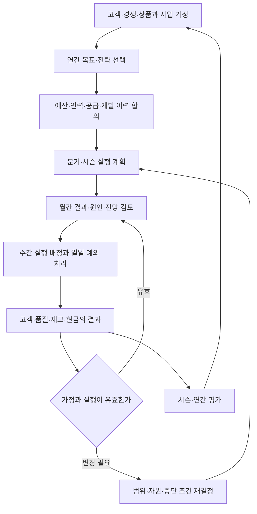
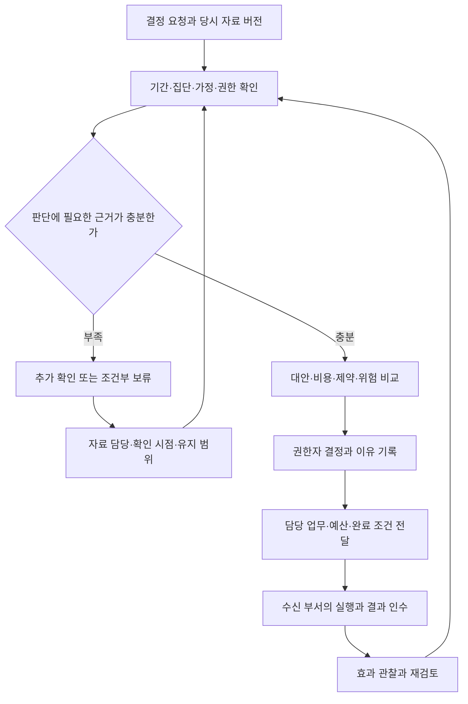

[시리즈 종합편과 전체 목차](/96/scenario-modeline-17-company-overview)

> 모드라인은 이 시리즈를 위해 만든 가상 회사다. 인물·거래·회의·금액은 창작이며 실제 회사의 실적이나 AI 도입 성공 사례가 아니다. 업무 절차와 지표는 이 회사의 운영 설정이며 실제 적용에는 조직의 정책과 전문 검토가 필요하다.

가을 검토 회의에서 CEO 윤서영 앞에 서로 다른 요청이 놓인다. MD는 재주문할 시간을 걱정하고, 그로스는 광고 확대를, CX는 반복 문의 해결을 요구한다. 재무는 입금 지연 가능성을, 개발은 이미 약속한 작업과 검토 대기를 설명한다. 각각 타당해도 모든 일을 같은 주에 시작할 수는 없다.

모드라인은 사내 80명의 가상 온라인 의류몰이다. 경영·사업은 서영을 포함한 3명이며 CTO 강태준은 개발 15명에 속한다. 이 글의 계획·회의·수치는 합성 사례다. 대표 상품과 두 주문, 파일럿, 주간 현금은 범위가 다른 기록이며 이를 모아 회사 전체 연간 실적으로 만들지 않는다.

경영은 중요한 회의에서 한 번 결론을 내리는 일에 그치지 않는다. 고객에게 어떤 가치를 제공할지 정하고, 그 선택에 맞는 돈·사람·상품·일정을 배정하고, 실행 결과가 가정과 다른지 확인하는 반복 업무다. 현장의 판단을 모두 CEO에게 올리는 대신 위임 범위와 다시 경영이 판단할 조건도 정해야 한다.

## 세 사람은 전략·사업 계획·후속 실행을 나눠 관리한다

모드라인은 한국 고객에게 일상복·출근복을 판매한다. 브랜드 매입과 일부 자체 기획 상품을 자체 웹·모바일 웹에서 판매하며 회사가 단일 판매 주체다. 해외·오픈마켓·오프라인 확장은 현재 운영 범위에 넣지 않는다. 새 사업을 시작하려면 기존 자원·계약·고객 경험에 무엇이 추가되는지 별도 판단한다.

| 경영·사업 역할 | 반복 업무 | 각 부서와의 경계 |
|---|---|---|
| 윤서영, CEO 1명 | 사업 방향, 자원 충돌, 주요 투자·위험 판단 | 승인 범위를 정하고 부서의 전문 판단을 받음 |
| 사업 계획 담당 1명 | 시장·고객 가정, 연간·분기 계획, 경영 자료 취합 | 데이터·재무가 확인한 정의와 범위 사용 |
| 실행 조정 담당 1명 | 안건 준비, 결정 기록, 부서 수신·후속 확인 | 실무 작업의 완료 판정은 결과를 받는 부서와 확인 |

CEO가 계약·회계·인사·기술의 모든 세부 판단을 대체하지 않는다. 한지민은 상품·공급 근거를, 남도현은 재무·현금을, 김나래는 인력 운영을, 태준은 기술·개발 여력을 설명한다. 경영은 대안 사이의 우선순위와 승인 범위를 결정하고 불확실한 판단에 필요한 전문 확인을 연결한다.

권한을 위임할 때는 업무 종류, 예산·인력·정책의 범위, 예외 보고 조건과 대체자를 남긴다. 부서는 기존 승인 안에서 일상 업무를 실행하고 범위를 바꾸는 신규 발주·증액·조직 변경 등을 경영에 올린다. 단순 금액뿐 아니라 고객 영향·복구 가능성·계약 약속도 검토한다.

## 연간 전략을 고객 가정과 회사의 제약에서 시작한다

다음 해 계획은 목표 매출 숫자를 먼저 배분하는 방식으로 시작하지 않는다. 사업 계획 담당자는 고객이 언제 어떤 옷을 찾는지, 구매 전 무엇을 비교하고 왜 교환·반품하는지 정리한다. 제품의 고객 조사, 검색어와 구매 흐름, CX의 문의 분류, MD의 판매·재고와 콘텐츠의 실측 자료를 연결한다.

시장·경쟁 검토에서는 공개된 상품 구성·가격대·배송 안내·콘텐츠를 같은 관찰 시점에 확인하고 자료 날짜를 남긴다. 경쟁사가 왜 그 선택을 했는지는 확인한 사실과 가설을 구분한다. 특정 경쟁사의 실적이나 성공 원인을 근거 없이 서술하지 않는다. 모드라인이 제공할 가치와 수행 가능한 범위를 결정하는 입력으로 쓴다.

사업 모델 검토에서는 고객에게 받은 돈, 할인·환불, 상품 매입, 물류·광고·인력·운영 비용을 분리한다. 주문량이나 MAU 배경값을 임의의 객단가와 곱해 전사 매출을 만들지 않는다. 상품별 분석이 긍정적이어도 고정비·현금 시점·품질 부담을 확인하지 않았다면 회사 차원의 투자 근거가 완성된 것은 아니다.

연간 방향의 예를 “고객이 사이즈를 판단할 근거를 개선한다”로 잡았다면 콘텐츠의 측정 기준, 상품 자료의 확인, 화면 표현, 상담 안내와 반품 사유 관찰이 함께 필요하다. 개발 기능 한 개로 목표를 대신할 수 없다. 서영은 필요한 부서와 자원을 연결하고 다른 과제를 줄이거나 순서를 바꾸는 결정도 한다.

| 전략 카드에 적을 것 | 모드라인에서 확인할 질문 |
|---|---|
| 고객 문제와 대상 | 어떤 고객·상품군·구매 상황의 문제인가 |
| 현재 근거와 빈칸 | 인터뷰·문의·판매·반품 자료의 기간과 범위는 맞는가 |
| 선택과 대안 | 상품·콘텐츠·운영·화면 중 무엇을 바꿀 것인가 |
| 확인할 결과 | 고객 결과와 품질·현금의 제약을 어떻게 볼 것인가 |
| 필요한 자원 | 담당 부서·업무 시간·예산·공급·계약은 준비됐는가 |
| 재검토 조건 | 근거가 달라지거나 효과가 없을 때 언제 바꿀 것인가 |

목표 수치가 필요하면 먼저 측정 정의와 기준선을 확인하고 책임자·관찰 기간·자원에 맞춰 승인한다. 이 글은 전사 연간 목표 숫자를 만들어 내지 않는다. 아직 기준선이 없는 과제는 기준선 수집과 후속 의사결정 일정을 첫 결과로 삼되, 그것을 고객 성과 달성이라고 부르지 않는다.

## 예산과 조직은 전략이 실행될 수 있는지 확인하는 단계다

부서별 계획을 모으면 의존 관계가 보인다. MD의 시즌 상품 확대에는 공급·입고·촬영·상품 등록·광고·출고·CS 여력이 필요하다. 제품 요구가 늘면 개발뿐 아니라 기획·디자인·리뷰·QA·운영 인수 시간이 필요하다. 경영은 한 팀의 일정만 맞춘 계획을 승인하지 않는다.

14편 재무가 연간 예산과 월별 지급 가정을 정리하고, 15편 피플이 승인 정원·결원·합류·교육을 연결한다. 교체 입사는 기존 80명의 역할을 잇는 것으로 관리한다. 증원이 필요하다는 제안은 새 승인 사항이며 이 글에서 이미 인원을 늘린 결과로 적지 않는다.

분기마다 새 과제를 추가할 때는 현재 진행 중인 과제의 종료·축소·순서 변경을 같이 검토한다. “최우선” 목록만 길어지면 어떤 작업도 끝나지 않는다. 실행 조정 담당자는 업무 자체의 시간과 다음 부서 검토 대기를 나눠 받고, 일정을 늦출지 범위를 줄일지 책임자가 결정하도록 안건을 준비한다.

조직 변경은 조직도 상자를 옮기는 것으로 끝나지 않는다. 업무 소유자, 의사결정권, 고객·공급사 연락, 예산 책임과 시스템 접근이 바뀐다. 피플·재무·시스템 담당이 각각 변경을 확인하고 당사자와 협업 부서가 새 경로로 일을 시작할 수 있어야 한다.

## 일간·주간·월간·분기·연간에 서로 다른 결정을 한다

정기 회의마다 같은 실적 슬라이드를 반복하지 않는다. 일간은 지금 막힌 일과 고객·현금 영향, 주간은 약속한 실행과 가까운 위험, 월간은 결과의 원인과 남은 계획, 분기는 전략 가정과 자원 배정, 연간은 다음 사업 방향을 판단한다.

| 주기 | 입력 자료 | 경영이 판단할 내용 | 다음 산출물 |
|---|---|---|---|
| 매일 09시 | 운영 예외 요약·현금·담당 공백 | 기존 권한으로 해결 가능한지, 긴급 조정이 필요한지 | 예외 책임자·결정 경로 |
| 매일 17시 | 중요한 미완료·다음 날 영향 | 다음 확인과 임시 대응 유지 여부 | 인계·결정 대기 상태 |
| 매주 | 지난 결정·판매/품질·재고·개발 대기·자금 | 가까운 우선순위·업무량·보류 조건 | 담당 행동·수신·다음 검토 |
| 매월 사전 준비 | 부서 결과·원인·요청, 재무 확정 범위 | 안건의 정의·근거·결정 필요 확인 | 경영 검토 묶음 |
| 매월 본 검토 | 실적·전망·계약·고객 문제·위험 | 유지·변경·중단·추가 확인 | 변경 계획·예산 승인 또는 보류 |
| 분기 | 전략 과제의 결과·가정 변화·용량 | 목표·과제·부서 자원 재배정 | 분기 실행 계획·변경 이유 |
| 시즌 전후 | 상품·고객·반품·공급·피크 운영 | 상품 구성·재주문·운영 개선 | 시즌 결정과 다음 기획 입력 |
| 연간 전년도 10~12월 | 고객·경쟁·상품·채널 가정, 부서안 | 다음 해 방향·예산·인력·계약 순서 | 연간 사업 계획과 위임 범위 |
| 연간 1~3월 | 전년 결과·결산 확인, 새해 실행 | 이전 가정 검증·첫 실행 보완 | 목표·예산·쟁점 후속 확인 |
| 연간 4~6월 | 상반기 진행·여름 운영·가을 준비 | 하반기 전망·공급·인력 용량 | 하반기 실행 조정 |
| 연간 7~9월 | 가을 판매·파일럿·피크 위험 | 확대 조건·관찰·운영 여력 | 시즌 실행과 다음 해 가정 |
| 연간 10~12월 | 가을/겨울 결과·재고·반품·현금 | 연말 운영과 다음 연도 선택 | 시즌 평가·연간 계획 갱신 |

이 달력은 내부 운영 예시다. 연간 결산 관련 실제 의무·날짜는 전문가가 확인한 별도 일정과 연결한다. 모든 직원이 모든 회의에 참석하는 구조도 아니다. 안건 책임자와 필요한 수신자가 참석하고 결정·변경 사항은 업무 기록으로 전달한다.

월간 검토에서 바뀐 것은 주간 담당 업무로 내려가고, 반복되는 현장 문제는 다음 분기의 전략 가정으로 올라간다. 작은 오류 하나를 곧바로 연간 전략 수정으로 확대하지 않는다. 반대로 기존 권한·자원으로 해결할 수 없는 문제가 반복되면 현장 담당자에게만 남겨 두지 않는다.

## 월간 회의 전에 숫자의 기간과 결정 요청을 맞춘다

사업 계획 담당자는 부서 보고를 결과·차이·원인 가설·이미 한 조치·요청 결정으로 받는다. 숫자마다 대상 기간·집계 단위·관찰 창·원천·갱신 시점·확정 상태를 확인한다. 서민아는 지표 정의를, 도현은 재무 확정 범위를 검토한다. 둘이 모든 부서의 업무 사실을 대신 확정하지는 않는다.

| 보고 담당 | 가져오는 자료 | 회의에서 확인할 제약 |
|---|---|---|
| MD | SKU 수요·판매·예약·재고·공급 답변 | 수량 시점, 남은 시즌·납기 |
| 콘텐츠·제품 | 실측 근거·표현·고객 조사·변경 검수 | 원천 문제와 화면 문제 구분 |
| 그로스·CRM | 채널·캠페인·고객 집단·비용·후속 반응 | 기여 기준·환불 관찰·동의·누락 |
| 물류·CX | 지연·회수·문의·교환/반품·해결 대기 | 실물 상태·고객 안내·반복 사유 |
| 재무 | 확정 범위·차이·지급 의무·현금 전망 | 관찰 현금과 예상, 비용 귀속 |
| 개발·플랫폼 | 납기·검토 대기·결함·운영·총비용 | 작업 완료와 효과, 검토 용량 |
| 피플·총무 | 승인 인력·결원·교육·부재·시설 | 실제 합류·숙련·대체와 업무 가능성 |

기여 결제액, 환불을 반영한 분석값, PG 순현금과 회계 매출은 다른 숫자다. 같은 이름의 지표라도 30일 반품 접수 주문율과 성공 환불을 반영한 파일럿 분석을 바꿔 부르지 않는다. 접수·승인·성공·관찰 완료를 나눠 보고 진행 중 자료는 잠정 상태로 표시한다.

원인 설명은 근거와 가설을 구분한다. 광고 소재 변경 뒤 구매가 늘었어도 계절·재고·고객 구성·다른 캠페인이 달라졌을 수 있다. 실측 화면을 출시했다는 사실도 문의 감소 효과의 증거는 아니다. 확인되지 않은 효과를 수익 전망의 확정 입력으로 쓰지 않는다.

자료가 늦으면 결정을 내릴 수 있는 범위를 먼저 묻는다. 기존 승인 업무를 계속하면서 신규 확대는 보류할 수 있다. 추가로 무엇을 수집할지, 언제 검토할지, 자료를 얻는 비용이 결정보다 커지지는 않는지 정한다. 보고서 빈칸을 추정 실적으로 채워 회의 형식만 완성하지 않는다.

## 위험은 이름과 등급에서 대응 책임으로 내려보낸다

위험 목록은 “공급 위험 높음” 같은 문장만 모으지 않는다. 어떤 조건이 발생하면 어떤 업무·고객·현금에 영향을 주는지, 현재 근거가 무엇인지, 누가 대응할지 적는다. 이미 발생한 문제와 앞으로 발생할 가능성을 구분하고 불확실한 확률을 정답 수치처럼 만들지 않는다.

| 위험 항목 | 먼저 볼 신호와 영향 | 책임자의 대응·재검토 |
|---|---|---|
| 공급·재고 | 공급 답변 지연, 현재 재고·시즌 납기 불확실 | 지민이 대안·납기 확인, 발주 승인 전 재검토 |
| 고객·품질 | 같은 문의·반품 사유의 반복, 원천 근거 부족 | 수진·소연이 사유·실측 검토, 개선 후 관찰 |
| 현금 | 입금 지연 가정과 일별 의무 집중 | 도현이 자금 시나리오, 경영이 신규 범위 조정 |
| 서비스·데이터 | 장애·접근·복구의 미확인 상태 | 태준·현우가 영향·복구·대체 경로 확인 |
| 인력·시설 | 대체자 없는 부재, 장비·공간 사용 차단 | 나래가 인계·대체 가능성, 부서가 업무 조정 |
| 외부 계약 | 갱신·조건 변경·공급 중단 가능성 | 계약 소유자가 조건·대안, 재무가 의무 확인 |

대응은 예방, 영향 제한, 대체 준비, 조건부 유지 또는 중단 등으로 설명할 수 있다. 어떤 선택이든 담당자·확인 시점·증거와 남는 위험을 기록한다. 위험을 받아들이는 결정도 책임자가 범위와 재검토 조건을 확인해야 하며, 항목을 목록에서 삭제하는 것으로 처리하지 않는다.

긴급 문제가 생기면 현장 대응 책임자가 영향과 임시 조치를 알리고 경영은 자원·고객 안내·업무 중단 등 필요한 결정을 연결한다. 기술 복구는 기술 담당, 사실 확인과 적용 의무는 해당 전문가의 판단을 받는다. 복구 후에는 대응과 결정이 왜 늦거나 빨랐는지 검토해 위임·연락·대체 계획에 반영한다.

## 대안은 필요한 근거와 포기할 효과까지 비교한다

가을 상품 검토에서는 재주문, 기존 범위 유지, 실측·콘텐츠 개선, 광고 확대를 비교한다. 기대효과만 쓰면 모든 안이 좋아 보인다. 각 안에 필요한 돈·사람·시간·자료, 실행 후 되돌릴 수 있는 범위와 채택하지 않을 때의 영향을 붙인다.

| 대안 | 얻으려는 것 | 실행 전 확인할 조건 |
|---|---|---|
| 추가 대량 발주 | 남은 시즌 판매 기회 확보 | 현재 SKU 수요·재고, 공급·반품 관찰·지급 여력 |
| 기존 범위 유지 | 현재 약속을 이행하며 근거 확보 | 판매가능 재고·고객 영향·다음 관찰 시점 |
| 실측·콘텐츠 개선 | 고객의 선택 근거 보완 | 원 측정·문의 분류·표현·검수·담당 용량 |
| 광고 확대 | 추가 고객 유입 | 증분 효과 가설·재고·현금·기존 계약 범위 |

효과의 숫자가 없으면 미확정으로 남기고 비교 가능한 다른 조건을 설명한다. 비용만 작은 안이 항상 맞는 것도 아니다. 고객 문제를 오래 방치하는 비용, 피크 시점, 검토자 피로와 기존 약속의 지연도 같이 본다. 결정권자는 왜 지금 그 안을 택했는지 기록한다.

추가 확인은 끝없는 보류를 정당화하는 말이 아니다. 누가 무엇을 가져오면 다시 판단할 수 있는지 있어야 한다. 결정 후에는 자료를 보낸 사람이 아니라 실제 결과를 사용하는 부서가 인수 조건을 확인한다. 실행이 끝났어도 고객·비용 효과의 관찰이 남으면 따로 추적한다.

## DEC-F26-REORDER는 다섯 후속 행동으로 남는다

이제 앞선 부서 기록을 가상 경영회의에서 다시 읽는다. 지민은 `PO-F26-041` 발주 600장과 첫 입고 596장, 보류 8장·미입고 4장을 설명한다. 후속 판매 전 기록에서는 보류 6장을 해제하고 2장을 반송해 판매가능 594장·보류 0장이다. 미입고 4장은 협의 대기다.

이것은 회의 시점의 현재 재고가 아니다. 재주문에는 그 뒤의 판매·예약·반품을 반영한 최신 자료가 필요하다. 또한 `O-F26-10482`의 교환과 `O-F26-10483`의 환불은 문제 흐름을 보여 주는 두 사례다. 두 주문으로 전체 상품 수요나 사이즈 실패율을 확정하지 않는다.

유라는 별도 사전 파일럿 `CMP-F26-WORK-PILOT`의 `MKT-F26-W36`을 가져온다. 채널 A의 결제액 기준 광고수익률인 ROAS는 5배지만, 환불·상품 원가·포함된 운영비·광고비를 반영한 분석 기여는 -510,000원, 즉 -51만 원이다. B는 32,000원, 즉 3만 2천 원이다.

이 파일럿은 여러 상품의 별도 합성 자료다. 대표 셔츠 `P-F26-017`이나 현재 `CMP-F26-WORK`의 실적이 아니다. A·B 고객 구성이 다르고 고정비·세무·현금 시점도 빠져 있어 B가 더 낫다는 관찰을 회사 이익이나 인과 효과로 바꾸지 않는다.

도현은 `RECON-F26-09`의 확정 범위·미해결 상태와 별도 주간 현금안을 설명한다. 13편의 두 주문 순현금 49,914원, 14편의 기준 전망 1,800만 원, 지연안 800만 원은 집계 범위가 다르다. 미계약 광고 확대분 200만 원을 미집행하는 조정안은 1,000만 원 전망이며 실제 입금 증가가 아니다.

서영과 지민이 남긴 `DEC-F26-REORDER`의 선택은 추가 대량 발주 보류다. 수요·현재 재고·공급·자금 근거를 보완한 뒤 다시 판단한다. 실측 근거 정리와 개발 필요성 검토를 먼저 진행하고 광고는 기존 승인 범위에서 운영한다. 새로운 발주량이나 B 채널 증액을 만들어 넣지 않는다.

| 결정에서 나온 다음 행동 | 실행 책임 | 다음 검토에서 받을 증거 |
|---|---|---|
| 추가 대량 발주 보류와 근거 보완 | 지민, 도현이 자금 검토 | SKU 수요·현재 재고·공급 답변·지급 여력 |
| 실측 안내와 표현 재검토 | 소연, 수진이 문의 근거 제공 | 원 측정·사유 분류·수정 후보·검수 결과 |
| 광고 확대보다 원인 검증 | 유라, 민아가 분석 지원 | 동일 대상 실험안·관찰 기간·비용 정의 |
| 현금 계획의 미집행 확대분 조정 확인 | 도현, 유라가 집행 상태 확인 | 변경 전후 계획·승인 범위·확대 예약 미설정 확인 |
| 신규 개발보다 미완료 인계 점검 | 태준, 지은이 요청 연결 | `DEV-F26-012` 등 검토·자료 대기와 담당자 |

각 행은 책임 주체를 앞에 두고 협력자를 구분한다. 다섯 행은 회사 전체 과제가 아니라 이번 결정의 실행 목록이다. 회의 기록자는 해당 행마다 다음 확인 시점과 결과 수신자를 붙인다. 실제 날짜가 없는 이 예시에서는 다음 주간 검토와 자료 도착 조건으로 설명한다.

신규 동료가 회의록에 “광고 B 확대 승인”이라고 적으면 유라가 바로잡는다. B의 분석 기여가 양수라는 관찰과 증액 결정은 다르다. 참석자는 결정 문장과 보류 범위, 담당 행동을 확인하고 수정된 버전을 남긴다. 유라의 승인되지 않은 확대 아이디어가 실행 요청으로 넘어가지 않게 한다.

## 다음 회의는 지난 약속의 상태에서 시작한다

실행 조정 담당자는 회의 다음 단계에서 담당 부서가 결정을 받았는지 확인한다. MD는 발주 검토 목록, 제품은 요구·우선순위, 그로스는 집행 계획, 재무는 현금 버전, 피플은 인력·교육 계획에 필요한 변경을 등록한다. 받은 결정이 기존 약속과 충돌하면 담당자는 실행 전에 알린다.

결정 상태는 실행 대기·진행·보류·결과 인수·효과 관찰 등으로 구분한다. 문서를 작성한 일, 실제 실행한 일, 고객이나 비용 결과가 확인된 일은 서로 다르다. 지은이 검토 목록을 정리한 것을 기능 효과로 세거나, 유라가 실험안을 낸 것을 광고 성과로 세지 않는다.

다음 주간 검토에서 공급사 답변이 없으면 지민은 재확인 기록과 가능한 다음 협의 시점을 가져온다. 반복해서 답이 없으면 서영은 더 기다릴지, 대체 근거·대안을 검토할지 결정한다. 담당자에게 같은 요청을 반복시키는 것만으로 조정 책임을 다했다고 보지 않는다.

반품 관찰이 끝나지 않은 후속 실험은 초기 신호와 최종 평가 대기를 나눈다. 원래 파일럿의 관찰 종료와 새 실험의 대기를 혼동하지 않는다. 현금안은 실제 입금과 집행 의무를 확인해 가정 변화와 결정 효과를 구분한다. 상태를 녹색으로 만들기 위해 원래 약속일이나 관찰 창을 몰래 바꾸지 않는다.

시즌 평가에서는 어떤 상품·고객 가정이 맞았는지, 공급·콘텐츠·물류·상담·개발·재무의 어느 인계에서 재작업이 생겼는지 본다. 한 부서의 성과만 최적화하면 다음 부서의 대기가 늘 수 있다. 다음 해 계획에는 배운 점을 상품 범위·계약·교육·시스템 개선과 자원 배정으로 반영한다.

## 경영의 지표는 결과를 읽는 능력과 실행 책임도 측정한다

전사 고객·매출·반품·배송·현금 지표의 상세 정의는 종합편과 부서별 지표를 따른다. 여기서는 경영 운영의 품질을 점검하는 내부 KPI를 정의한다. 회의가 많거나 결정이 빠르다는 이유만으로 좋은 경영이라고 판단하지 않으며 분모·누락·보류를 공개한다.

분모·누락·잠정치 표시는 [시리즈 공통 해석 규칙](/96/scenario-modeline-17-company-overview#지표의-공통-해석-규칙을-먼저-맞춘다)을 따른다.

### 지표의 계산 기준을 한눈에 본다

| 지표·단위 | 계산·관찰 기준 | 원천·책임·검토 주기 |
|---|---|---|
| 전략 과제 성과 확인률 · % | 정의한 범위·지표·한계로 결과 검토한 과제 ÷ 분기 검토일 도래 과제 ×100 | 전략 카드·성과 검토 / 사업 계획·서영 / 분기 |
| 의사결정 소요기간 · 영업일 | 월내 승인·거절·조건부 보류 판정 건의 최초 접수 → 권한자 판단 중앙값 | 안건·결정 이력·달력 / 실행 조정 / 월간 |
| 약속일 내 실행 인수율 · % | 원 약속일까지 수신자가 인수한 행동 ÷ 해당 주 약속일 도래 후속 행동 ×100 | 실행 목록·수신/인수 기록 / 실행 조정 / 주간 |
| 위험 대응 기한 경과율 · % | 기한 경과·증거 없는 미종결 작업 ÷ (월초 이월 미종결 ∪ 월내 보고 시각까지 원 기한 도래 작업) ×100; 중복 제외 | 위험대장·대응 이력 / 위험 소유자 / 주간 갱신·경영 월말 |
| 경영 검토 필수 자료 준비율 · % | 사전 점검 시각에 정의·원천·갱신·확정 상태 확인 묶음 ÷ 사전 지정 필수 묶음 ×100 | 회의 준비표·자료 검토 / 사업 계획 / 월간 회의별 |
| 투자 재검토 이행률 · % | 지출·진행·결과·가정 검토와 유지/수정/중단 판단 건 ÷ 분기 재검토일 도래 승인 투자 ×100 | 투자 결정·재무·부서 결과 / 사업 계획·도현 / 분기 |

### 수치를 해석하고 다음 행동으로 연결한다

#### 전략 과제 성과 확인률

해당 분기에 성과 검토일이 도래한 전략 과제 중 사전 정의한 대상·기간·지표와 한계로 결과를 검토한 과제 수 ÷ 검토일 도래 과제 수 × 100이다. 전략 카드·성과 검토 기록이 원천이며 사업 계획 담당자가 분기별 계산하고 서영이 본다. 목표 달성률과 다른 지표다. 결과가 나빠도 근거를 확인했다면 포함하며 미측정 원인을 데이터·관찰·실행으로 구분한다.

#### 의사결정 소요기간

해당 월 승인·거절·조건부 보류로 판정한 안건의 최초 접수부터 권한자 판단까지 경과 영업일 중앙값이다. 안건·결정 이력과 업무 달력이 원천이며 실행 조정 담당자가 월별 계산한다. 보류를 최종 승인과 나눠 보고 미결 안건의 경과일·보류 반복 횟수도 공개한다. 길어지면 자료·권한·검토 용량을 고치고 빠른 결정을 위해 근거를 생략하지 않는다.

#### 약속일 내 실행 인수율

해당 주 약속일이 도래한 결정 후속 행동 중 원 약속일까지 결과 수신자가 완료 조건을 확인한 행동 수 ÷ 약속일 도래 행동 수 × 100이다. 실행 목록·수신/인수 기록이 원천이며 실행 조정 담당자가 매주 확인한다. 분할·기한 변경은 원기록과 연결하고 효과 관찰은 별도다. 악화하면 담당 여력·선행 자료·범위 충돌을 조정한다.

#### 위험 대응 기한 경과율

대상은 해당 월 1일부터 보고 시각 사이에 원래 확인 기한이 도래한 작업과 월초 이월 미종결 작업의 중복 없는 합집합이다. 그중 기한이 지났으나 대응 증거가 없는 미종결 작업 수 ÷ 전체 대상 작업 수 × 100이다. 완료 작업도 분모에 남긴다.

위험대장·대응 이력이 원천이며 각 위험 소유자가 주간 갱신하고 경영이 월말 검토한다. 위험 중요도를 함께 보며 오래된 기한을 새로 쓰지 않는다. 높은 영향 작업은 즉시 자원·대체·중단 판단을 요청한다. 같은 월 중간값과 월말값은 관찰 시각을 구분한다.

#### 경영 검토 필수 자료 준비율

회의의 사전 점검 시각에 기간·집단·정의·원천·갱신·확정 상태가 확인된 필수 자료 묶음 수 ÷ 안건별로 사전 지정한 필수 자료 묶음 수 × 100이다. 회의 준비표와 자료 검토가 원천이며 사업 계획 담당자가 월간 회의별 계산한다. 발표 파일 개수와 다르다. 누락이 있으면 결정 가능 범위와 추가 확인자를 정한다.

#### 투자 재검토 이행률

해당 분기 재검토일이 도래한 승인 투자 중 실제 지출·진행·관찰 결과·남은 가정을 검토하고 유지·수정·중단 판단을 남긴 건수 ÷ 재검토일 도래 투자 건수 × 100이다. 투자 결정·재무·부서 결과가 원천이며 사업 계획 담당과 도현이 분기 검토한다. 수익률을 뜻하지 않고 철회한 투자도 기록한다. 누락이 반복되면 새 승인 전에 기존 책임·검토 여력을 확인한다.

KPI를 맞추기 위해 과제를 잘게 쪼개거나 낮은 위험만 등록하지 않도록 원래 승인 목록과 비교한다. 실행을 독려하는 지표와 고객·품질·현금 결과를 함께 읽어야 한다.

## 개발·AI 활용은 업무 운영과 구분해 설계한다

### 경영 자료는 원천과 결정 당시의 버전을 추적해야 한다

경영 화면에는 확정·잠정·예측·미측정을 구분하고 자료 기간과 관찰 창을 표시한다. 서로 다른 지표를 이름만 비슷하다고 합치지 않는다. 결정 당시 자료와 이후 갱신 자료를 모두 남겨, 그때 무엇을 알고 판단했는지 다시 볼 수 있어야 한다.

결정·담당 행동·부서별 실행은 연결하되 회의록 작성이 발주·광고·송금 실행이 되게 하지 않는다. 위임 범위와 승인 버전, 수신·결과 인수·효과 관찰을 따로 관리한다. 인사·계약·고객 상세 자료는 해당 권한을 가진 사람에게만 제공하는 설계가 필요하다.

### AI는 근거 있는 요약과 대안을 제안하고 합의를 확정하지 않는다

AI 입력은 접근이 허용된 부서 보고·지표 정의·결정 이력이다. 출력은 원천이 연결된 요약, 상충하는 가정, 누락 질문, 대안과 회의록 초안이다. 없는 수요·원가·성과를 채우거나 발언을 승인으로 바꾸지 않는다. 예산·인력·투자 우선순위는 권한 있는 사람이 판단한다.

검사에는 13편 두 주문 현금과 14편 주간 계획을 합치는 오류, 파일럿 A·B를 대표 셔츠의 성과로 바꾸는 오류, 보류를 승인으로 적는 오류를 넣는다. 참석자가 실제 합의와 담당 행동을 검토하고, 요약의 정확성뿐 아니라 빠진 반대 근거와 정보 접근도 확인한다.

### AI 투자도 업무의 품질·총비용·위험으로 재검토한다

태준은 상품 초안의 검수 반려, 개발의 재작업, 상담 오안내, 대사의 잘못된 연결을 각 업무 기준으로 측정하도록 준비한다. 생성량 대신 검수 후 채택한 결과와 사람의 확인·유지 비용을 본다. 모델·프롬프트·업무 계약·평가 자료의 변경을 기록하며 단순 전후 차이를 인과 효과로 확정하지 않는다.

NIST AI RMF는 AI 제품·서비스·시스템의 설계·개발·사용·평가에서 신뢰성과 위험을 관리하도록 돕는 자발적 프레임워크다. 모드라인의 법적 의무나 인증 완료를 뜻하지 않는다. 이 글에서는 업무별 위험 소유자와 지속적인 검토를 설계하는 참고로만 사용한다. [NIST AI 위험 관리 프레임워크 공식 안내](https://www.nist.gov/itl/ai-risk-management-framework)

별도 기술 심화 후보는 지표 정의와 원천 추적, 결정 버전·권한·실행 연결, 회의 요약의 누락 평가, AI 업무의 총비용과 위험 관찰이다. 미작성 후보이므로 발행된 후속 글 링크로 표시하지 않는다. 현재 이야기에는 회사의 모든 미래 사업과 실제 성과 자료가 없으며, 신규 시장·채널 확장은 추가 운영·계약·인력 설계가 필요한 결정으로 남는다.
