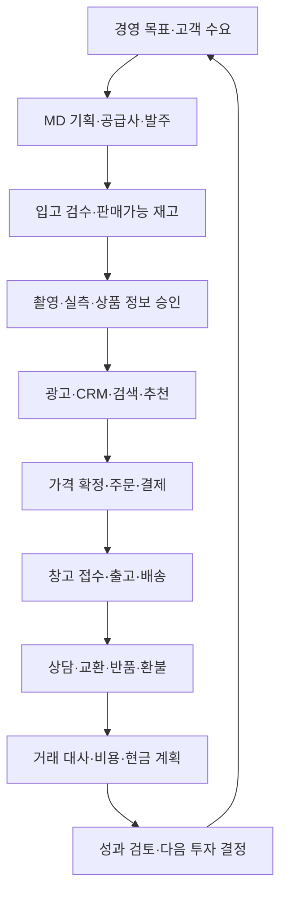
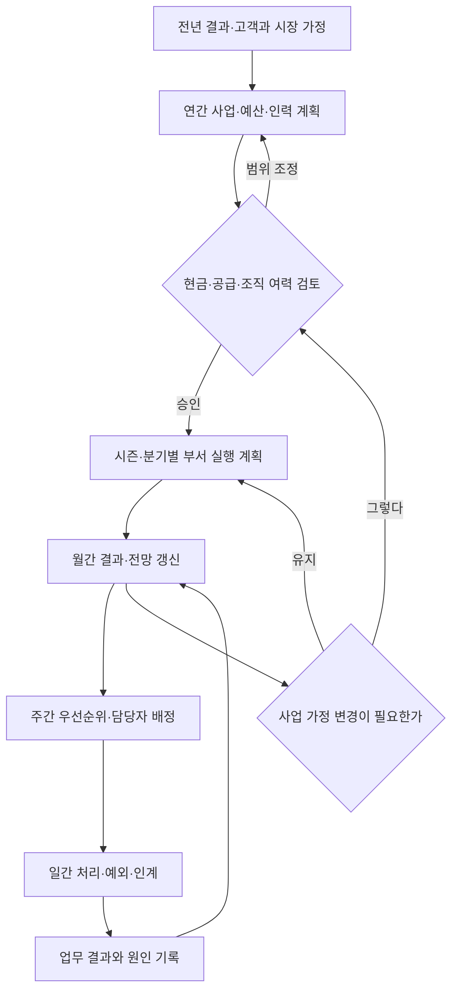
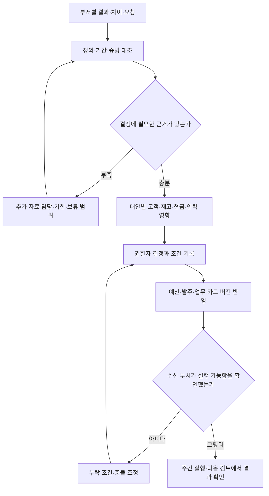
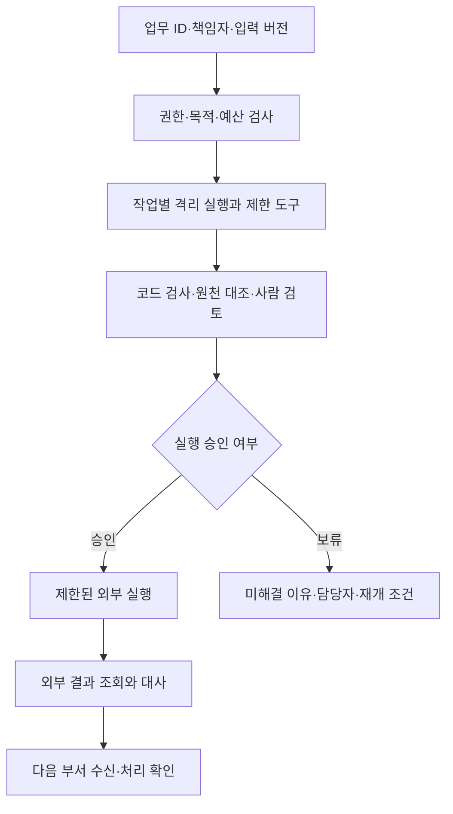

> 모드라인은 이 시리즈를 위해 만든 가상 회사다. 인물·거래·회의·금액은 창작이며 실제 회사의 실적이나 AI 도입 성공 사례가 아니다. 이 글은 처음 읽을 때의 입문 지도이자 전체 시리즈를 읽은 뒤의 종합 정리다.

모드라인에 새로 합류한 직원이 첫날 묻는다. “고객이 셔츠를 사면 우리 회사에서는 누가 무슨 일을 하나요?” 조직도를 보여 주면 부서 이름은 알 수 있지만 일이 어떻게 이어지는지는 설명되지 않는다. 기술 구성도만 보여 줘도 왜 그 시스템이 필요한지는 남는다.

개발 경력 22년이라는 가상 설정의 CTO 강태준은 대표 상품인 데일리 코튼 셔츠와 주문 두 건의 기록을 연다. 셔츠는 여러 부서의 업무를 같은 기준으로 따라가기 위해 정한 가상의 판매 상품이다.

발주, 사진, 코드 변경, 광고, 택배와 입금이 같은 상품을 기준으로 이어진다. 이 시리즈의 주인공은 특정 상품이나 에이전트가 아니라 **그 기록을 넘겨받으며 함께 일하는 회사**다.

사회초년생에게는 회사를 처음 둘러보는 이야기로, 실무자에게는 자기 회사의 업무와 비교하는 자료로 읽히도록 구성한다. 먼저 직원의 일을 따라가고, 그 일이 왜 필요한지 이해한 뒤 관련 데이터와 시스템을 살핀다. 코드와 AI 하네스는 그 과정을 지원하는 수단이다.

## 처음 듣는 직무와 문서는 그 사람이 하는 일로 이해한다

온보딩 담당 김나래는 새 직원에게 부서 약어를 외우라고 하지 않는다. 누가 어떤 결과를 책임지는지부터 설명한다. 모드라인에서 MD는 팔 상품을 고르고 매입을 관리하며, PM은 고객 문제를 개발 가능한 범위로 정리한다. 이름은 회사마다 달라도 이 이야기에서는 아래 책임으로 구분한다.

| 처음 만나는 말 | 이 회사에서 뜻하는 일 | 독자가 보게 될 자료 |
|---|---|---|
| MD·매입 | 팔 상품과 공급 조건을 정하고 사들인다 | 상품 계획·견적·발주서 |
| PM·제품 | 해결할 고객 문제와 만들 범위를 조율한다 | 요구사항·디자인·완료 조건 |
| 그로스·CRM | 고객 유입과 구매 이후 관계를 운영한다 | 캠페인·분석표·발송 대상 |
| CX·CS | 고객 요청을 해결하고 반복 문제를 돌려준다 | 상담·교환·환불·개선 요청 |
| QA·플랫폼 | 변경을 검사하고 공통 운영 기반을 지킨다 | 검사 결과·배포·복구 기록 |
| 발주·검수 | 공급사에 요청하고 도착한 실물을 확인한다 | 주문한 수량과 실제 판정의 차이 |
| 대사·마감 | 다른 장부를 맞추고 기간별 보고 범위를 정한다 | 거래 연결·미해결 차이·검토 기록 |
| 티켓·인계 | 일을 카드로 남기고 다음 담당자가 받게 한다 | 책임자·자료·상태·다음 행동 |

“확인 부탁드립니다”라는 메시지만으로 다음 일이 시작되지는 않는다. 누구의 어떤 판단이 필요한지, 언제까지 답해야 하는지, 답이 없으면 무엇을 보류할지를 적어야 한다. 문서는 보고를 위한 장식이 아니라 다른 사람이 일을 이어 갈 수 있게 하는 도구다.

신규 직원의 첫 과제는 전체 시스템을 외우는 것이 아니다. 업무 카드 하나에서 입력 자료, 현재 담당자, 완료 조건, 다음 수신자를 찾는 것이다. 이후 같은 질문을 각 부서에 적용하면 회사가 연결돼 보이기 시작한다.

## 회사가 무엇을 팔고 무엇을 외부에 맡기는지 먼저 정한다

모드라인은 한국 고객에게 일상복·출근복을 파는 온라인 의류몰이다. 브랜드를 매입하고 일부 상품을 기획하며, 자체 웹·모바일 웹에서 판매한다. 판매 주체는 회사 하나다. 다중 판매자 오픈마켓의 판매자별 정산은 현재 사업이 아니다.

사내 인원은 80명이고 개발은 15명이다. 월 활성 이용자 30만 명, 하루 평균 주문 1,000건, 스타일 2만 개와 SKU 12만 개는 규모를 설명하기 위한 가정이다. 이 값에서 회사 매출이나 AI 생산성을 역산하지 않는다.

PG라는 결제 중개 사업자가 결제를 처리하고, 3PL이라는 외부 물류 업체가 보관·포장·출고를 맡으며, 택배사가 배송한다. 내부 담당자는 이 외부 결과를 받아 주문·재고·고객 안내·정산을 맞춘다. 외주를 쓴다는 것은 회사의 책임이 사라진다는 뜻이 아니라 인계 계약이 추가된다는 뜻이다.

### 조직도는 인원보다 결정 권한과 반복 산출물로 읽는다

시리즈의 글 수와 부서 수는 같지 않다. 개발 조직의 여러 기능을 3~6편에서 나눠 보고, 그로스·CRM은 9·10편, 재무·회계는 13·14편으로 나눠 읽는다. 편마다 새로운 팀을 더해 인원을 늘리지 않는다.

| 조직·인원 | 계속 책임지는 업무 | 다른 조직이 받아야 하는 결과 |
|---|---|---|
| 경영·사업 3명 | 사업 가정, 목표, 투자·예산·조직, 위험 | 승인 범위·중단 조건·재검토 결정 |
| 제품·디자인 6명 | 고객 조사, 문제 정의, 우선순위, 사용 경험 | 해결 범위·디자인·완료 조건·효과 검토 |
| 개발 15명 | 구현·검증, 거래·데이터, 플랫폼·보안·복구 | 운영 가능한 변경과 근거·담당자 |
| MD·매입 12명 | 상품 구성, 공급 조건, 발주·수요·재고 | SKU별 계획·입고 일정·재주문 판단 |
| 콘텐츠·스튜디오 8명 | 촬영·실측·권리·설명·기획전 제작 | 승인 자료·게시 버전·수정 이력 |
| 그로스·CRM 10명 | 시장·브랜드, 유입·전환, 고객 관계 | 집행 내역·대상 기준·분석·다음 실험 |
| 영업운영·물류관리 8명 | 판매 설정, 3PL, 재고·출고·반품 실물 | 현재 상태·미처리 사유·다음 확인 |
| CX·CS 10명 | 문의·불만·교환·환불·상담 품질 | 고객 해결 결과·반복 문제의 근거 |
| 재무·회계 4명 | 증빙·대사·결산, 예산·현금·지급 | 확정 범위·차이·자금 전망·지급 결과 |
| 피플·총무 4명 | 채용·평가 운영·급여 자료·입퇴사·자산 | 역할·인계·접근·계약·장비 상태 |

인원 합계는 80명이다. 외부 창고 직원과 계약 전문가는 포함하지 않는다. 내부 팀은 계약 상대와 자료·완료 조건을 맞추고 결과를 검토한다. 전문 업무를 위탁하더라도 자료를 준비하고 회사의 판단을 전달할 담당자는 필요하다.

예를 들어 광고비가 늘어나는 결정에는 유라의 캠페인 계획, 지민의 SKU별 공급 여력, 민수와 수진의 처리 용량, 도현의 현금 전망이 함께 들어간다. 경영진은 그 충돌을 조정하지만 소재 문구 하나나 일상적인 환불까지 전부 직접 승인하지 않는다.

업무별 위임 범위는 문서로 정한다. 담당자는 승인 범위 안에서 실행하고, 범위를 벗어나면 이유·선택지·영향을 붙여 상신한다. 책임자가 휴가 중일 때 대신 판단할 사람과 긴급 처리 후 검토할 절차도 함께 지정한다.

## 한 상품이 다음 시즌의 결정으로 돌아오는 길을 읽는다

지민이 기획한 대표 상품은 `P-F26-017`, 데일리 코튼 셔츠다. 네이비와 아이보리, S·M·L로 SKU 여섯 개가 있다. 각 100장씩 600장을 발주했지만 첫 실물 입고는 596장이다. 검수 보류 8장을 빼고 처음 판매할 수 있는 수량은 588장이다.

화살표는 회사의 업무 관계다. 모든 과정이 하루에 끝나거나 하나의 데이터베이스 트랜잭션으로 처리된다는 뜻은 아니다. 상품을 기획하는 동안 다른 상품의 주문이 들어오고, 개발팀은 그 옆에서 화면과 연동을 개선한다.

고객 A는 네이비 M을 53,100원에 결제하고 이후 S로 교환한다. 고객 B는 아이보리 M을 같은 금액에 결제한 뒤 상품 문제로 53,100원을 환불받는 흐름이다. A의 대체 출고를 새 매출로 세거나 B의 환불 접수를 곧바로 정산 완료로 세지 않는다.

## 부서 사이에는 문서보다 완료 조건이 넘어간다

조직은 각자의 결과물을 생산하지만 회사는 인계가 맞아야 움직인다. 보낸 사람이 완료라고 표시하는 것과 받는 사람이 다음 일을 시작할 수 있는 상태는 다를 수 있다. 아래 표는 전 부서를 연결하는 업무 계약이다.

| 흐름·책임자 | 받는 근거 | 다음 담당자에게 넘기는 것 |
|---|---|---|
| 제품 · 이지은 | 고객 문제·부서 요청 | 범위·완료 조건·DEV-F26-012 |
| 개발 · 강태준과 개발팀 | 작업 계약·기준 코드 | 검증된 변경·릴리스·복구 방법 |
| 데이터 · 서민아 | 승인 상품·SKU·행동 로그 | 후보·노출 버전·지표 정의 |
| 플랫폼 · 최현우 | 서비스·실행·오류 기록 | 복구 절차·권한·미해결 작업 |
| MD · 한지민 | 수요 가설·공급 조건 | 발주·납기·재검토 조건 |
| 콘텐츠 · 배소연 | 샘플·실측·촬영·권리 자료 | 승인된 상품 자료와 변경 이력 |
| 그로스·CRM · 정유라 | 상품·재고·허용 고객 범위 | 집행·발송·비용·관찰 결과 |
| 물류관리 · 박민수 | 확정 주문·창고 결과 | 출고·배송·검수·차이 목록 |
| CX · 오수진 | 고객 요청·정책·거래 상태 | 교환·환불 결과와 개선 근거 |
| 재무 · 남도현 | 거래·정산·입금·비용 증빙 | 대사·마감·현금·미해결 차이 |
| 피플·총무 · 김나래 | 인력·계약·역할 변경 | 업무 인계·자산·접근 상태 |
| 경영 · 윤서영 | 같은 기준의 부서별 자료 | 결정·담당자·예산·재검토 조건 |

QA 조은서는 개발 계약부터 사용자 여정과 릴리스까지 검증 근거를 연결한다. 품질을 마지막 단계의 승인 도장으로만 두지 않는다. 다른 부서도 자기 입력과 산출물을 검사하는 책임을 가진다.

매입·광고·회계 판단까지 CTO 한 사람이 승인하지 않는다. 태준은 의미가 다른 숫자와 상태를 시스템이 구분하도록 만들고, 각 책임자가 자기 판단을 실행·검증할 수 있게 기반을 제공한다.

## 같은 주문을 서로 다른 장부에서 읽는다

고객 A의 주문은 `O-F26-10482`, 결제는 `PAY-F26-10482`, 교환은 `EX-F26-021`이다. 고객 B는 `O-F26-10483`, `PAY-F26-10483`, `RET-F26-032`와 환불 `REF-F26-032`로 이어진다.

| 장부 | A의 교환 | B의 반품 |
|---|---|---|
| 고객 요청 | 네이비 M에서 S로 변경 | 상품 문제로 반품·환불 |
| 실물 | M 회수·검수, S 대체 출고 | 아이보리 M 회수·검수 |
| 결제 | 원결제 53,100원 유지 | 환불 53,100원 결과 확인 |
| 재고 | 돌아온 M의 판정과 나가는 S 분리 | 환불과 재판매 가능 여부 분리 |
| 재무 | 교환 비용과 원거래 연결 | 환불·정산 차감·은행 연결 |

13편의 독립 산술 예시에서는 두 결제 합계 106,200원에서 가상 차감 3,186원을 제외해 103,014원이 먼저 입금된다. 이후 B의 환불 53,100원을 차감하면 순현금은 49,914원이다. 실제 PG 조건이 아니라 정산 차이를 설명하기 위한 설정이다.

고객 결제, 환불을 뺀 결제액, PG 순현금, 회계 매출과 이익은 다른 숫자다. 회사의 전체 흐름을 이해한다는 것은 숫자를 외우는 것보다 어떤 장부와 시점에서 나온 값인지 설명할 수 있다는 뜻이다.

## 판매 준비에서 다음 회의까지 직원의 자리를 옮겨 본다

첫 방문은 지민의 자리다. 상품을 고른 지민은 공급사와 수량·납기·검수 조건을 확인하고 발주서를 보낸다. 창고는 600장 요청에 실물 596장이 왔다고 회신한다. 신규 직원은 숫자가 틀린 것부터 고치려 하지만 민수는 발주와 입고가 다른 사실이라며 두 기록을 모두 남긴다.

첫 검수 보류 8장은 판매 시작 전 재검수에서 6장 판매가능, 2장 공급사 반송으로 나뉜다. 미입고 4장은 별도로 남는다. 이 시점의 판매가능 594장을 판매운영이 받고, 도현은 원 발주와 후속 증거를 받아 계약상 지급 조건을 확인한다. 이후 현재 재고는 판매와 이동을 더 반영해야 한다.

다음은 소연의 자리다. 상품을 매입했어도 사진과 옵션이 틀리거나 실측 근거가 없으면 판매 페이지를 승인할 수 없다. 사진 연결과 측정 안내를 고친 뒤 유라가 실제 공개된 랜딩을 열어 본다. 파일 전달에서 고객 화면 확인까지가 이 인계의 범위다.

개발팀에서는 지은이 여러 부서의 요청을 하나의 고객 문제로 정리한다. 개발자는 화면을 고치고 은서는 키보드 검사 실패를 찾아 돌려보낸다. 수정 뒤 검사를 다시 통과해도 배포 담당자의 운영 확인은 남는다. 구현·검토·출시를 같은 완료로 세지 않는다.

판매가 시작되면 주문팀이 결제와 재고를 확정하고 창고가 물건을 보낸다. 오후 출고 배치에서 아직 못 보낸 주문은 이유와 다음 확인 시각을 붙여 수진에게 넘어간다. 신규 직원은 그제야 상담팀이 왜 주문 화면뿐 아니라 창고 결과도 읽는지 이해한다.

고객 A의 교환과 B의 환불이 들어오면 수진은 답변 뒤에 필요한 실물·금액 작업을 만든다. 처리가 끝난 뒤에도 자료는 사라지지 않는다. 소매 길이 의견은 실측·화면 검토로, 상품 문제는 검수·공급사 협의로, 환불 기록은 재무와 마케팅 분석으로 이어진다.

월말 도현은 거래와 정산의 차이를 설명하고, 서영은 그 자료와 재고·고객 반응을 받아 다음 지출과 상품 계획을 정한다. 이 장면들은 여러 날과 주에 걸친 흐름이다. 회사는 이 모든 업무를 다양한 상품과 고객에 대해 동시에 반복한다.

## 쌓인 자료가 분석 결과를 거쳐 다음 업무로 바뀐다

### 보고서는 기준일·범위·확정 여부를 첫 화면에 적는다

민아가 월간 보고서를 만들 때 첫 작업은 차트를 고르는 것이 아니다. 주문·상품·광고·상담 자료가 어느 시점까지 들어왔는지 확인한다. 주문 발생 월과 현금 입금 월은 다르고, 이번 주 구매 고객의 반품 결과는 아직 끝나지 않았을 수 있다.

보고 표지에는 대상 기간, 집계 기준일, 고객·주문·항목 중 집계 단위, 제외 조건, 정의 버전, 작성자와 검토자를 적는다. 확정한 숫자와 잠정치, 전망을 구분하고 늦게 들어온 자료는 다음 버전의 조정 내역에 남긴다.

| 보고 자료 | 원천과 기준 | 읽는 사람이 해서는 안 되는 해석 |
|---|---|---|
| 주문·환불 현황 | 주문·결제·환불 ID와 각 완료 시각 | 환불 접수를 PG 성공이나 입금 차감과 동일시 |
| 판매가능 재고 | SKU별 재고 이동과 기준 시각 | 발주 수량 또는 첫 입고 숫자를 현재 재고로 사용 |
| 마케팅 구매 집단 | 유입·결제 연결 규칙과 반품 관찰 창 | 다른 고객 구성의 채널 차이를 인과 효과로 확정 |
| 월간 결산 | 회계 처리 기준과 증빙, 미해결 조정 | 고객 결제액을 그대로 확정 매출·이익으로 사용 |
| 주간 자금 전망 | 은행 잔액, 예정 수금·지급과 시나리오 | 아직 받지 않은 예상 입금을 가용 현금으로 표시 |
| 개발·운영 현황 | 요청·변경·장애별 시작과 완료 이벤트 | 코드 생성량을 고객 문제 해결량으로 표시 |

### 전사 KPI는 결과와 원인, 위험을 함께 묶는다

KPI는 중요한 성과를 계속 확인하기 위해 정한 지표다. 모드라인은 하나의 숫자로 모든 팀을 평가하지 않는다. 아래는 이 회사가 채택하는 내부 정의이며 실제 현재 실적이나 업계 권장 목표는 아니다. 목표와 경보선은 이전 자료·예산·처리 여력을 보고 별도 승인한다.

| 전사 지표 | 이 시리즈의 계산과 관찰 범위 | 원천·정의 책임 |
|---|---|---|
| 30일 환불 반영 결제액 | 구매 후 30일 관찰이 끝난 주문의 결제액 − 같은 창의 성공 환불액. 이후 조정은 별도 표시 | 결제·환불 원장, 재무·데이터 |
| 분석 기여액 | 같은 주문 집단의 환불 반영 금액 − 합의한 순원가·수수료·배송·회수·광고비 | 주문별 비용 매핑, 재무·그로스 |
| 30일 반품 주문율 | 관찰이 끝난 결제 주문 중 30일 안 반품이 접수된 고유 주문 / 해당 결제 주문. 교환·진행·거절을 별도 분류 | 주문·반품 접수, CX·MD |
| 출고 약속 준수율 | 해당 주 약속 마감 대상 주문 중 마감 내 택배 인계 증거가 있는 주문 / 대상 주문. 마감 전 취소 확정 제외 내역 보존 | 주문별 약속·WMS·택배, 물류관리 |
| 90일 두 번째 구매율 | 첫 결제 후 90일 관찰이 끝난 고객 중 그 창에 두 번째 결제한 고객 / 해당 첫 결제 고객. 후속 전액 환불 여부 별도 표시 | 고객·결제 연결, CRM·데이터 |
| 주간 기말 현금 전망 | 확인한 기초 가용 잔액 + 시나리오별 주간 입금 − 주간 지급. 제한 자금과 미확정 약정 분리 | 은행·수금·지급 일정, 재무 |
| 인계 재요청률 | 이번 주 접수한 업무 카드 중 필수 자료 부족으로 다시 요청한 카드 / 접수 카드. 카드당 한 번 집계 | 업무 카드·반려 사유, 각 수신 부서 |

분모가 작거나 관찰이 끝나지 않았으면 그 사실을 먼저 적는다. 접수 반품률과 성공 환불률도 다르므로 마케팅의 환불 분석값을 이 표의 반품 접수율로 바꿔 부르지 않는다. 월간 회계 매출·영업이익은 재무의 확정 보고에서 별도로 읽는다.

| 함께 읽는 지표·주기 | 지표가 나빠졌을 때의 조사 | 다음 담당자와 행동 |
|---|---|---|
| 결제액·기여액, 주간 잠정·월간 성숙 집단 | 판매량, 할인, 원가, 환불, 광고비를 같은 단위로 분해 | MD·그로스·재무가 가격·집행·공급 안 재검토 |
| 반품률·상담 사유, 주간 추이·월간 확정 창 | SKU·사이즈·소재·시점별 표본과 원문 확인 | 콘텐츠·MD·제품에 근거와 수정 조건 인계 |
| 출고 준수율·미처리 나이, 매일·주간 | 재고 차이, 창고 처리, 취소 경합, 택배 지연 분리 | 물류가 회복 계획, CX가 고객 안내 범위 확정 |
| 두 번째 구매율·수신 거부, 월간 구매 집단 | 신규 구성·시즌·혜택·반품 상태를 함께 비교 | CRM이 대상·빈도·혜택 실험안 조정 |
| 현금 전망·예측 차이, 매일 예외·주간 갱신 | 정산 지연·지급 확정·미집행 선택 지출 구분 | 재무가 시나리오, 경영이 승인 범위 결정 |
| 재요청률·대기 시간, 주간·월간 | 특정 입력 누락과 검토자 여력, 재작업 원인 확인 | 요청 부서가 양식·자료, 수신 부서가 검토 용량 개선 |

이 방식이면 마케팅의 결제 증가가 물류 적체와 반품 증가를 동반하는지, 처리 시간 단축이 다음 부서의 재작업을 늘리는지 볼 수 있다. 팀별 KPI의 상세 정의와 담당자의 업무 장면은 각 부서 글에서 이어진다.

### 지표의 공통 해석 규칙을 먼저 맞춘다

부서별 KPI는 서로 다른 업무를 측정하지만, 숫자가 없는 이유를 표시하는 방식은 같아야 한다. 아래 규칙은 02~16편의 공통 기준이다. 각 편의 표에는 지표·계산 범위·원천·책임·검토 주기를 두고, 이어지는 설명에서는 해석상 주의와 다음 행동을 읽는다.

| 상황 | 보고서에 표시할 것 | 이어서 할 일 |
|---|---|---|
| 집계 대상이 없어 분모가 0 | 해당 없음; 0% 또는 100%로 대체하지 않음 | 대상 선정이 맞는지 확인하고 활동 건수를 함께 제시 |
| 필요한 원천이 누락됨 | 미측정·집계 불가와 빠진 범위; 관측한 0과 구분 | 수집 담당·복구 예정·결정에 쓸 수 있는 범위 지정 |
| 반품·재구매 등 관찰 기간이 안 끝남 | 잠정치, 기준 시각, 확정 예정일 | 같은 관찰 길이의 집단끼리 비교하고 재집계 |
| 완료 건의 처리시간을 보고함 | 완료 집단의 중앙값·P90과 미완료 건수·현재 경과시간 | 빠른 완료만 남기는 편향을 확인하고 오래된 대기 배정 |
| 정의·원천·예정일이 바뀜 | 원래 정의와 변경 이유·승인·버전 | 과거를 조용히 덮지 않고 같은 기준으로 비교 가능한지 확인 |
| 목표와 관찰값을 함께 보고함 | 목표·실제 측정·가상 예시를 구분 | 기준선과 품질·고객·현금 영향을 함께 검토하고 조치 책임 지정 |

P90은 관측값의 90%가 그 값 이하에 놓이는 경계다. 실제 집계에서는 보간 방식과 표본 수도 고정·표시한다. 영업일·업무시간은 승인한 업무 달력을 쓰며, 달력일이나 전체 경과시간과 바꾸어 읽지 않는다.

표의 책임자는 지표와 업무 흐름을 개선할 담당자이지 단일 수치로 자동 평가할 대상이 아니다. KPI를 좋게 보이게 하려고 어려운 거래·문의·미완료를 원래 대상에서 빼지 않는다. 목표치를 아직 정하지 않았거나 실측하지 않았다면 그 상태를 그대로 남긴다.

금액·수량·고객·주문·작업은 다른 단위다. 이 공통 규칙이 각 부서의 분모·관찰 창·제외 규칙을 대신하지 않는다. 예를 들어 마케팅의 주문 비용 30일 창과 CRM의 재구매 90일 창, 예산과 은행 현금은 여전히 분리해서 읽는다.

### 같은 보고 틀에 넣더라도 독립된 예시를 합산하지 않는다

사회초년생이 보고서 숫자만 보면 부서가 각자 다른 숙제를 하는 것처럼 보일 수 있다. 같은 기간·집단·정의를 정해 원천을 정리하면 왜 다음 행동이 나왔는지 읽을 수 있다. 아래 값은 각 편의 서로 다른 가상 검토 자료이며 하나의 회사 실적표로 합산하지 않는다.

| 부서가 받은 자료 | 처리·분석에서 나온 결과 | 실제로 바뀐 다음 행동 |
|---|---|---|
| 제품 · 요청 12건 | 중복 정리 후 8건, 준비 완료 3건 | 나머지는 정책·자료 책임자에게 질문 |
| 개발 · 인수 검사 12개 | 첫 검토 11개 통과·1개 실패 | 초점 처리 수정 뒤 같은 조건 재검사 |
| 마케팅 · 별도 파일럿 460주문 | A 분석 기여 -51만 원, B 3.2만 원 | 즉시 확대 대신 원인·고객 구성 검토 |
| CRM · 발송 요청 830명 | 접수·전달·미확인을 나눈 결과 | 결과 불명은 조회, 수신 거부는 제외 |
| 물류 · 출고 배치 120건 | 인계 100·중지 확인 3·후속 확인 17 | CX 안내 판단과 창고 조사로 인계 |
| 재무 · 정산 원본 30줄 | 고유 29건, 일치 24·시점 3·조사 2 | 차이별 담당자·증거·확인일 지정 |
| 예산 · 입금 지연 가정 | 기말 800만 원 전망이 검토선 미달 | 미집행 확대분 조정해 1,000만 원 재계산 |

A의 광고 지표가 좋아 보여도 환불과 비용을 읽으면 증액을 다시 생각해야 한다. 반대로 B가 더 나아 보여도 신규 고객 비중과 관찰 조건이 다르면 그 차이를 광고 효과라고 단정할 수 없다. 분석은 답을 예쁘게 출력하는 일이 아니라 비교 가능한 것과 아직 모르는 것을 가르는 일이다.

서영은 결과표를 받은 뒤 결정·담당자·확인 시점을 남긴다. 다음 회의에서 실측 검토가 끝났는지, 공급사 답변이 왔는지, 광고 실험의 관찰 기간이 지났는지 확인한다. 이렇게 해야 보고서가 반복 작성되는 문서가 아니라 다음 업무를 움직이는 자료가 된다.

## 효율은 빨리 만든 양보다 기다림과 재작업이 줄었는지 본다

태준은 직원에게 무조건 더 빨리 일하라고 하지 않는다. 요청부터 완료까지를 실제 처리, 자료 대기, 검토 대기, 재작업으로 나눠 본다. 답변을 기다린 이틀과 코드를 고친 두 시간을 구분해야 어떤 일을 고칠지 알 수 있다.

모드라인의 개선 순서는 입력 양식과 ID를 맞추고, 정확해야 하는 반복 계산을 자동화하고, 예외를 담당자에게 보내고, 인계 이후 결과를 확인하는 것이다. AI는 문서 요약이나 초안처럼 도움이 되는 지점에 붙인다. 정책이 정해지지 않은 문제는 모델을 더 호출해도 해결되지 않는다.

각 편의 작업 건수와 대화는 이를 설명하는 창작 자료다. 실제 단축 시간이나 인력 절감률은 만들지 않는다. 같은 기준의 기록을 쌓아 이전 방식과 비교해야 개선을 주장할 수 있다. 빨리 보냈지만 다음 부서가 다시 조사한다면 회사 전체의 업무는 빨라진 것이 아니다.

## 회사의 1년은 다음 해 계획과 이번 시즌 실행이 겹쳐 흐른다

아침 출고 회의만 따라가면 회사가 급한 일에 반응하는 곳처럼 보일 수 있다. 실제 이 이야기의 직원들은 오늘 주문을 처리하면서 다음 달 캠페인과 다음 시즌 상품을 준비한다. 경영·재무·피플·개발은 그보다 긴 시간의 투자와 인력을 검토한다.

아래 일정은 모드라인의 가상 운영 달력이다. 모든 의류 회사의 고정 일정이나 법정 신고·지급 기한이 아니다. 계약·세무·노무 관련 확정 일정은 해당 담당자가 전문가와 별도 관리한다.

| 시기 | 회사가 함께 확인하는 것 | 다음 단계에 넘기는 자료 |
|---|---|---|
| 전년도 10~12월 | 고객·상품·채널 가정, 올해 원인, 다음 해 투자 여력 | 연간 사업안·예산·인력·상품·개발 우선순위 |
| 1~3월 | 전년 결과·결산 자료, 봄 판매, 다음 시즌 조달 준비 | 확정·미확정 결과 구분, 시즌 실행·공급 일정 |
| 4~6월 | 여름 운영, 상반기 차이, 가을 수요·발주·촬영 준비 | 하반기 전망, 가을 입고·콘텐츠·용량 계획 |
| 7~9월 | 가을 판매 준비·파일럿, 재고·현금·피크 대응 여력 | 승인된 판매·집행 범위, 물류·상담·서비스 준비 |
| 10~12월 | 가을·겨울 결과, 잔여 재고·반품·현금, 연말 운영 | 시즌 평가, 다음 해 가정 수정·계획 초안 |

일정표에서 ‘가을 준비’는 9월에 처음 시작하는 일이 아니다. 공급사 납기, 샘플·촬영, 화면 수정, 캠페인 검토가 앞서 배치된다. 고객 반응이 예상과 다르면 이미 확정한 계약과 아직 조정 가능한 지출을 구분해 계획을 바꾼다.

연간 계획은 목표 숫자만 전달하는 문서가 아니다. 무엇을 시도하고 무엇은 하지 않을지, 부서가 사용할 수 있는 예산과 인력, 다시 판단할 조건을 함께 준다. 하위 조직은 이 경계에서 자기 실행 계획을 만든다.

반대로 고객 불만이나 공급사 지연이 모두 연간 전략 수정으로 올라가지는 않는다. 일상적으로 처리할 예외는 담당자가 해결하고, 반복되거나 승인 범위를 바꾸는 문제만 근거를 모아 상위 의사결정으로 올린다.

### 월간 회의는 보고서 제출이 아니라 계획을 갱신하는 자리다

모드라인은 월간 검토 전에 각 부서가 결과·차이·가설·요청을 정리하고, 재무가 확정 범위와 잠정 자료를 표시하도록 한다. 필요한 입력이 늦으면 빈칸을 추정 실적으로 채우지 않는다. 미확정 항목과 그 때문에 결정할 수 없는 범위를 따로 남긴다.

| 준비·회의 단계 | 담당자가 하는 일 | 끝났다고 판단하는 근거 |
|---|---|---|
| 부서 사전 검토 | 목표 대비 차이와 원천, 이미 한 조치, 필요한 결정을 작성 | 숫자의 정의·기간과 책임자가 식별됨 |
| 데이터·재무 대조 | 중복·시점·정산·비용 차이, 잠정치와 확정치 표시 | 비교 가능 범위와 남은 차이 목록 공유 |
| 교차 검토 | 판매·재고·물류·상담·개발·현금 제약을 함께 읽음 | 대안별 효과·위험·필요 자원 정리 |
| 경영 결정 | 유지·수정·중단·추가 조사 중 선택 | 결정·권한·담당자·기한·재검토 조건 기록 |
| 실행 반영 | 예산·발주·캠페인·로드맵·인력 계획에 변경 반영 | 수신 부서가 새 버전과 자기 할 일을 확인 |
| 다음 검토 | 완료 증거와 실제 영향 확인 | 미완료는 책임자와 다음 확인 시점을 유지 |

보고서의 마지막에는 “알겠습니다”가 아니라 결정 카드가 남는다. 예를 들어 `DEC-F26-REORDER`에는 재주문을 위해 필요한 SKU별 수요, 공급 조건, 자금 근거가 붙는다. 자료가 부족하면 대량 발주를 보류하고 무엇을 더 확인할지 담당자를 정한다.

데이터가 불완전해도 모든 일을 멈추지는 않는다. 기존 승인 범위의 일상 업무를 유지하면서 신규 확대처럼 되돌리기 어려운 결정을 보류할 수 있다. 보류에는 확인 담당자와 기한이 있어야 하며, 자료를 더 얻는 비용도 함께 고려한다.

### 같은 회의에서 부서 목표가 충돌하는 장면을 읽는다

유라는 사전 파일럿의 A 채널 결제 기준 ROAS가 5라고 보고한다. 도현은 환불과 합의한 비용을 뺀 분석 기여가 -51만 원이라는 같은 파일럿의 계산을 덧붙인다. 민아는 B의 3.2만 원도 고객 구성이 달라 곧바로 더 좋은 채널의 증거가 아니라고 설명한다.

지민은 대표 셔츠의 추가 공급 가능성을 검토하고 싶지만 파일럿은 여러 상품을 대상으로 했으므로 그 주문 460건을 셔츠 수요로 대체할 수 없다. 민수는 현재 SKU별 판매가능 재고와 입고 예정, 수진은 실측 관련 문의의 원문과 발생 범위를 가져온다.

서영은 이 자료에서 세 가지 다른 일을 꺼낸다. 광고는 비교 조건을 맞춘 다음 실험을 설계한다. 상품은 실측·설명·검수 근거를 보완한다. 추가 발주는 현재 수요·공급·현금 자료가 준비될 때 다시 검토한다. 모두 ‘성장’이라는 단어로 묶여도 담당자와 완료 증거가 다르다.

별도의 주간 현금 전망에서는 입금이 늦어지면 기말 800만 원으로 검토선 1,000만 원을 밑돈다. 도현은 이미 지급할 의무와 아직 계약·집행하지 않은 광고 확대분 200만 원을 분리한다. 권한자가 확대분 미집행을 결정하면 전망을 1,000만 원으로 다시 계산한다.

이는 파일럿 B 증액을 승인했다는 뜻도, 미지급 의무를 임의로 늦췄다는 뜻도 아니다. 서로 다른 자료를 같은 회의에서 참고하되 범위와 인과관계를 섞지 않는 것이 경영 보고의 실무다.

### 주간과 일간에는 결정의 미완료 부분을 계속 추적한다

주간 판매·품질 협의에는 MD·그로스·영업운영·CX가 필요한 안건만 함께 본다. 품절 예상, 광고 대상, 반복 문의와 반품 사유를 확인해 다음 주 상품·콘텐츠·집행을 맞춘다. 제품·개발은 그중 시스템 변경이 필요한 요청을 받아 자기 검토·개발 용량에 배치한다.

재무는 주간 자금 전망과 지급 예정, 정산 차이를 갱신한다. 피플은 입사·휴가·담당 변경으로 생길 공백을 각 팀과 확인한다. 모든 직원이 모든 회의에 참석하지 않으며, 회의록의 결정과 인계 카드로 연결한다.

| 하루의 예시 시각 | 확인할 업무 | 다음 사람이 받을 것 |
|---|---|---|
| 09시 | 야간 주문·결제·출고·시스템 예외와 고객 영향 | 조사 담당·우선순위·고객 안내 필요 여부 |
| 10시 | 상품·재고·가격·콘텐츠·캠페인 판매 준비 | 승인 버전·공개 가능 범위·보류 사유 |
| 14시 출고 마감 | 택배 인계·취소 확인·미출고 대상 | 주문별 현재 상태·다음 확인·CX 안내 근거 |
| 17시 | 답변 대기·검토 대기·기한 임박 업무 | 다음 담당·확인 시각·중단/재개 조건 |

이 시각은 회사 설정의 예시이며 전 부서 공통 출석표가 아니다. 업무를 인계할 때는 “처리 중” 대신 이미 확인한 사실, 확인하지 못한 부분, 다음 행동을 적는다. 야간이나 휴일에도 필요한 업무는 별도의 당번·연락·승계 기준에 연결한다.

사람의 합류·휴가·퇴사 역시 운영 흐름이다. 계정과 장비만 넘기면 끝나지 않는다. 승인 대기 문서, 공급사와의 약속, 예약 발송, 서비스 계정, 다음 월간 보고의 책임을 새 담당자가 받아야 한다.

## 전체 글은 개발 순서와 회사의 시간 순서로 읽을 수 있다

현재 본편은 개발을 먼저 이해하고 각 부서로 넓히는 1~16편이며, 종합편을 포함한 업무 시리즈 17편과 별도 기술 01편, 총 18편을 작성했다. 완결 분량을 고정한 것은 아니다. 「시나리오: 이커머스」에 업무·구현 내용을 추가할 때 이 글의 지도와 목차도 함께 갱신한다.

회사 경험이 없다면 이 글을 읽고 15편의 입사 장면, 7·8편의 판매 준비, 9~14편의 고객·물건·돈, 16편의 경영 판단 순서로 둘러봐도 좋다. 그 과정에서 나온 개선 요청이 어떻게 구현되는지 궁금해지면 2~6편과 [기술 01편의 아키텍처·AI 실행 지도](/100/scenario-ecommerce-tech-01-architecture-ai-runtime)를 읽는다. 개발 관점부터 시작하려면 기존 1~16편 순서를 따른다.

| 편 | 읽을 내용 |
|---|---|
| 01 | [회사의 업무와 시스템을 한눈에 읽는다](/80/scenario-ecommerce-harness-engineering) |
| 02 | [제품·디자인팀의 조사, 로드맵과 출시 운영](/81/scenario-modeline-02-product-planning) |
| 03 | [개발·QA팀의 계획, 검증과 릴리스 운영](/82/scenario-modeline-03-development-harness) |
| 04 | [데이터팀의 분석, 검색·추천과 실험 운영](/83/scenario-modeline-04-search-recommendation) |
| 05 | [커머스팀의 주문·결제·취소·환불 운영](/84/scenario-modeline-05-orders-payments) |
| 06 | [플랫폼팀의 신뢰성, 보안과 복구 운영](/85/scenario-modeline-06-platform-operations) |
| 07 | [MD의 시즌 계획이 발주와 재고가 된다](/86/scenario-modeline-07-merchandising-procurement) |
| 08 | [스튜디오와 운영팀이 판매할 상품을 완성한다](/87/scenario-modeline-08-content-launch) |
| 09 | [마케팅팀의 시장 조사·캠페인·성과 분석](/88/scenario-modeline-09-growth-marketing) |
| 10 | [CRM이 회원·구매·재구매 여정을 관리한다](/89/scenario-modeline-10-crm-lifecycle) |
| 11 | [물류팀이 주문을 실물 배송으로 바꾼다](/90/scenario-modeline-11-fulfillment-logistics) |
| 12 | [CX·CS가 구매 전 문의부터 교환·환불·반복 문제까지 책임진다](/91/scenario-modeline-12-customer-support-returns) |
| 13 | [재무·회계가 거래와 비용을 기록하고 결산한다](/92/scenario-modeline-13-financial-close) |
| 14 | [재무가 예산·현금·구매·계약을 함께 운영한다](/93/scenario-modeline-14-budget-cash) |
| 15 | [피플·총무가 채용부터 급여 자료·퇴사·시설까지 운영한다](/94/scenario-modeline-15-people-administration) |
| 16 | [경영이 연간 전략·예산·조직과 실행을 연결한다](/95/scenario-modeline-16-management-decisions) |
| 종합편 · 이 글 | 회사 전체의 업무·데이터·의사결정을 연결하다 |
| 별도 기술 01 | [업무를 연결하는 아키텍처와 AI 실행 기반](/100/scenario-ecommerce-tech-01-architecture-ai-runtime) |

기술 구조는 별도 기술 01편과 업무 3·4·5·6편을, 고객 경험과 운영은 7~12편을, 자금·조직·경영은 13~16편을 함께 읽는다. 특정 부서만 읽더라도 앞뒤 인계 자료를 확인하면 왜 그 업무가 필요한지 연결할 수 있다.

## 이 회사에서 빠진 것과 다음 확장 조건도 남긴다

시리즈는 단일 판매 주체의 국내 온라인 의류몰이라는 범위에서 주요 일상 업무와 중요한 예외를 다뤘다. 해외·오픈마켓·오프라인 매장, 자체 공장 운영과 모든 법률·세무 절차를 완성한 운영 매뉴얼은 아니다. 새로운 사업을 시작하면 계약·데이터·책임·평가를 다시 설계해야 한다.

실제 회사에 적용할 때는 자기 조직의 원천 자료와 승인 정책을 확인해야 한다. 실측하지 않은 생산성 수치, 법적 검토 없이 만든 정책, 복원해 보지 않은 백업은 이 글을 읽었다는 이유로 검증된 것이 되지 않는다.

읽고 난 뒤 부서 이름을 전부 외울 필요는 없다. 한 업무에서 무엇을 받았는지, 누가 어떤 근거로 판단했는지, 어떤 실행과 확인이 남았는지, 다음 사람에게 무엇을 넘겼는지를 설명할 수 있으면 된다.

모드라인의 이야기는 그 연결을 따라 회사가 어떻게 움직이는지 보여 주는 기록이다. 같은 흐름을 이해하면 사회초년생은 자신의 일이 어디에 놓이는지 알 수 있고, 실무자는 어디에서 기다림과 재작업이 생기는지 질문할 수 있다. 시스템과 AI의 가치는 그 질문에 도움이 되는 결과로 확인한다.

## 개발·AI 활용은 업무 운영과 구분해 설계한다

업무편의 마지막 기술 구역은 바로 앞에서 본 일을 지원하는 시스템·데이터·자동화의 경계를 설명한다. 이 종합편에서는 공통 원칙과 편 사이의 연결만 묶는다. 기술 설명을 건너뛰어도 담당자의 일과 의사결정은 이해할 수 있게 분리한다.

### 사람·업무 코드·AI가 맡을 일을 분리한다

모드라인에서 AI는 비정형 자료를 읽고, 코드를 제안하고, 설명과 비교안을 만들며 조사할 근거를 찾는다. 같은 입력에서 정확해야 하는 계산과 상태 제약은 업무 코드가 맡는다. 목표·위험·예외·책임이 필요한 결정은 권한 있는 사람이 맡는다.

| 업무 | AI가 보조하는 일 | 코드·사람이 확정하는 일 |
|---|---|---|
| 개발 | 구현·테스트·검토 자료 초안 | 독립 검사·리뷰·릴리스 승인 |
| 상품 | 속성 추출·설명 제안 | 원자료 검수·판매 승인 |
| 추천 | 의미 기반 탐색·후보 설명 | 가격·판매 조건·실험 판단 |
| 광고·CRM | 소재·메시지·변화 원인 후보 | 적격성·예산·발송·집행 승인 |
| 물류·CS | 상태 요약·차이 조사·답변 초안 | 실물 판정·거래 실행·예외 판단 |
| 재무 | 증빙 매칭 후보·설명 | 산술 대사·회계 판단·지급 |
| 인사·경영 | 문서·일정·대안 정리 | 채용·권한·예산·사업 결정 |

AI에게 더 많은 도구를 주는 것이 항상 더 효율적인 것은 아니다. 확인할 수 없는 자료가 많으면 호출이 늘어도 작업은 끝나지 않는다. 모드라인은 입력·완료 조건·근거·권한이 명확한 좁은 업무부터 연결한다.

### 하네스는 각 부서의 일을 공통 실행 절차에 올린다

부서마다 모델 호출 코드를 복사하지 않고 공통 실행기를 사용한다. 다만 데이터와 권한까지 섞지는 않는다. 상품 초안 워커가 재무 원장을 읽거나 상담 워커가 광고비를 늘릴 수 있는 구조는 아니다.

어떤 작업은 읽기와 초안 저장에서 끝나므로 외부 실행 단계가 없다. 정해진 저위험 조건은 검증된 코드로 자동 처리할 수 있지만, 고위험 거래는 대상과 범위를 묶은 승인을 요구한다. 모든 업무에 같은 마찰을 넣기보다 위험에 맞춰 경계를 정한다.

중단되면 작업 ID 아래에 실행 결과와 남은 일을 저장한다. 다시 시작할 때는 기록과 현재 상태를 대조한다. 승인·전송·외부 성공이 각각 남아야 중복 결제·발송·출고를 피할 수 있다. 상태 저장만으로 외부 실행의 정확히 한 번 처리가 보장되지는 않는다.

### 별도 기술편은 부서 구분보다 함께 쓰는 시스템을 기준으로 나눈다

같은 업무를 두 번 설명하는 것은 허용한다. 업무편은 담당자가 어떤 근거로 판단하고 무엇을 인계하는지에 답하고, 기술편은 그것을 구현할 데이터 계약·API·권한·실패 처리·검증에 답한다. 독립적으로 읽는 데 필요한 배경을 반복하되 공통 ID와 지표 정의는 하나로 맞춘다.

현재 읽을 수 있는 별도 글은 [기술 01 — 업무를 연결하는 아키텍처와 AI 실행 기반](/100/scenario-ecommerce-tech-01-architecture-ai-runtime)이다. 업무 01편의 기술 상세를 옮겨 공통 기반을 설명했다.

아래 여섯 주제는 그다음 확장을 위한 기획안이며 아직 작성·발행된 글이 아니다. 업무 17편의 마지막 기술 구역과 기술 01편을 출발점으로 API·스키마·실패 처리·검증을 더 깊게 다룬다.

| 별도 기술편 후보 | 연결할 업무편 | 구현편에서 추가할 깊이 |
|---|---|---|
| 상품·가격·재고의 공통 데이터 계약 | MD·콘텐츠·데이터·주문·물류 | 스키마·버전·판매 조건·변경 전파·정합성 검사 |
| 주문·결제·출고·환불의 상태 연결 | 커머스·물류·CS·재무 | API·멱등 키·경합·외부 조회·대사·복구 시나리오 |
| 마케팅·CRM 분석 기반 | 데이터·마케팅·CRM·재무 | 이벤트·집계 단위·관찰 창·SQL·데이터 품질·실험 |
| 개발 요청부터 배포까지의 실행 기반 | 제품·개발·플랫폼 | 저장소 작업 격리·검사·승인·릴리스·관측 |
| 전사 업무 자동화와 AI 실행 관리 | 전 부서 | 권한·입출력 계약·도구 제한·평가·중단·재개·감사 |
| 운영 콘솔과 의사결정 기록 | 경영·재무·피플·운영 | 원천 추적·접근 통제·잠정치·승인 이력·인계 상태 |

기술편에서 실제 코드를 만들 경우에는 설계 예시, 실행 가능한 샘플, 실제 검증 결과를 구분해 표시한다. 여기서 제안한 아키텍처가 현재 블로그 저장소나 모드라인의 실서비스에 구현됐다는 의미는 아니다.
