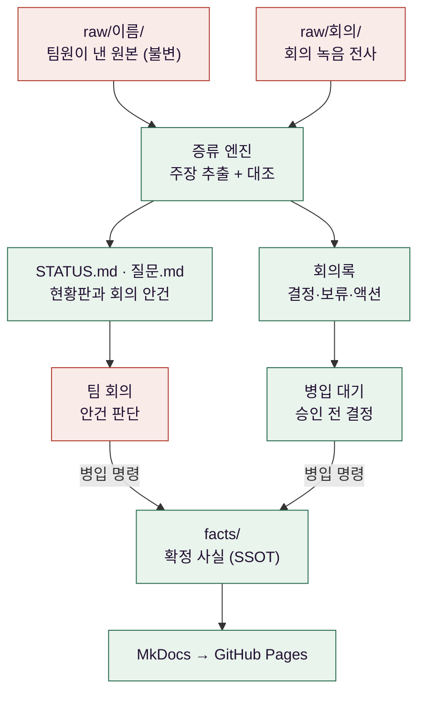
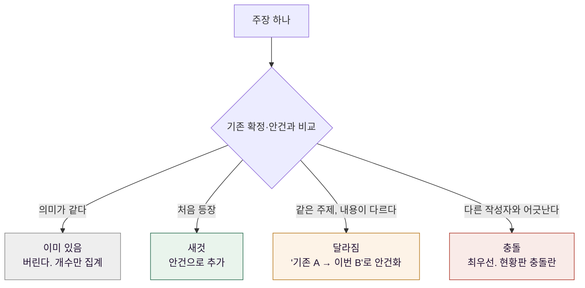

팀 프로젝트에서 설계 문서가 어긋나는 건 흔한 일이다. 다만 이번에는 어긋나는 속도가 이상하게 빨랐다.

Quantinue는 5인 팀으로 만든 모의 자동매매 시스템이다. 시스템 자체에 대해서는
[따로 정리한 글](/2/quantinue-ai-mock-trading-team-project-retrospective)이 있다. 이 글은 그 프로젝트에서
**문서를 관리하려고 따로 만든 시스템**에 대한 것이고, 이건 팀 작업이 아니라 내가 혼자 만들어 혼자 운영했다.

기간부터 적어 둔다. 설계 회의는 2026년 6월 30일부터 7월 10일까지 이어졌고 회의록으로 남은 것이 8편이다.
위키 저장소는 7월 4일에 만들어 8월 23일까지 손봤다. 아래 숫자들은 전부 그 사이의 기록이다.

문제는 이랬다. 팀원 다섯이 모두 AI로 설계 문서를 만들었다. 각자 다른 도구를 쓰고, 각자 다른 형식으로 뽑았다.
누구는 HTML로, 누구는 마크다운으로, 누구는 대화 로그를 그대로 붙여 왔다. 분량이 빠르게 늘었고, 문서 사이의
내용이 어긋나기 시작했다. 한 사람이 삭제하기로 한 필드를 다른 사람의 문서가 여전히 소비하고 있는 식이었다.

회의는 그걸 찾는 데 대부분의 시간을 썼다. "**그거 지난주에 바꾸기로 하지 않았나**"를 확인하려고 각자 파일을
열어 대조했다. 회의가 끝나면 무엇이 정해졌는지는 각자의 기억에만 남았고, 다음 회의에서 같은 논쟁이 다시 났다.

그래서 위키를 만들었다. 다만 사람이 손으로 채우는 위키는 안 될 것이 분명했다. 문서를 만드는 속도가
사람이 정리하는 속도보다 빨랐기 때문이다.


## 사람의 습관을 바꾸는 대신 문서가 수렴하게 만들었다

처음 떠오른 해법은 형식을 통일하는 것이었다. 템플릿을 정하고, 다들 그 형식으로 써 달라고 부탁하는 방법이다.
실제로 많은 팀이 이렇게 한다.

이 방법을 버린 이유는 단순하다. **지켜지지 않을 것이 뻔했다.** 팀원들은 이미 각자 익숙한 AI 도구가 있었고,
그 도구가 뱉는 형식이 서로 달랐다. 형식을 맞추라는 건 도구를 바꾸라는 말과 같았고, 그건 프로젝트 일정 안에서
설득할 수 있는 종류의 요구가 아니었다.

그래서 전제를 뒤집었다. **팀원의 행동은 그대로 두고, 그 이질적인 문서들을 하나의 확정 사실 집합으로 수렴시키는
일만 자동화한다.** 팀원이 하는 일은 자기가 만든 파일을 정해진 폴더에 넣는 것 하나로 줄었다.

시스템 이름은 DocStill로 붙였다. 원본을 증류해서 확정된 것만 병에 담는다는 비유에서 왔다. 실제로 파이프라인의
두 단계 이름을 각각 증류와 병입으로 불렀고, 이 용어가 나중에 자동 검사 규칙 하나를 만들게 된다.

전체 흐름은 단방향이다.



여기서 SSOT는 Single Source of Truth, 곧 **확정된 사실이 저장소에서 오직 한 곳에만 있다**는 뜻이다.
위키가 읽는 것은 그 한 곳뿐이고 나머지는 전부 과정 산출물이다.

빨간 칸이 사람이 하는 일의 전부다. 파일을 넣는 것과, 회의에서 무엇을 확정할지 판단하는 것.
나머지는 전부 자동으로 돈다. 오른쪽 아래로 들어가는 두 화살표를 눈여겨볼 만한데, **일반 문서든 회의 전사든
확정 사실에 닿으려면 반드시 병입 명령을 거친다.** 회의에서 합의된 것처럼 보이는 내용도 예외가 아니다.

이 흐름이 폴더 구조에 그대로 드러나게 뒀다. 어느 폴더에 있느냐가 곧 그 파일의 처리 단계다.

```text
quantinue-wiki/
├─ raw/
│  ├─ 나/
│  ├─ 팀원A/
│  ├─ 팀원B/
│  ├─ 팀원C/
│  ├─ 팀원D/
│  ├─ 공용/
│  ├─ 멘토/
│  └─ 회의/
├─ documents/
│  ├─ STATUS.md
│  ├─ 질문.md
│  ├─ 추천제안.md
│  ├─ 회의록/
│  └─ facts/
│     ├─ 결정로그.md
│     ├─ 데이터계약.md
│     └─ 파이프라인.md
├─ tools/
│  ├─ distill.py
│  ├─ distill_prompt.md
│  ├─ lint.py
│  ├─ config.json
│  └─ .state.json
├─ .claude/
│  └─ commands/
├─ CLAUDE.md
├─ wiki/
├─ archive/
└─ mkdocs.yml
```

`raw/` 아래를 **작성자별로 나눈 게 설계의 핵심이었다.** 폴더 이름이 곧 그 문서의 작성자이고,
증류가 주장을 뽑을 때 출처로 남기는 것도 이 경로다. 그래야 **다른 작성자의 주장과 어긋난다**는
판정이 가능해진다. 폴더를 주제별로 나눴다면 같은 어긋남을 한 사람 안의 앞뒤 차이와 구분할 수 없었을 것이다.

폴더를 사람 단위로 쪼갠 데는 이유가 하나 더 있다. **팀의 역할 분담이 곧 데이터 계약의 경계**였기 때문이다.
파이프라인은 수집에서 판단을 거쳐 회고로 이어지는 한 줄인데, 그 구간마다 담당자가 달랐고
담당자가 바뀌는 지점이 전부 계약이다. 누가 어떤 테이블을 소유하는지도 그 경계로 정해졌다.

| 폴더 | 맡은 구간 | 소유한 원장 |
|---|---|---|
| `팀원A` | 파이프라인 명세·거시 지표 | 종목 후보·기술 지표·거시·주문·체결 |
| `팀원B` | 공시·뉴스 수집 | 공시·뉴스 |
| `팀원C` | 전략 판단 | 전략 신호 |
| `팀원D` | 검증 | 검증 평결 |
| `나` | 회고와 스키마 관리 | 회고 |

이 표를 보면 앞에서 말한 충돌이 어디서 나는지가 보인다. **공시와 뉴스를 만드는 쪽과 그것을 읽어
전략을 짜는 쪽 사이가 계약이고, 그 계약의 필드 이름 하나가 어긋나면 두 사람 문서가 충돌한다.**
증류에 "다른 작성자끼리 어긋날 때만 충돌"이라는 규칙을 넣은 것은 이 구조를 그대로 옮긴 것이다.

`공용`은 팀 전체가 쓰는 설계서, `멘토`는 외부 피드백, `회의`는 녹음 전사다. 멘토 피드백의 지적은
자동으로 우선순위 높은 안건이 되고, 회의 전사는 뒤에서 보듯 아예 다른 절차를 탄다.

여기서 실제로 일어난 일을 미리 적어 둔다. **팀원 몫으로 만든 폴더 넷 가운데 둘은 끝까지 비어 있었다.**
문서가 없어서가 아니다. 그중 한 사람은 자기 담당을 정리하면서 다른 문서들까지 함께 읽고 전체 뼈대를
잡는 방식으로 일했고, 그렇게 나온 명세는 개인 문서라기보다 팀 전체의 설계서에 가까워 `공용`으로 들어갔다.
분류가 틀린 게 아니라, **작성자별 폴더라는 모델이 그런 작업 방식을 담지 못한 것**이다.
이 이야기는 마지막에서 다시 한다.

각각의 역할과, 무엇보다 **누가 쓸 수 있는지**가 이 구조의 요점이다.

| 경로 | 무엇이 있나 | 쓰는 주체 |
|---|---|---|
| `raw/<작성자>/` | 그 사람이 낸 원본 문서 | 사람이 넣기만 한다. 엔진은 읽기만 |
| `raw/회의/` | 회의 녹음 전사 | 사람이 넣는다. 처리 규칙이 따로 있다 |
| `documents/STATUS.md` | 현황판 | 증류가 매번 통째로 새로 쓴다 |
| `documents/질문.md` | 회의 안건 | 증류가 쌓는다. 지우지 않는다 |
| `documents/추천제안.md` | AI가 뽑은 다음 할 일 | 증류가 매번 재생성 |
| `documents/회의록/` | 전사에서 만든 규격 회의록 | 증류가 만든다 |
| `documents/facts/` | 확정 사실과 결정로그 | **병입 명령으로만.** 증류는 못 건드린다 |
| `tools/distill_prompt.md` | 증류 규칙 | 사람이 규칙을 고칠 때 |
| `tools/.state.json` | 파일별 해시와 처리 회차 | 엔진이 자동 기록 |
| `CLAUDE.md` · `.claude/commands/` | 세션 규칙과 슬래시 명령 넷 | 사람이 정의 |
| `wiki/` | MkDocs가 읽는 곳. `documents/`로 향하는 심볼릭 링크뿐 | 자동 |

`wiki/`를 심볼릭 링크로 둔 게 작지만 중요했다. MkDocs는 `wiki/`만 읽고 그 안은 전부 실제 문서를
가리키는 바로가기라, 확정 사실을 고치면 사이트에 바로 반영된다. 문서를 두 벌 관리하지 않아도 된다.

설계할 때 정한 원칙 여섯 개를 위키에도 그대로 적어 뒀다.


## 원본은 절대 고치지 않고, 바뀐 것만 다시 읽게 했다

`raw/` 아래 원본은 읽기 전용이다. 증류 엔진은 여기를 읽기만 하고, 쓰는 곳은 현황판과 안건 파일뿐이다.

이 제약이 필요한 이유는 재현성이다. 원본이 그대로 있으면 상태 파일 하나만 지우고 처음부터 전부 다시 증류할 수
있다. 증류 규칙을 고쳤을 때 과거 문서까지 새 규칙으로 다시 읽히려면 이게 있어야 한다. 원본을 한 번이라도
덮어썼다면 그 시점 이전으로는 되돌아갈 수 없다.

같은 파일을 두 번 넣는 것도 막아야 했다. 팀원이 문서를 조금 고쳐 다시 올릴 때마다 전체를 다시 읽으면
LLM 호출이 낭비되고, 이미 정리된 안건이 중복으로 다시 생긴다.

해결은 파일 내용의 SHA-256 해시를 상태 파일에 기억하는 것이었다.

```python
def file_hash(p: Path) -> str:
    return hashlib.sha256(p.read_bytes()).hexdigest()[:16]

def find_new_files(state: dict) -> list[Path]:
    """해시가 바뀐(또는 처음 보는) 파일만 — 같은 파일 재투입은 자동 무시."""
    return [p for p in scan_raw()
            if state["processed"].get(_key(p)) != file_hash(p)]
```

여기서 한 가지 함정을 겪었다. **macOS 파일시스템은 한글 경로를 NFD로 돌려준다.** 코드에 적은 한글 문자열은
NFC라, 같은 파일인데도 상태 키가 달라져서 이미 처리한 문서를 매번 새 파일로 인식했다. 파일명이 전부 한글인
프로젝트라 이게 그대로 비용이 됐다. 지금은 상태 키를 만들 때 `unicodedata.normalize("NFC", ...)`로 통일한다.

실패 처리는 일부러 비대칭으로 뒀다. **성공했을 때만 해시를 기록한다.** LLM 호출이 실패하면 상태를 안 남기므로
다음 실행에서 같은 파일을 다시 시도한다. 성공과 실패를 똑같이 기록했다면 실패한 문서가 조용히 누락됐을 것이다.

## 규칙을 파이썬이 아니라 프롬프트에 뒀다

이 시스템에서 "무엇을 추출할 것인가"를 정하는 건 파이썬 코드가 아니라 마크다운 파일 하나다.
`tools/distill_prompt.md`가 그 파일이고, 파이썬은 그 파일을 읽어 LLM에 넘기는 일만 한다.

이렇게 나눈 이유는 규칙이 계속 바뀔 것을 알았기 때문이다. 실제로 초기 증류 결과는 쓸 만하지 않았다.
문서에서 뽑아 온 것이 너무 잘거나 너무 컸다. `PER은 주가수익비율이다` 같은 용어 설명까지 안건으로 올라오고,
반대로 아키텍처 전체가 주장 하나로 뭉뚱그려지기도 했다.

고친 방법은 코드 수정이 아니라 지시서에 굵기 기준을 예시로 못박는 것이었다.

| 판정 | 예시 |
|---|---|
| 좋은 굵기 | `DB는 Postgres + TimescaleDB로 한다` · `후보는 5~10개로 제한` |
| 너무 잘다 | `PER은 주가수익비율이다` (용어 설명은 주장이 아니다) |
| 너무 크다 | `시스템 아키텍처 전체` (문서 통째는 주장이 아니다) |

배경 설명, 교육용 내용, 비유는 건너뛰고 **결정·수치·계약·일정만** 주장으로 본다는 규칙도 여기에 있다.
결과가 이상하면 이 파일에 한 줄을 더 쓴다. 지시서는 그렇게 자라서 10KB가 됐고, 그동안 파이썬 쪽은
거의 손대지 않았다.

## 세션마다 규칙을 다시 설명하지 않도록 하네스를 짰다

지시서를 잘 써 두는 것만으로는 부족했다. **LLM 세션에는 기억이 없다.** 새 세션을 열 때마다 이 저장소가
무엇이고, 원본을 고치면 안 되고, 확정 사실은 별도 명령으로만 바뀐다는 걸 처음부터 다시 설명해야 했다.

말로 설명하면 매번 조금씩 달라진다. 어떤 날은 금지 조항 하나를 빠뜨리고, 어떤 날은 순서를 바꿔 말한다.
그리고 그 차이가 산출물에 그대로 나타난다. 그래서 설명을 파일로 고정했다.

`CLAUDE.md`가 그 파일이다. 세션이 시작될 때 자동으로 읽히고, 저장소의 구조와 불변식 네 가지와
자주 하는 작업이 거기 적혀 있다. 실질적으로는 **이 저장소의 운영 헌법**이다.

그 위에 자주 하는 작업 넷을 슬래시 명령으로 고정했다.

| 명령 | 하는 일 |
|---|---|
| `/증류` | 새 원본을 읽어 주장을 뽑고 대조한 뒤 현황판과 안건을 갱신한다 |
| `/병입 <내용>` | 확정 사실을 기록하고 결정 번호를 매긴다 |
| `/점검` | 기계 검사와 판단 검사를 2단으로 돌린다 |
| `/배포` | 검사와 빌드를 통과시킨 뒤 push한다 |

명령 하나하나가 절차를 담고 있다. `/증류`는 먼저 `--dry-run`으로 처리 대상을 확인하고, 지시서를 읽어
그대로 수행하고, 확정 사실은 건드리지 않고, 마지막에 **새 주장 N건·충돌 N건·중복 소멸 N건** 형식으로
보고하도록 적혀 있다. 매번 같은 순서로 돌고 매번 같은 형식으로 보고한다.

이 중 `/점검`이 이 하네스의 성격을 가장 잘 보여준다. 검사를 두 단으로 나눴다.

1. **기계 검사** — `lint.py`와 엄격 모드 빌드. 몇 초 만에 끝나고 결과가 항상 같다.
2. **판단 검사** — 기계가 못 잡는 것만 LLM에게 맡긴다. 같은 사실이 두 곳에 복붙됐는지, 사실은 바뀌었는데
   문장이 옛 상태를 설명하는지, 페이지 사이에 모순이 있는지 같은 것들이다.

이 순서가 중요했다. 결정적으로 판정할 수 있는 건 먼저 기계로 걸러내고, 남은 것만 LLM에게 준다.
반대로 하면 LLM이 링크 검사 같은 일에 토큰을 쓰면서 정작 문맥 판단은 대충 하게 된다.

권한도 좁게 뒀다. `settings.json`의 허용 목록에는 빌드와 미리보기, 그리고 증류의 `--dry-run`
세 가지만 있다. 나머지는 실행 전에 매번 확인을 거친다. **원본을 지우거나 확정 사실을 덮어쓰는 명령이
확인 없이 도는 경로를 아예 만들지 않으려고** 그렇게 했다.

## AI가 못 하게 막은 것이 시스템의 절반이다

증류 엔진에게 준 권한에는 큰 구멍이 하나 있다. **확정 사실을 담는 `facts/`는 절대 건드리지 못한다.**

이게 이 시스템에서 가장 중요한 제약이다. AI는 문서를 읽고 "이건 확정된 것 같다"고 판단할 수 있다. 그리고 그
판단은 꽤 자주 맞는다. 문제는 틀렸을 때다. **거짓 확정은 미확정보다 훨씬 나쁘다.** 미확정은 회의에서 다시
논의되지만, 잘못 확정된 사실은 아무도 다시 안 본다. 그 위에 다른 결정이 쌓이고, 몇 주 뒤에 구현이 어긋나서야
발견된다.

그래서 증류가 할 수 있는 일을 "안건으로 올리는 것"까지로 잘랐다. 확정은 회의 뒤에 내가 병입 명령을 따로 내려야
일어난다. 지시서에 적힌 금지 조항이 이걸 강제한다.

- `facts/`를 직접 수정하지 않는다. 병입은 운영자의 별도 지시로만 한다.
- 원문에 없는 내용을 지어내지 않는다. 모든 주장에 출처가 필수이고, 출처를 못 대면 그 주장은 버린다.
- 애매하면 확정후보가 아니라 제안으로 분류한다.
- 기존 안건을 삭제하지 않는다.

병입할 때는 형식도 정해 뒀다. 확정 사실 하나마다 날짜와 출처와 결정 번호를 붙이는 형태다.
실제 결과를 세어 보면 결정로그 16건에는 이유 열과 근거 열이 **전부 채워져 있다.** 다만 확정 사실을
담은 개별 페이지에서는 지정한 한 줄 형식 그대로가 아니라 표 안에 `결정 #12` 같은 참조로 들어간
경우가 많았다. **형식은 느슨하게 지켜졌고, 번호로 되짚는 연결은 지켜졌다**는 게 정확한 서술이다.

**뒤집힌 결정은 지우지 않고 새 번호로 다시 적는다.** 결정 #8을 뒤집을 때 #8을 고치는 게 아니라
#10을 새로 쓰고 거기에 `[#8 변경]`을 붙였다.

이건 나중에 실제로 여러 번 쓰였다. 확정 16건 중 넷이 앞선 결정을 뒤집은 것이다.

| 처음 결정 | 뒤집은 결정 | 왜 |
|---|---|---|
| 모든 테이블에 `created_at` + `updated_at` | 상태가 바뀌는 두 테이블만 `updated_at` | 나머지는 덮어쓰지 않는 테이블이라 `updated_at`이 항상 `created_at`과 같은 죽은 컬럼이 된다 |
| 투자 성향은 공격형 하나 | 공격형·안전형 두 종류 | 같은 종목을 두 성향이 어떻게 다르게 판단하는지가 관측 가치의 핵심이었다 |
| 실행 브로커는 외부 페이퍼 계정 | 로컬 모의 체결 | 페이퍼 계정도 외부 상태를 바꾼다. 외부 의존 없이 중복 주문 검증을 끝내는 편이 안전하다 |
| 위험 점수는 0~100 | 0~1로 통일 | 다른 신호가 0~1 축으로 들어오면서 한 화면에 두 스케일이 섞였다 |

이 표가 남아 있는 것 자체가 결정로그의 값이다. 몇 달 뒤에 "**왜 0~1이지**"라고 물으면 답이 한 곳에 있다.

## 네 갈래 대조가 실제로 잡아낸 것

주장을 뽑고 나면 기존 확정 사실 및 기존 안건과 대조한다. 결과는 네 갈래로 갈린다.



여기서 판단 기준을 하나 명시해야 했다. **실질 동일은 표현이 아니라 의미로 본다.** 문장이 달라도 숫자와 방식이
같으면 같은 주장으로 친다. 이걸 안 적었을 때는 같은 결정이 표현만 바꿔 안건에 두세 번 올라왔다.

네 갈래 중 실제 값을 만든 건 충돌 쪽이었다. 충돌은 **다른 작성자끼리** 어긋날 때만 붙인다. 한 사람 문서 안의
앞뒤 차이는 그 사람이 고치면 되지만, 두 사람 사이의 차이는 회의에서만 풀리기 때문이다.

첫 두 회차의 현황판 사본이 남아 있어서 실제 건수를 볼 수 있다.

| 회차 | 처리한 원본 | 확정후보 | 미정 | 충돌 |
|---|---|---|---|---|
| 1회차 (07-04) | 9개 | 15 | 6 | **4** |
| 2회차 (07-04) | 3개 | 26 | 13 | **8** (1회차 4건 + 신규 4건) |

2회차가 특히 의미 있었다. 처리한 문서는 세 개뿐인데 충돌이 배로 늘었다. 각자가 실제 인터페이스 계약과
스키마를 만들기 시작한 시점이었고, **문서가 구체적으로 변할수록 어긋남이 드러난다**는 게 숫자로 보였다.
추상적인 설계 문장끼리는 충돌하지 않는다. 필드 이름과 타입이 적히기 시작해야 충돌한다.

2회차의 충돌 여덟 건은 성격이 이랬다.

| 충돌 | 무엇이 어긋났나 | 어떻게 닫혔나 |
|---|---|---|
| 투자 유형 | 세 문서가 각각 공격형·안정형 둘·균형형이라고 적음 | 결정 #2로 공격형 단일 확정 (나중에 #13에서 2종으로 뒤집힘) |
| 저장소 | 한쪽은 PostgreSQL, 다른 쪽은 이미 SQLite로 **코드가 돌아가는 중** | 결정 #12로 Postgres 한 벌 확정 |
| 테이블명 규칙 | 한쪽은 `tb_` 접두사, 다른 쪽은 접두사 없음 | 결정 #1로 `tb_` 통일, 기존 코드는 개명 |
| 필드명 | 보내는 쪽은 `category`, 받는 쪽은 `sector`를 기대 | 데이터 계약 정합에서 정리 |
| 교차 확인 필드 | 한쪽 로직이 의존하는 필드가 상대 규격에 없음 | 이후 회차에서 재발 (아래) |
| 사이클 키 | `cycle_id`와 `run_id`로 이름이 갈리고, 한쪽은 개념 자체가 없음 | 안건으로 남아 생성 주체까지 논의 |
| LLM 모델 | 세 문서가 서로 다른 모델명을 적음 | 회의에서 통일 |
| 데이터 흐름 | 한쪽은 각자 DB에 저장 후 조회, 다른 쪽은 조립해서 전달 | 파이프라인 확정 시 정리 |

여덟 건 중 셋이 결정로그의 번호로 닫혔다. **충돌 탐지에서 확정까지 추적이 이어진다**는 걸
이 표로 확인할 수 있다.

테이블명 규칙 줄이 이 시스템이 왜 필요했는지를 가장 잘 보여준다. 테이블명 앞에 `tb_`를 붙일지 말지는
회의에서 5분이면 정할 문제다. 문제는 **아무도 그게 어긋나 있다는 걸 몰랐다**는 것이다.
각자의 문서는 각자 안에서 일관됐고, 둘을 나란히 놓아야만 보였다.

같은 종류의 충돌이 뒤에서 또 났다. 증류 7회차에서, 한 팀원이 필드 세 개를 삭제하기로 확정했는데
다른 팀원의 판단 로직 문서가 그 필드를 여전히 소비하고 있었다. 2회차에 잡혔던 교차 확인 필드 문제가
형태를 바꿔 돌아온 것이다.

| 필드 | 한쪽의 최종안 | 다른 쪽이 아직 쓰던 것 |
|---|---|---|
| 신뢰 점수 | 삭제 확정 | 게이트 문턱값으로 사용 중 |
| 교차 확인 플래그 | 다른 필드로 대체 | 문서에 그대로 남음 |
| 등급 점수 두 종류 | 서로 다른 축이라 둘 다 유지 | 중복이니 하나 빼자는 요청 |

세 번째 줄이 특히 중요했다. 겉보기엔 중복이지만 하나는 코드가 사전에 매기는 값이고 다른 하나는 LLM이 사후에
매기는 값이라, 축이 다르다는 걸 양쪽 문서를 나란히 놓고서야 확인할 수 있었다.

다만 여기서 정직하게 말해 둘 것이 있다. **위 숫자는 증류가 잡은 건수이지, 실제로 존재했던 어긋남의
건수가 아니다.** 놓친 게 몇 건인지는 모른다. 이 문제는 마지막 절에서 다시 다룬다.

## 회의 전사만 다르게 다뤘다

회의 녹음을 전사한 텍스트는 `raw/회의/`라는 별도 폴더로 받았다. 작성자별 폴더와 나란히 두되 이름을 따로 준 이유가 있다.
**다른 문서는 제안의 출처이지만 회의는 결정의 출처다.**

그래서 회의 전사에는 별도 규칙을 뒀다. 주장을 뽑는 대신 정해진 네 절(결정·보류·액션 아이템·논의 맥락)로
회의록을 만든다. 그리고 여기에 안전장치를 하나 더 얹었다. **회의에서 합의된 것으로 보이는 내용도 확정 사실에
바로 쓰지 않고 "병입 대기"로 제시한다.**

이유는 전사 품질이다. 자동 전사는 숫자와 고유명사를 자주 틀린다. 예를 들어 손절 기준 15%가 50%로 적히는
식인데, 그런 오류가 그대로 확정 사실이 되면 이후 전부가 오염된다. 그래서 오인식으로 추정되는 단어는 `[?]`로 표시하고, 발언자가
불분명하면 `(불명)`으로 남기고, 전사에 없는 결정은 만들지 않도록 명시했다.

이 규칙이 실제로 걸린 적이 있다. 7차 회의는 자동 전사 품질이 나빠 회의록에 오류가 많았고, 결국 그 회의의
결정은 전사가 아니라 이후 정리된 정본 문서를 따르기로 했다. 회의록 페이지에 그 사실을 경고로 남겨 뒀다.

전사 자료가 아예 없는 회의도 하나 있었다. 그 회차는 회의록을 만들지 않고 **자료 누락**으로 표시했다.
없는 것을 그럴듯하게 채우는 것보다 빈칸으로 두는 편이 낫다고 봤다.

## LLM을 갈아끼울 수 있도록 백엔드를 두 종류로만 나눴다

증류를 어떤 LLM으로 돌릴지는 설정 파일의 값 하나로 정한다. 이걸 이렇게 만든 이유는 프로젝트 도중에
실제로 갈아탈 가능성이 있었기 때문이다. 문서량이 늘면 API 비용이 오르고, 그러면 로컬 모델로 내려야 한다.

핵심은 백엔드 종류를 **두 개로만** 나눈 것이다.

| 종류 | 예 | 파일 입출력을 누가 하나 |
|---|---|---|
| 에이전트형 | Claude Code, Codex | CLI 에이전트가 지시서를 읽고 스스로 파일을 읽고 쓴다 |
| API형 | Ollama, OpenAI 호환 서버 | LLM은 텍스트만 주고받고, 파이썬이 읽기와 쓰기를 대행한다 |

이 구분이 실제 차이의 전부다. 에이전트형은 짧은 명령만 넘기면 알아서 파일을 조작하고, API형은 지시서와 현재
문서와 새 원본을 한 프롬프트에 다 담아 보낸 뒤 응답을 파싱해야 한다. 그래서 API형에는 HTML에서 텍스트만
뽑는 처리와 문자수 제한이 따로 붙는다.

응답 파싱은 마커 방식으로 했다. `===STATUS===`, `===QUESTIONS===`, `===REPORT===`로 구간을 나눠 보내게
하고, **마커가 깨지면 파일을 하나도 안 건드리고 원문만 백업한다.** 부분적으로 적용된 상태가 가장 고치기
어렵기 때문에, 애매하면 전부 안 하는 쪽으로 뒀다.

무엇을 추출할지는 지시서 한 곳에만 있으므로, 백엔드를 바꿔도 규칙은 그대로 통한다.
실제 운영은 Claude Code 에이전트형으로 했다.

## AI가 쓴 문서를 기계가 검사한다

여기까지 만들고 나니 새 문제가 생겼다. **AI가 만든 문서를 누가 검사하느냐**는 것이다.

증류를 돌릴 때마다 문서가 늘고, 링크가 늘고, 결정 번호가 늘었다. 사람이 매번 전부 읽어 확인하는 건 애초에
피하려던 일이었다. 그렇다고 LLM에게 검사를 다시 시키면 같은 종류의 실수를 같은 방식으로 놓칠 수 있다.

그래서 LLM 없이 몇 초 안에 끝나는 결정적 검사를 파이썬으로 따로 만들었다. `tools/lint.py`가 아홉 가지를 본다.

| 검사 | 무엇을 잡나 |
|---|---|
| nav 대상 실존 | 목차에 등록했는데 파일이 없는 경우 |
| nav 커버리지 | 파일은 있는데 목차에 없어 사이트에서 못 닿는 문서 |
| 심볼릭 링크 | 원본을 가리키는 링크가 깨졌는지 |
| 내부 링크 | 문서 사이 링크가 실제 파일에 닿는지 |
| 유니코드 충돌 | 한글 경로의 NFC와 NFD가 섞였는지 |
| 결정 번호 연속성 | 결정로그의 번호가 1부터 빠짐없이 이어지는지 |
| 안건 코드 정합 | 다른 문서가 참조한 안건 코드가 실제로 있는지 |
| 금지 용어 | 팀이 읽는 페이지에 운영 용어가 샜는지 |
| 낡은 참조 | 폐기된 경로와 테이블 이름이 남아 있는지 |

이 중 여덟 번째가 이 시스템의 성격을 가장 잘 보여준다. 증류와 병입은 **내가 시스템을 운영할 때 쓰는 말이지
팀원이 알 필요가 없는 말**이다. 팀원이 읽는 페이지에 "이 사실은 3회차 증류에서 병입되었다"고 적히면
읽는 사람만 혼란스럽다. 그래서 지시서에 팀 페이지에는 이 용어를 쓰지 말라고 적었다.

그런데 프롬프트에 적는 것만으로는 새어 나왔다. LLM은 대체로 지키지만 항상 지키지는 않고, 안 지킨 것을
사람이 매번 찾아내는 건 다시 원점이다. 그래서 같은 규칙을 기계 검사로 한 번 더 걸었다.
**프롬프트로 요청하고, 검사로 확인한다.** AI에게 맡긴 작업에서 이 조합이 가장 잘 들었다.

검사기는 엔진과 설정을 분리해 뒀다. 프로젝트 고유의 값은 상단 `CONFIG` 하나에 모여 있어서, 다른 위키에
가져갈 때 그 딕셔너리만 고치면 된다. 이 프로젝트에서만 쓰는 결정로그 경로나 안건 코드 패턴 같은 것들이
거기 있고, 값을 비우면 해당 검사를 건너뛴다.

오탐 처리 규칙도 명령에 못박았다. 이력을 다루는 페이지가 폐기된 이름을 언급하는 건 정당한데, 검사기는
그걸 낡은 참조로 잡는다. 이때 **검사를 우회하지 말고 `CONFIG`의 허용 목록에 근거와 함께 추가하도록**
`/점검` 명령에 적어 뒀다. 우회는 흔적이 안 남지만 허용 목록은 남는다. 나중에 왜 예외인지 되짚을 수 있다.

배포는 GitHub Actions에 맡겼다. `main`에 push하면 검사를 돌리고, `mkdocs build --strict`로 경고까지
실패로 잡은 다음에야 배포한다. **검사가 실패하면 배포 자체가 안 되므로 깨진 사이트가 올라갈 수 없다.**

지금 다시 돌려 보면 아홉 가지가 전부 통과하고 ERROR와 WARN이 0이다. 다만 여기에는 이 검사기의 한계가
같이 들어 있다. **어느 검사가 그동안 실제로 몇 번 잡았는지는 남아 있지 않다.** 통과 여부만 출력하고
결과를 파일로 남기지 않아서다. 이 이야기는 마지막에서 다시 한다.

## AI에게 다음에 무엇을 할지도 물었다

여기까지는 AI가 이미 쓰인 것을 정리하는 역할이었다. 하나 더 얹은 것이 추천 제안 페이지다.

증류를 돌릴 때마다 확정 사실과 회의록과 안건을 전부 훑어서, 지금 무엇이 릴레이를 막고 있는지 서너 개를
뽑게 했다. 뽑는 기준은 지시서에 루브릭으로 적었다.

1. 지금 진행을 막는 병목 하나를 맨 위에
2. 이번에 새로 생긴 위험과 기회
3. 비용이 적고 효과가 큰 순서로
4. 전에 제안했으나 아직 안 된 것을 다시 올린다
5. 모든 제안에 근거 링크를 붙인다

네 번째가 없으면 제안이 조용히 사라진다. 한 번 언급되고 다음 회차에서 밀려나면 그걸로 끝이라,
아직 안 된 것은 계속 다시 떠오르게 했다.

반대로 다뤄진 제안은 본문에서 빼고 하단 접힘 목록에 **채택인지 기각인지와 날짜**를 한 줄로 남긴다.
그래서 본문에 남아 있는 건 항상 아직 처리되지 않은 것뿐이다.

실제로 이 페이지가 짚어 준 병목 하나가 맞았다. 뉴스 대표 기사를 무엇으로 정할지가 안 잡혀서 뒤쪽 단계 둘이
동시에 막혀 있었는데, 회의에서는 그게 여러 안건 중 하나로만 보였다. 의존 관계를 훑고 나서야 그 하나가
전체의 병목이라는 게 드러났다.

실제로 뽑힌 제안은 이런 모양이었다.


진단 부분이 특히 쓸모 있었다. 문서가 난잡해지는 원인을 **작성자 다섯 명 곱하기 계속 바뀌는 파일 곱하기
애매한 용어**로 분해하고, 그 세 축을 각각 접는 순서를 제시했다. 데이터 계약 한 장을 유일 기준으로 삼고,
뜻이 갈리는 말만 골라 용어 사전에 고정하고, 각자 구현한 스키마를 계약과 자동 대조한다는 것이었다.

세 번째가 이 제안의 핵심이었다. **사람이 회의에서 대조하느라 시간을 태우는 걸 없앤다**는 발상이고,
사실상 이 글에서 다룬 시스템이 하던 일을 코드 쪽으로 한 단계 더 밀자는 제안이다. 일정 때문에 거기까지는
못 갔지만, 방향으로는 맞았다고 본다.

다만 한계도 분명하다. 이 페이지는 제안이지 결정이 아니고, 실제로 어떤 제안은 팀 사정에 맞지 않아 기각됐다.
그래서 페이지 자체에 **결정은 팀이 한다**고 적어 두고, 문체도 3인칭 중립으로 고정했다.

## 두 달 뒤에 남은 것

프로젝트가 끝나고 위키에 남은 것은 이렇다. 아래는 저장소와 상태 파일에서 직접 센 값이다.

| 항목 | 수 | 어디서 셌나 |
|---|---|---|
| 확정 결정 (뒤집힌 것 넷 포함) | 16건 | 결정로그 표의 행 수 |
| 이유와 근거가 비어 있는 결정 | **0건** | 같은 표의 두 열을 전부 확인 |
| 회의록 | 8편 (전사 누락 1회는 빈칸 표시) | 회의록 목록 |
| 사이트에 노출되는 문서 | 53개 | `documents/` 아래 마크다운 파일 수 |
| `raw/`의 원본 파일 | 22개 | 지원 확장자만 세어 확인 |
| 엔진이 처리 기록을 남긴 원본 | 21개 | 상태 파일의 해시 기록 |
| 증류 회차 | 9회 | 상태 파일의 `run_count` |
| 검사 항목 | 9종, 현재 ERROR 0 | 지금 다시 돌려 확인 |

**원본 22개와 처리 기록 21개의 차이 하나가 이 시스템의 구멍이다.** 빠진 것은 마지막 회의 전사인데,
그 회차를 엔진이 아니라 대화형으로 돌리면서 상태에 기록이 안 남았다. 결과물인 회의록은 멀쩡히 만들어졌으니
겉으로는 아무 문제가 없다. 다만 **상태 파일만 보면 그 문서를 아직 처리 안 한 것처럼 보인다.**
전체 재증류를 하면 그 파일만 다시 처리될 것이다. 내용이 같으니 결과가 망가지지는 않지만,
회차 기록은 어긋난다. 지시서에 대화형으로 처리한 경우에도 상태를 반영하라고 적어 뒀는데 지켜지지 않았다.

처리 기록이 남은 21개를 폴더별로 나눠 보면 이 시스템의 실제 사용 양상이 드러난다.

| 폴더 | 개수 |
|---|---|
| 회의 전사 | 7 (여덟 번째는 위에 적은 그 파일) |
| 공용 설계 문서 | 5 |
| 나 | 4 |
| 팀원B | 2 |
| 팀원C | 2 |
| 멘토 | 1 |
| **팀원A · 팀원D** | **0** |

**팀원 넷 몫으로 만든 폴더 가운데 둘이 끝까지 비어 있다.** 앞에서 본 역할 표와 겹쳐 놓으면
비어 있는 쪽이 파이프라인 명세 담당과 검증 담당이다. 이 둘은 이 시스템에서 가장 계약이 촘촘한
자리인데, 그렇다고 그 자리의 문서가 없었던 것은 아니다. 앞에서 적었듯 한쪽은 `공용`에 들어가 있다.
**이 표가 보여 주는 것은 문서의 유무가 아니라 폴더 모델과 실제 작업 방식의 차이다.**
마지막 절에서 다시 다룬다.

숫자보다 중요한 건 마지막에 문서가 어떤 상태였느냐다. 발표 준비를 하면서 "**이건 왜 이렇게 정했지**"를
물어볼 일이 여러 번 있었는데, 매번 결정로그의 한 줄과 그 줄이 가리키는 회의록으로 끝났다.
사람의 기억을 확인할 일이 없었다.

부수 효과도 하나 있었다. 위키를 정리하다 보니 애플리케이션 문서도 같은 방식으로 붙일 수 있었다.
아래는 최종 구현의 JOB 구성을 정리한 페이지인데, 이 표의 각 줄은 실제 코드와 설정 파일을 읽고 만든 것이다.


## 못 잰 것은 못 쟀다고 적어 둔다

이 시스템은 출처 없는 주장을 버린다는 규칙 위에 서 있다. 그걸 설명하는 글이 같은 규칙을 안 지키면
앞뒤가 안 맞는다. 여기까지 적은 숫자는 전부 저장소와 상태 파일에서 직접 센 것이다.
**반대로 끝내 세지 못한 것이 셋 있고, 하필 셋 다 이 시스템의 핵심 주장과 맞닿아 있다.**

**어긋남을 얼마나 놓쳤는지는 모른다.** 잡은 건수는 셀 수 있지만 놓친 건수는 셀 수 없다.
놓친 것을 세려면 문서 전체를 사람이 읽어 대조해야 하는데, 그게 애초에 이 시스템으로 없애려던 작업이다.
회의에서 새로 나온 어긋남을 놓친 것으로 볼 수도 있지만, 그중 어디까지가 문서에 이미 적혀 있었고
어디부터가 회의 중에 처음 생긴 것인지 구분할 방법이 없다. **잡은 것만 센 숫자는 성능이 아니다.**

**없는 말을 지어내지 않았다는 것도 확인하지 못했다.** 지시서에는 출처가 없으면 버리라고 적었고,
결과물에서 근거 없는 문장이 눈에 띄지는 않았다. 다만 이건 **눈에 안 띄었다**는 말이지
**안 만들었다**는 증거가 아니다. 주장마다 원문의 어느 줄에서 나왔는지를 같이 남겨 뒀다면 나중에
대조할 수 있었을 텐데, 그렇게 만들지 않았다. 결국 이 요구를 프롬프트에만 맡긴 셈이다.

**아홉 가지 검사 중 무엇이 몇 번 걸렸는지 모른다.** 앞에서 적었듯 통과 여부만 출력하고 결과를
파일에 안 남겼다. 간접 증거는 있다. 폐기된 이름이 문서에 남아 있는지 보는 검사에 등록된 패턴 넷은
전부 이 프로젝트에서 실제로 개명되거나 없어진 이름이고, 예외를 적어 두는 목록에 항목이 쌓여 있다는 건
그 검사가 실제로 걸렸다는 뜻이다. 그래도 간접 증거는 간접 증거다.
**한 줄씩 파일에 남기는 데 드는 비용이 거의 없었는데 안 했다.**

## 실패로 보이는 것 가운데 일부는 선택이었다

**파일을 넣는 일은 결국 내가 다 했다.** 폴더에 파일을 넣는 것까지가 팀원의 일이라고 처음에 정해 두었는데,
실제 운영은 내가 받아서 대신 넣는 쪽으로 갔다. 그렇게 흘러간 게 아니라 그렇게 하기로 한 것이다.
파일 이름과 넣는 시점이 사람마다 제각각이면 거기서부터 증류 결과가 흔들리는데, 내가 한 번 받아서
정리하고 넣으면 그 변동이 사라진다. 팀원 넷에게 규칙을 지키게 만드는 것보다 **내가 관문 하나를 맡는 쪽이
안정적**이라고 봤고, 지금도 그 판단은 틀리지 않았다고 생각한다. 위키를 읽는 사람은 늘었고, 넣는 창구는
하나로 유지됐다.

**대신 그 선택에는 값이 있다.** 경로가 곧 출처인 설계에서 경로를 고르는 사람이 나 하나면,
**그 출처는 내가 판단한 만큼만 정확하다.** 팀원 몫 폴더 넷 가운데 둘이 끝까지 빈 것도 그 결과다.
그중 하나는 담당자가 문서를 안 쓴 게 아니라, 그 사람이 자기 몫을 정리하면서 다른 문서까지 함께 읽고
전체 뼈대를 잡는 방식으로 일했기 때문이다. 그렇게 나온 명세는 한 사람의 문서보다 팀 설계서에 가까웠고,
내가 받아 넣으면서 `공용`으로 잡았다. **그 자리 자체는 맞다.** 담기지 않은 것은 그 문서가
동시에 누구의 것이기도 하다는 사실이다.

충돌 판정 자체는 돌아갔다. 현황판 사본을 보면 공용 폴더 문서도 하나의 당사자처럼 취급되어
"설계서와 어느 팀원 문서와 내 문서가 3자 불일치" 같은 형태로 잡혔다. **문제는 그다음이다.**
충돌이 잡혀도 그 주장의 주인이 공용으로 뭉뚱그려져 있으면, 회의에서 **누구에게 확인해야 하는지가
한 번에 안 나온다.** 안건에 당사자를 적는 칸이 있는데 그 칸이 흐려지는 것이다.

고칠 자리는 넣는 사람이 아니라 **넣을 때 받는 정보**다. 경로 하나로 작성자와 문서 성격을 동시에
표현하려 한 것이 무리였다. 파일을 넣을 때 이 둘을 따로 받았다면, 한 문서가 공용이면서 동시에
누구의 것인지를 같이 들고 갈 수 있었다.

**증류는 회의 주기에 맞춰 돌렸다.** 파일이 들어올 때마다 도는 자동 트리거는 만들지 않았다. 비용 때문은
아니다. 처리하는 문서 수가 같으니 총비용은 어느 쪽이든 비슷하다. 이유는 **문서가 갱신되는 시점이
대체로 회의 직후**라는 데 있다. 회의는 자주 있었고, 거기서 결정이 나면 그걸 반영한 문서가 들어온다.
그러니 대조가 필요해지는 순간도 회의 주기를 따라간다. 문서 하나가 들어올 때마다 전체를 다시 대조하는
것은 같은 일을 여러 번 하는 쪽에 가깝다.

그 대가는 있다. 회의와 회의 사이에 문서가 어긋난 채로 며칠이 지나는 구간이 생기고, 회의 전날에야
충돌 여덟 건이 한꺼번에 드러나는 일이 실제로 있었다. 다만 그 여덟 건은 어차피 그 회의에서 처리할
안건이었다. 더 일찍 알았다면 좋았을 것과, 더 일찍 알아야만 했던 것은 다르다.

**API형 백엔드는 끝까지 실전에서 안 써 봤다.** 구현은 해 뒀지만 운영은 전부 에이전트형으로 했다.
벤더 중립을 설계 원칙으로 적어 뒀는데 실제로 갈아타 본 적이 없으니, 이 부분은 검증된 주장이 아니라
**검증되지 않은 설계 의도**다. 로컬 모델이 이 지시서를 그대로 따라올지는 모른다.

**이건 팀 프로젝트를 위해 만든 개인 시스템이다.** 팀원들에게는 읽는 사이트였고 나에게는 파이프라인이었는데,
그건 어긋난 결과가 아니라 처음부터 그렇게 굴리려던 모양이다. 팀 전체가 같은 도구를 쓰게 만드는 대신
한 사람이 문서를 받아 정리하는 자리를 만든 것이고, 그 자리가 있어서 발표 준비에서 사람의 기억을
확인할 일이 없었다.

다음에 비슷한 걸 만든다면 하나는 더 붙일 것 같다. **넣는 사람에게 결과를 돌려주는 것**이다. 자기가 낸
문서에서 어떤 주장이 뽑혔고 그중 무엇이 다른 사람 문서와 부딪혔는지를 본인에게 바로 보내면,
넣는 창구가 나 하나여도 확인은 당사자가 하게 된다. 지금 구조에서는 그 정보가 전부 현황판 한 장으로만 나온다.

## 관련 자료

- [Quantinue: AI 판단과 규칙 기반 통제로 운영한 모의 자동매매 시스템](/2/quantinue-ai-mock-trading-team-project-retrospective)
- [배포된 위키](https://jaymunsh.github.io/quantinue-wiki/) · [저장소](https://github.com/jaymunsh/quantinue-wiki)
- [DocStill 시스템 설명서](https://jaymunsh.github.io/quantinue-wiki/%EC%8B%9C%EC%8A%A4%ED%85%9C%EC%84%A4%EB%AA%85%EC%84%9C/)
