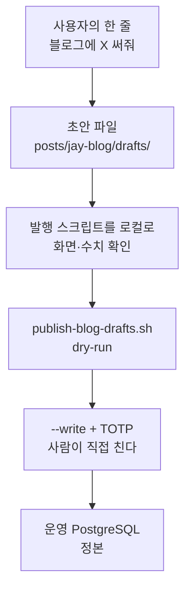

블로그 글의 정본은 저장소가 아니라 운영 PostgreSQL 이다. 저장소의 `posts/jay-blog/` 는 작업용 사본과 초안이고, 2026-08-10 부터 추적하기 시작했다. 이 구조는 편리하지만 함정이 하나 있다. 같은 slug 를 다시 발행하면 관리자 화면에서 고친 내용이 초안으로 덮인다. 초안과 운영이 언제든 갈릴 수 있다는 것, 그게 이 글의 출발점이다.

더 근본적인 문제도 있다. 글은 컴파일되지 않는다. 틀린 문장도, 형식이 어긋난 본문도 아무 오류를 내지 않는다. 코드라면 빌드가 깨지고 테스트가 잡아 주는 것들이 글에서는 조용히 통과한다. 그래서 글 한 편이 지나는 길목마다 장치를 하나씩 걸어 두게 됐다. 이 글은 그 장치들을 순서대로 적은 것이다.



## 규칙 문서를 만나는 경로를 사슬로 엮었다

규칙을 `docs/blog-writing-guide.md` 한 파일에 모아 두는 것만으로는 부족했다. 문서가 있다는 것과 그 문서를 작업 전에 읽는다는 것은 다른 문제다.

그래서 경로를 사슬로 엮었다. `CLAUDE.md` 가 글 작업 전에 스킬을 열라고 지시한다. 블로그 글은 blog-writing, 위키 글은 wiki-writing 이다. 그리고 스킬의 첫 지시가 `docs/blog-writing-guide.md` 를 먼저 읽으라는 것이다. 어느 입구로 들어와도 결국 가이드를 거치게 된다.

스킬은 가이드의 요약이 아니다. 가장 자주 깨진 것 셋만 강제한다.

- 정본은 운영 DB 다. 발행한 글을 다시 손볼 때는 운영에서 그 사이 바뀌었는지 먼저 본다.
- 본문을 `# 제목` 으로 시작하지 않는다. 화면이 제목을 따로 그려 두 번 나온다.
- 발행은 사람이 직접 친다.

스킬 파일은 저장소에 커밋돼 있다(`.claude/skills/blog-writing/SKILL.md`). 이 저장소를 받은 어느 세션에서나 같이 온다.

## 이 글 자신이 만들어진 기록으로 따라간다

하네스가 실제로 어떻게 도는지는 추상적으로 말하는 것보다 사례 하나를 따라가는 게 낫다. 마침 가장 가까운 사례가 이 글 자신이다.

사용자가 친 말은 대략 이랬다. 블로그 쪽에 "jay-blog: 글 작성 하네스" 같은 느낌의 제목으로 하나 써 달라, 글은 Fable 로 진행해도 좋다.

이 한 줄의 "블로그"와 "글"이 blog-writing 스킬 설명의 트리거, 곧 블로그 글·블로그 초안·블로그에 글 써·발행 가운데 하나와 맞았고, 그제서야 스킬 본문이 열렸다. 본문의 첫 지시가 `docs/blog-writing-guide.md` 를 읽으라는 것이라, 머리말 형식과 카테고리 목록, 문체, 마크다운 함정이 글을 쓰기 전에 들어왔다.

다음은 사실 수집이다. 이 글에 들어갈 내용이 저장소에 흩어져 있어서 직접 읽었다. `.claude/skills/blog-writing/SKILL.md`, 가이드, `posts/jay-blog/README.md`, `scripts/publish-blog-drafts.sh` 와 그 안에서 부르는 `.mjs`, `scripts/pull-blog-post.mjs` 다.

읽은 것은 A 부터 H 까지 묶어 31개 항목의 번호 목록으로 정리했다. 항목은 전부 "무엇이 어디에 어떻게 되어 있다" 수준의 사실이고, 문장이 아니다. 문장이 아니어야 하는 이유는 다음 단계에 있다.

그 목록을 Fable 에게 넘겼다. 함께 넘긴 것은 셋이다. 고정할 머리말, 지켜야 할 규칙(평서체, 여는 문단은 불편에서 시작, 소제목은 문장, 목록 밖 수치 금지), 반환 전에 스스로 볼 검수 네 줄. 사실 수집과 집필을 이렇게 나눈 이유는 겪어 본 실패 때문이다. 한 번에 시키면 문장이 매끄러워지는 대신 저장소에 없는 수치가 자연스럽게 섞여 들어온다. 목록 밖을 금지하면 지어낼 자리가 없어진다.

돌아온 본문에서 사람이 손댄 곳은 한 군데였다. 경로를 설명하느라 꺾쇠를 쓴 자리가 HTML 엔티티로 와 있었는데, 블로그는 본문의 HTML 을 전부 글자로 이스케이프하므로 그대로 두면 엔티티가 화면에 그대로 보인다. 코드 스팬으로 바꿨다.

초안은 `posts/jay-blog/drafts/jay-blog-writing-harness.md` 로 저장하고, 발행 스크립트를 로컬로 돌려 화면으로 봤다. 로컬 DB 에서 id 26 을 받았고 처음은 3,527자였다. 로컬과 운영은 id 를 따로 매기므로 이 숫자는 미리보기 주소에서만 쓰인다. 목차 6줄, mermaid, 코드 스팬 안의 꺾쇠까지 정상으로 나오는 것을 확인했다.

그런데 이 미리보기가 처음에는 안 됐다. 스크립트가 대상과 무관하게 TOTP 를 요구했고, 로컬 관리자에는 2FA 가 없어 길이 막혀 있었다. 주소가 localhost 일 때만 면제하도록 고쳐서 열었다.

그래서 이 글을 쓰는 동안 도구가 한 번 바뀌었다. 가이드에서 예전 방식, 곧 로컬 PostgreSQL 에 INSERT 문을 만들어 넣던 절차를 지웠다. 글을 쓰다가 그 글이 설명하는 대상이 바뀐 셈이다.

이 절도 같은 경로를 한 번 더 탔다. 사용자가 이 절을 실제 사례로 다시 써 달라고 해서, 같은 방식으로 이 절만 다시 넘겼다. 그때는 5,101자였다. 발행은 아직 안 했다. 그 한 번은 사람이 친다.

약점도 이 사례에 그대로 있다. 말에 안 걸리면 스킬은 안 열린다. 규칙 전체를 항상 실어 두는 대신 필요한 순간에만 불러오는 대가다.

## 초안은 파일 하나로 완결되게 했다

`posts/jay-blog/drafts/<slug>.md` 에 쓴다. 첫 `---` 위가 머리말이고 아래가 본문이다.

| 머리말 항목 | 무엇을 적나 |
|---|---|
| title | 화면에 그려지는 제목. 본문에서 `#` 으로 다시 적지 않는다 |
| slug | 주소의 뒷부분. 같은 값으로 다시 발행하면 기존 글을 덮는다 |
| category | 아래 일곱 중 하나 |
| tags | 쉼표로 나열한다 |
| summary | 목록과 공유 카드에 쓰이는 한두 문장 |
| toc | 생략하면 켜짐. 끄려면 `toc: false` |
| publishedAt | 사람이 적지 않는다. 발행 스크립트가 채운다 |

카테고리는 **일곱**이다. 개인 프로젝트, 팀 프로젝트, 기술 실험, 도구·워크플로까지 넷은 마이그레이션에 들어 있고, 도서·문제 해결·리서치 셋은 나중에 관리자 화면에서 만들었다. 뒤의 셋은 `V13__blog.sql` 만 돌린 빈 DB 에는 없어서, 그런 환경에서 발행하면 카테고리를 못 찾는다.

목차는 `##` 과 `###` 을 모아 자동으로 그리고, 항목이 3개 미만이면 안 그린다. 기본이 켜짐이라 끄려면 머리말에 `toc: false` 를 적는다. 위키는 반대로 기본 꺼짐이다.

목차에서 조심하는 지점이 하나 있다. 앵커 id 규칙은 `web/src/lib/toc.ts` 의 `headingSlug` 하나뿐이고, 목차와 렌더러가 그것을 함께 쓴다. 둘이 갈리면 링크가 조용히 아무 데도 안 닿는데 화면은 멀쩡해 보인다. 글이 컴파일되지 않는다는 문제의 전형적인 모습이다. `web/src/lib/toc.test.ts` 가 그 계약을 고정한다.

이미지는 `web/public/assets/projects/<slug>/` 에 두고 본문에서 `/assets/projects/<slug>/<파일>.png` 로 건다. 정적 파일이라 배포와 함께 나간다. 본문의 HTML 은 전부 글자로 이스케이프된다. 예외는 `details` 와 `summary` 하나뿐이다.

## 화면 확인은 발행 스크립트를 로컬로 돌려서 한다

초안이 화면에서 어떻게 보이는지는 발행 스크립트를 대상만 바꿔 로컬로 돌려서 본다. 운영에 올릴 때와 같은 코드 경로라, 머리말 파싱도 카테고리 연결도 목차 켜짐도 실제와 같게 확인된다.

```
JAYWIKI_API_BASE=http://localhost:8080/api JAYWIKI_ADMIN_PASSWORD=admin1234 \
  node scripts/publish-blog-drafts.mjs --write posts/jay-blog/drafts/<slug>.md
```

끝에 주소를 찍어 주고, 화면은 `http://blog.localhost:3000/<id>/<slug>` 에서 본다.

이 길은 원래 막혀 있었다. TOTP 를 요구하는 가드가 대상과 무관하게 걸려 있었는데, 로컬 관리자에는 2FA 가 없어서 미리보기 자체가 불가능했다. 주소가 localhost 일 때만 면제하도록 고쳤고, 판정 기준은 이미 `pull-blog-post.mjs` 가 쓰던 것과 같다. 운영은 그대로 막힌다.

예전에는 로컬 PostgreSQL 에 INSERT 문을 만들어 넣었다. 카테고리 id 를 손으로 넣고 SQL 을 조립해야 했고, 무엇보다 발행 경로를 타지 않아 정작 발행에서 깨지는 것은 못 잡았다.

화면은 눈으로만 보지 않고 수치로도 잰다. 문단 줄 수 분포, 본문에 남은 별표, 표 넘침, 코드 넘침, 문서 가로 넘침을 뽑는다. 기준도 정해 뒀다. 남은 별표는 빈 목록, 표와 문서 넘침은 0, 문단은 5줄 이하다.

한 가지 함정은 뷰포트다. 기본 뷰포트가 744px 이라 그냥 두면 모바일 배치가 나온다. zoom 0.62 로 데스크톱 배치를 재현하고 측정값을 환산한다. 모바일 폭에서 코드 블록이 좌우로 밀리는 것은 정상이라, 데스크톱 폭에서 판단한다.

## 발행의 마지막 한 걸음은 자동화하지 않았다

`scripts/publish-blog-drafts.sh` 를 인자 없이 돌리면 dry-run 이다. 무엇이 신규이고 무엇이 갱신인지만 보여준다. `--write` 를 붙여야 실제로 발행하고, 파일 경로를 주면 그 글만 올린다.

비밀번호는 macOS Keychain 의 `jay-wiki-production-admin` 에서 실행 순간에만 읽는다. TOTP 는 사람이 그 자리에서 넣는다. 비밀번호와 TOTP 는 대화·문서·로그에 남기지 않는다. dry-run 에도 TOTP 가 필요하다. 블로그는 목록 조회조차 관리 API 뒤에 있기 때문이다. 위키 시드는 dry-run 이 공개 API 만 읽어서 필요 없었다.

그래서 이 마지막 단계는 자동화하지 않았다. blog-writing 스킬에도 발행은 사람이 친다고 적혀 있다. 발행 뒤에는 글 주소와 공유 카드 주소를 curl 로 두 번 확인한다.

여기서 위키와 갈린다. 같은 저장소에 사는 두 사이트인데 마지막 단계가 정반대다.

| | 위키 | 블로그 |
|---|---|---|
| 무엇이 정본인가 | `scripts/seed-portfolio-wiki.mjs` | 운영 PostgreSQL |
| 화면에 올리는 행동 | develop 을 main 에 머지 | 발행 스크립트 실행 |
| 배포와의 관계 | 배포가 시드를 실행한다 | 무관하다 |
| 사람이 하는 일 | 머지까지만 | 마지막 한 번을 직접 친다 |
| 인증 | CI 안의 내부 토큰 | 관리자 자격증명 + TOTP |

이유는 인증 경계다. 블로그 발행은 관리자 자격증명과 TOTP 를 요구하고, 그 둘을 CI 에 넣지 않기로 했다.

## 공유 카드에는 글자를 넣지 않는다

목록 썸네일과 og:image 는 같은 값을 쓴다. 관리자 화면에서 지정한 자산이 있으면 그것, 없으면 본문의 첫 이미지다. 공유 카드는 글마다 1200x630 으로 그린다. 카드에 글자를 넣지 않는 것은 취향이 아니라 제약이다. 폰트가 woff2 인데 카드 생성기가 그것을 못 읽는다.

## 남은 한계

하네스가 다 막아 주지는 않는다.

초안과 운영은 여전히 갈릴 수 있다. 정본이 DB 라서, 화면에서 고치고 초안을 안 고치면 다음 발행이 그것을 덮는다. 스킬이 경고하는 것과 실제로 안 일어나는 것은 다르다.

화면 확인이 수동이다. 줄 수와 넘침을 재는 것도 사람이 명령을 돌려야 한다. 그리고 글의 사실이 낡는 것은 어떤 검사도 못 잡는다. 형식은 재도 내용은 못 잰다.

발행 자동화가 없는 것은 못 한 것이 아니라 안 한 것이다. 그 대가로 글을 올릴 때마다 사람이 한 번 앉아야 한다. 그 한 번의 앉음이 지금은 비용보다 안전장치에 가깝다고 판단하고 있지만, 글이 쌓이면 다시 볼 문제다.
